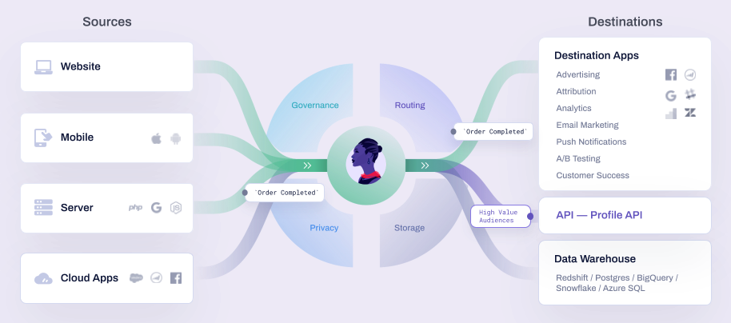
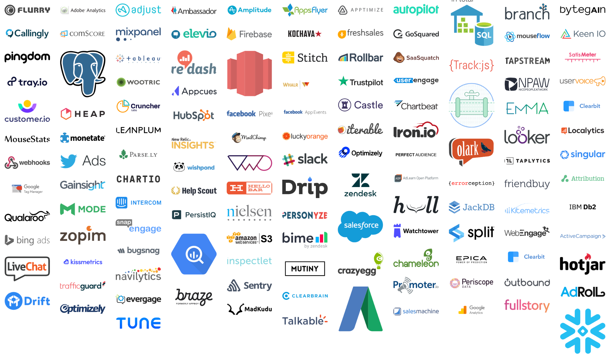

This page introduces important terms and concepts about Segment that you should be familiar with before you start a Segment installation.

In the simplest form, the Segment libraries ("[Sources](/docs/connections/sources/catalog/)") generate messages about what's happening in your site or app, and send them to the Segment servers. Segment then translates the content of those messages into different formats for use by other tools (which we call '[Destinations](/docs/connections/destinations/)'), and sends the translated messages to those tools. The Segment servers also archive a copy of the data, and can [send data to your storage systems](/docs/connections/storage/) (such as databases, warehouses, or bulk-storage buckets).

## The Segment Platform

The first two parts of the Segment platform are the [Segment Spec methods](/docs/connections/spec/), which are how you collect interaction data from your interfaces, and the [Segment Sources](/docs/connections/sources/), which you package with your interfaces to collect and route that data.

Once you've collected your interaction data, there are several different things you can do with it:
- Send it to [Destinations](/docs/connections/destinations/), which receive the data from any number of sources in real time
- Send it to [Warehouses](/docs/connections/storage/) (and other bulk storage tools), which hold your raw event schemas and update on regular intervals

You can also enrich the customer data you collect by [connecting data from your other tools](/docs/connections/sources/catalog/#cloud-apps), and then collect it in a warehouse it to monitor performance, inform decision-making processes, and create uniquely customized user experiences. You can also use [Personas](/docs/personas/), our identity resolution tool, to unify data from individual users to gain a holistic understanding of their actions.

## Where data comes from

You can quickly implement Segment’s tracking libraries across several different platforms.

- [Analytics.js, the Segment Javascript source](/docs/connections/sources/catalog/libraries/website/javascript/), is the most powerful way to track customer data from a website. We recommend it as the default installation for any website.
- [The Segment Mobile SDKs](/docs/connections/sources/catalog/#mobile) are the best way to simplify tracking in your iOS, Android, and Xamarin apps. We recommend them over server-side sources as the default installation for any mobile app.
- [Server-side sources](/docs/connections/sources/catalog/#server) let you send analytics data directly from your servers when client-side tracking won't work, or when you're sending mission-critical data like revenues.

We also offer other source libraries to cover less straightforward cases:

- Use the [HTTP Tracking API](/docs/connections/sources/catalog/libraries/server/http-api/) if Segment doesn't offer a library for your specific environment yet.
- The [Pixel Tracking API](/docs/connections/sources/catalog/libraries/server/pixel-tracking-api/) lets you track events from environments where you can’t execute code - for example, tracking when an email has been opened.
- The [Querystring API](/docs/connections/sources/catalog/libraries/website/javascript/querystring/) lets you use querystrings to load API methods when a user first visits a Segment-enabled site. Use this API for tracking events like email clicks, and identifying users associated with those clicks on the destination page.

Segment also offers [Cloud App Sources](/docs/connections/sources/about-cloud-sources/) to integrate data from your third-party tools:

- [Object Cloud Sources](/docs/connections/sources/about-cloud-sources/#event-cloud-app-sources) can import third party tool data directly into your Segment warehouse, but cannot stream that data into your other Segment destinations. Make sure you have a Segment warehouse enabled before you enable an object cloud source.
- [Event Cloud Sources](/docs/connections/sources/about-cloud-sources/#object-cloud-app-sources) don’t just import third party tool data into your Segment warehouse, they also send event data in real-time to your other Segment destinations. You don't need to set up a data warehouse to send Event Cloud Source data to your destinations.

## Where you can track

Segment supports several ways to implement tracking. The two most common are to use _device-based_ or _server-based_ libraries. You can use Segment's device-based libraries, such as JavaScript, iOS, and Android, to make calls on users’ browsers or mobile devices. You can also track data with Segment's server-based libraries, such as Node, Python, PHP and so on, where the calls are triggered on your own servers and then sent to the Segment servers.

When you collect data using device-based libraries, you can choose between two different connection modes: you can either use "cloud-mode", where the library sends the data directly to the Segment servers which then translate and forward it, or you can use "device-mode" where the library sends the data both directly to the Segment servers, and also to the servers for the destination tool. (Device-mode sometimes requires some [additional set-up steps](/docs/connections/sources/mobile_guide/), but can unlock rich device data.)

Although there are some tradeoffs between the two approaches, neither is better than the other, and we usually recommend that you implement a mix of both. In general, more direct interaction data is available using a device-based library, but server-based collection is more secure, reliable, and can’t be blocked by ad blockers.

<!-- Here’s a handy flow chart to help with the client-side/server-side decision:

TODO: Image removed, didn't work with formatting. need a better version of this flowchart or else to just omit?-->

## The Segment Methods

The Segment libraries generate messages about what happens on your interface, translate those messages into different formats for use by destinations, and transmit the messages to those tools.

There are several [tracking API methods](/docs/connections/spec/), which can be called to generate messages. The four most important methods are:
  - [Identify](/docs/connections/spec/identify/): who is the user?
  - [Page](/docs/connections/spec/page/) and [Screen](/docs/connections/spec/screen/): what web page or app screen are they on?
  - [Track](/docs/connections/spec/track/): what are they doing?

Every call shares the same [common fields](/docs/connections/spec/common/).  When you use these methods [as intended](/docs/connections/spec/best-practices-identify/), it allows Segment to detect specific type of data, and correctly translate it to send it on to downstream destinations.

## Where you can send data

Segment maintains a catalog of destinations where you can send your data.

<!--TODO: big list o' destinations image (programmatically update?) should go here-->

## Workspaces

Your Segment Workspace is where you set up and manage sources and destinations, manage the schema of the data your interfaces send, and test and monitor that data for errors. A Workspace is a collection of Segment sources, destinations, and their configurations, that are administered and billed together. Each Workspace has a specific list of Segment users who may access it, and it might also contain several "environments" for production, development and testing use.

When you first log in to your Segment account, you can create a new workspace, or choose to log into an existing workspace if your account is part of an existing organization.

  

  

