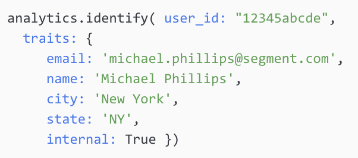

Before you start implementing from your tracking plan, let's review the Segment methods, what they do, and when you should use each.

## Segment methods in detail

Segment's libraries generate and send messages to our tracking API in JSON format, and provide a standard structure for the basic API calls. We also provide recommended JSON structure (also known as a schema, or 'Spec') that helps keep the most important parts of your data consistent, while allowing great flexibility in what other information you collect and where.

There are six calls in the basic tracking API, which answer specific questions:

- [Identify](/docs/connections/spec/identify/): Who is the user?
- [Track](/docs/connections/spec/track/): What are they doing?
- [Page](/docs/connections/spec/page/): What web page are they on?
- [Screen](/docs/connections/spec/screen/): What app screen are they on?
- [Group](/docs/connections/spec/group/): What account or organization are they part of?
- [Alias](/docs/connections/spec/alias/): What was their past identity?

Among these calls, you can think of Identify, Group, and Alias as similar types of calls, all to do with updating our understanding of the user who is triggering Segment messages. You can think of these calls as adding information to, or updating an object record in a database. **Objects** are described using "traits", which you can collect as part of your calls.

The other three, Track, Page, and Screen, can be considered as increasingly specific types of events. **Events** can occur multiple times, but generate separate records which append to a list, instead of being updated over time.

A Track call is the most basic type of call, and can represent any type of event. Page and Screen are similar and are triggered by a user viewing a page or screen, however Page calls can come from both web and mobile-web views, while Screen calls *only* occur on mobile devices. Because of the difference in platform, the context information collected is very different between the two types of calls.

> success ""
> **Tip**! Segment recommends that you always use the Page and Screen calls when recording a page-view, rather than creating a "Page Viewed" event, because the Page/Screen calls automatically collect much better context information.

## Anatomy of a Segment message




## Identify calls




The `identify` call allows Segment to know **who** is triggering an event.

### When to call Identify

Call `Identify` when the user first provides identifying information about themselves (usually during log in), or when a they update their profile information.

When called as part of the login experience, you should call `identify` as soon as possible after the user logs in. When possible, follow the `identify` call with a `track` event that records what caused the user to be identified.

When you make an `identify` call as part of a profile update, you only need to send the changed information to Segment. You can send all profile info on every `identify` call if that makes implementation easier, but this is optional.

## Traits in Identify calls

These are called "Traits" for Identify calls, and "Properties" for all other methods.

**The most important trait to pass as part of the identify() call is userId**, which uniquely identifies a user across all applications.

You should use a hash value to ensure uniqueness, although other values are acceptable; for example, email address isn't the best thing to use as a userid, but is usually acceptable since it will be unique, and doesn't change often.

Beyond that, the Identify call is your opportunity to provide information about the user that can be used for future reporting, so you should try to send any fields that you might want to report on later.

Consider using Identify and traits when:

- Gathering user profile data (for example, company, city/state, job title, or other user-level data)
- Gathering company-level data (for example, company size, number of seats, etc)


## How to Call Identify

You can call Identify from any of Segment's device-based or server-based libraries, including [Javascript](/docs/connections/sources/catalog/libraries/website/javascript/), [iOS](/docs/connections/sources/catalog/libraries/mobile/ios), [Android](/docs/connections/sources/catalog/libraries/mobile/android), [Ruby](/docs/connections/sources/catalog/libraries/server/ruby/), and [Python](/docs/connections/sources/catalog/libraries/server/python/).

Here are two examples of calling identify from two different libraries:




```js
analytics.identify("12345abcde", {
  "email": "michael.phillips@segment.com",
  "name": "Michael Phillips",
  "city": "New York",
  "state": "NY",
  "internal": True
});
```



```ruby
analytics.identify( user_id: "12345abcde",
  traits: {
     email: 'michael.phillips@segment.com',
     name: 'Michael Phillips',
     city: 'New York',
     state: 'NY',
     internal: True })
```




## Using analytics.reset()

When a user explicitly signs out of one of your applications, you can call `analytics.reset()` to stop logging further event activity to that user, and create a new `anonymousId` for subsequent activity (until the user logins in again and is subsequently `identify`-ed). **This call is most relevant for client-side Segment libraries**, as it clears cookies in the user's browser.

Make a `Reset()` call as soon as possible after sign-out occurs, and only after it succeeds (not immediately when the user clicks sign out). For more info on this call, [see the JavaScript source documentation](/docs/connections/sources/catalog/libraries/website/javascript/#reset-or-logout).

## Page and Screen

The `Page` and `Screen` calls tell Segment what web page or mobile screen the user is on. This call automatically captures important context traits, so you don't have to manually implement and send this data.

| **Page context** auto-captured | **Screen context** auto-captured                    |             |                                                                                                    |
| ------------------------------ | --------------------------------------------------- | ----------- | -------------------------------------------------------------------------------------------------- |
| **title**                      | *window.location.title*                             | **app**     | *build, name, namespace, version*                                                                  |
| **url**                        | *window.location.url*                               | **device**  | *adTrackingEnabled, advertisingId (IDFA/AAID), device ID, manufacturer, model, type (android/ios)* |
| **path**                       | *window.location.path*                              | **library** | *name, version*                                                                                    |
| **referrer**                   | *window.document.referrer*                          | **locale**  | *window.document.referrer*                                                                         |
| **search**                     | *window.location.search*                            | **network** | *cellular, wifi*                                                                                   |
| **ip**                         | *address*                                           | **ip**      | address                                                                                            |
| **userAgent**                  | *string*                                            | **os**      | name, version                                                                                      |
| **campaign**                   | *utm_source, utm_medium, utm_campaign, utm_content* | **screen**  | height, width                                                                                      |

### Page and Screen call properties

You can always [override the auto-collected Page/Screen properties](/docs/connections/sources/catalog/libraries/website/javascript/#default-properties) with your own, and set additional custom page or screen properties.

Some downstream tools (like [Marketo](/docs/connections/destinations/catalog/marketo/)) require that you attach specific properties (like email address) to every `page` call.

This is considered a destination-specific implementation nuance, and you should check the documentation for each destination you plan to use and make a list of these nuances before you start implementation.

### Named Page & Screen Calls

You can specify a page “Name" at the start of the page or screen call, which is especially useful to make list of page names into something more succinct for analytics. For example, on an ecommerce site you might want to call `analytics.page( "Product" )` and then provide properties for that product:




```js
analytics.page("Product", {
  "category": "Smartwatches",
  "sku": "13d31"
});
```



```objc
[[SEGAnalytics sharedAnalytics] screen:@"Product"
properties:@{ @"category": @"Smartwatches", @"sku": @"13d31" }];
 }];
```




### When to Call Page

Segment automatically calls a `page` event whenever a web page loads. This might be enough for most of your needs, but if you change the URL path without reloading the page, for example in single page web apps, you must call `page` manually .

If the presentation of user interface components don't substantially change the user's context (for example, if a menu is displayed, search results are sorted/filtered, or an information panel is displayed on the exiting UI) **measure the event with a Track call, not a Page call.**

> note ""
> **Note**: When you trigger a Page call manually, make sure the call happens _after_ the UI element is successfully displayed, not when it is called. It shouldn't be called as part of the click event that initiates it.

For more info on Page calls, review [Page spec](/docs/connections/spec/page/) and [Analytics.js docs](/docs/connections/sources/catalog/libraries/website/javascript/#page).

### When to call Screen

Segment Screen calls are essentially the Page method, except for mobile apps. Mobile Screen calls are treated similarly to standard Page tracking, only they contain more context traits about the device. The goal is to have as much consistency between web and mobile as is feasible.

## Track calls

The Track call allows Segment to know **what** the user is doing.

### When to call Track

The Track call is used to track user and system events, such as:

- The user interacting with a UI component (for example, "Button Clicked")
- A significant UI component appearing, other than a page (for example, search results or a payment dialog)

### Events and Properties

Your track calls should include both events and properties. **Events are the actions you want to track**, and **properties are the data _about_ the event that are sent with each event**.

Properties are powerful. They enable you to capture as much context about the event as you'd like, and then cross-tabulate or filter your downstream tools. For example, let's say an eLearning website is tracking whenever a user bookmarks an educational article on a page. Here's what a robust analytics.js Track call could look like:

```js
analytics.track('Article Bookmarked', {
  "title": 'How to Create a Tracking Plan',
  "course": 'Intro to Data Strategy',
  "author": 'Dr. Anna Lytics',
  "publish_year": '2019',
  "publish_month": '03',
  "length": 'Medium - 1000-2000 words',
  "assets": {'Infographics','Interactive Charts'},
  "topics": {'Data Planning','Segment','Data Flow'},
  "button_location": 'Subheader - 3rd Column'
});
```

With this track call, we can analyze which authors had the most popular articles, which months and years led to the greatest volume of bookmarking overall, which button locations drive the most bookmark clicks, or which users gravitate towards infographics related to Data Planning.

## Event Naming Best Practices

Each event you track must have a name that describes the event, like 'Article Bookmarked' above. That name is passed in at the beginning of the track call, and should be standardized across all your properties so you can compare the same actions on different properties.

Segment's best practice is to use an “Object Action” (Noun<>Verb) naming convention for all **Track** events, for example, 'Article Bookmarked'.

Segment maintains a set of [**Business Specs**](/docs/connections/spec/semantic/) which follow this naming convention around different use cases such as eCommerce, B2B SaaS, and Mobile.

Let's dive deeper into the Object Action syntax that all Segment Track events should use.

### Objects are Nouns

Nouns are the entities or objects that the user or the system acts upon.

It's important to be thoughtful when naming objects so that they are referred to consistently within an application, and so that you refer to the same objects that might exist in multiple applications or sites by the same name.

Use the following list of objects to see if there is a logical match with your application. If you have objects that aren't in this list, name it in a way that makes sense if it were to appear in other applications, and/or run it by Product Analytics.

#### Some suggested Nouns

<!--(TODO: this section had a table with a mostly-empty "description" column. We should expand this table and provide descriptions, then normalize formatting with the similar ones below.)-->

- Menu
- Navigation Drawer (the “Hamburger” menu in the upper left corner of a UI)
- Profile
- Account
- Video


### Actions are Verbs

Verbs indicate the action taken by either a user on your site. When you name a new track event, consider if you can describe the current interaction using a verb from the list below.

If you can't, choose a verb that describes what the user is trying to do in your specific case, but try to be flexible enough so that you could use it in other scenarios.

#### Some suggested Verbs

- **Applied** - Applying a new format to the UI results.
- **Clicked** - Catch-all for events where a user activated some part of the UI but no other verb captures the intent.
- **Created/Deleted** - The user- or system-initiated action of creating or deleting an object (e.g., new search, favorite, post)
- **Displayed/Hidden** - The user- or system-initiated action of hiding or displaying an element
- **Enabled/Disabled** - Enabling or disabling some feature (e.g., audible alarms, emails, etc).
- **Refreshed** - When a set of search results is refreshed.
- **Searched** - When an app is searched
- **Selected** - User clicked on an individual search result.
- **Sorted** - The user or UI action that causes data in a table, for example, to be sorted
- **Unposted** - Making a previously publicly-viewable posting private.
- **Updated** - The user action that initiates an update to an object (profile, password, search, etc.; typically be making a call to the backend), or the they system having actually completed the update (often this tracking call will be made in response to a server-side response indicating that the object was updated, which may or may not have an impact on the UI).
- **Viewed** - (exactly what it says on the tin)


### Property naming best practices

Segment recommends that you record property names using **snake case** (for example `property_name`), and that you format property values to match how they are captured. For example, a `username` value would be captured in whatever case it the user typed it in as.

Ultimately, you can decide to use a casing different from our recommendations; however, **the single most important aspect is that you're consistent across your entire tracking with one casing method**.

You can read more about [best practices for Track calls](/docs/connections/spec/best-practices-event/), .

All of the basic [Segment methods](/docs/connections/spec/) have a common structure and common fields which are automatically collected on every call. You can see these in the [common fields documentation](/docs/connections/spec/common/).

### Common properties to send with Track call

The following properties should be sent with every Track call:

| **Event Context** | **Property Name** | **Description** |
| ----------------- | ----------------- | --------------- |
| Any Track call    | `initiator`         | States whether the event was initiated by the user or the system. |
| Any Track call    | `display_format`    | Responsive or not (or some other indicator of the current page layout template)
| Search Initiated or Search Results Displayed | [Search Parameters] | All search parameters, with the names being the snake case version of the internal names.
| Search Results Displayed | `total_result_count` | The total number of results returned that match the search parameters.  This number represents the number of results that could be returned to the user even if only a subset of those were actually returned (for example, if the results are paginated).
| Paginated List Displayed | `total_items_pages` | The total number of pages of items available to be viewed by the user.
| Paginated List Displayed | `items_per_page` | The number of possible items in each page of items (for example, if the UI is showing 50 search results per page).  The actual number of items in the current page may be less than this number if, for example, the system is displaying the last page of results and there aren't enough results to fill to the page's maximum (for example, if there are 27 results when the page could display as many as 50).
| Paginated List Displayed | `current_item_page` | The current page number displayed to the user.
| External Link Clicked | `destination_url` | The URL that the user is taken to when clicked. Ideally, this will be the final destination (for example, after any redirects), but only the immediate destination is likely in most cases.
| Item List Sorted | `sort_column` | The internal name of the column that was sorted.
| Item List Sorted | `sort_direction` | Whether the items sort in ascending or descending order.

### How to call Track

You can make a Track call from any of Segment's client-side or server-side libraries, including [JavaScript](/docs/connections/sources/catalog/libraries/website/javascript/), [iOS](/docs/connections/sources/catalog/libraries/mobile/ios), [Android](/docs/connections/sources/catalog/libraries/mobile/android), [Ruby](/docs/connections/sources/catalog/libraries/server/ruby/), and [Python](/docs/connections/sources/catalog/libraries/server/python/). Here are two examples of calling track from two different libraries:




```js
analytics.track('Article Bookmarked', {
  "title": 'How to Create a Tracking Plan',
  "course": 'Intro to Data Strategy',
  "author": 'Dr. Anna Lytics',
});
```



```ruby
analytics.track( user_id: '12345abcde',
  event: 'Article Bookmarked',
  properties: {
     title: 'How to Create a Tracking Plan',
     course: 'Intro to Data Strategy',
     author: 'Dr. Anna Lytics'})
```




<div class="double">
  

  
</div>
