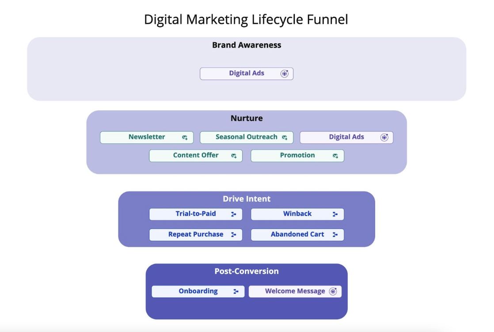

Audiences, Journeys, and Broadcasts are fundamental to [Twilio Engage](/docs/engage/) and let you segment your users, send them personalized content, and show them ads from platforms like Facebook or Google.

In this guide, you’ll learn how to choose between an Audience, a Journey, and a Broadcast for a number of marketing use cases across the customer lifecycle.

## Back to basics

First, consider the following definitions for an Audience, Journey, and Broadcast.

### Audience

In Engage, an [Audience](/docs/engage/audiences/) is a group of users that share certain characteristics. When you create an Audience, you group users who meet certain conditions, like having performed an event or having a [Computed Trait](/docs/engage/audiences/computed-traits/).

Once you’ve created an Audience, you can sync it to [marketing automation tools](/docs/connections/destinations/catalog/#marketing-automation), [ads platforms](/docs/connections/destinations/catalog/#advertising), [analytics tools](/docs/connections/destinations/catalog/#analytics), or [data warehouses](/docs/connections/storage/warehouses/). Depending on the Audience’s conditions and [connected Destination(s)](/docs/connections/destinations/), Segment syncs the Audience’s users in batches or in real time, as they meet the Audience’s conditions.

### Journey

A [Journey](/docs/engage/journeys/) is a logic-driven workflow that progresses users through steps based on conditions and time delays. You add users to a Journey with an entry condition, then users progress through [the Journey’s steps](/docs/engage/journeys/step-types/) based on conditions you define during Journey setup.

As with Audiences, Segment can sync users to Destinations at designated points in the Journey. Unlike an Audience, a Journey can send users to Twilio Engage’s [native email and SMS channels](/docs/engage/campaigns/).

### Broadcast

A [Broadcast](/docs/engage/campaigns/broadcasts) is a one-time SMS or email campaign sent to a group of users. Whereas Segment continously updates Audience membership, Segment only calculates the users who will receive your Broadcast once. Marketers commonly use Broadcasts for newsletters, promotional campaign, and events.

## Engage and the customer lifecycle

The customer lifecycle provides a helpful framework for thinking about Audiences, Journeys, and Broadcasts.

Audiences and Broadcasts tend to be most effective at the top of the customer lifecycle funnel, where brand awareness and discovery occurs.

A Journey becomes a better option as customers progress down the funnel, where a more complex strategy involving messaging, social ads, and newsletters helps move customers closer to conversion.

## Choosing between Audiences, Journeys, and Broadcasts

With the customer lifecycle in mind, use the following table as a starting point for selecting an Audience or Journey for common marketing use cases:

| Use Case                                         | Audience, Journey, or Broadcast |
| ------------------------------------------------ | ------------------------------- |
| I want to send email and SMS campaigns.          | Journey or Broadcast            |
| I want to send a one-time email or SMS campaign. | Broadcast                       |
| I only have one intended touchpoint.             | Audience or Broadcast           |
| I need branching logic.                          | Journey                         |
| I want to run A/B tests.                         | Journey                         |
| I want to re-target customers with the same ad.  | Audience                        |

While these suggestions will work for most use cases, you may need to consider other factors before you implement your own campaign. Asking the following questions will help you identify the right approach.

### Over the course of a campaign, how many touchpoints do I want to create?

Audiences and Broadcasts work best for single, one-off messages or touchpoints. If you need a campaign with time delays and branching logic, opt for a Journey.

For example, an Audience works well if you want to show a single ad when a user abandons a cart. If, however, you want to show an ad, wait several days, then send the user an email if they’ve not completed their purchase, go with a Journey.

### Do I want to use Engage Premier Channels like SMS and email?

You can message users with [Engage Premier Channels](/docs/engage/#market-to-customers-with-engage-premier-and-channels). If you’d like to send an SMS or email campaign to a customer, use a Journey.

### Do I need branching logic?

Create a Journey if you want to incorporate branching logic into your campaign.

### Do I want to conduct an A/B test or create a holdout group?

A number of Journeys step types, like [randomized splits](/docs/engage/journeys/step-types/#randomized-splits), let you run experiments and test your campaigns. If you want to experiment with different groups, use a Journey.

### Do I want my customers to receive the same campaign more than once?

With Journeys, you can allow customers to [re-enter a Journey they’ve exited](/docs/engage/journeys/build-journey/#exit-and-re-entry-times) or restrict them to a one-time Journey.

Audiences, on the other hand, admit users whenever they meet the Audience’s criteria. For example, you may want to retarget a user with an ad whenever they view a page on your website. In this case, an Audience works well since the user can re-enter the Audience regardless of how many times they’ve already done so.

## Putting it together

With this guidance in mind, take your next steps with Engage by learning [how to build a Journey](/docs/engage/journeys/build-journey/), [work with Engage Audiences](/docs/engage/audiences/), and [send a Broadcast](/docs/engage/campaigns/broadcasts/).
