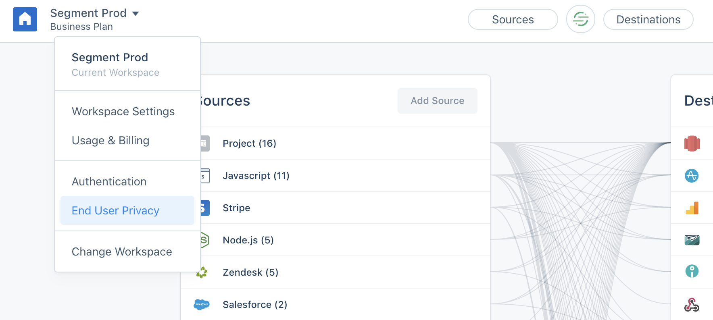
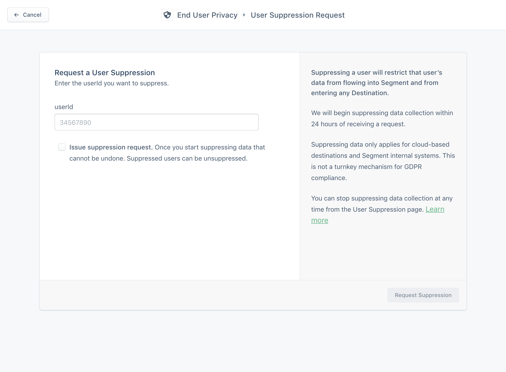
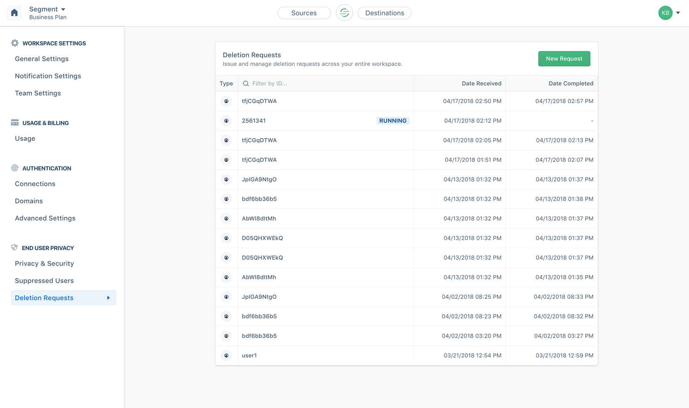
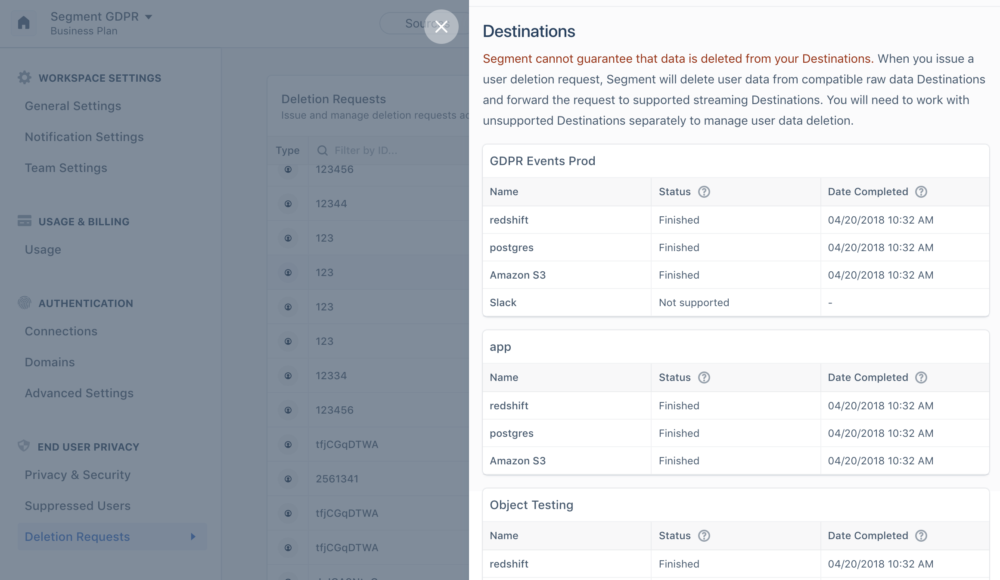

In keeping with our commitment to GDPR and CCPA readiness, Segment offers the ability to delete and suppress data about end-users when they can be identified by a `userId`, should they revoke or alter their consent to data collection. For example, if an end-user invokes their Right to Object or Right to Erasure under the GDPR or CCPA, you can use these features to block ongoing data collection about that user and, additionally, to delete all historical data about them from Segment’s systems, connected S3 buckets and warehouses, and supported downstream partners.

[Contact us](https://segment.com/help/contact/) if you need to process more than 100,000 users within a 30 day period.

**PLEASE NOTE (Business Plan Customers):** If you use this feature to delete data, you can not Replay the deleted data. For standard Replay requests, you must wait for any pending deletions to complete, and you cannot submit new deletion requests for the period of time that we replay data for you.

## Overview

All deletion and suppression actions in Segment are asynchronous, and are categorized as what we call "Regulations." **Regulations** are requests to Segment to control your data flow. They can be issued from your Segment Workspace Settings page under **End User Privacy.**



With Regulations you can issue a single request to delete and suppress data about a user by `userId`. All regulations are scoped to your workspace, and target all sources within the workspace. This way, you don't need to look at every source in Segment to delete data about a single user.

There are currently three valid regulation types:

 - **SUPPRESS**
 - **UNSUPPRESS**
 - **SUPPRESS\_AND\_DELETE**

## Suppression Support and the Right to Revoke Consent

`SUPPRESS` regulations add a user to your suppression list by their `userId`. Suppressed users are blocked across all sources; any message you send to Segment with a suppressed userId is blocked at our API. These messages do not appear in the debugger, are not saved in our archives and systems, and are not sent to any downstream server-side destinations. Suppression does not affect device-mode destinations.

Usually, when a customer exercises their right to erasure, they also expect that you stop collecting data about them. Suppression regulations ensure that regardless of how you’re sending data to Segment, if a user opts out, their wishes are respected on an ongoing basis and across applications.

**Suppression is not a substitute for gathering affirmative, unambiguous consent about data collection and its uses.**

Segment offers suppression tools to help you manage the challenge of users opting-out across multiple channels and platforms. However, we encourage and expect that you design your systems and applications so you don't collect or forward data to Segment until you have unambiguous, specific, informed consent or have established another lawful legal basis to do so.

To remove a user from the suppression list, create an `UNSUPPRESSION` regulation.

## Deletion Support and the Right to Be Forgotten

When you create a `SUPPRESS_AND_DELETE` regulation, the user is actively suppressed, and Segment begins permanently deleting all data associated with this user from your workspace. This includes scanning and removing all messages related to that `userId` from all storage mediums that don’t automatically expire data within 30 days, including archives, databases, and intermediary stores.

Messages with this `userId` are also deleted from your connected raw data Destinations, including Redshift, BigQuery, Postgres, Snowflake and Amazon S3. Warehouse deletions happen using a DML run against your cluster or instance, and we delete from S3 by "recopying" clean versions of any files in your bucket that included data about that `userId`.

Finally, we also forward these deletion requests to a growing list of supported partners.

**Segment cannot guarantee that data is deleted from your Destinations.**

We forward deletion requests to supported streaming Destinations (such as Braze, Intercom, and Amplitude) but you should confirm individually with each partner that the request was fulfilled.

You will also need to contact any unsupported Destinations separately to manage user data deletion.

Note that if you later **UNSUPPRESS** a user, the deletion functionality does not clean up data sent after removing the user from the suppression list.

## **UI Walkthrough**

## Suppressed Users

The Suppressed Users tab shows an up-to-date list of **actively** suppressed `userId`s. Data about these users is blocked across all sources.

To create a suppression regulation and add a userId to this list, click **Add User**, and enter the `userId` in the field that appears. Then click **Request Suppression**.



A `SUPPRESS` regulation is created, and this userId is added to your suppression list within 24 hours.

To remove a user from the suppression list, click the ellipses (**...**) icon on the `userId` row, and click **Remove**.


This creates an `UNSUPPRESS` regulation, the `userId` is removed from your suppression list, and their data is no longer blocked within 24 hours.

## Deletion Requests

The deletion requests pane shows a log of all regulations with a deletion element along with their status, so that you can see the status of a deletion.



You can click an individual deletion to view its status across Segment and your connected destinations.



## Programmatic User Deletion and Suppression using the API

**NOTE:** The GraphQL APIs for user deletion and suppression are deprecated. Use the [Segment Config APIs](https://reference.segmentapis.com/?version=latest#57a69434-76cc-43cc-a547-98c319182247) to interact with our User Deletion and Suppression system.

Use the Segment GraphQL API to issue mutations or queries to `https://gdpr.segment.com/graphql`.

### Regulate User from all Sources in Workspace

*Deprecated* : Refer to [Create Regulation](https://reference.segmentapis.com/?version=latest#009d2fc7-1eb6-445a-86de-7f92bc277b32) Config API

#### Mutation

```js
mutation {
  createWorkspaceRegulation(
    workspaceSlug: "workspace-slug"
    type: SUPPRESS | UNSUPPRESS | SUPPRESS_AND_DELETE
    userId: "userIdToDelete"
  ) {
    id
  }
}
```

#### Input
| Field Name    | Type          | Required | Description |
| ------------- | ------------- | -------- | ----------- |
| workspaceSlug | String        | yes      | Your workspace slug. You can find this by looking at the url path of your workspace.|
| userId        | String        | yes      | The target user’s userId. |
| type          | Enum          | yes      | The regulation type. Can be SUPPRESS, UNSUPPRESS, or SUPPRESS_AND_DELETE |

#### Output
| Field Name    | Type          | Description |
| ------------- | ------------- | ----------- |
| id            | String        | The regulation ID. You can use this to identify the regulation or check its status.|

### Regulate User from a single Source in a Workspace

*Deprecated* : Refer to [Create Source Regulation](https://reference.segmentapis.com/?version=latest#32732f1a-572c-457b-9c38-77f3c7f77559) Config API

#### Mutation

```js
mutation {
  createSourceRegulation(
    workspaceSlug: "workspace-slug"
    sourceSlug: "source-slug"
    type: SUPPRESS | UNSUPPRESS | SUPPRESS_AND_DELETE
    userId: "userIdToDelete"
  ) {
    id
  }
}
```

#### Request fields
| Field Name    | Type          | Required | Description |
| ------------- | ------------- | -------- | ----------- |
| workspaceSlug | String        | yes      | Your workspace slug. You can find this by looking at the url path of your workspace.|
| sourceSlug    | String        | yes      | Your source slug. You can find this by looking at the url path of your source.|
| userId        | String        | yes      | The target user’s userId. |
| type          | Enum          | yes      | The regulation type. Can be SUPPRESS, UNSUPPRESS, or SUPPRESS_AND_DELETE |

#### Response fields
| Field Name    | Type          | Description |
| ------------- | ------------- | ----------- |
| id            | String        | The regulation ID. You can use this to identify the regulation or check its status.|

### Delete Object from a Cloud Source

*Deprecated* : Refer to [Cloud Source Object Deletion](https://reference.segmentapis.com/?version=latest#1273ed6e-43e2-4cc2-a9bc-f0c7d2f153e8) Config API


Cloud Sources sync objects to Segment. As a result, Cloud Sources are regulated based on an `objectId` instead of a `userId`.
Before you delete the object from Segment, you should delete it from the upstream system first.

#### Mutation

```js
mutation {
  createSourceObjectDeletion(
    workspaceSlug: "workspace-slug"
    sourceSlug: "source-slug"
    collection: "source-collection"
    objectId: "objectIdToDelete"
  ) {
    id
  }
}
```

#### Request
| Field Name    | Type          | Required | Description |
| ------------- | ------------- | -------- | ----------- |
| workspaceSlug | String        | yes      | Your workspace slug. You can find this by looking at the url path of your workspace.|
| sourceSlug    | String        | yes      | Your source slug. You can find this by looking at the url path of your source.|
| objectId      | String        | yes      | The target objects `objectId` |
| collection    | String        | yes      | The collection to which this object belongs |
| type          | Enum          | yes      | The regulation type. Can be SUPPRESS, UNSUPPRESS, or SUPPRESS_AND_DELETE |

#### Response
| Field Name    | Type          | Description |
| ------------- | ------------- | ----------- |
| id            | String        | The regulation ID. You can use this to identify the regulation or check its status.|


### List Suppressed Users for your Workspace

*Deprecated* : Refer to [List Suppressed Users](https://reference.segmentapis.com/?version=latest#2ad8f59e-2490-4a85-bc6d-d758a6a373ce) Config API

#### Query

```js
query {
  suppressedUsers(workspaceSlug: "workspace-slug", cursor: { limit: 20 }) {
    data {
      userId
    }
    cursor {
      hasMore
      next
      limit
    }
  }
}
```

#### Request
| Field Name    | Type          | Required | Description |
| ------------- | ------------- | -------- | ----------- |
| workspaceSlug | String        | yes      | Your workspace slug. You can find this by looking at the url path of your workspace.|
| cursor        | Object        | no       | Cursor is used for pagination. By default, lists the first 20 results. Use the `next` property returned by the GraphQL response to continue to the next page of results.|


### List Deletion Requests for your Workspace

List the all the deletion requests you have sent to Segment for a given workspace. The below query will return both the `userId` and `status` of the deletion request.

*Deprecated* : Refer to [List Regulations](https://reference.segmentapis.com/?version=latest#e27e4dac-892d-431e-b4f8-cee0eca5b3d8) Config API

#### Query

```js
query {
  deletionRequests(workspaceSlug: "workspace-slug", cursor: { limit: 20 }) {
    data {
      userId
      status
    }
    cursor {
      hasMore
      next
      limit
    }
  }
}
```

#### Request
| Field Name    | Type          | Required | Description |
| ------------- | ------------- | -------- | ----------- |
| workspaceSlug | String        | yes      | Your workspace slug. You can find this by looking at the url path of your workspace.|
| cursor        | Object        | no       | Cursor is used for pagination. By default, lists the first 20 results. Use the `next` property returned by the GraphQL response to continue to the next page of results.|


### Making requests with GraphQL

GraphQL requests are POST requests with JSON payloads. The query of mutation is sent in the body of the request Here’s how that might look with cURL:

```bash
curl \
  -X POST \
  -H "Content-Type: application/json" \
  -H "Authorization: Bearer <Access Token>" \
  --data '{"query":"mutation {createWorkspaceRegulation(workspaceSlug:\"<workspace-slug>\" type:SUPPRESS_AND_DELETE userId:\"<userIdToDelete>\") { id }}"}' \
  https://gdpr.segment.com/graphql
```

Here’s how it might look using a generic HTTP request library:

```js
require('isomorphic-fetch');

fetch('https://gdpr.segment.com/graphql', {
  method: 'POST',
  headers: { 'Content-Type': 'application/json' },
  body: JSON.stringify({ query: `mutation {
    createWorkspaceRegulation(
      workspaceSlug: "workspace-slug"
      type: SUPPRESS_AND_DELETE
      userId: "userIdToDelete"
    ) {
      id
    }
  }`
  }),
})
  .then(res => res.json())
  .then(res => console.log(res.data));
```

**We recommend using a library purpose built for making GraphQL requests. For example, in node.js, we recommend** `apollo-fetch`.

```js
const fetch = createApolloFetch({
 uri: 'https://gdpr.segment.com/graphql'
})

fetch({
 query: `mutation {
   createWorkspaceRegulation(
     workspaceSlug: "workspace-slug"
     type: SUPPRESS_AND_DELETE
     userId: "user_id"
   ) {
     id
   }`
 }
}).then(res => {
 console.log(res.data);
})
```

Any other queries or mutations exposed by `gdpr.segment.com` are **not** officially public, and as such we have not made any commitments or guarantees around their stability or longevity. **We do not recommend building functionality against undocumented queries or mutations on this API, as they are not officially supported and change without notice.** If you’re interested in programmatic access to your workspace, contact us separately! We are actively exploring how to best support your needs.

### Authentication

The mutation above requires a valid access token in the `Authorization` request header, which you can generate using the credentials of any workspace owner.

To fetch an access token, you issue a mutation like the one above with the following structure:

```js
mutation auth($email:String!, $password:String!) {
  login(email:$email, password:$password)
}
```

The access token is returned in the JSON payload at `data.login.access_token`

**IMPORTANT:** Access tokens are short-lived, so we recommend starting every attempt to create a regulation with a fresh login.

Note that your Segment password should always be kept secret. It’s imperative that you treat it as a privileged secret in your program. We recommend using something like [AWS Secrets Manager](https://docs.aws.amazon.com/secretsmanager/latest/userguide/rotating-secrets-create-generic-template.html) or [Chamber](https://segment.com/blog/the-right-way-to-manage-secrets/) to securely store, encrypt, and decrypt your password on program or request handler invocation. **Do not attempt to create Regulations from your browser or a client application, as you would expose this secret.**

Once you have your access token, include it in the `Authorization` header with the prefix `"Bearer "`.

Here’s a full bash example of authenticating and making a deletion request:

```bash
token=$(curl -X POST -H "Content-Type: application/json" -d '{"query": "mutation auth($email:String!, $password:String!) {login(email:$email, password:$password)}", "variables": {"email": "<your_email>", "password": "your_password"}}' https://gdpr.segment.com/graphql | jq -r '.data.login.access_token')

curl -X POST \
  -H "Content-Type: application/json" \
  -H "Authorization: Bearer $token" \
  -d '{"query":"mutation {createWorkspaceRegulation(workspaceSlug:\"<slug>\" type:SUPPRESS_AND_DELETE userId:\"<userId>\") { id }}"}' \
  https://gdpr.segment.com/graphql
```

Putting it all together, here’s an example internal microservice that you could deploy with [`next`](https://zeit.co/now) or [`up`](https://github.com/apex/up), both of which offer modest paid plans with encrypted environment variables for secrets. You could invoke this service at `/deleteUserFromSegment`

```js
const { createApolloFetch } = require("apollo-fetch");
const express = require("express");
const { PORT = 3000 } = process.env;

const app = express();
const fetchMiddleware = function(req, res, next) {
  req.fetch = createApolloFetch({
    uri: "https://gdpr.segment.com/graphql"
  });
  next();
};

const loginMiddleware = async function(req, res, next) {
  const response = await fetch({
    query: `mutation Login($email: String!, $password: String!) {
                login(email:$email, password:$password)
              }`,
    variables: {
      email: process.env.SEG_USER,
      password: process.env.SEG_PW // secret
    }
  })

  const token = response.data.login.access_token

  req.fetch.use(({ request, options }, cb) => {
    if (!options.headers) {
      options.headers = {};
    }

    options.headers["Authorization"] = `Bearer ${token}`;

    cb()
  })

  next()
}

app.get("/deleteUserFromSegment/:userId", login, function(req, res) {
  const delete = req
    .fetch({
      query: `mutation {
          createWorkspaceRegulation(
            workspaceSlug: "workspace-slug"
            type: SUPPRESS_AND_DELETE
            userId: ${req.params.userId}
          ) { id }
        }`
    })
    .then(del => {
      console.log(del)
    });

  res.send("Success")
});

app.listen(PORT)
```
## Migrating to Config API's
Use the following guide to migrate your GraphQL based workflow's to use the new REST endpoints. Please use the [Config API guide](https://reference.segmentapis.com/?version=latest#57a69434-76cc-43cc-a547-98c319182247) for reference.

### Regulate User from all Sources in Workspace
*GraphQL*
```
mutation {
  createWorkspaceRegulation(
    workspaceSlug: "workspace-slug"
    type: SUPPRESS
    userId: "userIdToDelete"
  ) {
    id
  }
}
```

*REST*
```
POST /v1beta/workspaces/workspace-slug/regulation

{
    "regulation_type": "suppress",
    "attributes": {
        "name": "userId",
        "values": ["foo", "bar"]
    }
}
```

### Regulate User from a single Source in a Workspace
*GraphQL*
```
mutation {
  createSourceRegulation(
    workspaceSlug: "workspace-slug"
    sourceSlug: "source-slug"
    type: SUPPRESS | UNSUPPRESS | SUPPRESS_AND_DELETE
    userId: "userIdToDelete"
  ) {
    id
  }
}
```
*REST*
```
POST /v1beta/workspaces/workspace-slug/source/source-slug/regulation

{
    "regulation_type": "suppress",
    "attributes": {
        "name": "userId",
        "values": ["foo", "bar"]
    }
}
```

### Delete Object from a Cloud Source
*GraphQL*
```
mutation {
  createSourceObjectDeletion(
    workspaceSlug: "workspace-slug"
    sourceSlug: "source-slug"
    collection: "source-collection"
    objectId: "objectIdToDelete"
  ) {
    id
  }
}
```
*REST*
```
POST /v1beta/workspaces/workspace-slug/source/source-slug/regulation

{
    "attributes" {
        "name": "objectId",
        "values": ["foo", "bar"]
    },
    "regulation_type": "delete",
    "collection": "workspaces/myworkspace/sources/js/col"
}
```

### List Suppressed Users for your Workspace
*GraphQL*
```
query {
  suppressedUsers(workspaceSlug: "workspace-slug", cursor: { limit: 20 }) {
    data {
      userId
    }
    cursor {
      hasMore
      next
      limit
    }
  }
}
```
*REST*
```
GET /v1beta/workspaces/workspace-slug/suppressed-users
```

### List Deletion Requests for your Workspace
*GraphQL*
```
query {
  deletionRequests(workspaceSlug: "workspace-slug", cursor: { limit: 20 }) {
    data {
      userId
      status
    }
    cursor {
      hasMore
      next
      limit
    }
  }
}
```
*REST*
```
GET /v1beta/workspaces/workspace-slug/regulation
```
## Frequently Asked Questions

### How can I find my user’s userId?

The easiest way to find a customer’s `userId` is by querying an existing tool. Specifically, you can use your Segment [data warehouse](https://segment.com/warehouses) to query the `users` table for another known item of information about the user (their email address, for example) and then use that row to find their userId.

### How many deletion requests can I send?
You can send us batches of up to 5,000 `userIds`, or 4 MB, per payload. We process these batches asynchronously. [Contact us](https://segment.com/help/contact/) if you need to process more than 100,000 users within a 30 day period.

### Which Destinations can I send deletion requests to?

Currently, we can forward requests to the following destinations:

- Amplitude
- Iterable
- Braze
- Intercom
- Webhooks
- tray.io
- Appcues
- Vero

Segment cannot guarantee that data is deleted from your Destinations. When you issue a user deletion request, Segment forwards the request to supported streaming Destinations. You must still contact these Destinations to confirm that they have executed the request.

**NOTE:**  If you have the Amplitude destination enabled in one or more sources, you’ll must include Amplitude’s secret key in each destination(s) settings so they can accept the deletion request. (You add it in the Amplitude destination settings, under "Secret Key"). You can find your Secret Key on the [General Settings](https://amplitude.zendesk.com/hc/en-us/articles/235649848-Settings#project-general-settings) of your Amplitude project.
