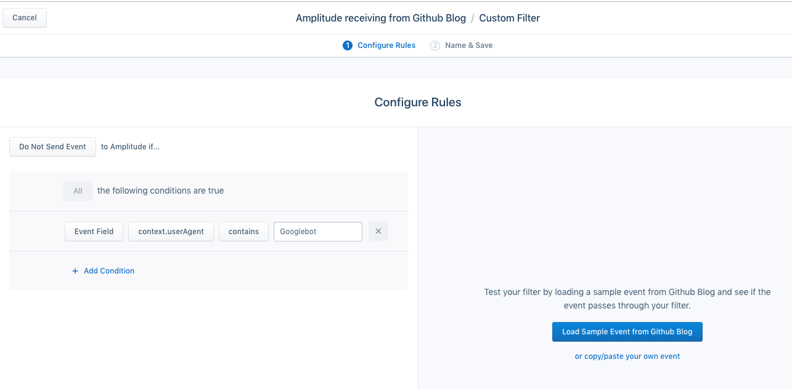
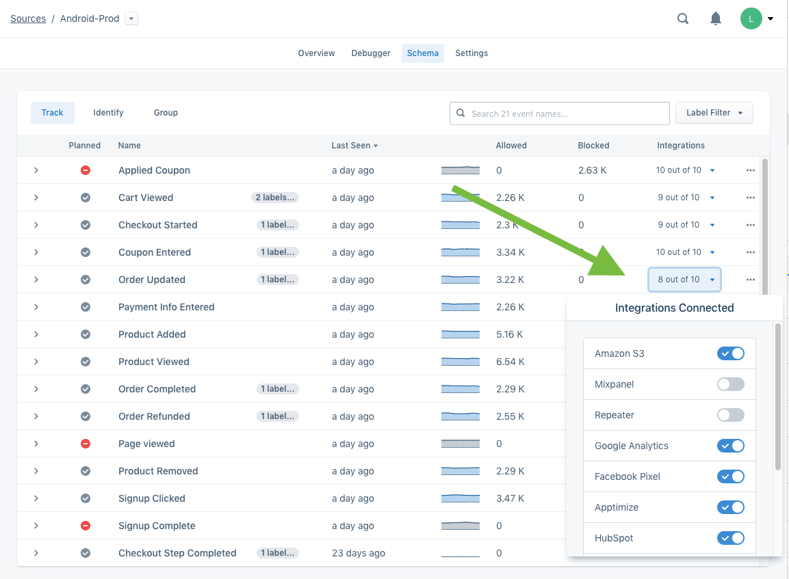
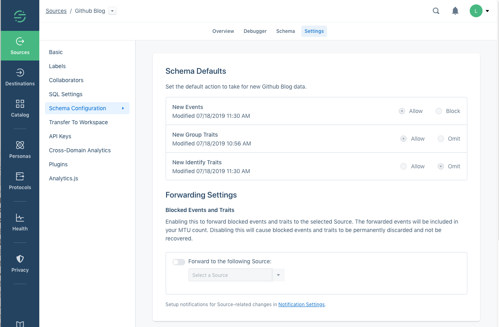
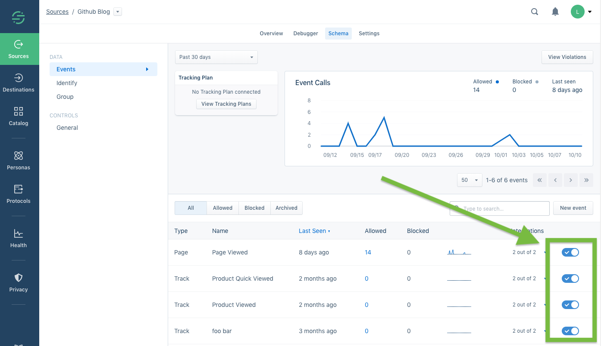
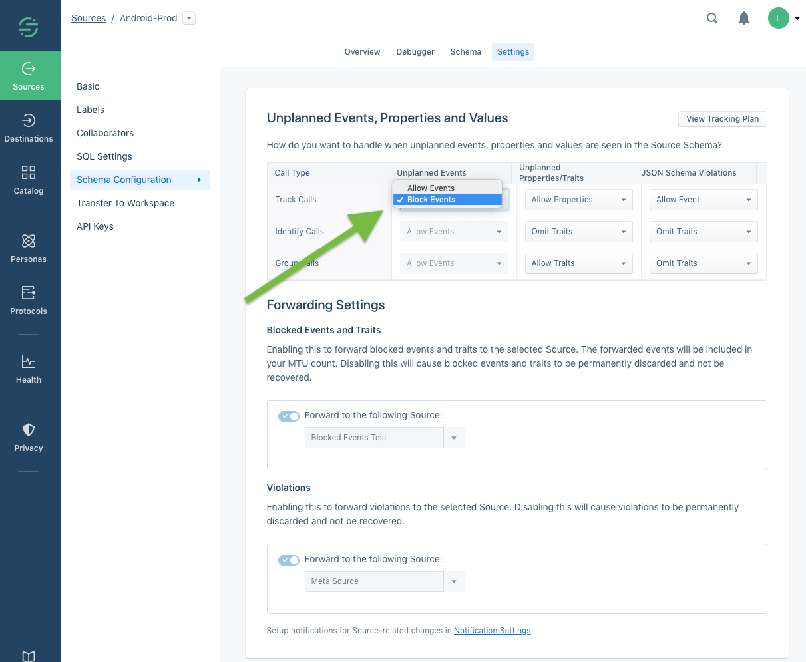
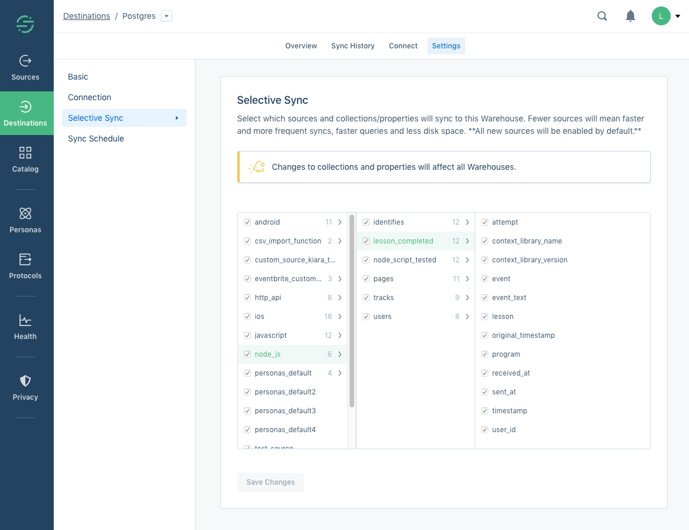

There are many ways you can use Segment to filter event and object based data to control which destinations it reaches. This document lists the most commonly used ways you can filter data in Segment, and explains when you'd use each.


## Filtering with the Integrations Object

The Integrations object is the only filtering method that cannot be edited using the Segment web app. As such, it is both the most reliable, and the most complicated filtering option to change. The integrations object is available to all customers regardless of Segment plan.

Use this option when you absolutely, for sure, 100% know that you *always*, or *never* want this data in a specific destination or set of destinations. You can also build logic in your app or site to conditionally enable or disable destinations by rewriting this object, however this is not recommended as it is time consuming to change, especially for mobile apps.

The Integrations object filters track, page, group, identify, and screen events from both client and cloud based sources, and routes or prevents them from getting to the listed destinations. Data from these calls still enters into and is stored in the Segment systems, and is passed downstream to your warehouse(s) if you have them.

You can use the `integrations` JSON object as part of your Segment payloads to control how Segment routes your data to specific destinations. An example payload is below:

```json
{
  "anonymousId": "507f191e810c19729de860ea",
  "context": {
    "locale": "en-US",
    "page": {
      "title": "Analytics Academy",
      "url": "https://segment.com/academy/"
    },
  },
  "integrations": {
    "All": true,
    "Mixpanel": false,
    "Salesforce": false
  }
}
```

By *default*, the `integrations` object is set to `'All':``true`. You do not need to include this flag in the object to use this behavior, but if you'll be using the integrations object frequently to control destination filtering, you might want to do this to make it explicit for later readers. You can also change this to `'All': false` to prevent destinations from receiving any data by default. You can also add destinations to the object by key, and provide a `true` or `false` value to allow or disallow data to flow to them. The `All` flag is superseded by any destination specific options.

Note that destination flags are **case sensitive** and match the destination's name in the docs (for example, "AdLearn Open Platform", "awe.sm", "MailChimp", etc.).

Your data is sent to your warehouse (if you have one) and into the Segment backend systems regardless of what is in the integrations object.

## Destination Filters

[Destination Filters](https://segment.com/docs/connections/destinations/destination-filters/) allow you to control the data flowing into each specific destination, by examining event payloads, and conditionally preventing data from being sent to destinations. You can filter out entire events, or just specific fields in the properties, in the traits, or in the context of your events. Destination filters are not available for, and do not prevent data from reaching your warehouse(s) or S3 destinations.

> note ""
> **Note**: Destination Filters are available in workspaces that are on a Business Tier plan only. Destination Filters can only be applied to Cloud-mode ("server-side") streaming destinations. Device-mode destinations are not supported.



You can set up Destination Filters from the Segment web app by navigating to the destination from which you want to exclude the data, and clicking the **Destination Filters** tab. From there you can create new filter rules, and edit, enable, and disable existing filters. See the [Destination Filters documentation](https://segment.com/docs/connections/destinations/destination-filters/) for more details.

You can set up Destination filters using the options presented in the Segment web app, or using Segment's Filter Query Logic (FQL). If you use FQL, your query syntax is limited to 5kb per query.

## Per-Source Schema Integrations Filters

Integration filters allow you to quickly change which destinations receive specific Track, Identify, or Group events. Access this tool in any Source that is receiving data by navigating to the Schema tab. Schema integration filters are available to workspaces that are on a Business Tier plan only.

You can apply Integrations filters to specific events regardless of whether the source is connected to a Tracking Plan. To update which destination an event can be sent to, click the **Integrations** dropdown menu to see a list of the destinations each call is sent to. You can turn those destinations on or off from within the dropdown menu.



The events filtered out of individual destinations using this method still arrive in your data warehouse(s). Warehouses do not appear in the integration filters dropdown, and you cannot prevent data from flowing to Warehouses using this feature - to do that use [Warehouse Selective Sync](#warehouse-selective-sync).

**Integration filters are all-or-nothing for each event.** If you require more detailed control over which events are sent to specific destinations, you can use Destination Filters to inspect the event payload, and conditionally drop the data or forward it to the destination.

## Schema Defaults

Schema defaults allow you to prevent unexpected or malformed data from a Source from getting into your downstream destinations. When you set your Schema Defaults to **Block**, Segment automatically prevents new Events from being sent to destinations. You can activate this for new events (including `track`, `page`, and `screen` events) or for new `identify` traits and `group` properties.

Data blocked using schema defaults is permanently discarded, and cannot be recovered or replayed through Segment. You can forward blocked data to a new Source, but these events count toward your account MTU limits, and may not be worth saving.

Schema Defaults are only available to Business Tier customers.

You can find the Schema Defaults in the **Settings** tab for each Source, in **Schema Configuration** section.



**Schema Defaults Blocking Limitations**
You cannot use Schema defaults if the source is connected to a Tracking Plan. If you're using Protocols and Tracking Plans, use [Protocols Tracking Plan Blocking](#protocols-tracking-plan-blocking-and-property-omission) to perform the same blocking. Learn more in the [Protocols Schema Configuration documentation](/docs/protocols/enforce/schema-configuration/).

**Track** events blocked by Schema filters are not delivered to either device-mode or cloud-mode Destinations. That means if you send a blocked event from a client-side library like Analytics.js, it is not delivered to any device-mode Destinations.

**Identify** and **Group** call traits blocked by Schema filters are **only** blocked from delivering to cloud-mode Destinations. Since device-mode destinations are connected directly to the user's device and don't pass through the Segment filters first, they still receive all traits regardless of whether they are blocked in the Segment Schema.

## Schema Event Filters

You can use Schema Event Filters to discard and permanently remove Page, Screen and Track events from event-based sources, preventing them from reaching any destinations or warehouses. Use this if you know that you'll never want to access this data again. This functionality is similar to filtering with the Integrations object, however it can be changed from within the Segment app without touching any code.

When you enable these filters, Segment stops forwarding the data to all of your Cloud- and device-mode destinations, including warehouses, and your data is no longer stored in Segment's warehouses for later replay.

Use this when you need to disable an event immediately, but may need more time to remove it from your code, or when you want to temporarily disable an event for testing. In addition to blocking track calls, you can block all page and screen calls, as well as omit identify traits and group properties.

If the Source is not connected to a tracking plan, you'll find event filter toggles next to the Integration filters in the source's schema tab. When an event is set to block, the entire event is blocked. This means no destinations receive it, including data warehouses.



When an event is blocked, the name of the event or property appears on your Schema page with a counter which shows how many times it has been blocked. By default, data from blocked events and properties is not recoverable. You can always re-enable the event to continue sending it to downstream destinations.

In most cases, blocking an event immediately stops that event from sending to destinations. In rare cases, it can take **up to 6 hours** for an event to completely stop arriving in all Destinations.

This feature is only available if the Source is not connected to a Tracking Plan, and is only available in workspaces that are on a Business Tier plan.


## Protocols Tracking Plan blocking and property omission

If you're using Protocols, and you're confident that your tracking plan includes exactly the events and properties you want to record, you can tell Segment to [block unplanned events or malformed JSON](/docs/protocols/enforce/schema-configuration/). When you do this, Segment discards any data coming from the Source that doesn't conform to the tracking plan.

By default, the blocked events are permanently discarded: they do not flow to Destinations, and cannot be Replayed (similar to Schema Controls). However, you can opt to send data in violation of the tracking plan to a new Segment Source so you can monitor it. (This source can affect your MTU count.)

If you have Protocols in your workspace, **and** have a tracking plan associated with the Source, you'll see additional options in the Schema Configuration section of the Source's Settings page. From this page you can choose how to handle data violations across different types of calls and properties, whether that be blocking events entirely or omitting violating properties.




## Warehouse Selective Sync

[Warehouse Selective Sync](/docs/connections/storage/warehouses/selective-sync/) allows you to stop sending specific data to specific warehouses. You can use this to stop syncing specific events or properties that aren’t relevant, and which could be slowing down your warehouse syncs.

> info ""
> This feature is available to Business Tier customers only, and only Workspace Owners can change Selective Sync settings.

By default, a warehouse receives all sources and their collections and properties. No data is prevented from reaching warehouses. With Selective Sync, you can configure which collections and properties from a source are sent to each warehouse. This allows you to send different sets of data to each warehouse. This also means that you need to enable or disable data for each individual warehouse.

This feature only affects [warehouses](/docs/connections/storage/warehouses/), and does not prevent data from going to any other [destinations](/docs/connections/destinations/).

When you use Selective Sync to prevent data from syncing to a specific warehouse, Segment stops sending new data that meets the selection criteria to that warehouse, however it doesn't delete any existing data in the warehouses. If you use Selective Sync to re-enable a source after disabling it, Segment loads all data that arrived since the last sync into the warehouse, but doesn't backfill data that was omitted while the source was not syncing. Re-enabling a collection or property does **not** backfill any historical data -- only new data generated after re-enabling will be synced to your warehouse.

To enable selective sync, in the Segment app go to the Destinations page, select the warehouse, click **Settings**, and click **Selective sync** in the left menu.
See the documentation on [Warehouse Selective Sync](/docs/connections/storage/warehouses/selective-sync/) for more details.



## Privacy Portal filtering

The [Privacy Portal](/docs/privacy/portal/) is available to all Segment customers, because we believe that data privacy is a right, and that anyone collecting data should have tools to help ensure their users' privacy. More enhancements are available to BT customers who may need tools for managing complex implementations.

The Privacy Portal tools allow you to inspect your incoming calls and their payloads, detect potential Personally Identifiable Information (PII) in properties using matchers, classify the information by different categories of risk, and use those categories to determine which Destinations may or may not receive the data. Learn more about these features in the [Privacy Portal documentation](/docs/privacy/portal/).


