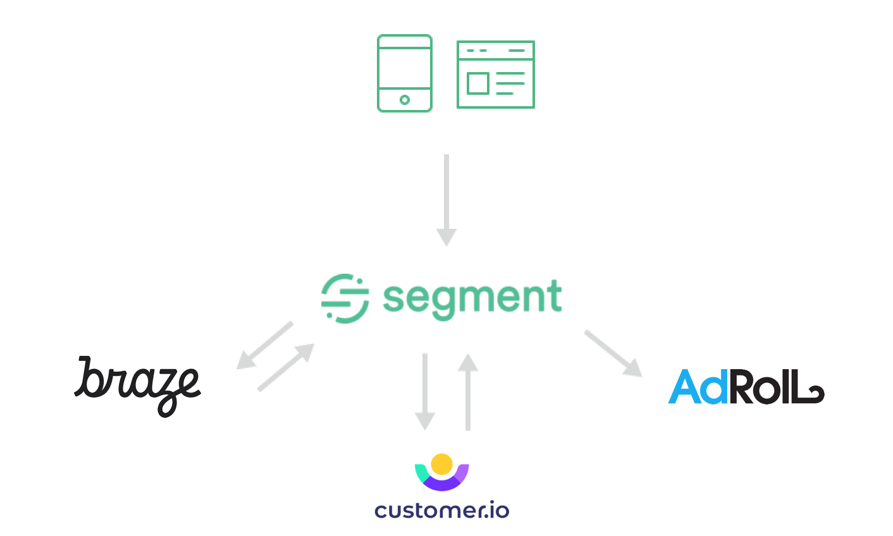
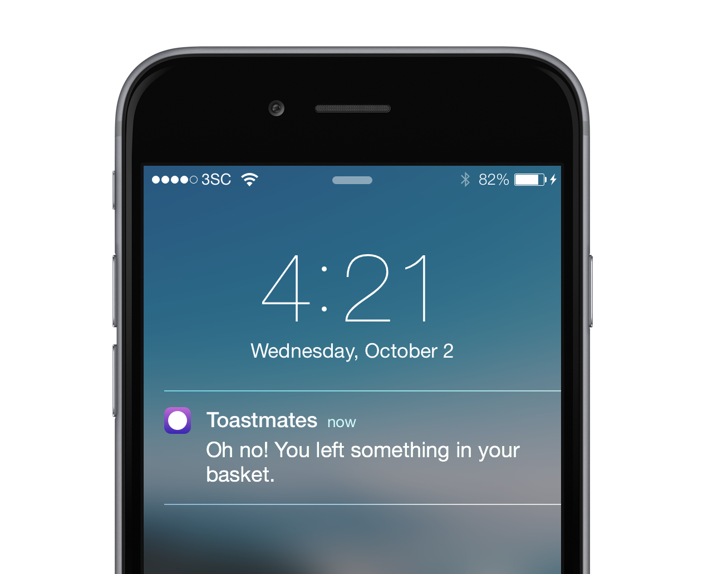
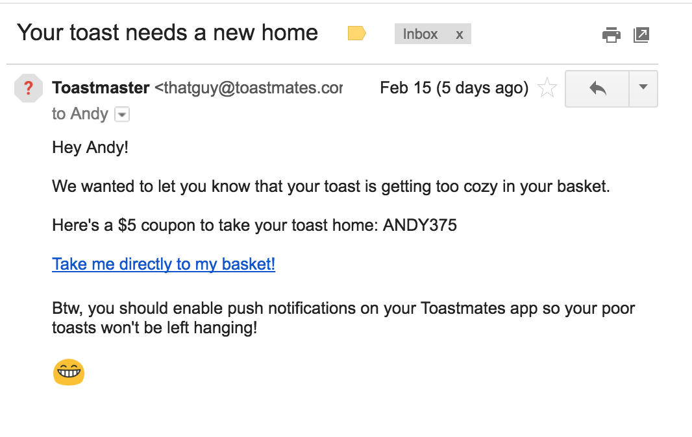
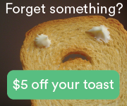

Compelling and engaging brands delight their customers at every interaction. As customers move seamlessly across channels—such as email, push notifications, display ads—brands must similarly meet them with tailored and consistent messages.

We'll show you how to craft a tailored message while using a combination of AdRoll, Customer.IO, and other tools to dynamically switch between channels.

[Talk to a product specialist today](https://segment.com/contact/sales) about using data to tailor your brand experience.

## Tools used

*   Retargeting with [AdRoll](https://adroll.com/): _AdRoll is a retargeting and prospecting tool that allows you to show display ads to a behaviorally-defined cohort_

*   Push notifications with [Braze](https://braze.com/): _Braze is a multi-channel marketing campaign focused on the mobile experience_

*   Emails with [Customer.io](https://customer.io/): _Customer.io is a flexible email provider that allows you to create cohorts based on customer actions. You can build complex onboarding emails, nurture email campaigns, as well as marketing automation workflows._

_There are other email tools on Segment's platform, such as_ [Bronto](https://bronto.com/), [SendGrid](https://sendgrid.com/), _and_ [Mailchimp](https://mailchimp.com/). _Check out the_ [full list of email tools](https://segment.com/catalog#integrations/email).

Before we proceed, it's important to register for these tools and enable them on your Segment source project. When Segment collects tracking data, it'll also route it to all of your enabled tools. Then your tools, especially ones like Customer.io, Braze, and AdRoll, where you can define cohorts of your users, will be working off a dynamic, yet consistent data set. This is paramount in getting the dynamic messaging to update accordingly.

## Set it up

When you send tracking data from your app or website to Segment, Segment will send the same data to all of your tools. Segment also collects key messaging events like Push Notification Opened and Email Opened from Braze and Customer.io, respectively, and sends that to other tools. By defining cohorts based on these events, you can create dynamic campaign audiences, to which customers can add and remove themselves.

In each of your destinations—Braze, Facebook, Customer.io, AdRoll—you can create custom campaigns to show display ads or send emails to a specific segment of users who have performed (or not performed) a given action, or "event." In this cross-channel re-engagement example, we'll start with push notifications.

## 1st Line of Defense: The Push Notification

In Braze, create a segment of customers who added a product to their cart, but did not check out. The segment definition, in this case, should be people who have performed `Product Added`, but have not performed `Order Completed` . Send a push notification to these customers with a message that the cart was abandoned and that they can complete the transaction with a 10% coupon (or up to you).

## 2nd Line of Defense: The Email Reminder

Because Segment automatically collects second-party data from Braze, you now also have push notification event data, like `Push Notification Opened` and `Push Notification Received` in Segment. You can use the `properties` on each of these events to define a property called `campaign_name` so you can tie these activities to a given campaign.

This is helpful because now, you can define segments in Customer.io for customers who have triggered `Push Notification Received`, but not `Push Notification Opened` . You've now automated the process of targeting customers who don't open your push notifications. In Customer.io, From here, you can create a campaign that sends an email to those people asking them to check their push notifications and offering them a coupon to complete their order.

## 3rd Line of Defense: Paid Advertising

Since Segment collects email event data, like `Email Opened`, from Customer.io, you can similarly create segments in Facebook Ads and AdRoll for when customers don't open your email. Create a segment where users have an `Email Delivered` event, but no `Email Opened` event. When users meet these criteria, they'll get automatically added to your retargeting campaigns. You can then serve them custom creatives about them neglecting to open your emails and, again, perhaps offer them a coupon to complete the transaction.

When users do not open an activation email, we can seamlessly add them to a specific retargeting campaign that contains messaging to remind them to activate.

With Segment, we can automate not just switching across channels, but also the messaging in each channel so that the entire experience is cohesive. The added benefit is that we can create specifically targeted retargeting campaigns for people who no longer open our emails or push notifications. Automating these processes with Segment makes channel-switching more seamless for your customers.

## Create an engaging and consistent brand experience

This is just a simple cart abandonment example that dynamically follows our customers as they switch between channels. Because Segment collects and routes the second party data of emails and push notifications being opened, we are able to create specific campaigns with messaging that targets your customers as they interact with your brand.

With over 200+ different tools on our platform, you can take this idea and create other tailored shopping experiences to re-engage your customers.

[Talk to a product specialist today](https://segment.com/contact/sales) _about using data to tailor your brand experience._
