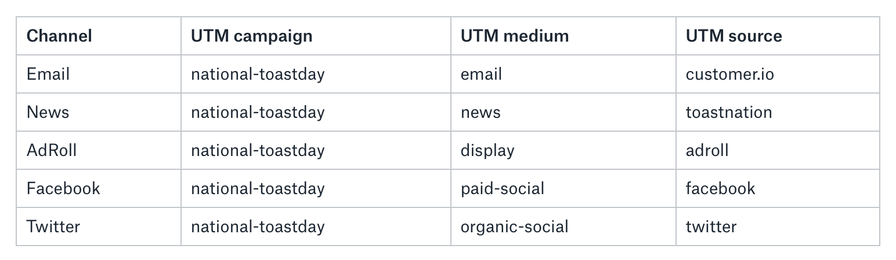

The paths consumers take to your app or website are more complex than ever, often involving a variety of online communities and multiple devices. Your next repeat customer might stumble across your display ad on a newsletter you've never heard about, or receive a recommendation from a co-worker in a Slack channel.

But these off-domain and cross-device brand interactions are equally, if not more, important to track and understand. With this data, you can identify more sources of qualified traffic and determine the best shopping experiences for conversion.

In this guide, we'll share where and how to track these critical events so that you can understand your customer's journey before they even get to your storefront, as well as their preferred shopping experiences.

_If you're interested in learning about what to track,_ [check out our guide on creating an e-commerce tracking plan](/docs/connections/spec/ecommerce-tracking-plan/).

[Talk to a product specialist today](https://segment.com/contact/sales) about building a clean, high-quality data spec so you can focus on brand engagement and sales growth.

## Where are they coming from? Off-domain tracking

Digital marketing consists of owned marketing, earned marketing, and paid marketing.


"Owned" marketing encompasses all activities you have full control over. It can be further split into first- and second-party data. First-party data is customer data generated on your site or in your app. Second-party data is customer data generated when your customers interact with your email or push notifications (e.g. "Email Opened", "Push Notification Received").

"Earned" marketing is when publications, newsletters or blogs organically create some content that refers to or promotes you.

Paid acquisition, like display ads or embedded advertorials, don't exist on your domain. To track the inbound traffic from both "earned" and paid acquisition sources, we use UTM parameters (and deep links if you're directing a customer to a specific screen in your mobile app that has the product to purchase).

**Track engagement on your email channels**

While these are still under "owned" marketing, they happen off your domain. An example is sending an engagement email to your customer base with a call-to-action to visit your store. If you're using Segment and an email or push notification tool on our platform, you can easily collect second-party data such as "Email Sent" and "Push Notification Opened".

_Learn more about which_ [email](https://segment.com/catalog#integrations/email) and [push notification tools](https://segment.com/catalog#integrations/push-notifications) _are supported on Segment._

Here are some of the most commonly used and popular events tracked through email and push notifications on Segment:

*   Email Delivered

*   Email Opened

*   Push Notification Received

*   Push Notification Opened

*   Deep Link Clicked


If your email tool is not supported on Segment, you can still track email opens with Segment's tracking pixel. This pixel functions like an advertising pixel in that it embeds an image onto pages where JavaScript and POST requests are disabled.

[A list of supported tools on Segment.](https://segment.com/catalog/)

In your email template HTML, include an image tag where the `src` is a URL that is carefully constructed to hit Segment's appropriate endpoint with a JSON payload that is base64 encoded.

An example of the payload that will be sent to Segment upon an email open is:

```js
{
  "writeKey": "YOUR_WRITE_KEY",
  "userId": "025waflo3d65",
  "event": "Email Opened",
  "properties": {
    "subject": "Try Our New $10 Toast",
    "email": "andy@segment.com"
  }
}
```

Then, you would base64 encode that and append it to the Segment endpoint:

```text
https://api.segment.io/v1/pixel/track?data=<base64-ENCODED-JSON>
```

Add the complete URL as the `src` in the image tag.

```text

```

[Learn more about our Pixel API.](/docs/connections/sources/catalog/libraries/server/pixel-tracking-api/)

**Track earned traffic with UTM Parameters**

UTM parameters are types of query strings added to the end of a URL. When clicked, they let the domain owners track where incoming traffic is coming from and understand what aspects of their marketing campaigns are driving traffic.


UTM parameters are only used when linking to your site from outside of your domain. When a visitor arrives to your site using a link containing UTM parameters, Segment's client-side analytics.js library will automatically parse the URL's query strings, and store them within the `context` object as outlined [here](https://segment.com/docs/connections/spec/common/#context-fields-automatically-collected). These parameters do not persist to subsequent calls unless you pass them explicitly.

UTM parameters contain three essential components:

*   **utm\_campaign**: this is the name of your campaign. All marketing activities that support this campaign, needs to have the same utm\_campaign so that downstream analysis to measure performance for this specific campaign can be done off this primary key. Examples: "national-toastday"

*   **utm\_medium**: how the traffic is coming to your site? Is it through email, a display ad, an online forum? This ensures our downstream analysis can easily see which channel performs the best. Examples: "email", "paid-display", "paid-social", "organic-social"

*   **utm\_source**: where is the traffic specifically coming from? You can be specific here. This ensures our downstream analysis can measure which specific source brings the most conversions. Examples: "twitter", "customer.io" (email tool), "facebook", "adroll".


With these being optional:

*   **utm\_content**: for multiple calls to action on a single page, utm\_content indicates which one. For example, on a website, there may be three different display ads. While the link on each display ad will have the same utm\_campaign, utm\_medium, and utm\_source, the utm\_content will be different. Examples: "banner", "left-side", "bottom-side"

*   **utm\_term**: this is the parameter suggested for paid search to identify keywords for your ad. If you're using Google Adwords and have enabled "autotagging", then you don't need to worry about this. Otherwise, you can manually pass the keywords from your search terms through this parameter so that you can see which keywords convert the most. Note that this parameter is reserved explicitly for search. Examples: "toast", "butter", "jam".


[Learn more about the semantics with each UTM parameter.](https://docs.google.com/file/d/0By71e2L6SonANjViYWUyOTktOGQ2Ny00NWJmLThlY2MtMDU3MzJhNWU0MDg1/edit?hl=en) _The key isn't to stick with the definitions that closely, but to be consistent within your own analytics system._

**Proper UTMs use**

A marketing campaign is a single marketing message across several platforms, media, and channels, with a consistent and clear call-to-action.

Since the marketing campaign is from off-domain to your storefront (on your property or domain), then it's critical to use the proper and consistent UTM params across all of your channels:

*   emails

*   paid acquisition

*   guest blog post in partner's newsletter

*   article in the news

*   offline events / in real life / meat space


Your UTM parameters would match a pattern such as

*   having the same utm\_campaign across all channels

*   different utm\_source and utm\_medium depending on the channel

*   if you were on paid acquisition, the placement of the display ad would determine what goes in utm\_content

*   if you were using paid search, the term would be utm\_term


An example would be a National Toast Day campaign. This campaign would include emails, paid acquisition (via AdRoll and Facebook Ads), organic social (Twitter), and promotional content on partners' blogs.



Having the consistent UTM parameters naming convention simplifies the downstream analysis and the ease of querying across dimensions, such as within the campaign, which medium or source was the best. Or which placement of the display ad led to the most conversions.

[Learn more about measuring ROI of marketing campaigns with SQL and UTM parameters.](https://segment.com/docs/guides/how-to-guides/measure-marketing-roi/)

## What device are they using? Cross-device tracking

It's common for customers to discover you on their desktop before making the purchase much later on their phone. How do we tie all of these events back to the same customer so we can understand which marketing activities on what screens are responsible for conversions?

**Track server-side when possible**

Tracking with JavaScript in the browser has its benefits, such as leveraging browser technologies to automatically track things like UTM parameters, referring domain, IP address, and user agent. But here are a few reasons why it might make sense for your store to track on the server side.

*   Are your customers technically savvy and use ad blockers? Ad blockers restrict requests from a list of blocklisted domains to your browser, which means that none of your event tracking will work properly. If you sell to a technical audience, it is possible that you may be underreporting your analytics by a material amount.

*   Do you have multiple devices? If you have multiple devices with the same customer check out flow, moving those events to the server-side will reduce your surface area of your code base. This means less maintenance and faster changes.


[Learn more about client vs server tracking.](https://segment.com/academy/collecting-data/when-to-track-on-the-client-vs-server/)

If you do move key checkout events to the server side, you will have to manually send the data automatically collected by our client-side JavaScript library to your server. These pieces of tracking data are still important for the following reasons:

*   **UTM parameters**: collecting the UTM params will allow you to tie conversion events to your marketing campaign or activities. This is valuable in that you can immediately measure performance and calculate ROI on your campaigns.

*   **IP address**: the IP address can provide location intelligence for your customers. This means you can personalize your shopping experience or engagement emails with inventor that might be more relevant depending on your customers' locations.

*   **User Agent**: the User Agent will inform you of your customers' preferred device and shopping experience. Are they converting on a mobile web browser? Native app? Or on their laptop?


[Learn how to use](https://segment.com/docs/connections/spec/common/#context) [`context`](https://segment.com/docs/connections/spec/common/#context) [to manually send this information on the server side.](https://segment.com/docs/connections/spec/common/#context)

**Track the same user across devices**

If your store allows user registration and users are logged in when they shop on your site or app, then you can track them across devices.

This works by using a `userId` instead of an `anonymousId` to track key events and where they occur. This `userId` serves as the primary key in your downstream tools and data warehouse, allowing you to join all of her anonymous activities with her logged in ones. You also can get a complete picture of where she is and what device she is on, while she is using your apps or website.

[Learn more about pulling the entire user journey for a single user given a userId.](https://segment.com/docs/guides/how-to-guides/join-user-profiles/)

Unfortunately, tracking the same user across devices only works if she logs into each device. Anonymous browsing in each distinct "experience" (e.g. mobile safari, native iPhone, browser on laptop) generates its own unique `anonymousId` . Each `anonymousId` is limited to the scope of that browser or app, only measuring activities in those sessions. It's not until the user logs in when the `userId` is generated (if she is registering for a new account) or the `userId` is retrieved from your database, and then mapped to the `anonymousId` of that session. Segment will keep a table of `anonymousId` s mapped to a single `userId`so you can analyze a user's activity across multiple devices.

If a user logs in on multiple devices, then you would be able to analyze even the anonymous activity across those devices. Consequently, it's important to encourage your users to log in so that you have this capability.

## Attribute offline conversions to online impressions

One of the biggest challenges for brick-and-mortar stores is to measure the impact of their online advertising campaigns on their in-store purchases. Attributing offline conversions has traditionally been difficult to achieve, due to the lack of offline data and robust infrastructure to route that data.

For Facebook advertisers, [Facebook Offline Conversions](https://www.facebook.com/business/help/1782327938668950) allow you to tie offline conversions to your campaigns. It's important to note that the offline data is labeled to an event set that has been assigned to a Facebook campaign. Here are the two ways to attribute offline conversions to Facebook advertisements:

*   uploading offline event data about actions that aren't captured with Facebook Pixel or App Events to Facebook for them to match actions to your Facebook ads

*   enable and configure [Segment's Facebook Offline Conversions destination](/docs/connections/destinations/catalog/facebook-offline-conversions/), which automates attributing offline events to your Facebook ads in real-time


[Learn more about the benefits of Segment's Facebook Offline Conversions destination.](https://segment.com/blog/facebook-offline-conversions-integration/)

Most other advertising networks provide some functionality of manually uploading offline data to match with their online advertising data. Here is a short list of other services:

*   [Google Adwords](https://adwords.google.com/home/) provides the functionality to [attribute offline conversions to your ads](https://support.google.com/adwords/answer/2998031?hl=en).


Being able to attribute in-store purchases to an impression from a display ad online is critical to help marketers and advertisers understand which campaigns or creatives are driving sales. The more real-time the data and insights, the more nimble your business can be in altering course so that additional resources can be put towards the right marketing actions.

## Learn about the funnel before your website or app

The internet has made it easy for customers to come from nearly anywhere to your digital storefront. But there are ways to track and collect data to better understand these complicated paths so you can be intentional with your marketing efforts to tap into these communities.

By tracking in these locations with the above mentioned techniques, your downstream analysis will also be simpler. With UTM params, you'll be able to quickly measure the performance of a campaign or a particular channel. By properly tracking on multiple devices, you can understand which shopping experiences are most preferred. These tracking techniques are invaluable to understanding the source of your highest quality customers.

[Talk to a product specialist today](https://segment.com/contact/sales) _about building a clean, high-quality data spec so you can focus on brand engagement and sales growth._
