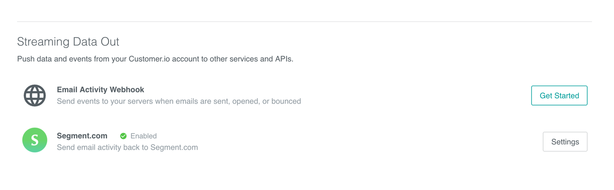
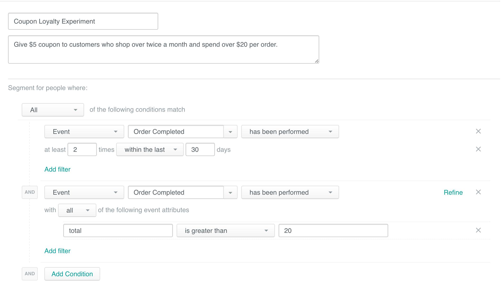
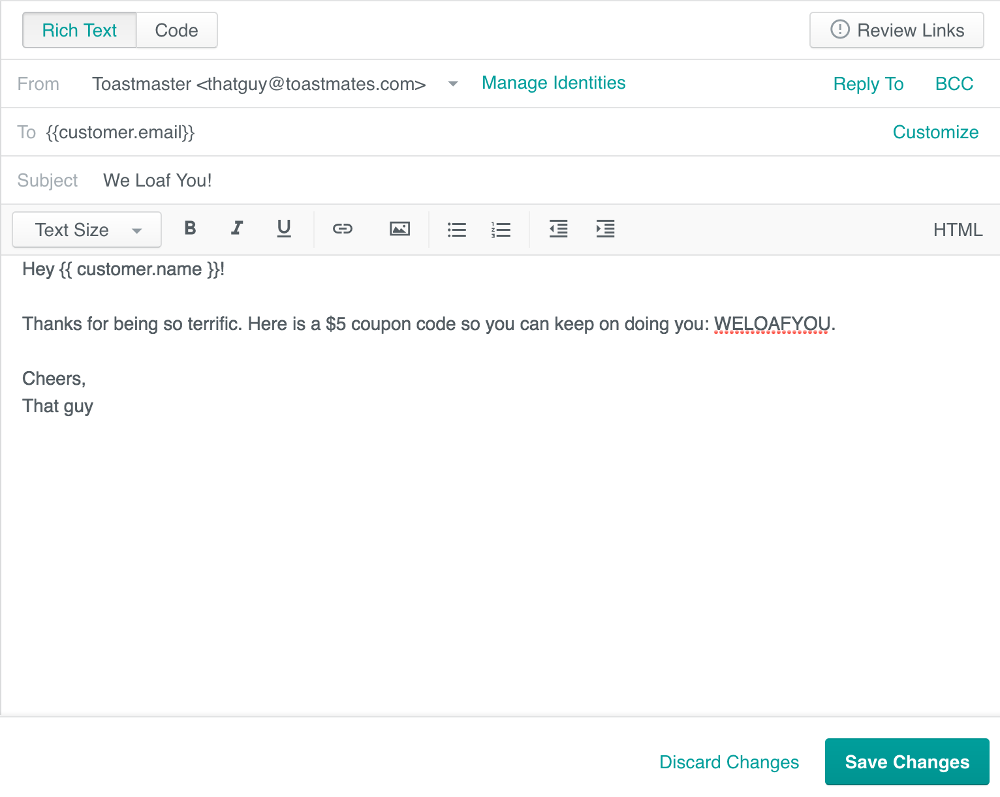
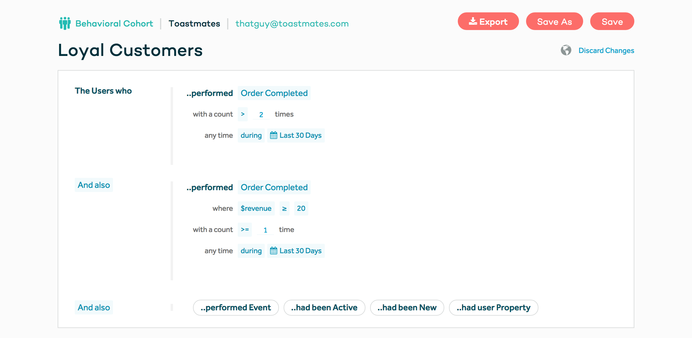
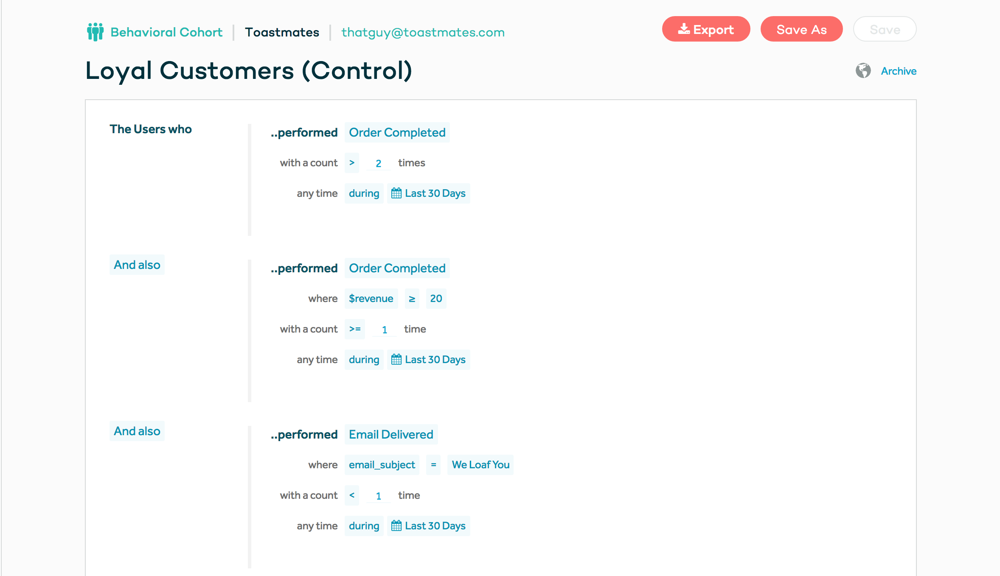
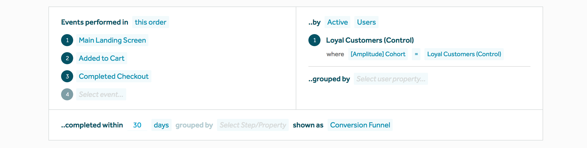
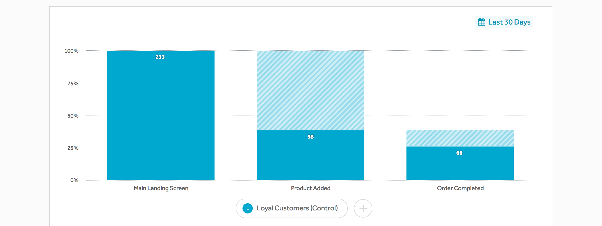
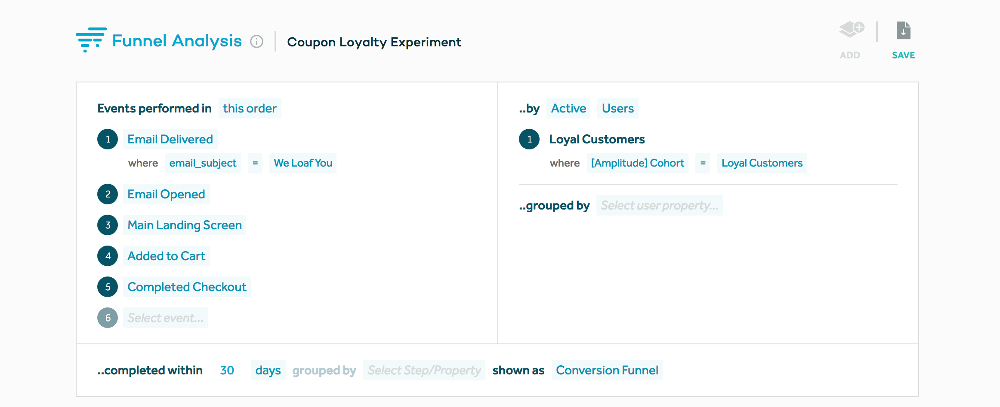
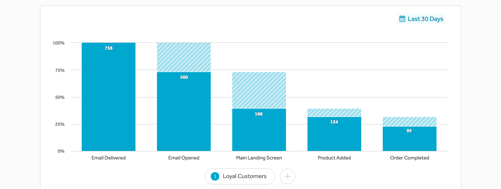

One component of building a successful and engaging e-commerce brand is rewarding your most loyal customers. With Segment Warehouses and SQL, you can retrieve a table of your most valuable customers, then reward them.

This guide will walk you through setting up a dynamic and automated coupon program based on conditions that define your most valuable customers, as well as how to measure the program's performance.

[Talk to a product specialist today](https://segment.com/contact/sales) about using data to tailor your brand experience.

## Tools used

*   Emails with [Customer.io](https://customer.io/): _Customer.io is a flexible email provider that allows you to create cohorts based on customer actions. You can build complex onboarding emails, nurture email campaigns, as well as marketing automation workflows._

*   Retention Analytics with [Amplitude](https://amplitude.com/): _Amplitude is an analytics tool that focuses on understanding retention and funnel analysis_

Before we proceed, it's important to register for these tools and enable them on your Segment source project. When Segment collects tracking data, it routes it to all of your enabled tools, meaning that they get a single consistent data set. Most importantly, the data generated by users interacting with emails is sent through Segment so you can analyze email performance, and how it impacts conversion with Amplitude.

**Not using Customer.io or Amplitude?** Check out the other Segment Supported [Email Marketing](/docs/connections/destinations/catalog/#email-marketing) and [Analytics tools](/docs/connections/destinations/catalog/#analytics).

## The Loyalty Program

As the marketing manager of our fictitious, on-demand artisanal toast company, Toastmates, I want to experiment with a coupon program to retain our best customers.

Through a combination of SQL and statistical analysis on a set of historical data, we've identified the conditions for our most valuable customers as:

*   shops over twice a month
*   pays over $20 per order

_Learn how we defined these conditions in_ [How to Forecast LTV for e-commerce with Excel and SQL.](https://segment.com/docs/guides/how-to-guides/forecast-with-sql/)

Will rewarding a $5 coupon to this cohort after they make the second purchase a month lead to higher engagement and LTV? We'll set up this program using Customer.io as the email provider and measure it's performance on engagement and LTV with Amplitude.

We'll conduct a split test (half of the cohort will represent the control group and will not receive any emails; the other half will receive an email with the $5 coupon) for one month. After which, we'll use Amplitude to see if there were any correlations between the coupon email and conversions.

## Set it up

First, register for an account with Customer.io and Amplitude. Then, enable Customer.io and enable Amplitude on your Segment project. Finally, go into your Customer.io account and enable "sending data to Segment":

[You can find those destination settings in Customer.io here.](https://fly.customer.io/account/integration_settings)

When everything is enabled, customer event data such as `Order Completed` and `Product Added`, as well as their properties, will all be sent to your configured destinations, including Customer.io and Amplitude. Then you can define cohorts based on these events in Customer.io to add to email campaigns or conduct funnel analytics in Amplitude.

[Talk to a product specialist to learn what else you can accomplish with these tools.](https://segment.com/contact/sales)

## Define the cohort in Customer.io

Now we define the specific cohort in Customer.io as per our conditions listed earlier: someone who spends over $20 per order and shops over twice a month. In Customer.io, go to "Segments" and "Create Segment":

After this cohort is created, then when a customer makes the third purchase in a month and it's over $20, then she will be added to this segment.

Next, we'll create a "segment trigger campaign", where Customer.io will send a message the first time someone enters a segment. The segment in this case will be the one we just created: Coupon Loyalty Experiment.

Save the changes and then enable the campaign!

Then, make sure that your e-commerce backend is set up properly to handle the coupons. If it's available in your system, create a coupon that only works for a specific set of customers.

## Measure performance

After a month has passed for our split test, we can then measure the performance of the email coupon program to see whether it's making a material impact on conversions.

In Amplitude, we can create a funnel that compares the two cohorts—one who received this coupon email vs. the control group who did not—and see its impact on conversions and revenue generated.

First, let's define a behavioral cohort with the conditions of being loyal customers so we can use it when we analyze the conversion funnel:

We'll also have to create a second identical cohort, except with the only difference that these customers did not receive the coupon email. We need this cohort so we can create the conversion funnel with the control group.

After we've created these two cohorts, we'll create two funnel charts. The first funnel will look at the control group. The second funnel will look at the group that received the coupon email.

Resulting in:

We can see that the control group that did not receive the email for the coupon resulted in 233 people visiting the store, with 66 conversions.

The funnel for the group who did receive the emails can be created with these parameters:

Resulting in:

The email itself drove 168 customers to the store, which also saw higher conversions to `Product Added` and ultimately `Order Completed` .

Note that this funnel is only looking customers who went through these events in this specific order. This analysis doesn't consider customers who are part of the emailed cohort, yet didn't open the email, but still visited the site and/or made a purchase.

At first glance, it appears that the group that was emailed did receive an absolute number of more conversions. However, these funnels are still inconclusive, given that we haven't explored the impact on the top line revenue, as well as overall engagement with the brand. Fortunately, we can continue to use Amplitude to analyze impact on revenue itself, though we won't go into detail here.

## Find new ways and channels to retain your most valuable customers

Retaining and rewarding your customers is paramount to a strong and engaging brand. This example is just one of millions that you can employ to find new ways to delight and excite your customer base.

Other ideas can be to send messages to your customers with a referral code to invite their friends. Or set up a coupon for customers who are just shy of entering your most valuable customers cohort. Or, if you're hosting a pop up shop event, sending a special and personalized invite to your strongest users first, as a way to thank them for their business.

The possibilities are endless! We're excited to see how you use your customer data to drive sales.

[Talk to a product specialist today](https://segment.com/contact/sales) _about using data to tailor your brand experience._
