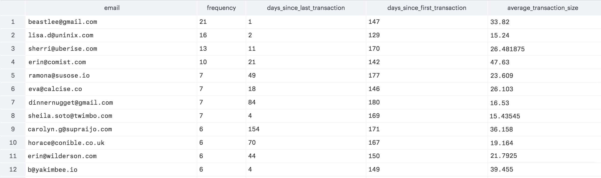
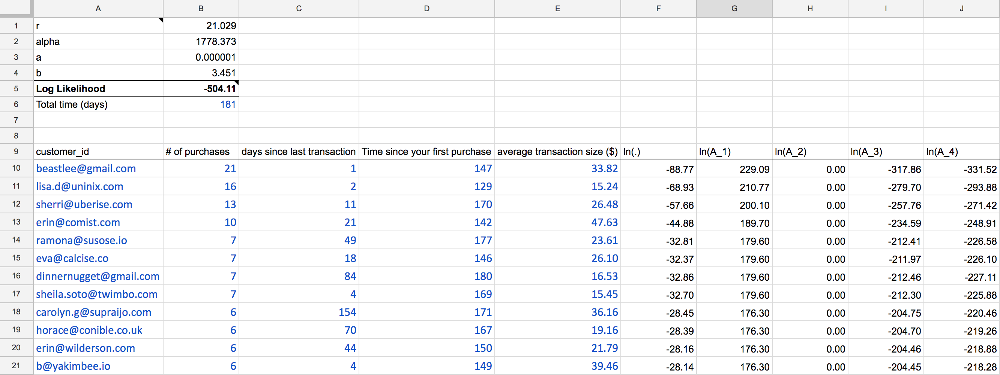
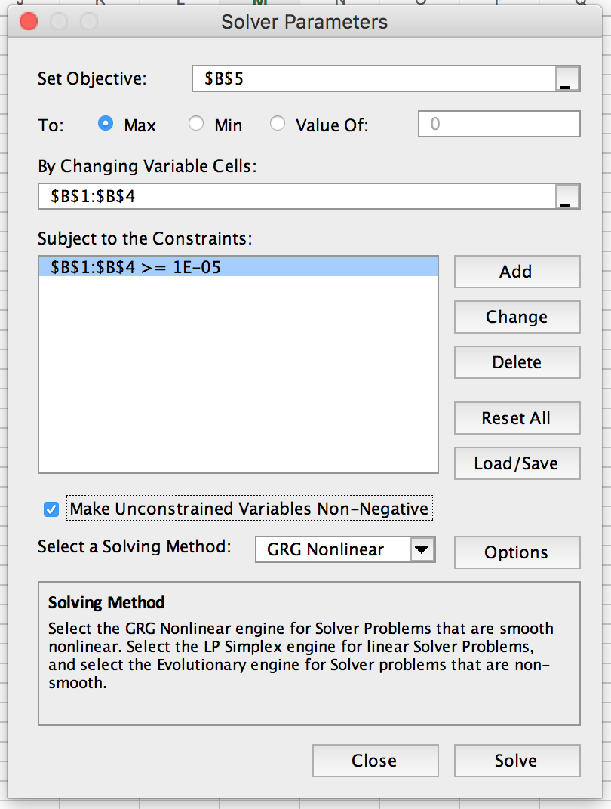
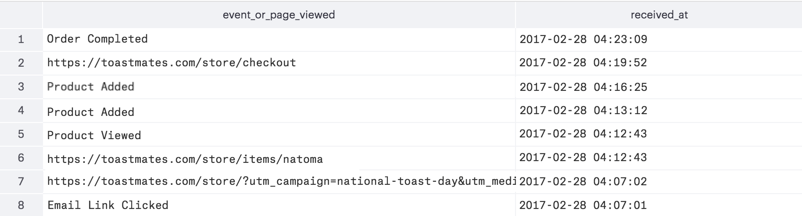

Customer Lifetime Value ("LTV") is the amount of money that an individual customer will spend with a given business in the future. It's often used to value cohorts in your customer base, determine how much to spend in acquiring or retaining new users in a given cohort, rank customers, and measure the success of marketing activities from a baseline LTV forecast.

The LTV calculation is not straightforward for e-commerce businesses, since future payments are not contractual: at any moment, a customer may never make a single purchase again. Additionally, forecasting future purchases requires statistical modeling that many current LTV formulas lack.

This guide shows how to calculate forward-looking LTV for non-contractual businesses using SQL and Excel. This analytical approach allows you to accurately rank your highest value customers, as well as predict their future purchase sizes to help focus your marketing efforts.

In this guide, we assume that you're using the tracking scheme we described in [How to implement an e-commerce tracking plan](/docs/connections/spec/ecommerce-tracking-plan/) and are storing data in a [Segment Warehouse](https://segment.com/warehouses).

[Talk to a product specialist](https://segment.com/contact/sales) to learn how companies like Warby Parker and Crate & Barrel use a data warehouse to increase engagement and sales.

## Calculating LTV: Buy 'Til You Die

In a non-contractual setting, we can't use a simple retention rate to determine when customers terminate their relationship. This is because the retention rate is a linear model that doesn't accurately predict whether a customer has ended her relationship with the company or is merely in the midst of a long hiatus between transactions.

The most accurate non-contractual LTV model, named "Buy Til You Die" ("BTYD"), focuses on calculating the discounted estimation of future purchases based on recency of last purchase, frequency of purchases, and average purchase value. This model uses non-linear modeling to predict whether or not a user is "alive" or "dead" given historic transactions to forecast future probability and size of purchases.

Since LTV is a critical metric for e-commerce companies, it's important that this model, instead of simpler linear formula that is based on retention rates, is used for it's calculation.

We'll first use SQL to build the necessary table, which will be exported as a CSV and opened in Google Sheets. Then, we'll use Solver to estimate the predictive model parameters, which ultimately calculate the future purchases of each customer. Finally, the LTV calculation is simply the net present value of each customer's future purchases. We will rank them by LTV, then find behavioral patterns across our top 10 or 50 customers to figure out how best to target or retain this cohort.

**Recency, Frequency, and Average Size**

As a growth analyst at our fictitious on-demand artisanal toast company, Toastmates, we want to know which customers are worth more to the business than others. Most important, we'd like to understand what similarities these customers all have to help guide our marketing team in their efforts.

The first step in creating the BTYD model is to get historic purchasing data of at least a month. In our analysis, we'll use data from the past six months. The data must include the columns `userId` (email is cool, too, which we'll use in our example below), number of purchases within the specified time window, days since last purchase, and days since first purchase.

Then, we'll use [this Google Sheet](https://docs.google.com/spreadsheets/d/1hcl5nI2KoPhtAMneDGQc_eRUNVaktYtx8p_06YT5fNU/edit#gid=0), which provides all of the complex calculations for estimating the model parameters, as well as forecasting the future sales of each customer. This sheet is View Only, so be sure to copy it entirely so you can use it.

To retrieve a table with the right columns for analysis, let's use the follow SQL query:

```sql
    with
    first_transaction as (
        select  u.email,
                datediff('day', min(oc.received_at)::date, current_date) as first
          from  toastmates.order_completed oc
     left join  toastmates.users u
            on  oc.user_id = u.email
         where  oc.received_at > dateadd('month', -6, current_date)
      group by  1
    ),
    frequency as (
        select  u.email,
                count(distinct oc.checkout_id) as frequency
          from  toastmates.order_completed oc
     left join  toastmates.users u
            on  oc.user_id = u.email
         where  oc.received_at > dateadd('month', -6, current_date)
      group by  1
    ),
    last_transaction as (
        select  u.email,
                datediff('day', max(oc.received_at)::date, current_date) as last
          from  toastmates.order_completed oc
     left join  toastmates.users u
            on  oc.user_id = u.email
         where  oc.received_at > dateadd('month', -6, current_date)
      group by  1
    ), 
    average_transaction_size as (
        select  u.email,
                avg(oc.total) as avg
          from  toastmates.order_completed oc
     left join  toastmates.users u
            on  oc.user_id = u.email
         where  oc.received_at > dateadd('month', -6, current_date)
      group by  1
      order by  2 desc
    )
        select  distinct 
                u.email,
                nvl(f.frequency, 0) as frequency,
                nvl(z.last, 0) as days_since_last_transaction,
                nvl(a.first, 0) as days_since_first_transaction,
                t.avg as average_transaction_size
          from  toastmates.users u
     left join  first_transaction a
            on  u.email = a.email
     left join  frequency f
            on  u.email = f.email
     left join  last_transaction z
            on  u.email = z.email
     left join  average_transaction_size t
            on  u.email = t.email
      order by  2 desc
```

This returns a table where each row is a unique user and the columns are email, number of purchases within the time window, number of discrete time units since last purchase, and average purchase order.



> Here is a screenshot of the first twelve rows returned from the query in Mode Analytics.

Export this data to a CSV, then copy and paste it in the first sheet of the Google Sheet where the blue type is in the below screenshot:



Also be sure to add the total time in days in cell B6. This is important as the second sheet uses this time duration for calculating net present value of future payments.

## How to use the Google Spreadsheet

After you paste in the CSV from the table into the first tab of the sheet, the next step is to estimate the model parameters (the variables on the top left of the sheet). In order to do this, we need to use a feature of Microsoft Excel called Solver.

You can export your Google Sheet as an Excel document. Then, use Excel Solver to minimize the log-likelihood number in cell B5, while keeping the parameters from B1:B4 greater than 0.0001.



After Solver runs, cells B1:B4 will be updated to represent the model's estimates. Now, you can hard code those back into the sheet on Google Sheets. The next sheet relies on these model estimates to calculate the expected purchases per customer.

## Model and predict future customer purchases

The model requires four pieces of information about each customer's past purchasing history: her "recency" (how many "time units" her last transaction occurred), "frequency" (how many transactions she made over the specified time period), the length of time over which we have observed her purchasing behavior, and the average transaction size.

In our example, we have the purchasing behavior data over the course of six months with each unit of time being a single day.

We'll apply a both a beta-geometric and a negative binomial distribution ("BG/NBD") to these inputs and then use Excel to estimate the model parameters (an alternative would be the Pareto/NBD model). These probability distributions are used because they accurately reflect the underlying assumptions of the aggregation of realistic individual buying behavior. ([Learn more about these models](http://www.brucehardie.com/notes/021/palive_for_BGNBD.pdf)).

After estimating the model parameters, we'll predict a particular customer's conditional expected transactions by applying the same historic purchasing data to Bayes' Theorem, which describes the probability of an event based on prior knowledge of conditions related to the event.

**Estimating the model parameters**

The top left part of the first sheet represent the parameters of the BG/NBD model that must be fitted to the historic data you paste in. These four parameters (r, alpha, a, and b) will have "starting values" of 1.0, since we'll use Excel Solver to determine their actual values.

The values in columns F to J represent variables in the BG/NBD model. Column F, in particular, defines a single customer's contribution to a the overarching function, on which we'll use Solver to determine the parameters. In statistics, this function is called the likelihood function, which is a function of the parameters of a statistical model.

In this particular case, this function is the log-likelihood function, which is B5, as calculated as the sum of all cells in column F. Logarithmic functions are easier to work with, since they achieve its maximum value at the same points as the function itself. With Solver, we'll find the maximum value of B5 given the parameters in B1:B4.

With the new parameter estimates, we can now predict a customer's future purchases.

**Predicting a customer's future purchases**

In the next sheet, we apply Bayes' Theorem to the historic purchasing information to forecast the quantity of transactions in the next period. We'll then multiply the expected quantity with the average transaction size to calculate the expected revenue for that period, which we can extrapolate as an annuity, of which we can find the present discounted value (assuming discount rate is 10%).

Central to the Bayes' Theorem formula is the Gaussian hypergeometric function, which is defined by "2F1" in column M. We evaluate the hypergeometric function as if it were a truncated series: by adding terms to the series until each term is small enough that it becomes trivial. In the spreadsheet, we sum the series to it's 50th term.

The rest of the variables in Bayes' Theorem is in columns I through L, which use the inputs from the customer's historic purchasing information, as well as the model parameter estimates as determined from Solver (cells B1:B4).

The expected quantity of purchases in the next time period is calculated in column H.

Finally, multiply that with the average transaction size and you can get the expected revenue for the next time period.

## Rank your customers

This exercise allows you to rank your customers from most valuable to least by ordering column F in descending order. You can take the `userId` s of the top several customers and look across their shopping experiences to identify any patterns that they share, to understand what behaviors are leading indicators to becoming high value customers.

Below is a simple query to get a table of a user's actions in rows. Just replace the `user_id`with the user in question.

```sql
    with anonymous_ids as (
        select  anonymous_id from toastmates.tracks
         where  user_id = '46X8VF96G6'
      group by  1
    ),

    page_views as (
        select  *
          from  toastmates.pages p
         where  p.user_id = '46X8VF96G6'
            or  anonymous_id in (select anonymous_id from anonymous_ids)
      order by  p.received_at desc
    ),

    track_events as (
        select  *
          from  toastmates.tracks t
         where  t.user_id = '46X8VF96G6'
            or  anonymous_id in (select anonymous_id from anonymous_ids)
      order by  t.received_at desc
    )

      select  url,
              received_at
        from  page_views
      union  
      select  event_text,
              received_at
        from  track_events
    order by  received_at desc
```

This above query for user whose `user_id` is `"46X8VF96G6"` returns the below table:



At Toastmates, most of the highest forward-looking expected LTV customers share one thing in common: averaging two orders per month with an average purchase size of $20.

With that in mind, we can define a behavioral cohort in our email tool, Customer.io, as well as create a trigger workflow so we can send an email offer to these customers.

[Learn how to use email tools to target this cohort of high value customers.](https://segment.com/docs/guides/how-to-guides/forecast-with-sql//)

## Reward your best customers

This exercise is useful not only as a forward looking forecasting model for customer LTV, but also as a quality ranking system to see which customers are worth more to your business. Coupled with the ability to glance across the entire shopping experience of a given customer, you can identify broad patterns or specific actions that may be an early signal for a high value shopper. Recognizing these high value shoppers means being proactive in nurturing, rewarding, and retaining them.

And this is just the beginning. Having a rich set of raw customer data allows you to create accurate projection models for LTV so you know not only how much you can spend to acquire them, but also how to rank your customers by value. Ultimately, these insights lead to the right actions that can build an engaging shopping experience and drive sales.

[Talk to a product specialist](https://segment.com/contact/sales/) _to learn how companies like Warby Parker and Crate & Barrel use a data warehouse to increase engagement and sales._
