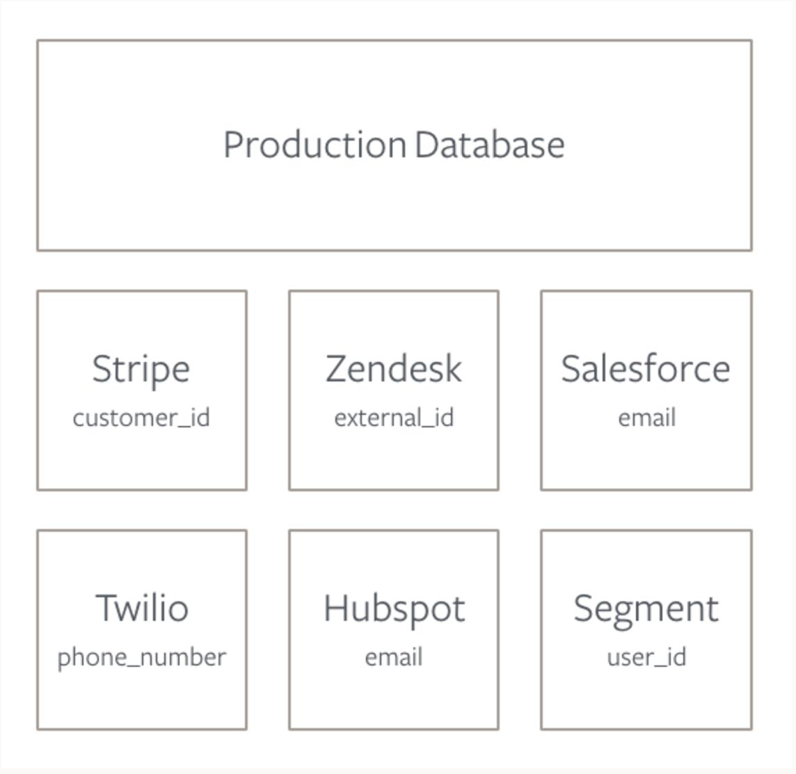

One of the first questions we get when our customers start querying all of their data is, how do I join all this data together? For example, let's say you'd like to know if support interactions in Zendesk increase revenue in Stripe, or which percentage of users opened your email campaign and visited your website or mobile app? The key to answering these advanced questions is tying your data together across these sources. To do that, you need a common user identifier.

## What is the user ID problem?

Each SaaS tool you use has its own way of identifying users with a unique primary key. And, you will find each of these different IDs across different collections of tables in your database. So, when you want to start matching Joe Smith who entered a ticket in Zendesk and also clicked through a campaign in Mailchimp, it starts to get tricky.



For example, Stripe keeps track of users with a `customer_id`, Segment requires a`user_id`, and Marketo uses `email` to uniquely identify each person.

To effectively join across these sources, you need to understand how each id maps to each other. The best way to do this is to create a common identifier across tools.

### Use a common identifier when possible

When you install a new tool (or use [Segment](https://segment.com/catalog) to install all of them at once), you need to choose what you will put in the ID field. There are lots of different options for this: emails, twitter handles, usernames, and more.

However, we suggest using the same ID you generate from your production database when you create a new user. Database IDs never change, so they are more reliable than emails and usernames that users can switch at their leisure. If you use this same database ID across as many tools as possible, it will be easier to join identities down the road. (In MongoDB, it would look something like this `507f191e810c19729de860ea`.)

```js
analytics.identify('1e810c197e', { // that's the user ID from the database
  name: 'Jane Kim',
  email: 'jane.kim@example.com'// also includes email
  });
```

Though we wish you could use a database ID for everything, some tools force you to identify users with an email. Therefore, you should make sure to send email along to all of your other tools, so you can join on that trait as a fallback.

## For Segment Destination Users

Integrating as many tools as possible through Segment will make your joins down the road a little easier. When you use Segment to [`identify`](https://segment.com/docs/connections/spec/identify) users, we'll send the same ID and traits out to all the destinations you turn on in our interface. (More about [Segment destinations](https://segment.com/docs/connections/destinations/catalog).

A few of our destination partners accept an external ID, where they will insert the same Segment user ID. Then you can join tables in one swoop. For example, Zendesk saves the Segment User ID as `external_id`, making a Segment-Zendesk join look like this:

```sql
SELECT zendesk.external_id, users.user_id
FROM zendesk.tickets zendesk
JOIN segment.usersusers
ON zendesk.tickets.external_id = segment.user_id
```

Here's a look at the Segment destinations that store the Segment User ID:

| **Tool**  | **Corresponding Trait** | **Corresponding Sources Table**   |
| --------- | ----------------------- | --------------------------------- |
| Zendesk   | external\_id            | zendesk.tickets.external\_id      |
| Mailchimp | unique\_email\_id       | mailchimp.lists.unique\_email\_id |
| Intercom  | user\_id                | intercom.users.user\_id           |


## How to merge identities

Whether you're using Segment or not, we suggest creating a master user identities table that maps IDs for each of your sources.

This table will cut down on the number of joins you have to do because some IDs may only exist in one out of many tables related to a source.

Here's sample query to create a master user identities table:

```sql
CREATE TABLE user_identities AS (
select
segment.id as segment_id,
segment.email as email,
zendesk.id as zendesk_id,
stripe.id as stripe_id,
salesforce.id as salesforce_id,
intercom.id as intercom_id

from segment.users segment

– Zendesk
leftjoin zendesk.users zendesk on
 ( zendesk.external_id = segment.id– if enabled through Segment
or zendesk.email = segment.email ) – fallback if not enabled through Segment

– Stripe
left join stripe.customers stripe on
 stripe.email = segment.email

– Salesforce
left join salesforce.leads salesforce on
 salesforce.email = segment.email

– Intercom
left join intercom.users intercom on
 ( intercom.user_id = segment.id– if enabled through Segment
or intercom.email = segment.email ) – fallback if not enabled through Segment

group by 1,2,3,4,5,6

)
```

You'll spit out a user table that looks something like this:

| **segment\_id** | **email**          | **zendesk\_id** | **stripe\_id**      | **salesforce\_id** | **intercom\_id**         |
| --------------- | ------------------ | --------------- | ------------------- | ------------------ | ------------------------ |
| mYhgYcRBC7      | ziggy@stardust.com | 1303028105      | cus\_6ll4iGAO7X8u7L | 00Q31000014XGRcEAO | 55c8923f67b8d6524600037f |
| mYhgYcRBC7      | justin@biebs.com   | 1303028105      | cus\_6ll3xVVSLIZomI | 00Q31000014XGRcEAO | 55c8923f67b8d6524600037f |
| 7adt7XG27c      | queen@beyonce.com  | 1472230319      | cus\_6u2ZcW3uC8VwZa | 00Q31000014sKCqEAM | 5626dfed2e028608710000ce |
| QZnP7cViH1      | kanye@kimye.com    | 1486907299      | cus\_6yrv9bwLgXN78s | 00Q31000015G7kIEAS | 55f6a142bd531ec6930005fa |

While creating this table in SQL is a good strategy, we'd be remiss not to point out a few drawbacks to this approach. First, you need to run this nightly or at some regular interval. And, if you have a large user base, it might take a while to run. That said, it's probably still worth it.

**How to run a query with your joined data**

So what can you do once you have all of your ID's mapped? Answer some pretty nifty questions that is. Here are just a few SQL examples addressing questions that incorporate more than one source of customer data.

**Segment + Zendesk**

```sql
-- Which referral source is sending us the most tickets?
SELECTsegment.referral_source,
COUNT(zendesk.ticket_id) AS count_of_tickets
FROM zendesk.tickets zendesk
LEFT JOIN segment.userssegment
ONusers.segment_id = segment.user_id
GROUP BY 1
ORDER BY 2 desc
```

**Stripe + Zendesk**

```sql
-- How many tickets do we receive across each pricing tier?

SELECT stripe.plan_name AS plan_name,
COUNT(zendesk.ticket_id) AS count_of_tickets

-- Start with Zendesk
FROM zendesk.tickets zendesk

-- Merge Users
LEFT JOIN user_identities users
ON zendesk.id = users.zendesk_id

-- Add Stripe
LEFT JOIN stripe.charges stripe
ON users.stripe_id = stripe.customer_id

-- Group by plan name, from most tickets to least
GROUPBY1
ORDERBY2desc
```

## Advanced Tips

An alternative to the lookup user table in SQL would be writing a script to grab user IDs across your third-party tools and dump them into your database.

You'd have to ping the APIs of each tool with something like an email, and ask them toreturn the key or id for the corresponding user in their tool.

A sample script, to run on a nightly cron job, would look something like this:

```js
var request = require('superagent'); // https://www.npmjs.com/package/superagent

var username = '<your-username>';
var password = '<your-password>';
var host = 'https://segment.zendesk.com/api/v2/';

/**
 * Gets the user object in Zendesk by email address.
 *
 * @param {String} email
 * @param {Function} fn
 */

functiongetUserIds(email, fn) {
 request
 .get(host + 'users/search.json?query=' + email)
 .auth(username, password)
 .end(fn);
}

/**
 * Get the first Zendesk user that matches 'kanye@kimye.com'
 */

getUserIds('kanye@kimye.com', function(err, res) {
if (err) return err;
// res.body.users will be an Array
// res.body.users[0].id will return the `id` of the first user
});
```

[Here is the documentation for Zendesk's API for more information](https://developer.zendesk.com/rest_api/docs/core/users).
