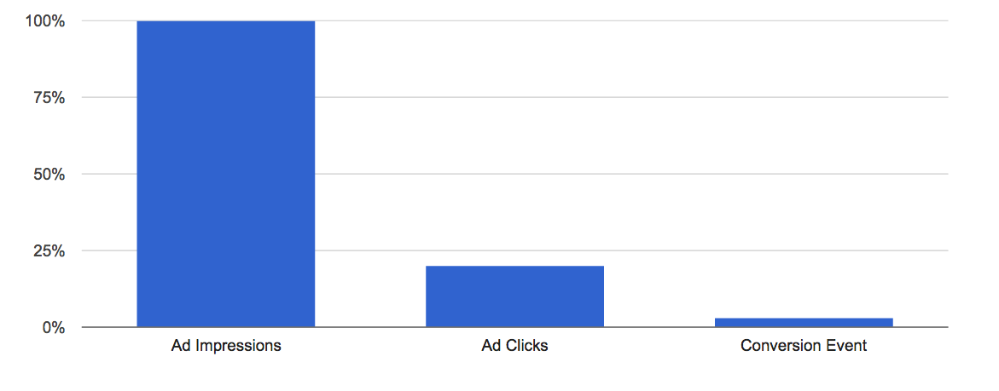
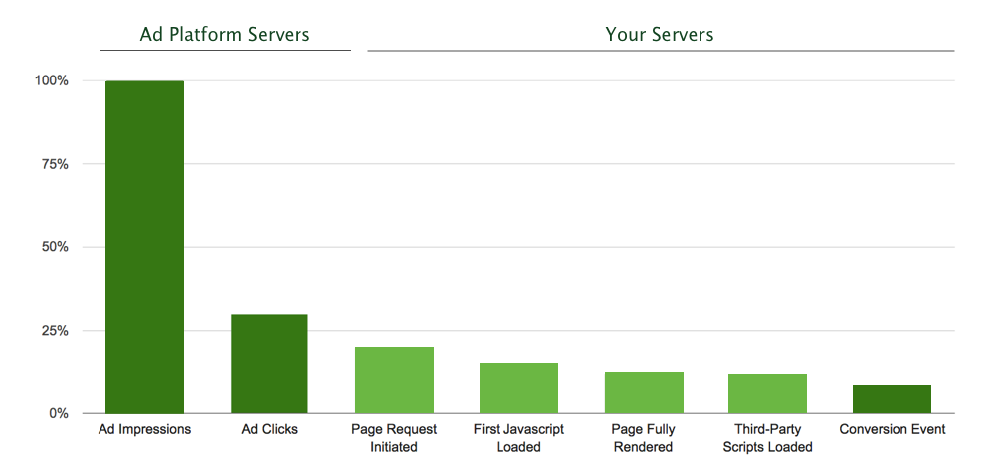
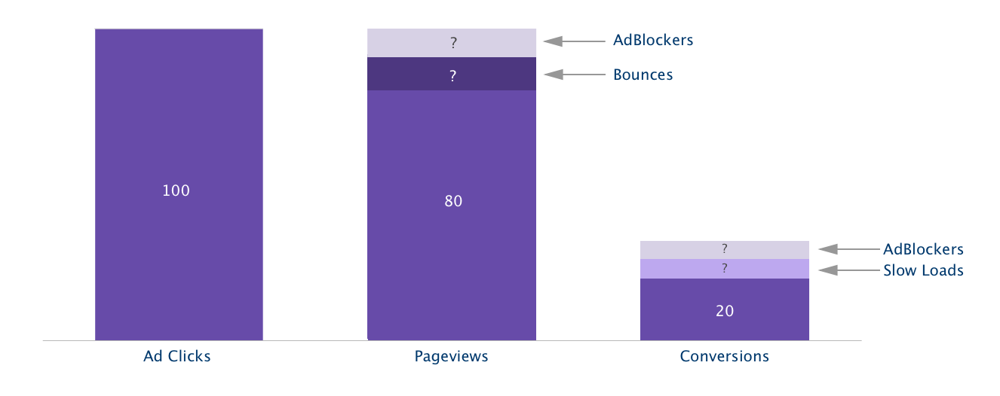
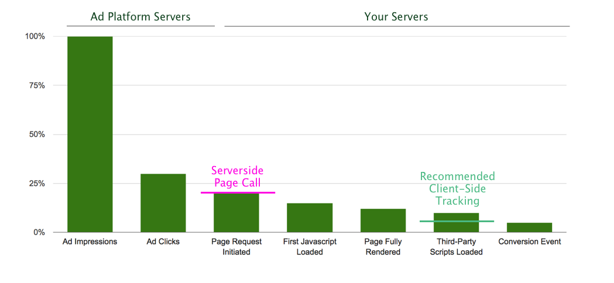
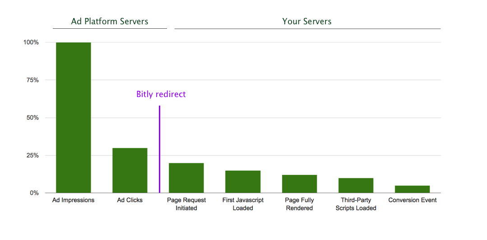
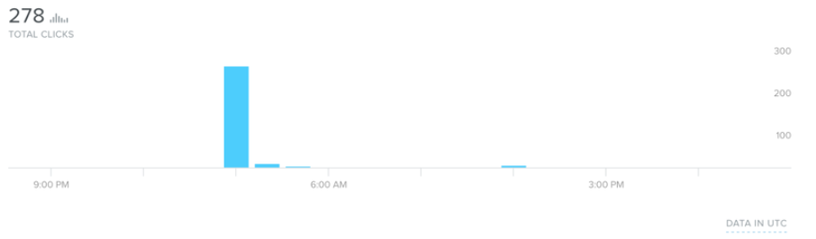

It's surprisingly hard to answer questions about the ROI of your ad campaigns. What does a click actually result in? How much should I pay for it? We built our Sources for Facebook Ads and Google Adwords to help you understand the true performance and cost of your campaigns.

In this article, we dig into the nuances of data collection and potential gotchas around measuring clicks, pageviews, and ultimately, conversions.

## Measuring Campaign Performance

Today, most marketing teams think about their paid acquisition funnel as three major steps…



This makes sense when looking at overall campaign performance, but hides several crucial funnel steps that can make the difference between increasing a campaign's spend and shutting it off due to poor results.

Because page optimization and ad blockers can impact measurement of your funnel, it's important to look at the four additional steps happening between the ad click and conversions.



Let's go through each true funnel step in a little more detail.

- **Impressions & Clicks:** When a user views an ad, the ad platform increments the count of impressions for that ad. When an ad is clicked, the ad platform logs a click. This is all handled by the ad platform's servers. Facebook and Google work hard to filter invalid and fraudulent traffic, whether that's a mistaken click, a bot, or a competitor looking to drain your advertising budget. Any bad traffic is removed from both your reporting and your monthly bill.

- **Page Request Initiated:** After an ad is clicked, a user's browser attempts to load your landing page. This request is the first contact your application has with the user, and the server responds with the content to render the landing page.

- **First JavaScript Loaded:** The user's browser starts to download the landing page content, which includes the HTML, JavaScript, and CSS. The browser parses and renders this content, loading the JavaScript sequentially as it parses the page. By default, analytics.js uses the [`async`](http://www.w3schools.com/tags/att_script_async.asp) [tag](http://www.w3schools.com/tags/att_script_async.asp), which means that the browser won't block the page and will load analytics.js once everything else is ready. Analytics.js wants to get out of the way where possible so you can create the best experience for your customers.

- **Page Fully Rendered:** The page is fully rendered once all the html, css and scripts have been loaded on the page. This time can vary a lot based on the speed of the internet connection (how fast all the assets download) and the device itself (how fast the local computer can run all of the scripts).

- **Third-Party Scripts Loaded:** Finally, third-party scripts are asynchronously loaded onto the page. The speed at which these scripts are loaded depends on a variety of factors, like the page size, network speed, and the size and number of the third-party scripts. Once these scripts are loaded, analytics.js triggers a `page` call to our API.

- **Conversion Event:** From there, a user might fill out a form, signup, or buy your product!

## How does this impact my ad reporting?

There are three less-obvious contributors to fall-off across the paid acquisition funnel: slow loads, ad blockers, and bounces.

For the sake of illustration, this means that if you have 100 ad clicks, you will be able to count most but not all corresponding page views because some visitors may bounce (exit or hit the back button) before analytics.js is executed. Similarly, you may miss some attributable conversions due to slow load times (your page calls can't fire in time) and ad blockers (which often block analytics not just ads).



Here's how it works.

**Slow Loads**

Slow loads can impact your attribution modeling, making campaigns appear to have worse performance than reality. In the general case, when a user hits your landing page, your tracking code loads and triggers a pageview event that you can use to attribute that user to a campaign.

But if third-party scripts take on the order of seconds to load (for example, on 1x or 3G networks), users may click off the page before your tracking code executes. In this case, the pageview never gets recorded and your ability to attribute that click to a conversion is lost.

This is generally not an issue for most companies because they are focused more on people who spend a good deal of time on their pages. However, it is a potential source of opaqueness, particularly for users with slow or bad network connection.

**Bounces**

Bounces can occur at any stage of the funnel between an ad being clicked and third-party scripts loading on the page.

Some bounces are not tracked because the user doesn't even last the few seconds to request your HTML, render it, and execute tracking. If they quickly hit back or close the browser window, your ad platform will report clicks that don't show up in your analytics tracking.

**Ad blockers**

It is likely the case that some percentage of your users are using ad blockers. It's estimated that [22% of mobile smartphones worldwide](https://pagefair.com/blog/2016/mobile-adblocking-report/) and [16% of US web traffic](https://pagefair.com/blog/2015/ad-blocking-report/) use ad blockers. Segment customers have reported ad blockers for as little as a few percentage points of their visitors, to upwards of 70% of traffic for companies with very tech-forward audiences.

But just because a user is using ad blockers doesn't mean that they aren't seeing and clicking on ads. Facebook recently announced that they would be [suppressing ad blockers](http://newsroom.fb.com/news/2016/08/a-new-way-to-control-the-ads-you-see-on-facebook-and-an-update-on-ad-blocking/), and Adblock Plus, the most popular ad blocking and anti-tracking software, categorizes Google Search ads as [acceptable ads](https://adblockplus.org/acceptable-ads).

That said, many ad blockers do block analytics tools like Google Analytics, Mixpanel and Segment. This means that there exists some percentage of your conversions that actually came through your paid acquisition channels, but are unattributable due to ad blockers.

## What if I need more precise tracking?

Segment offers two ways of joining your user clickstream data to your paid acquisition channels: standard client-side tracking or advanced server-side page calls.



Both options come with their own tradeoffs that are important to consider for your use case.

**Client-side Tracking (Standard)**

Analytics.js is loaded with the async tag by default, which means that the library and all it's destinations are loaded near the end of the page rendering. The benefit is that analytics.js doesn't slow down page loads, but it does mean that tracking is not executed immediately on page load.

When you use standard client-side tracking, you'll lose pageview data for visitors who bounce or click off the page before analytics.js executes, and for visitors with ad blockers enabled.

**Server-side Page Calls (Advanced)**

If you want to capture adblock, bounce, and slow load traffic, we recommend adding an additional `page()` call to the server-side. This allows you avoid the browser altogether and see the total number of requests emanating from your paid acquisition channels. You'll get visibility on an extra step in that funnel.

The general approach is to use an arbitrary `anonymousId` (e.g. a UUID) in the server-side `page()` call and then also set the `anonymousId` as the `ajs_anonymous_id` cookie in the browser. You can read more about how to implement that here. This approach is tricky to implement, so we recommend that this is undertaken only for use cases in which bounce and/or adblock data is critical.

## Estimating the Impact of Moving Server-side

If you want to get a quick estimate for the number of additional clicks you'd track using server-side tracking, you can use "redirect tracking" with a URL shortener to estimate the number of clicks coming from Google Adwords or Facebook Ads. This will give you an estimate for the number of times an ad is clicked (minus some bounce in the few hundred milliseconds of the redirect), which will closely match server-side `page()` tracking should you choose to implement it.



Here's how it works…

1.  Use a URL shortener like bit.ly to link to a landing page, with a custom parameter like `?ttg=2` .

2.  Add the shortened link to your ad.

3.  Measure total clicks from the bit.ly stats page.
    

4.  In your warehouse, count the number of pages with that unique url parameter from step 1 (make sure you're looking at the same timeframe).


```sql
select received_at, url
from <site>.pages
where url like '%/warehouses%'
and search like '%ttg=2'
order by received_at
```

We hope this overview helps explain the technical nuances of measuring what happens when a customer finds you using an ad! If you have any other questions, feel free to share them in the Segment Community for discussion.
