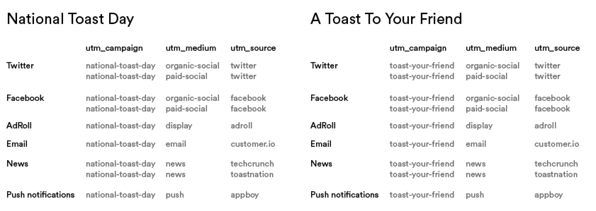
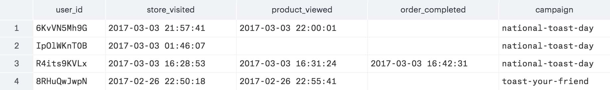
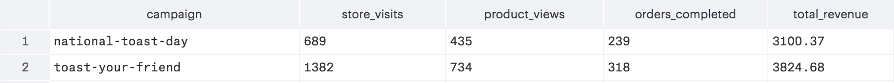
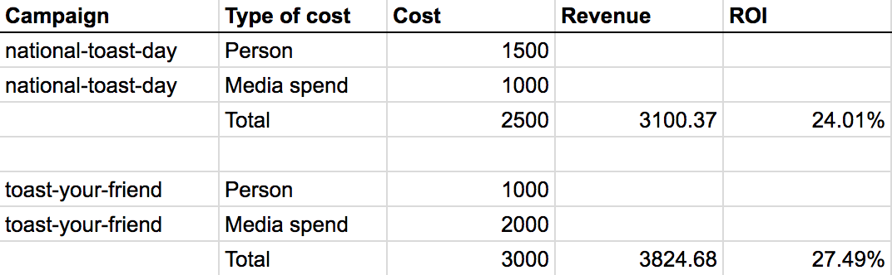
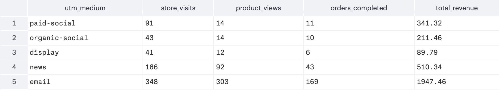

The purpose of marketing campaigns is to drive traffic (and sales). But how do you know which campaigns yield the most conversions or what channel across the campaigns was most effective?

This guide provides you with the tools to answer these questions with SQL so that your marketing team can reproduce the hit campaigns and consistently generate loyal customers.

[Talk to a product specialist](https://segment.com/contact/sales) to learn how companies like Warby Parker and Crate & Barrel use a data warehouse to increase engagement and sales.

## Analyze campaign performance

The goal of marketing campaigns is to drive engagement and conversions. Most commonly performed by attracting traffic to the site, these campaigns use UTM parameters for attribution. In our analysis, we'll be heavily relying on UTM parameters to analyze not only campaign, but also channel performance.

[Learn how to effectively use UTM parameters in your marketing campaign strategies.](/docs/guides/how-to-guides/cross-channel-tracking/)

For our analysis walkthrough, we'll use fictitious e-commerce and marketing data from on-demand artisanal toast company, Toastmates.

Toastmates is currently running these two campaigns:

- "National Toast Day", where $5 off was applied if you made a purchase on that day
- "A Toast To Your Friend", where you can buy toast for a friend at $5 off


Each of these campaigns used a combination of channels. Here is a table with the channels and corresponding UTM parameters so when we build the SQL query, we can make sure all of the traffic sources are accounted for.



We'll use SQL below to measure the performance of each campaign and what that means for future marketing activities.

## Build the funnel

The following query creates a table where each row is a customer and the columns are the date time when a key funnel event happens that have the `context_campaign_name` to match that of the `UTM_campaign` . The key funnel events in this analysis are `Store Visited`(based on a page view to the store URL), `Product Viewed` , and `Order Completed` . Given that each channel may have some key top of the funnel action that is unique to itself, let's save that analysis for when we're analyzing across channels.

Feel free to copy and paste the below query for your analysis so long as you replace `national-toast-day` with your own UTM campaign parameter.

```sql
    with

    users as (
        select  *
          from  toastmates.users
    ),

    page_viewed as (
        select  p.received_at as page_viewed_at,
                p.context_campaign_name,
                p.user_id
          from  toastmates.pages p
     left join  users u
            on  u.id = p.user_id
         where  p.context_campaign_name is not null
           and  p.url ilike '%toastmates.com/store%'
    ),

    product_viewed as (
        select  v.received_at as product_viewed_at,
                v.context_campaign_name,
                v.user_id
          from  toastmates.product_viewed v
     left join  users u
            on  u.id = v.user_id
    ),

    order_completed as (
        select  c.received_at as order_completed_at,
                c.context_campaign_name,
                c.user_id
          from  toastmates.order_completed c
     left join  users u
            on  u.id = c.user_id
    )

        select  p.user_id as user_id,
                page_viewed_at,
                product_viewed_at,
                order_completed_at,
                p.context_campaign_name
          from  page_viewed p
     left join  product_viewed v
            on  p.user_id = v.user_id
     left join  order_completed c
            on  p.user_id = l.user_id
      order by  5 desc
```

Here are the first four rows of the resulting table:



Then, we can use tweak the query above into the one below to perform some simple `COUNT` and `SUM` on the previous table to get conversion metrics as well as total revenue derived from the campaign.

```sql
    with

    users as (
        select  *
          from  toastmates.users
    ),

    page_viewed as (
        select  p.received_at as page_viewed_at,
                p.context_campaign_name,
                p.user_id
          from  toastmates.pages p
     left join  users u
            on  u.id = p.user_id
         where  p.context_campaign_name is not null
           and  p.url ilike '%toastmates.com/store%'
    ),

    product_viewed as (
        select  v.received_at as product_viewed_at,
                v.context_campaign_name,
                v.user_id
          from  toastmates.product_viewed v
     left join  users u
            on  u.id = v.user_id
    ),

    order_completed as (
        select  c.received_at as order_completed_at,
                c.context_campaign_name,
                c.total,
                c.user_id
          from  toastmates.order_completed c
     left join  users u
            on  u.id = c.user_id
    )

        select  p.context_campaign_name,
                count(page_viewed_at) as store_visits,
                count(product_viewed_at) as product_views,
                count(order_completed_at) as orders_completed,
                sum(total) as total_revenue
          from  page_viewed p
     left join  product_viewed v
            on  p.user_id = v.user_id
     left join  order_completed c
            on  p.user_id = l.user_id
      group by  5
      order by  5 desc
```

Here is the resulting table:



This analysis not only gives us a great snapshot of the conversion points along each campaign's funnel, but also shows that we've generated $3,100.37 from the National Toast Day campaign and $3,824.68 from the Toast Your Friend campaign. Also we can see that the quality of the traffic from the National Toast Day is higher, but we've had more total traffic from Toast Your Friend, which makes sense since it's an ongoing campaign.

But this is not yet ROI, since we haven't incorporated the spend—the labor of your marketing team and the paid acquisition channels to source part of this traffic—that went into these channels.

**Add campaign costs**

The main costs that are incorporated in an ROI calculation are salaries (pro-rated by person-hour) and media spend. While we could conceivably create a custom, static table in SQL that contains the spend information over time, the faster and more practical way would be a back of the envelope calculation.

The costs associated with a given campaign consist of two major pieces: the person-hour cost and any associated media spend.

*   Calculating the pro-rated person-hour is an estimate of the number of hours and people used to set up and manage the campaign, then multiplied by the hourly rates based off their annual salaries.

*   The media spend is the advertising cost for distributing creatives to generate traffic to your store


_Want to easily export advertising data from_ [Google Adwords](https://segment.com/sources/adwords) _or_ [Facebook Ads](https://segment.com/sources/facebook-ads)_?_ _Check out_ [Segment Sources](https://segment.com/sources).

When we have the aggregate cost numbers, the formula for ROI is:

```none
Campaign ROI = (Profit Attributed to Campaign – Campaign Cost) / Campaign Cost
```

Here is a spreadsheet to illustrate the ROI calculation for both campaigns:



Though ROI numbers are one success metric, it's an important benchmark for comparing performance when launching new campaigns or comparing against past campaigns.

But how can we go one step further and see what worked and what didn't? One approach is to see which channels convert better, so you know how to adjust your marketing spend or media buys in your current campaigns or future ones.

## Analyze channel performance

A single campaign can include a wide variety of channels: email, display ads, push notifications, forums, etc. all of which yields different engagement and conversion rates. Effective marketers will keep a pulse on each channel throughout the duration of the campaign to understand whether a target audience is being saturated, a creative refresh is needed (for advertising), or how to efficiently allocate future spend towards a source that converts.

The analysis is similar to measuring the performance across a single campaign, with the only change being finding events where we focus on `context_campaign_medium` or `context_campaign_source` instead of `context_campaign_name` . The SQL below measures the conversion rates at key funnel events for `national-toast-day` , but broken down by `utm_medium` .

You can copy the below into your favorite editor, as long as you change out the `context_campaign_name` and `context_campaign_medium` parameters to ones that applies to your business.

```sql
    with

    users as (
        select  *
          from  toastmates.users
    ),

    page_viewed as (
        select  p.received_at as page_viewed_at,
                p.context_campaign_name,
                p.user_id
          from  site.pages p
     left join  users u
            on  u.id = p.user_id
         where  p.context_campaign_name = 'national-toast-day'
           and  p.context_campaign_medium is not null
           and  p.url ilike '%toastmates.com/store%'
    ),

    product_viewed as (
        select  v.received_at as product_viewed_at,
                v.context_campaign_medium,
                v.user_id
          from  toastmates.product_viewed v
     left join  users u
            on  u.id = v.user_id
    ),

    order_completed as (
        select  c.received_at as order_completed_at,
                c.context_campaign_medium,
                c.user_id,
                c.total
          from  toastmates.order_completed c
     left join  users u
            on  u.id = c.user_id
    )

        select  p.context_campaign_medium as utm_medium,
                count(page_viewed_at) as store_visits,
                count(product_viewed_at) as product_views,
                count(order_completed_at) as orders_completed,
                sum(c.total) as total_revenue
          from  page_viewed p
     left join  product_viewed_at v
            on  p.user_id = c.user_id
     left join  order_completed c
            on  p.user_id = c.user_id
      group by  1
      order by  1 desc
```

The resulting table:



Since the National Toast Day campaign is relatively new, the majority of the traffic is from the email and an article ("news"). But we can see that the social channels have a lower conversion from store visits to product views. Email has the best overall conversion to revenue, which may be attributed to the recipients already familiar with the Toastmates brand or having previously had a stellar end-to-end shopping experience.

We can further breakdown this analysis by seeing which email, display ads, and social channels performed the best, by adding `utm_source` and `utm_content` ,assuming that you've properly added them in your earned and paid media links. Also note that this preliminary analysis in SQL doesn't account for double-counted users, who had impressions with our brand on multiple channels (e.g. someone seeing a display ad, yet converted on the email outreach). Fortunately, there are multi-touch attribution models that can be applied to better understand the weights of each activity towards conversion.

[Learn more about multi-touch attribution models.](https://segment.com/academy/advanced-analytics/an-introduction-to-multi-touch-attribution/)

## Build repeatable hit marketing campaigns

Measuring the ROI and performance of marketing campaigns and marketing channels tells a compelling story about what types of campaigns resonate with your audience. How does your audience like to be engaged? Text, push notifications, email? What campaign messaging hooks work the best in getting them back at your store?

You can apply this analytical approach and performance measurement techniques to a wide variety of marketing activities, such as offline marketing, billboards, or sponsoring events. These insights can empower your team to focus on what works and eliminate what doesn't.

[Talk to a product specialist](https://segment.com/contact/sales) _to learn how companies like Warby Parker and Crate & Barrel use a data warehouse to increase engagement and sales._
