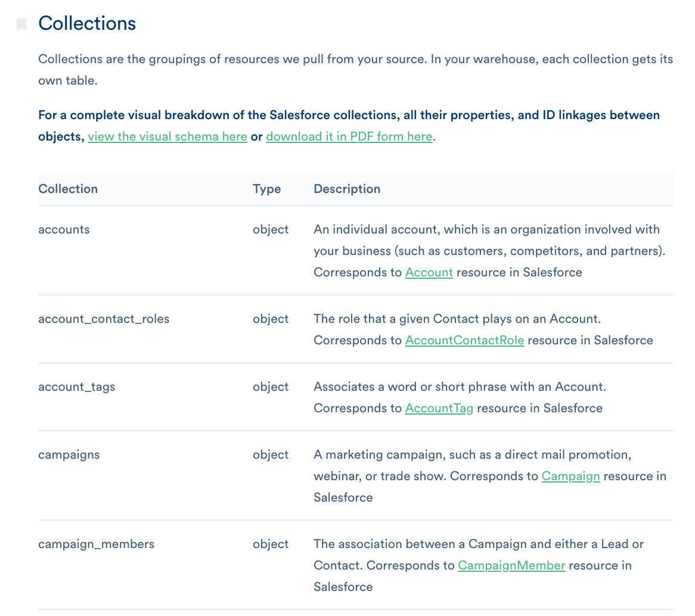
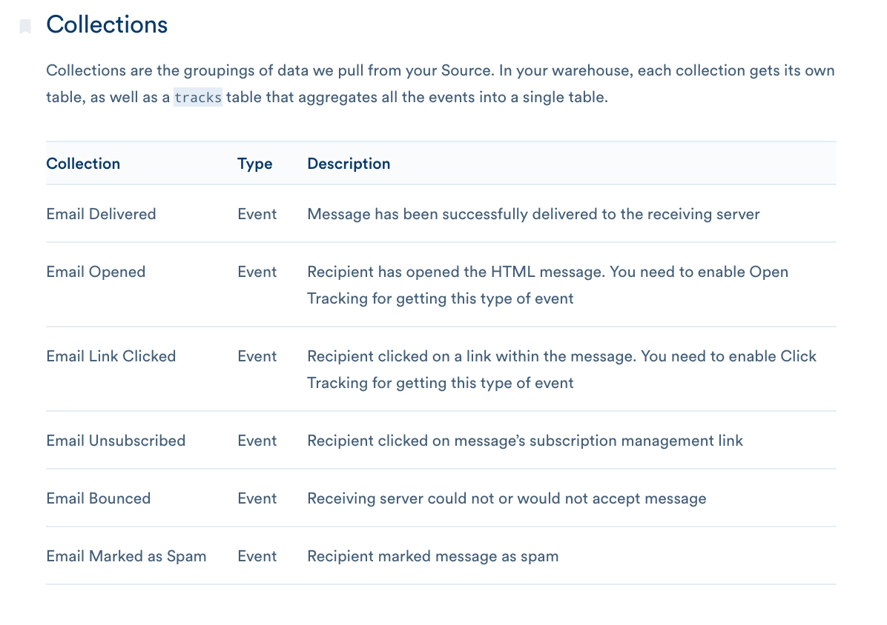

**MTUs are Monthly Tracked Users**

Monthly tracked users are calculated based on the number of **unique** `user_ids` plus **unique** `anonymous_ids` that appear in any call to Segment in a given month. Object-based sources do not count towards your MTU count.

We only count users once per month, even if they perform multiple actions across your sources.

**What about object-based sources?**

Object-based Sources (like Salesforce, Zendesk, and Stripe) _don't impact your MTU counts_ because there are no IDs. However they do impact your overall object count.

**And event based cloud-app sources?**

Event based (mostly email sources like Klaviyo, Vero, Drip, etc.) _do create MTUs_ because they have IDs associated.

