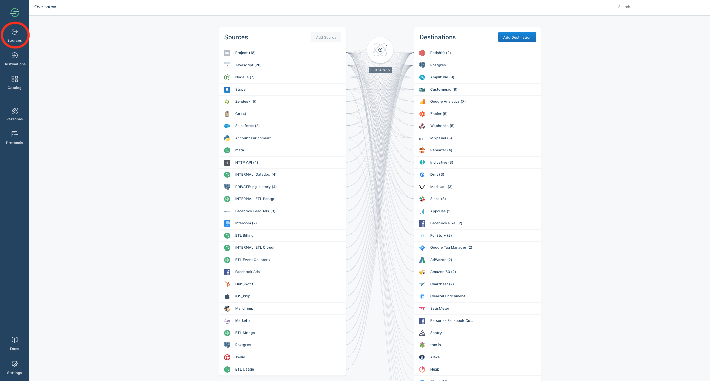
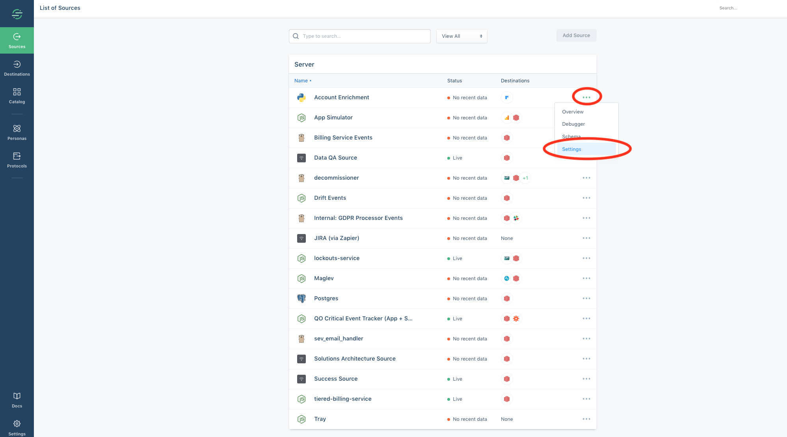
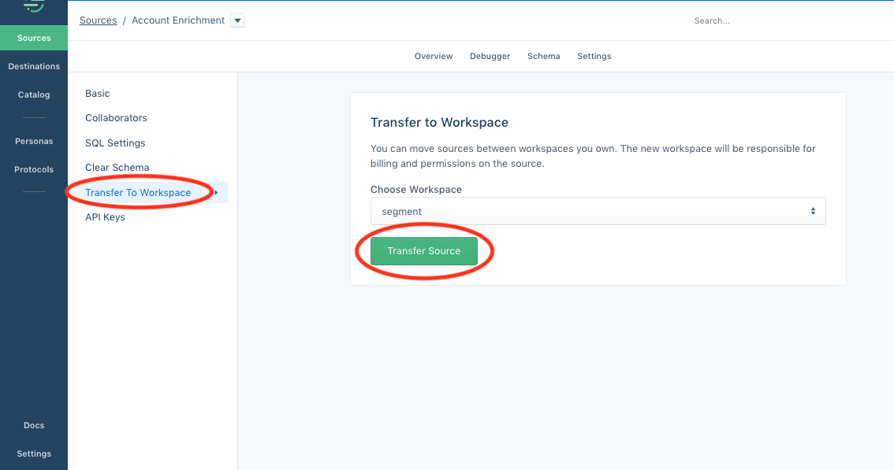

## What is the difference between an account and a workspace?

An account is associated to a single user, and is attached to the email address you sign up with. A workspace houses all of your sources, and can have one or several user accounts as owners and/or read-only members.

## What if I change my domain name?

You don't need to do anything if you change your domain – for example, if you change your domain from www.mysite.com to www.mysuperawesomesite.com. If you want the new domain to be used as the same Segment source, just make sure you use the same Segment write key that you used with the old domain.

You may claim ownership of your domain for the purposes of Single Sign On login association, but it currently has no bearing on data collection.

## I'm on a Legacy API plan, why can't I add the integration I want?

Only users on our legacy API based plans will run into integration limits. Some of our older plans placed limitations on the integrations you could use. If you would like to add an integration that is not available on your current plan  move to a new Team plan where all integrations are included along with several other additional features.

## Will deleting my account cancel my subscription?

No, deleting your account will only stop you from accessing workspaces through your login. The workspace is where the subscription is managed, and it will not be deleted. Data will still flow into Segment and your Destinations and you will still be charged if you delete your account but don't delete your workspace.

## How do I delete my workspace entirely?

To delete your workspace, go your [Workspace's Settings](https://app.segment.com/goto-my-workspace/settings/basic), click the "General" tab, and click **Delete Workspace**.

You should also change your write keys for each source and remove all Segment snippets from your codebase.

## Can I recover a source or workspace after I delete it?

No, once a source or workspace is deleted it cannot be recovered.

## Can I move a source from one workspace to another?

Segment doesn't have the ability to "merge" workspaces, however you can achieve the same effect by moving your existing sources to a single workspace.

You can move sources between workspaces by clicking the sources tab in the top left of your workspace,

heading to "Settings" for the requisite source,

and then clicking on "transfer to workspace," selecting which of your other workspaces you'd like to transfer the source to.

You will need to ensure that the transfer is done by someone who is an owner of both workspaces.

You will additionally need to configure desired destinations in the workspace that the source is now sending data to.

Benefits of doing this include unifying all of your data across your team(s) to better track your customer data as a complete picture.
