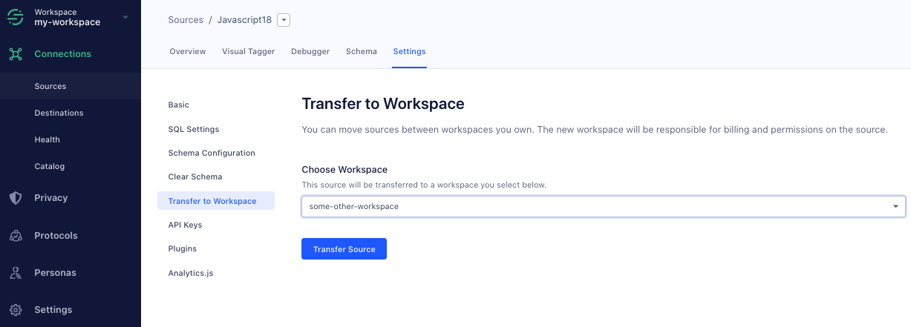

## What is the difference between an account and a workspace?

An account is associated to a single user and is attached to the email address you sign up with. A workspace houses all of your sources, and can have one or several user accounts as owners and/or read-only members.

## What if I change my domain name?

You don't need to do anything if you change your domain name. If the new domain name will serve as the same Segment source, make sure you use the same Segment write key that you used with the old domain.

You may claim ownership of your domain for the purposes of single sign-on login association, but it currently has no bearing on data collection.

## I'm on a legacy API plan. Why can't I add the integration I want?

Some of Segment's previous plans, including the legacy API plan, limited integration usage. If you want to add an integration that's not available on your current plan, move to a new Team plan. Team plans include all integrations, along with other additional features.

## Will deleting my account cancel my subscription?

No. Deleting your account only stops you from accessing workspaces through your login. The workspace is where the subscription is managed, and it will not be deleted. Data will still flow into Segment and your Destinations, and you will still be charged if you delete your account but don't delete your workspace.

## How do I delete my workspace entirely?

To delete your workspace, go your [Workspace Settings](https://app.segment.com/goto-my-workspace/settings/basic), click the **General** tab, then click **Delete Workspace**.

You should also change your write keys for each source and remove all Segment snippets from your codebase.

## What happens if I change my workspace name or slug?

Changing your workspace name or slug won't impact any sources or destinations you've already configured. If you're using [Segment's Config API](/docs/config-api/), though, you'll need to change the slug in your request URLs.

## Can I recover a source or workspace after I delete it?

No. Deleted sources and workspaces cannot be recovered.

## Can I move a source from one workspace to another?

Though workspaces can't be merged, you can move an existing source to a single workspace to the same effect. For example, you might move existing sources to one workspace so that you can unify all of your data across teams and gain a broader view of your customer data tracking.

To move a source between workspaces, navigate to the source's **Settings** tab, then click **Transfer to Workspace**. Choose the workspace you're moving the source to, then click **Transfer Source**.

> info ""
> The person who transfers the source must be a [workspace owner](/docs/segment-app/iam/) for both the origin and recipient workspaces, otherwise the recipient workspace won't appear in the dropdown list.

Transferring a source removes all associated destination configurations.  Be sure to set up the destinations you want after the transfer.
