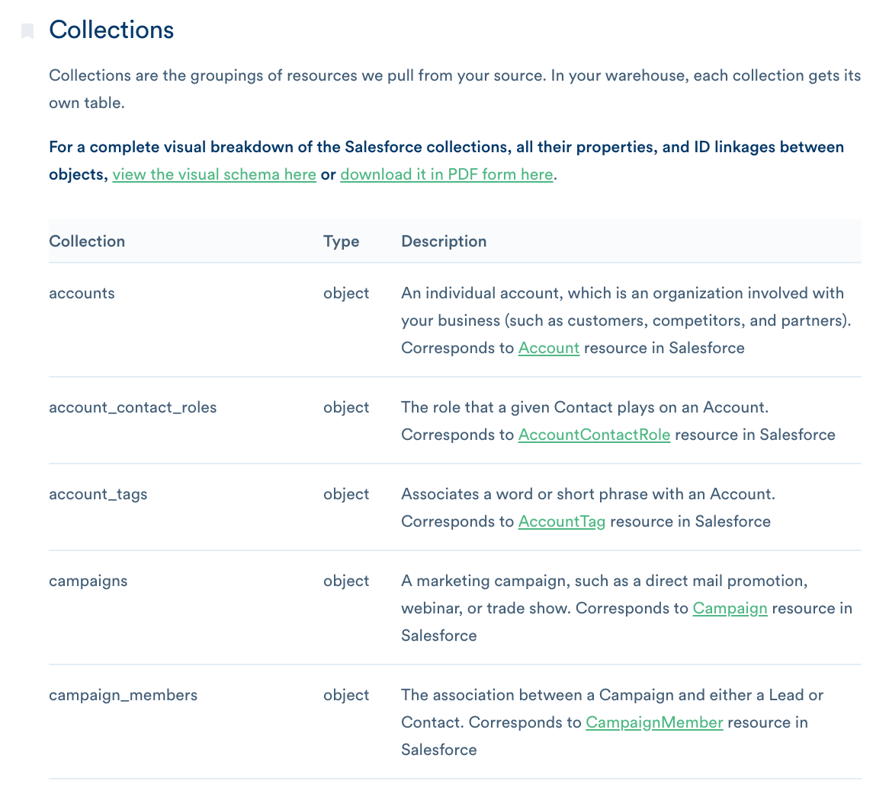
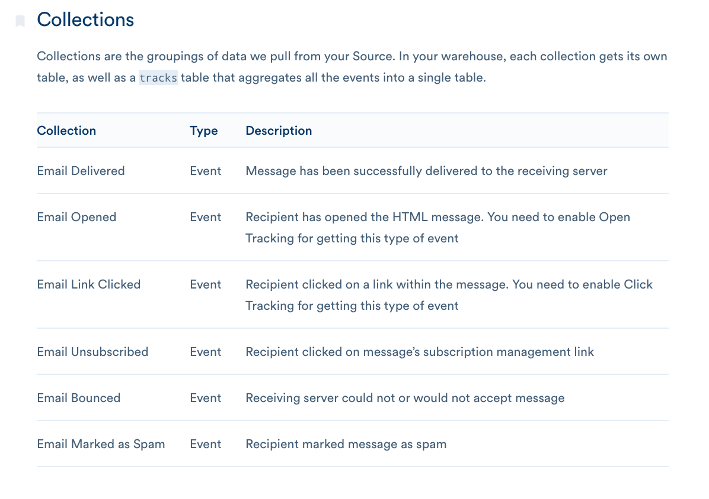

**MTUs are Monthly Tracked Users**

We calculate this by adding the number **unique userIds** and number of **unique anonymousIds** that you track with Segment. We only count users once per month, even if they perform multiple actions across your sources.

**What about object-based sources?**

Object-based Sources (like Salesforce, Zendesk, and Stripe) _don’t impact your MTU counts_, because there are no IDs, but they will impact your overall object count.

**And event based cloud-app sources?**

Event based (mostly email sources like Klaviyo, Vero, Drip, etc.) _will create MTUs_ because they have IDs associated.

