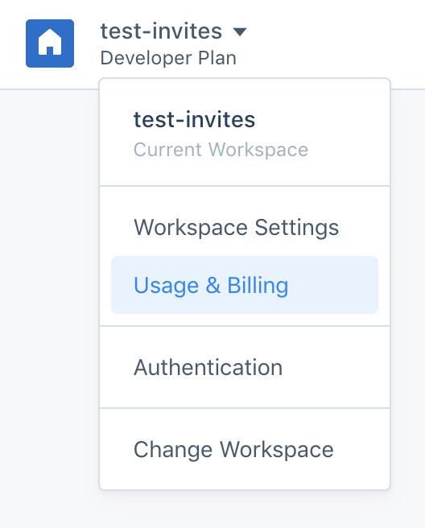

If you have questions about your data usage or how it relates to your bill, we recommend logging into your Segment workspace, clicking on the top left arrow in the navigation bar, and going to the Usage page within the Usage & Billing category.

On that page you will see what plan you’re on, what data volumes your plan includes, and how much data you used during a billing period. If you have used data volumes past what your bill includes, the page will provide information about what volume of data was in overage and what your overage rate is.
