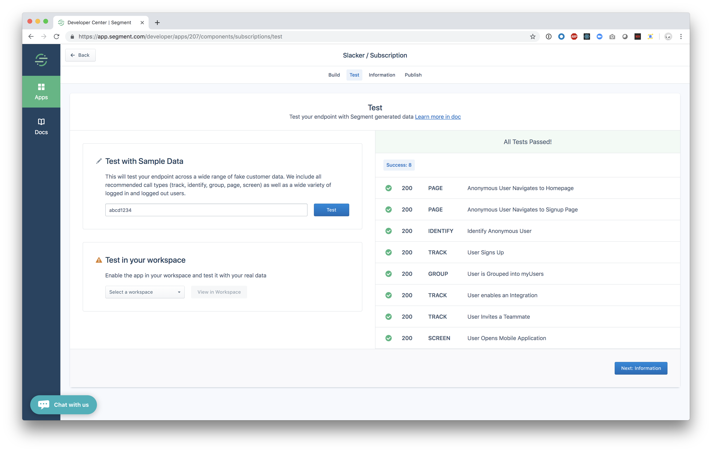

**Function Subscriptions** allow Segment Partners to write custom JavaScript code that sends Segment Event Data to existing APIs. This guides explains how to write custom functions.

To start, you need [access to the Segment Developer Center](https://segment.com/partners/developer-center/).

## Creating a Function Subscription

First, [navigate to the Segment Developer center](https://app.segment.com/developer/apps), and create a new App.

### Create a new Subscription

Next click the **subscription** card, and select  **I want Segment to run functions I write**:


## Write your Functions

Next, you see the Code Editor page. Here, you can take full control of your Subscriptions's logic. Segment provides boilerplate functions that make it simple to send data to your API Endpoint. You can delete the example code and implement your own functions.


## How Functions Work

For every event you send to Segment, Segment invokes a function you provide for the event type. So you must define functions named after every type in the [Segment Spec](https://segment.com/docs/spec/) that you support:

* identify
* track
* page
* screen
* group
* alias

The two items passed into the functions are the **event payload** and the **settings**. All subscriptions have an **apiKey** setting by default. To add more custom settings, go to the `Settings Builder` page under `App Info`. Use your custom setting **key** (which is generated for you from your custom setting label) to access your custom setting from the **settings** argument.


* The **Event** argument to the function is the [Segment Event Data](https://segment.com/docs/spec/common/#structure)
* The **Settings** argument to the function contains user settings like **apiKey** and any custom settings you have added.

The functions are ["async/await" style JavaScript](https://javascript.info/async-await), and should use the [Fetch API](https://developer.mozilla.org/en-US/docs/Web/API/Fetch_API/Using_Fetch) via the pre-loaded `fetch` package.

Here's a basic example of a function that POSTs the event to a "request bin" for introspection. You can go to [RequestBin](https://requestbin.com/) to create your own `endpoint` to experiment with.

This builds a query string for the URL, sets a basic auth header, and sends a JSON body:

```js
const endpoint = "https://REDACTED.x.pipedream.net"

async function track(event, settings) {
  const url = new URL(endpoint);
  url.searchParams.set("ts", event.timestamp);

  const res = await fetch(url.toString(), {
    body: JSON.stringify(event),
    headers: new Headers({
      "Authentication": 'Basic ' + btoa(`${settings.apiKey}:`),
      "Content-Type": "application/json",
    }),
    method: "post",
  })

  return await res.text() // or res.json() for JSON APIs
}
```

The function should return data to indicates a success. In the above example we simply return the request body.

You can also `throw` an error to indicate a failure.

In the above example, try changing the endpoint to `https://foo` and you'll see it throws a `FetchError` with the message `request to https://foo/ failed, reason: getaddrinfo ENOTFOUND foo foo:443`

There are 3 pre-defined error types that you can `throw` to indicate the function ran as expected, but data could not be delivered:

* EventNotSupported
* InvalidEventPayload
* ValidationError

Here are basic examples using these error types:

```js
async function group(event, settings) {
  if (!event.company) {
    throw new InvalidEventPayload("company is required")
  }
}

async function page(event, settings) {
  if (!settings.accountId) {
    throw new ValidationError("Account ID is required")
  }
}

async function alias(event, settings) {
  throw new EventNotSupported("alias is not supported")
}
```

If you do not supply a function for an event type, Segment will throw an implicit `EventNotSupported` error.

## Built-in Dependencies

### lodash

A modern JavaScript utility library delivering modularity, performance & extras.

[See Docs](https://lodash.com/docs/4.17.11)

### AWS

The official Amazon Web Services SDK.

[See Docs](https://docs.aws.amazon.com/AWSJavaScriptSDK/latest/)

### Crypto

The crypto module provides cryptographic functionality that includes a set of wrappers for OpenSSL's hash, HMAC, cipher, decipher, sign, and verify functions.

[See Docs](https://nodejs.org/dist/latest-v10.x/docs/api/crypto.html)

### Fetch API

The Fetch API provides a JavaScript interface for accessing and manipulating parts of the HTTP pipeline, such as requests and responses. It also provides a global `fetch()` method that provides an easy, logical way to fetch resources asynchronously across the network.

[See Docs](https://developer.mozilla.org/en-US/docs/Web/API/Fetch_API/Using_Fetch)

#### `fetch()`

The `fetch()` method starts the process of fetching a resource from the network, returning a promise which is fulfilled once the response is available.

[See Docs](https://developer.mozilla.org/en-US/docs/Web/API/WindowOrWorkerGlobalScope/fetch)

#### `Request`

The `Request` interface of the Fetch API represents a resource request.

[See Docs](https://developer.mozilla.org/en-US/docs/Web/API/Request)

#### `Response`

The `Response` interface of the Fetch API represents the response to a request.

[See Docs](https://developer.mozilla.org/en-US/docs/Web/API/Response)

#### `Headers`

The `Headers` interface of the Fetch API allows you to perform various actions on HTTP request and response headers. These actions include retrieving, setting, adding to, and removing. A Headers object has an associated header list, which is initially empty and consists of zero or more name and value pairs.

[See Docs](https://developer.mozilla.org/en-US/docs/Web/API/Headers)

#### `URL`

The `URL` interface is used to parse, construct, normalize, and encode URLs. It works by providing properties which allow you to easily read and modify the components of a URL.

[See Docs](https://developer.mozilla.org/en-US/docs/Web/API/URL)

#### `URLSearchParams`

The `URLSearchParams` interface defines utility methods to work with the query string of a URL.

[See Docs](https://developer.mozilla.org/en-US/docs/Web/API/URLSearchParams)

### `atob()`

The `atob()` function decodes a string of data which has been encoded using base-64 encoding.

[See Docs](https://developer.mozilla.org/en-US/docs/Web/API/WindowOrWorkerGlobalScope/atob)

### `btoa()`

The `btoa()` method creates a base-64 encoded ASCII string from a binary string.

[See Docs](https://developer.mozilla.org/en-US/docs/Web/API/WindowOrWorkerGlobalScope/btoa)

## Testing your Functions

Test your code directly from the Developer Center UI. Use the `Send Test Event` button and review the test event to make sure your function works as expected.


In the debugger panel, check the two outputs. The **Callback Return** and the **Log Output**.

* **Callback Return** - What data your function returned or error it threw.
* **Log Output** - The raw log. Any messages to `console.log()` from your function appear here.

When your code is working with one event you can test it with a suite of more Segment events. Click `Save and Next: Test`, fill in an `API Key` and click `Test`. You will see the results of additional types of Segment data.



## Submitting your App For Review

Please make sure you complete the other [launch requirements](/docs/partners/subscription/#5-launch-requirements) and submit your Subscription for review. If you have any questions in the interim, feel free to reach out to partner-support@segment.com!

Before we launch your app as a destination in the Segment catalog, Segment will perform a security review on your functions. Since Segment is running code on your behalf, we need to understand what it does before sending it customer data.
