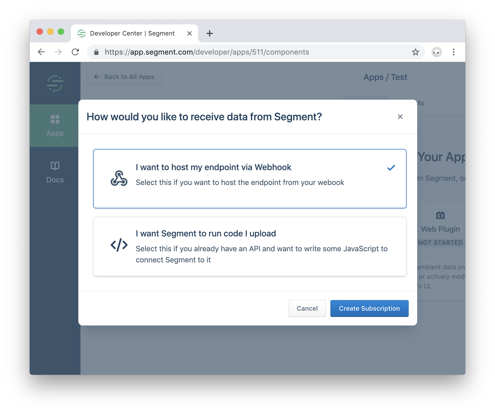
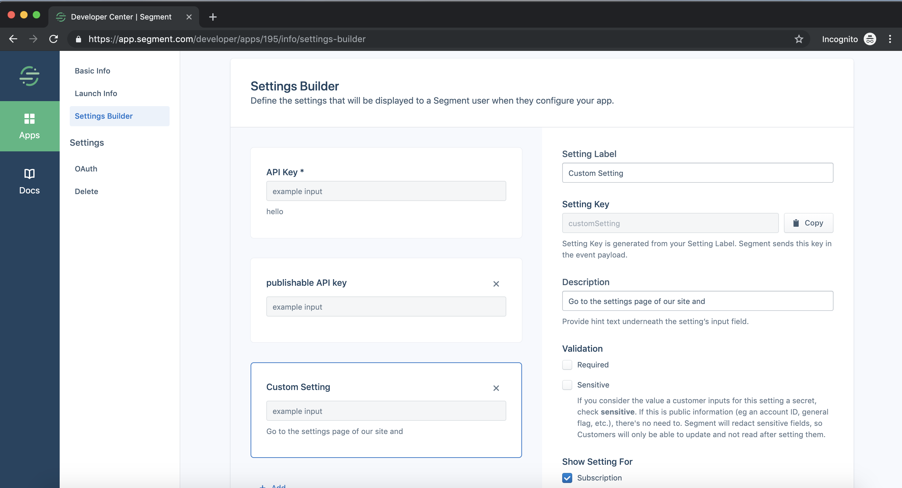
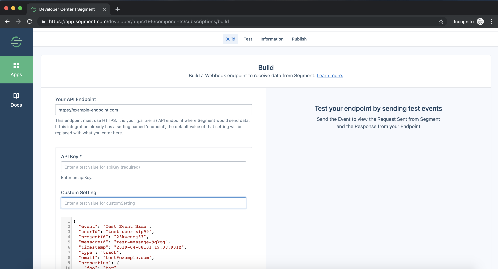
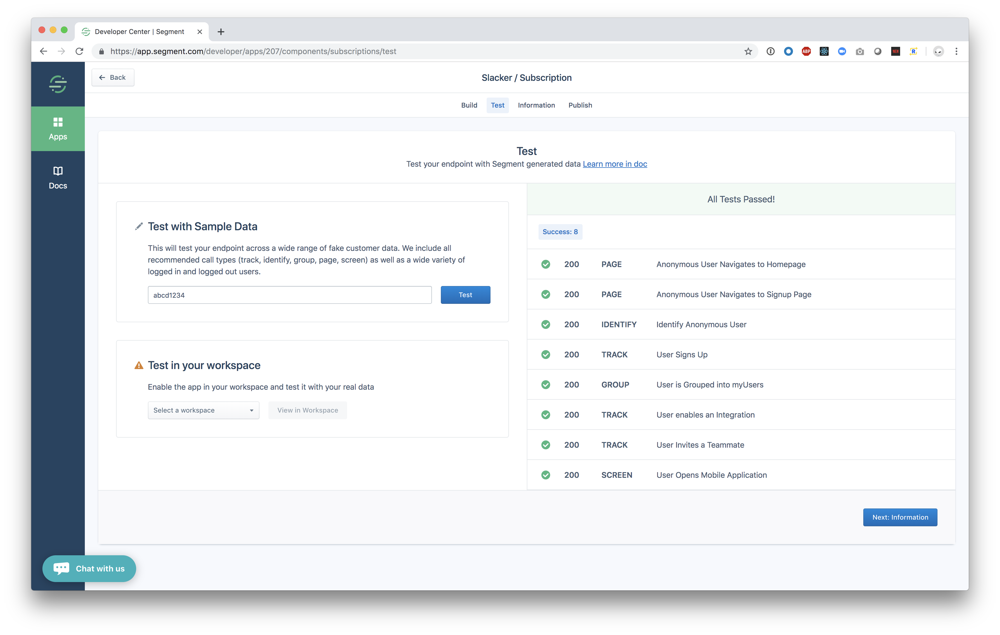

**Webhook Subscriptions** allow Segment Partners to ingest Segment Event Data using a Webhook. This guide explains how to set up your Webhook with Segment.

To start, you need [access to the Segment Developer Center](https://segment.com/partners/integration).

## Creating a Webhook Subscription

First, [navigate to the Segment Developer center](https://app.segment.com/developer/apps), and create a new App.

### Create a new Subscription

Next click the **subscription** card, and select  **I want to host my endpoint via Webhook**:



## Accepting Segment Data

To receive data from Segment, you must provide a server with a static endpoint that can accept HTTPS requests.

The endpoint must:
- *Accept POST requests.* Segment sends customer data to the endpoint you designate in POST requests.
- *Accept JSON data.* Segment sends data in JSON.
- *Use HTTPS.* Segment transmits potentially sensitive data on behalf of customers, and HTTPS is the first step in making sure their data stays safe.

## Authorization

Segment sends your user's API key with requests, and you can use it to authenticate requests. **Note**: This is the API key _you_ give to your users; it is not a Segment API key.

Segment sends the key in the `Authorization` header using the `Basic` authentication type. It is Base64 encoded with your user's API key as the username, and an empty password.

For example, if your user's API key was `segment`, Segment would Base64 encode the string `'segment:'` and prepend the string `'Basic '`.

**Note**: The colon is always present, even when the password is absent.

This would result in a final string of `'Basic c2VnbWVudDo='`. This is what is contained in the `Authorization` header. Like any Authorization header, you must decode the string when you receive it.

See the [headers](#headers) section for more details.

## Custom Settings
All subscriptions have an API key setting by default, which Segment will send in the Authorization Header. To add more custom settings, go to the `Settings Builder` page under `App Info`.



Any custom settings you add will be sent in the custom header `X-Segment-Settings` (See the [headers](#headers) section for more details.)


## Headers

Segment sends you the following HTTP headers with all requests:

Header|Description|Example
------|-----------|-------
`Accept` | Segment accepts any content type, but ignores responses unless this header is set to `application/json`.| `Accept: */*`
`Authorization`| Segment sends your user's API token in this header, with the `Basic` authentication type. | `Authorization: Basic c2VnbWVudDo=`
`Cache-Control`  | Each request Segment sends is a new event, so we do not expect caching on your end.| `Cache-Control: no-cache`
`Connection` | Segment uses HTTP/1.1's keep-alive functionality whenever possible, however this is optional.| `Connection: Keep-Alive`
`Content-Length` | Segment always sends you the length of the request in bytes.| `Content-Length: 348`
`Content-Type`   | Segment indicates the type of data it sent you (this will always be JSON), along with Segment's vendor type. | `Content-Type: application/json`
`User-Agent`     | Segment sends you this field every time. You can count on us!| `User-Agent: Segment`
`X-Segment-Settings` | Except for the API key (which is sent in the Authorization header), Segment will send the base 64 encoding of the rest of your custom settings encoded in this header. | `X-Segment-Settings: eyJjdXN0b21TZXR0aW5nT25lIjoiY3VzdG9tIHNldHRpbmcgdmFsdWUifQ==`

## Request Body

Segment's [spec](https://segment.com/docs/spec) standardizes the data that you can expect from Segment. You can choose to implement four types types of calls:

- Who is this? `.identify(userId, traits)`
- What are they doing? `.track(userId, event, properties)`
- Where are they doing it? `.page(userId, pageName, properties)`
- What group are they part of? `.group(userId, groupId, groupTraits)`

For example, you might implement the `.identify(userId, traits)` call to create contacts in an email marketing application. You can expect the following customer information as a JSON object in the call body:

```json
{
  "anonymousId": "1234",
  "context": {
    "ip": "8.8.8.8",
    "userAgent": "Mozilla/5.0 (Macintosh; Intel Mac OS X 10_9_5) AppleWebKit/537.36 (KHTML, like Gecko) Chrome/40.0.2214.115 Safari/537.36"
  },
  "messageId": "022bb90c-bbac-11e4-8dfc-aa07a5b093db",
  "receivedAt": "2015-02-23T22:28:55.387Z",
  "sentAt": "2015-02-23T22:28:55.111Z",
  "traits": {
    "name": "John Doe",
    "email": "john.doe@email.com",
    "plan": "premium",
    "logins": 5
  },
  "type": "identify",
  "userId": "5678",
  "version": "1.1"
}
```

*Important*: The casing on these fields will vary by customer, so be ready to accept any casing.

## The Segment Spec

To learn about the semantics of the five supported API calls, and the semantic event names and properties we recognize, read the Segment [spec](https://segment.com/docs/spec).

The spec is a critical component in preserving logical continuity between disparate writers and readers of data. If you encourage customers to break the spec, you are breaking the promise of Segment, and is grounds for removal from the catalog.

*Important*: If any functional elements of your tool map to the spec, but do not adhere to it (for example, asking customers to send "Purchase" instead of "Order Completed" or "install" instead of "Application Installed"), we will reject your application.

If something unique to your tool requires specific data that is not included in the spec, [get in touch](https://segment.com/help/contact/). We love partner suggestions for extensions to the spec!

## Responding to Segment

This section defines how to respond to Segment requests.

## Status Code

Segment uses standard HTTP status code conventions to help diagnose problems quickly and give better insight into how the destination is working.

Upon receiving data, your endpoint should reply with one of the following status codes:

Code  | Reason
----  | ------
`200` | You've accepted and successfully processed the message.
`202` | You've accepted the message, but have not yet processed it.
`400` | The message is malformed, or otherwise contains an error that is the client's fault.
`401` | The client's API key is malformed, has expired, or is otherwise no longer valid.
`403` | The client's API key is valid, but has been rejected due to inadequate permissions.
`500` | If you encounter an internal error when processing the message, reply with this code. (Hopefully you won't have to send too many of these.)
`501` | If Segment sends you an [API call type](https://segment.com/docs/spec/#api-calls) (indicated by the `type` property included on all messages) you don't support, reply with this code. Read more about the API call types Segment supports [here](https://segment.com/docs/spec/#api-calls).
`503` | Send Segment this code when your endpoint is temporarily down for maintenance or otherwise not accepting messages. This helps Segment avoid dropping users' messages during your downtime.

## Response Body

You can normally send back an empty body, but when sending back a `4xx`- or `5xx`-class error, you can optionally send Segment a diagnostic message that explains the error. This message is displayed to the user in the Segment debugger, and is be used in our Event Delivery summaries.

Be sure to send JSON (and set your `Content-Type` header to `application/json`), and send your message in the `message` property.

Here's an example of a `401` response that helps a user track down why their calls aren't appearing in your tool's UI:

```json
{
  "message": "API token expired"
}
```

Or, if your tool requires an email address in order to accept calls, use this example `400` reply:

```json
{
  "message": "Missing email address"
}
```

## Testing your Webhook

Test your webhook directly from the Developer Center UI. Use the `Send Test Event` button and review the test event to make sure your function works as expected. You will be able to enter a test `apiKey` value as well as any custom settings you added for your subscription.



In the debugger panel, check the two outputs:

* **Request from Segment** - What request Segment sent to your webhook
* **Response from Endpoint** - What response your endpoint returned

When your code is working with one event you can test it with a suite of more Segment events. Click `Save and Next: Test`, fill in an `API Key` and click `Test`. You will see the results of additional types of Segment data.



## Handling deletions

In addition to the five primary spec methods, Segment forwards partners a sixth message type for customer-requested deletions. Destination Partners with access to the Developer Center are *required* to implement and document support for this federated user deletion.

Here's what a payload for deletion request looks like.

```json
{
	"type": "delete",
	"channel": "server",
	"messageId": "delete-022bb90c-bbac-11e4-8dfc-aa07a5b093db",
	"projectId": "abcd123",
	"userId": "5678",
	"context": [],
	"integrations": [],
	"receivedAt": "2019-02-19T23:58:54.387Z",
	"sentAt": "2019-02-19T21:58:54.387Z",
	"originalTimestamp": "2019-02-19T23:58:54.387Z",
	"timestamp": "2019-02-19T23:58:54.387Z"
}
```

## Submitting your App For Review

Please make sure you complete the other [launch requirements](/docs/partners/subscription/#5-launch-requirements) and submit your Subscription for review. If you have any questions in the interim, feel free to reach out to partner-support@segment.com!
