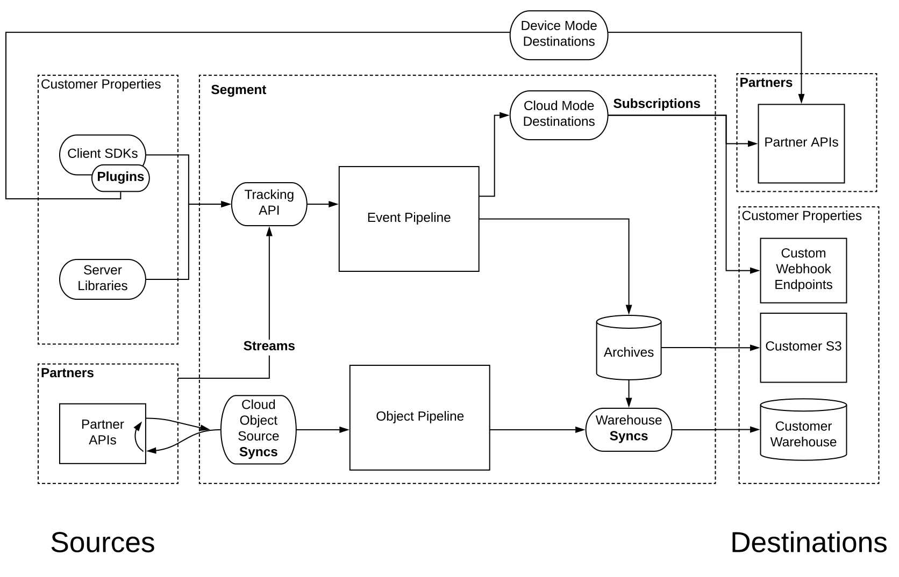

At a high level Segment provides a simple product model for customer data. Segment collects data using "sources" and routes data to "destinations". Along the way data is translated to and from the "spec" -- a specification for how to represent customer data events.

## Sources

Segment Customers use [Sources](/docs/connections/sources/) to collect all data across all their properties (web, mobile, CRMs, email etc.).

## Destinations

Segment Customers use Segment to intelligently route this data with a flip of a switch to [Destinations](/docs/connections/destinations/) where they perform analytics, run marketing campaigns, and much more.

## Spec

The [Spec](/docs/connections/spec) is arguably the most critical component of Segment. It's how we preserve semantics between disparate writers and readers of data, and ensure that sources and destinations can stay on the same page. It's crucial that your Source or Destination adhere to the spec. If you encourage customers to break the spec, you are breaking the promise of Segment, which is grounds for removal from the catalog.

If there is something unique about your tool that requires specific data points that are not included in the spec, get in touch. We love partner suggestions for augmentations to the spec!

## Apps

Apps represent a unit of functionality that Segment users can add to their workspace. Partners use the Developer Center to create an App that will represent their company and/or service, and configure and build Components for the App.

## Components

"Sources and Destinations" are a bit more complicated under the hood than publishing and subscribing to data to and from Segment's servers. For instance:

- We offer SDKs that expose runtime support for plugins so that Destinations may be configured in either Cloud-mode or Device-mode.
- Within Destinations, we have Streaming Destinations, Batch Destinations, and Warehouse Destinations, all of which receive different data, using different processes, at different intervals and with varying degrees of control and flexibility.
- On the Sources side, integrations are categorized based on whether they send Objects or Events, whether they are "Push" or "Pull," and whether they are built and hosted by Segment or by Partners.

These smaller pieces that support the source and destination model are called "Components".

Segment is committed to providing more Components through the Developer Center at these various hook points that allow customers and partners to read and write data from Segment, and to configure and control the flow of that data.

**Today**, Partners can use the Developer Center to build Subscription and Plugin Components that will ultimately show up as Destinations in Segment's Connections Catalog.

In the future Segment will enable Partners to build Streams and Syncs that will show up as Sources in the Catalog.

## Plugins

Plugins are the basis for [Device-mode Destinations](/docs/connections/destinations/#connection-modes) and, in the future, possibly Device-mode Sources.

Client SDK Plugins are used to augment Subscriptions and Streams by shipping code to the End User's Device using Segment's SDKs:

- [analytics.js](/docs/connections/sources/catalog/libraries/website/javascript/)
- [analytics-ios](/docs/connections/sources/catalog/libraries/mobile/ios/#packaging-device-mode-destination-sdks)
- [analytics-android](/docs/connections/sources/catalog/libraries/mobile/android/#sending-data-to-destinations)

These SDKs serve as microcosms of the Segment runtime — they enable the dynamic orchestration of event collection, cleaning/transformation, and delivery.

Client SDK Plugins are an appropriate component if your source or destination requires client-side side effects, such as collecting ambient data in the client (Heatmapping, Error & Performance Monitoring tools), relying on device-native context such as third party cookies (Advertising pixels), or needs to actively modify the Client UI (e.g. A/B testing, Push Notification, In-App Messaging and LiveChat).

### Web Plugins

Web plugins are loaded into [analytics.js](/docs/connections/sources/catalog/libraries/website/javascript/).

### Mobile Plugins

Mobile plugins are loaded into [analytics-ios](/docs/connections/sources/catalog/libraries/mobile/ios/#packaging-device-mode-destination-sdks) or [analytics-android](/docs/connections/sources/catalog/libraries/mobile/android/#sending-data-to-destinations)).

## Streams

Streams are the basis for sending events to Segment directly as an [Event Source](/docs/connections/sources#event-cloud-sources). If you supply channels and properties where customer interactions happen, you can apply for inclusion in the Segment Source Catalog with a documented Stream. Streams are not yet supported in the Developer Center but we are working with select partners currently, and are working to make this available to any partner using the Developer Center in the future, so feel free to [get in touch](https://segment.com/help/contact/) and get started if you're interested in eventually joining the catalog!

## Subscriptions

Subscriptions are the basis for [Cloud-mode Destinations](/docs/connections/destinations/#connection-modes), and are the starting point for our partnership. Subscriptions can be created, configured, and managed in the Segment Developer Center.

Subscriptions give you complete control over how you want to store, transform and process your customers' data. It means that our customers can immediately start sending you data from any one of our [sources](/docs/connections/sources/)—from the browser, from their mobile apps, or from their servers—with no added work. Segment [Business Plan](https://segment.com/pricing/) customers can also [**replay**](/docs/connections/data-export-options/) historical data from our archives, which means you can demonstrate the full value of your tool immediately upon enablement.

Note that Object data collected from Cloud Object Sources (such as Stripe, Zendesk, and Salesforce) currently only targets customer Warehouse Destinations and is not not made available to Destinations through Subscriptions.

Subscription-based Destinations work well for analytics tools, email marketing tools, attribution tools, CRMs, raw data tools, helpdesks, customer success tools, etc.

You can build a subscription to customer data in two ways: Functions or Webhooks.

### Subscription Functions

Functions are designed to be the fastest to get working. You start with reference JavaScript code, add your existing API endpoint, customize functions to translate Segment event data and make requests to your existing API, and click "test" in the Segment Dev Center to start delivering data. Segment will run the custom JavaScript for you to send data to your API.

### Subscription Webhooks

Webhooks are designed to be the most traditional way to receive data. You can refer to a reference HTTP server implementation and implement the same concepts in any language, deploy it to your infrastructure, and paste the resulting HTTPS URL into the Segment Dev Center. Segment will POST data to your Webhook service.

## Syncs

Syncs are scheduled processes that pull data from Partner APIs and upload it to Segment's Object API, or which pull data from our Object and Event Archives to load into Data Warehouses. Currently, the Object API only targets customer Warehouse Destinations. This data is not made available in streaming destinations.

> Syncs are currently not available to partners. If you are interested in building one, contact partner-support@segment.com.
