> info ""
> If you're a customer who just wants to build a simple script or app against a single workspace, you may want to use [Workspace Access Tokens](/docs/config-api/authentication).

Enable with OAuth, supported with our [Config API](/docs/config-api), allows partners to build seamless flows for customers to implement and enable integrations within their workspace. This is a [post-launch requirement](/docs/partners/#post-launch) for a partner to graduate from public beta to public.

## Concepts

Before getting started with your implementation, it's important to understand the below concepts.

### Apps

As a partner developing an integration using Segment's Config API, everything starts from an **App**. An App behaves like a standard OAuth client, but adds granular permissions. When a user installs your App through the familiar OAuth flow, we require the user to grant access to a specific workspace and source. The user must also be a Workspace Owner of the authorized workspace.

As a destination partner, you may only manage your own destination on the workspace and source authorized by the user.

### App Installs

Segment Workspace Owners authorize your App on their workspace using a web-based authorization flow, exactly like OAuth. When authorized, Segment creates an **App Install** on the workspace.

Therefore, the token returned by Segment isn't tied to a user – it's tied to an App Install. That's why we call it an Install Token.

## Set up Guide

There are three steps to implement an "Enable with Segment" OAuth flow:

1. Create an App through Segment's Developer Center.
2. Set up an OAuth consumer that will participate in your Segment App's OAuth handshake.
3. Run your OAuth consumer, and verify that you can access resources – i.e. enable, configure, disable, and monitor your destination – on a user's behalf.

### 1. Create an App through Segment's Developer Center

1. Go to the [Segment Developer Center](https://app.segment.com/developer/apps).
2. Click **New App** to navigate to the App creation page:
   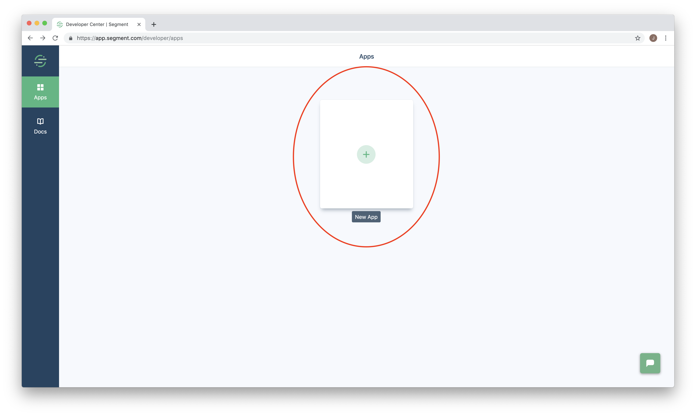
3. Name your App, and click **Create**.
   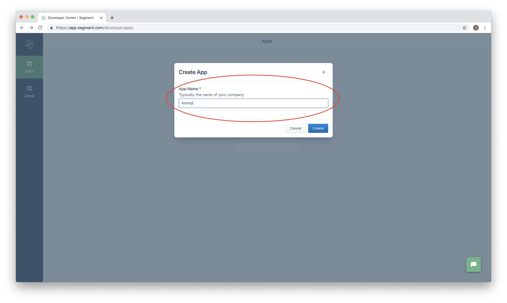
   You'll be redirected to your App's main page. If you are implementing Enable with OAuth for an integration not built using the Developer Center and encounter an issue where your integration's name is already taken, you may choose another name (eg. TOOLNAME-enable). You will have the option to connect the two by selecting a scope in Step #2.
4. Click the `App Info` tab.
   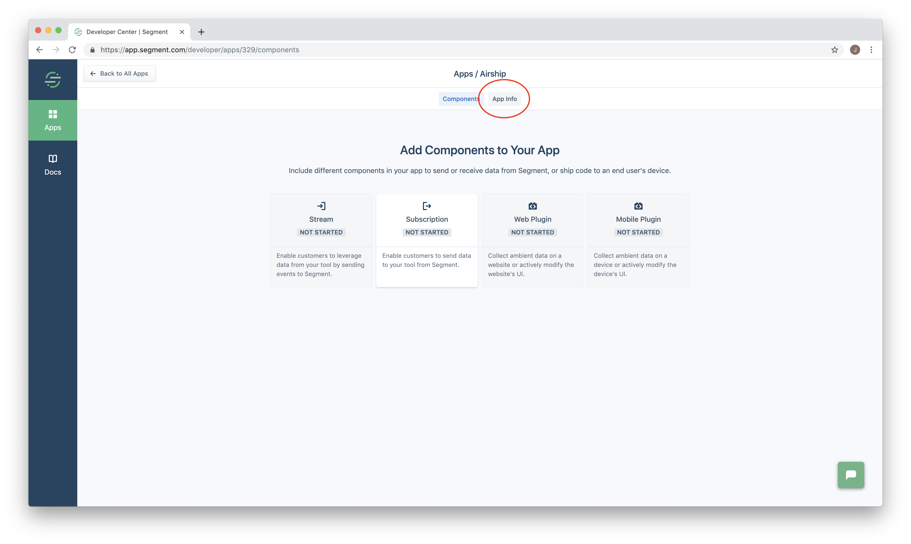
5. From the `App Info` tab, click `OAuth` in the left side navigation.
   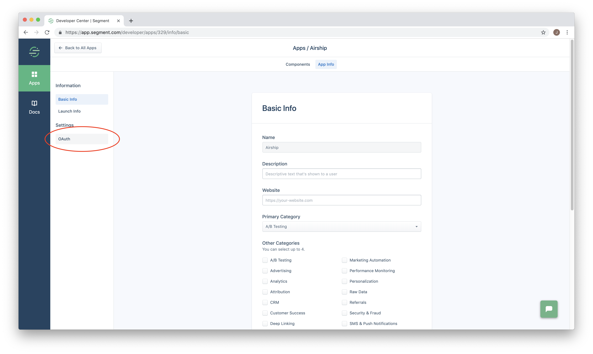
6. Keep your Developer Center browser window open – we'll need the OAuth credentials on this page to set up an OAuth consumer.
   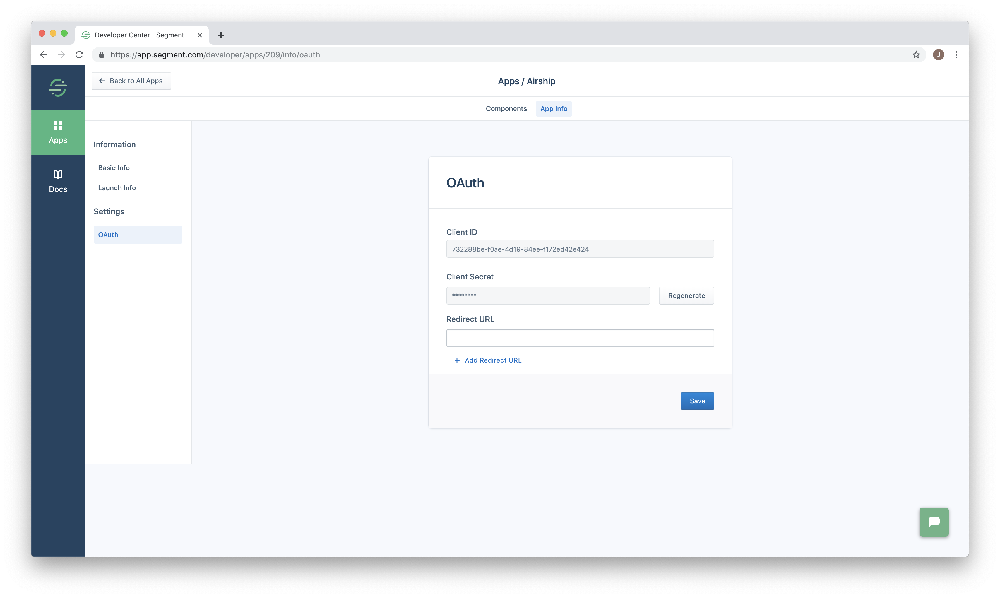

### 2. Set up an OAuth consumer

> For this step, we reference our example OAuth consumer at https://github.com/segmentio/partnerapp.
>
> You should adapt our example to your own infrastructure.

1. Clone our `partnerapp` repo:
   ```sh
   git clone https://github.com/segmentio/partnerapp
   ```
2. Back in your Developer Center browser window, copy the `Client ID` and `Client Secret` fields, and paste them into an `.env` file in the root of your `partnerapp` directory:
   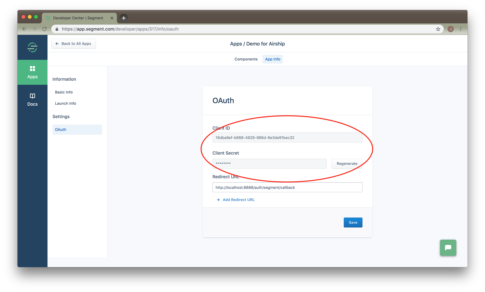
   ```sh
   echo CLIENT_ID=d1ce4e85-XXXX-XXXX-XXXX-XXXXXXXXXXXX > .env
   echo CLIENT_SECRET=YvpqeXXXXXXX >> .env
   ```
3. Add `http://localhost:8888/auth/segment/callback` to the list of redirect URLs, and click **Save**.
   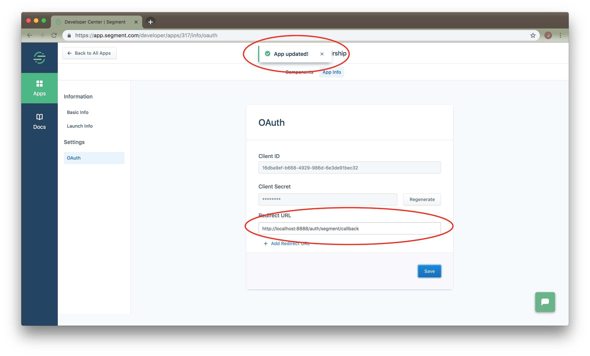

   > You **must** specify `http://localhost:8888/auth/segment/callback` in the Developer Center list of redirect URLs. The redirect URLs serve as a whitelist. Without the whitelisted URL, the OAuth flow in the `partnerapp` won't work.
4. Optionally set a new scope. The options, from most to least restrictive are:
  * `destination/<SLUG>` (e.g. `destination/airship`) -- create or update a single destination type on a single source a user consents to. This allows you to manage a secret like `apiKey` on your company's destination automatically but nothing else. Note that you may need to update the scope to the right destination slug if your app name differs.
  * `workspace:read` -- read-only access to all the settings and metadata on a single workspace a user consents to. This allows you to build integrations like a dashboard that gets and displays a workspace event delivery metrics
  * `workspace` -- full acess to all the settings on a single workspace a user consents to. This allows you to build deep integrations that create sources, destinations and more.
5. Finally, create a component of your choice in Developer Center.
   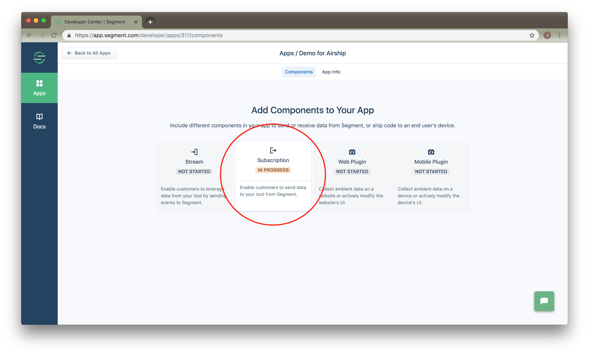

   > You generally will create a component and build a flow to create an Install of your app. However you can also build a flow to create an install of an existing destination by changing the OAuth scope.

### 3. Run through an example OAuth flow

> For this step, we reference our example OAuth consumer at https://github.com/segmentio/partnerapp.
>
> You should adapt our example to your own infrastructure.

1. Back in the root directory of your `partnerapp` clone, update the following two pieces of configuration in `index.js`:
   ```js
   // Change this to the slug of the destination you are trying to manage for the user.
   // You can find the slug of your destination by going to your App's "App Info" page,
   // located at https://app.segment.com/developer/apps/123/info/basic.
   const dest = 'test-destination'

   // Change this to the API key provisioned for the user in your system.
   const destAPIKey = 'abcd1234'
   ```
   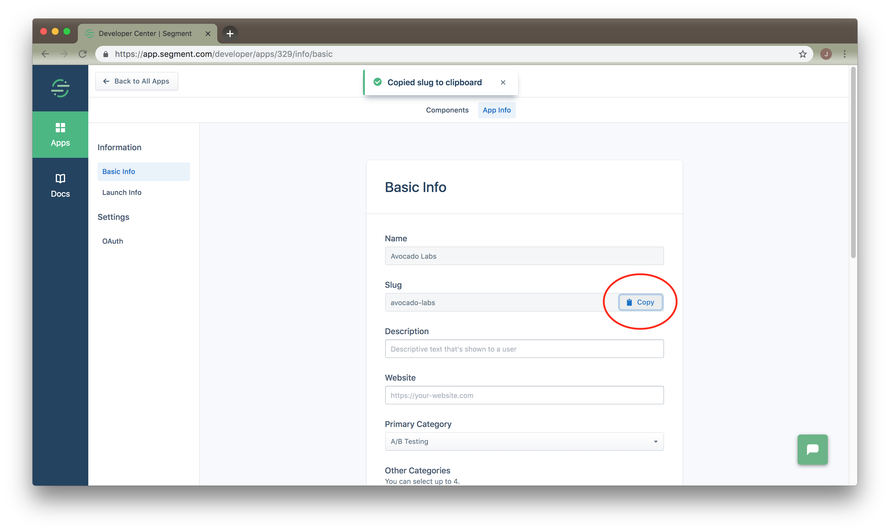
2. Run `node index.js`, and navigate to `http://localhost:8888/auth/segment` in a _new_ browser window:
   ```sh
   node index.js
   ```
3. Navigate through our login and authorize OAuth flows:
   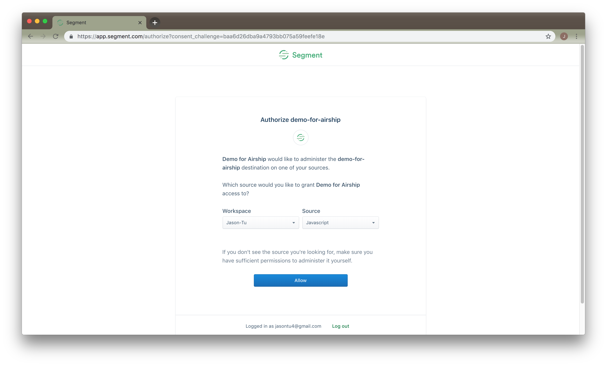
4. Look for a JSON response in your browser window, and output in the terminal running `partnerapp`:
   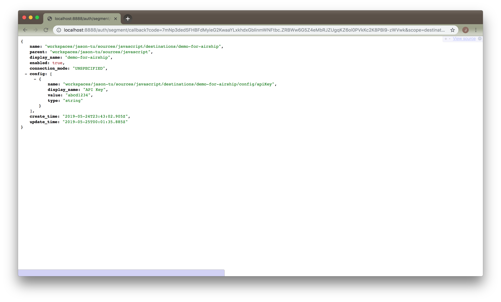
   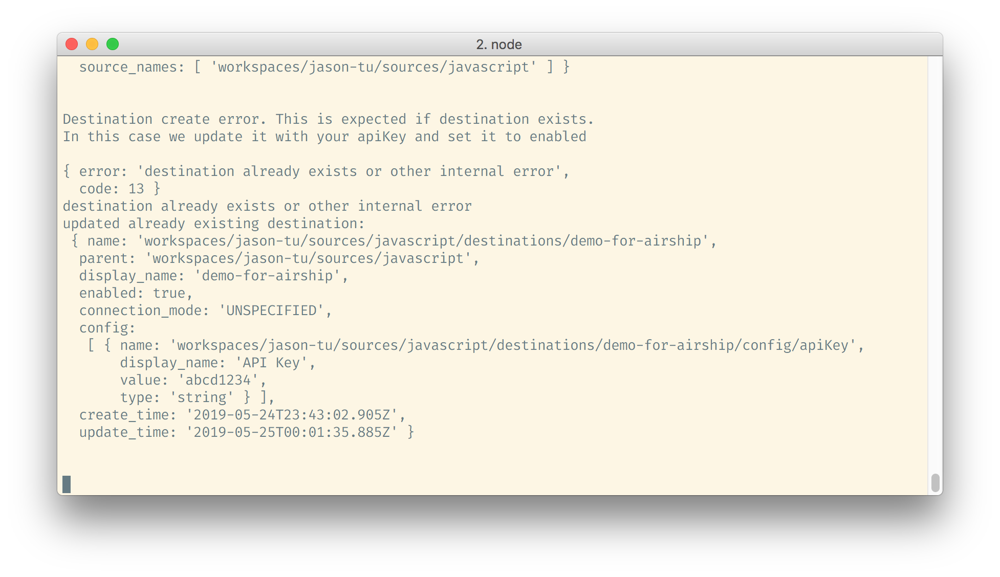

## OAuth Implementation

If you use a standard OAuth library in your programming language, all of this is done for you as shown in the [setup guide](#set-up-guide). These steps are just for illustration.

1. When the user wants to authenticate, you redirect them to `https://id.segmentapis.com/oauth2/auth?response_type=code&scope=workspace:read&client_id=...`.
   > **Note**: We only accept `response_type=code` here. That means Segment returns an `auth_code` that your library exchanges for an install token in Step 5 below.
2. If the user is logged out, Segment redirects to `https://app.segment.com/login`
3. If the user is logged in, Segment redirects to `https://app.segment.com/authorize`
4. If user consents, Segment redirects with a code to your redirect_uri `http://localhost:8888/auth/segment/callback`. This app listens for this request and runs step #5 below.
5. You exchange the code with for an install token from `https://id.segmentapis.com/oauth2/token`. The body of this POST request should include the code you received and your `redirect_uri`. Include your client secret and client id in a basic authorization header.
6. You save the access token, install name, workspace name and source name for the user.

At the end of a successful flow you get an "Install Token". If you passed in the scope as `destination/clearbrain` the user is prompted to select a source on which to install your Enable With Segment App, and that source is returned to you as well.

```js
{
  access_token: 'YL8a0w-Boz1EgZgmD2ELZvsxakjqSMwO8xe7tV-ToSk.nKaLX2QHocqalHR3O4BdoYdcopk3hjW4izYHMG14cxQ',
  token_type: 'bearer',
  expires_in: 3599,
  scope: 'workspace',
  app_name: 'apps/2',
  install_name: 'installs/7',
  workspace_names: [ 'workspaces/userworkspace' ]
  source_names: ['workspaces/userworkspace/sources/javascript']
}
```

You can then perform API operations as the installed app on behalf a user.

With the `destination/clearbrain` scope you can only change the destination specified (`clearbrain` in this case) on the user selected source. This is the recommended scope for apps trying to control just one destination for a user (Enable With Segment functionality). These apps can only access the Destinations API. You can find a detailed reference here: https://reference.segmentapis.com/ > Destinations

You can GET a destination if it exists (and you have access to the user workspace and source) as shown below. You can also Create, Update or Delete it too.

```sh
$ INSTALL_TOKEN=YL8a0w-Boz1EgZgmD2ELZvsxakjqSMwO8xe7tV-ToSk.nKaLX2QHocqalHR3O4BdoYdcopk3hjW4izYHMG14cxQ
$ curl \
  -H "Authorization: Bearer $INSTALL_TOKEN" \
  https://platform.segmentapis.com/v1beta/workspaces/business/sources/js/destinations/clearbrain \
```

```json
{
    "name": "workspaces/business/sources/js/destinations/clearbrain",
    "parent": "workspaces/business/sources/js",
    "display_name": "ClearBrain",
    "enabled": true,
    "connection_mode": "UNSPECIFIED",
    "config": [
        {
            "name": "workspaces/business/sources/js/destinations/clearbrain/config/apiKey",
            "display_name": "API Key",
            "value": "abcd1234",
            "type": "string"
        }
    ],
    ...
}
```

You can refresh the token with the installation token API. The token expires in an hour, so do this periodically.

```sh
$ INSTALL_NAME=installs/7
$ curl \
  -u "$CLIENT_ID:$CLIENT_SECRET" \
  https://platform.segmentapis.com/v1beta/$INSTALL_NAME/token
```

```json
{
 "access_token": "4d9ee1b5-b752-4f7f-86d9-5680df6f8ce8",
 "token_type": "bearer",
 "expires_in": 3600,
 "scope": "workspace",
 "app_name": "apps/myapp",
 "install_name": "install/10",
 "workspace_names": ["workspaces/userworkspace"]
}
```

## Advanced Use Cases

> Developer Center Destinations must use their specific destination scope for their enable flows. More permissive apps are subject to revocation unless specifically approved. If you've been approved, however, this section may apply.

If you created an App with a more permissive scope, you have access to more APIs:

- With the `workspace` scope you can change all resources
- With the `workspace:read` you can read all resources, but not change them

A full list of APIs are here: https://segment.com/docs/config-api/

The example below shows how you would get a users workspace if you had any of the above scopes:

```sh
$ INSTALL_TOKEN=YL8a0w-Boz1EgZgmD2ELZvsxakjqSMwO8xe7tV-ToSk.nKaLX2QHocqalHR3O4BdoYdcopk3hjW4izYHMG14cxQ
$ curl \
  -H "Authorization: Bearer $INSTAL_TOKEN" \
  https://platform.segmentapis.com/v1beta/workspaces
```

```json
{
  "name": "workspaces/userworkspace",
  "display_name": "Business",
  "id": "bb296fce9c",
  "create_time": "2012-08-12T15:40:04.406Z"
}
```

If you created the app with any of these scopes, and then updated the scope in index.js at the top to match it, you can uncomment the lines around sourceList in index.js to see an example of how you could list all sources on the users workspace.

## FAQs

### What should the exact destination slug word be?

There are references above for `destination/<slug>`, but what should the `<slug>` be? The "slug" is the destination that you want to manage for the user. To see the exact slug we are expecting for your destination:

 -  If you just submitted a destination in the Developer Center for approval, you can see the slug on the submission form, or in the URL once submitted.
 -  If your destination is already public, look at the Segment Catalog and find your destination. That exact slug should appear in the URL. So it would be `clearbrain` for this destination /docs/connections/destinations/catalog/clearbrain/

### What should the exact `create` body be to enable my destination?

The `create` body has three fields:
 - full path to the apiKey (which includes the users workspace and source, see below)
 -  the actual apiKey provisioned for the user in your system. It's in the "value" field
 -  `enabled: true`.

The body is in this format:

```sh
curl -X POST \
  -H "Authorization: Bearer $TOKEN" \
  -d '{
    "destination": {
            "name": "workspaces/userWorkspaceSlug/sources/userSourceSlug/destinations/clearbrain",
            "connection_mode": "CLOUD",
            "config": [
                {
                    "name": "workspaces/userWorkspaceSlug/sources/userSourceSlug/destinations/clearbrain/config/apiKey",
                    "display_name": "API Key",
                    "value": "abcd123"
                }
            ],
            "enabled": true
    }
  https://platform.segmentapis.com/v1beta/workspaces/userworkspace/sources/js/destinations \
}'
```

### Why can't I list all of the destinations on the source?

If you created the app with the `destination/<slug>` scope, you can only access that one destination on the source. You cannot list all destinations using this scope.

### How do I create or update a destination that requires more configuration than just a API Key?

`GET` the destination settings using our catalog API first. This shows all of the fields the destination supports. You can then substitute the field values for the ones you need to specify.

Using this body, craft a `CREATE` request and substitute the appropriate field values. Check out https://reference.segmentapis.com/ > Destination > CREATE request for an example

### What type of OAuth grant do you support?

We support the "authorization code" grant type. That means you exchange the `auth_code` returned during the install flow to get the actual access token. https://www.oauth.com/oauth2-servers/access-tokens/authorization-code-request/

The library you use in your programming language should do this automatically for you.

### What scopes do you support?

We support `destination/<slug>`, `workspace` and `workspace:read`. You set these scopes during app creation and when you start the install flow. You must use the same scope in both places, otherwise you get an invalid scope error when you start the error.

### What is the fastest way to get started? Do I have to learn OAuth to make an app?

Run the partner app (you're looking at it!) so you can see all the steps involved in setting up your app, installing it and then accessing resources.

You don't need to learn OAuth! If you use the standard Oauth implementation in your programming language, like we do in the partner app, all this complexity should be hidden from you.

### During OAuth code exchange I get a "missing a required parameter" error

Your `redirect_uri` probably doesn't match what you set in the App Create Request.

### How many redirect_uris can I have? Can I add more after the app is created?

You can have five `redirect_uris` on app creation. Editing the app info directly is not supported at this time. [contact us](https://segment.com/help/contact/) if you want any of your `redirect_uris` or other info changed.

In the future we will allow you to update this information on your own.

### I am getting "malformed token" when I try to access the API. What is wrong?

 - Tokens expire every hour, so your token might have expired. To get a new access_token, hit the refresh endpoint. Make sure you pass in the correct `install_name`, `client_id` and `client_secret` in that request.

 - You might not have permissions for the action you're trying to take. You can only write to a resource when you have `workspace:read` permission. If you need write access, then create a new app with `workspace` permission and then re-install it.

### Do you send CSRF state back when you redirect?

Yes. If you set the `state=123` parameter in your initial request, we send it back to you.

### Do we still have to send the redirect_uri in the oauth2/token request?

Yes. This conforms to the OAuth spec, and is done for security purposes.

### I am getting `install already exists` error

You already installed the app on this workspace, so you can't install it again. You can use your current `access_token` to simply access resources on this workspace.

When the app was installed, you should have received a Segment `workspace` and  `install_name` so you can store it in your own db along with the user's info. If the user tries to install this app again, you can check your db and see that they already installed your app, and can skip the install flow.

### OK I managed to create an App. How do I use your APIs?

See [the API docs](https://segment.com/docs/config-api/), and the Postman API reference collection that you can run as-is https://reference.segmentapis.com/#51d965d3-4a67-4542-ae2c-eb1fdddc3df6.
