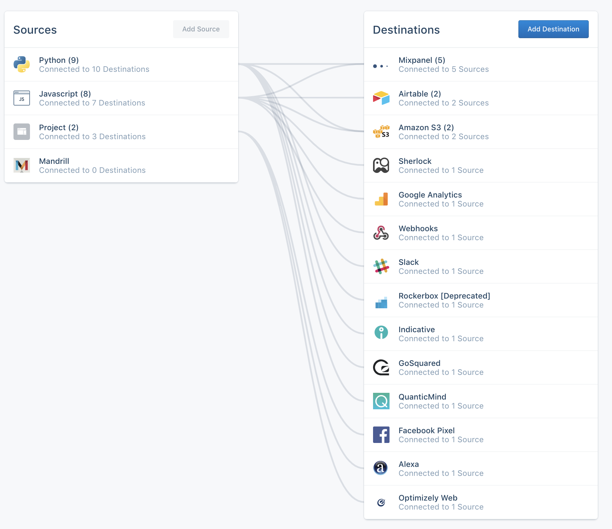



## Building on Segment

Over 19,000 companies use Segment as their central hub for collecting and synthesizing first-party customer data. Customers use Segment [Sources](/docs/connections/sources/) to collect data across all their properties (web, mobile, CRMs, email etc.) and send this data into [Destinations](/docs/connections/destinations/) (SaaS tools, internal databases or queues, or a data warehouse) to perform analytics, run marketing campaigns and much more.

Below is a sample screenshot of a customer's Segment dashboard, showing all their sources of data on the left, and destinations for their data on the right.

Segment's core feature is the Connections Catalog:

Customers discover your Sources and Destinations using the Connections Catalog and can enable them from there.

The development process is simple:

1. Understand Segment's [Conceptual Model](/docs/partners/conceptual-model) and [Spec](/docs/connections/spec).
2. Follow Segment's security guidance.
3. Request [access to the Segment Developer Center](https://segment.com/partners/developer-center/).
4. Create an App.
5. Build and test your Component(s).
6. Publish documentation.
7. Submit your App for review.
8. Launch into _Public Beta_!

### 1. Understand Segment's Conceptual Model

It's important to understand Segment's [Conceptual Model](/docs/partners/conceptual-model) to begin planning your integration. This will help you understand how data will flow from or into your integration.

### 2. Follow Segment's security guidance

Security for both customers and partners is a priority at Segment. Before you start building on the Developer Center, review the [Acceptable Use Policy](https://segment.com/legal/acceptable-use-policy/) and ensure you're following the below guidance:

- Follow a secure software-development lifecycle, which enables you to create code that is safe for Segment customers and their end users, and that enables you to maintain and raise the security of that code over time
- If you or your code comes into contact with Segment customer- or end-user data for any reason, protect it with commercially reasonable methods throughout its data lifecycle, including creation, handling, transporting, storing and destruction.
- If you suspect a security event, incident or breach while working on this project or afterward, contact [Segment Security](mailto:security@segment.com?subject=Developer%20Center%20Security) for assistance with your investigation and communications
- Practice modern and common-sense security for any scenario not explicitly stated  

### 3. Request Access

During _Developer Preview_, you will need to [request access to Developer Center](https://segment.com/partners/developer-center/). A Segment account is required for this step.

Segment receives a large volume of requests so please include a valid company website and email address, answer all questions with details about integration's use case as well as highlighting specific customer requests to expedite the approval process.

### 4. Create your App

Once approved, you can create your first [App](/docs/partners/conceptual-model/#apps). This represents a tile in the [Segment catalog](https://segment.com/catalog/) irrespective of which [Component](/docs/partners/conceptual-model/#components) type you choose to build so it should reflect your tool's name (for example, Zendesk Chat, Zendesk Sell).

### 5. Build & Test

Now you can start building! Depending on your use case you can build a:

- [Subscription](/docs/partners/subscriptions)
- [Plugin](/docs/partners/plugins)
- [Stream](/docs/partners/streams)

No matter which Component you decide to build, make it aligns with the [Segment Spec](/docs/connections/spec). This is a critical component in preserving logical continuity between disparate writers and readers of data. If you encourage customers to break the spec, you are breaking the promise of Segment, and is grounds for removal from the catalog.

To provide a positive experience for mutual customers, it's important to test integrations with the tooling provided by the Developer Center. You can also use your Segment sandbox to polish the experience your end users will see.

### 6. Document

Finally, make sure you prepare documentation and relevant marketing material for easy discovery and reference. Provide the following documentation about your integration by making a copy of the below templates:

1. Documentation [hosted by Segment](https://segment.com/docs/) for [Subscription / Plugin](https://hackmd.io/t7amLXluS7-39rg7ARZgSA) or [Stream](https://hackmd.io/TV8cZR6tRnKwGtkvSexeag)
2. Documentation for [the Segment catalog](https://segment.com/catalog/) using [this template](https://docs.google.com/document/d/1kKvqYtZeDPnBjvCrtQSuO3BBH70b_CLO13hYrYIOOtA/edit))
3. Documentation hosted on your own website about your new Segment integration
4. Draft blog post announcing your new integration

### 7. Submission

You can submit your Component in the Developer Center for review. Segment aims to respond to your submission within two business days to kickstart the review process.

Segment tests your integration and reviews your documentation and marketing material. To keep this review feedback loop short, make sure that your integration:

- Adheres to the [Segment Spec](/docs/connections/spec/)
- Adheres to your published documentation
- Supports high data volumes
- Meets all [launch requirements](/docs/partners/#launch-requirements)

## Launch Requirements

See the [Public Beta Checklist](/docs/partners/checklist) for a detailed checklist used by the Segment team to review and approve the launch of your integration.

In a nutshell you need:

1. A working integration tested end-to-end. Follow your own documentation and run through the experience as a mutual customer.

2. Complete the fields under the _App Info_ tab with your App including both _Basic Info_ and _Launch Info_. This includes:

  - **Segment Documentation:** Using these templates ([subscription](https://hackmd.io/t7amLXluS7-39rg7ARZgSA?both=)/[stream](https://hackmd.io/TV8cZR6tRnKwGtkvSexeag), document how mutual customers can use your integration.
  - **Your Documentation:** Similar to the above but hosted on your own website.
  - **Catalog Details:** Details for the [catalog](https://segment.com/catalog) material including screenshots by making a copy of [this template](https://docs.google.com/document/d/1kKvqYtZeDPnBjvCrtQSuO3BBH70b_CLO13hYrYIOOtA/copy).
  - **Integrations / Partners Page:** Add your Segment integration to your integrations or partners page.
  - **Blog Post:** Publish a launch blog post about your integration, like [this](https://www.kustomer.com/blog/kustomer-segment-integration/). Make sure you share it on Twitter and LinkedIn too! (If you don't have a blog, an email is okay)

Be sure to use Segment's [brand kit](https://brandfolder.com/segment/press-kit) for logos, and Segment's [UTM guide](https://docs.google.com/document/d/1L0MHYdF2SYaMMiodQCYlZELF7pN0TXiZbD22nnlGhEk/copy) any time you link to a Segment page.

You can contact Segment Partner Support at [partner-support@segment.com](mailto:partner-support@segment.com) once you have all these elements ready for review. Once approved, your Destination goes live on the Catalog in Public Beta.

## Post Launch

Congratulations on launching your integration in Public Beta - welcome aboard! Here are the next steps to move out from Public Beta to Public:

1. Implement the [Enable with Segment OAuth](/docs/partners/enable-with-segment) button - this makes it much easier for mutual customers to get started with your integration!
2. Onboard at least three customers to actively use your integration

Bonus points if you join the [Segment Select](/docs/partners/#segment-select) Partner Program!

## Segment Select

You can taking advantage of Segment's available partner opportunities by [joining the Segment Select Partner Program](https://segment.com/partners/integration/#module-5-benefits).

By becoming a Segment Select partner, you have access to sales support, technical training, and personalized co-marketing opportunities. [Learn more about the program details here.](https://assets.ctfassets.net/9u2t3ap6pctb/3NPVQDweiX0l8Z2edugwIr/d09ea71f04913f3189514b7d2df57d36/Segment_Select_Partner_Program_One_Pager.pdf)
