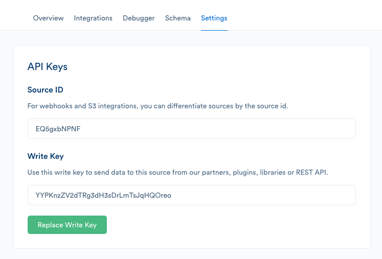

> info ""
> The Developer Center is currently not accepting new components. Segment is committed to redeveloping the Developer Center and a new version will be launched in the future. Include [your information here](https://airtable.com/shrj3BkHMhdeaPYWt){:target="_blank"} and we'll contact you once _Streams_ are made available!


Streams enable you to send data to mutual customers from your web services in realtime.

# Building a Stream

Segment empowers companies of all sizes to use their customer data to grow their business. In addition to more than 180 analytics and marketing tools that receive data from Segment, there are a growing number of source partners — including Salesforce, Twilio, Stripe, Zendesk, and more — sending data into Segment for their customers to use in any destination. By creating a Segment data stream, you'll enable customers to use data from your tool wherever it's most useful to them.

# Understanding the integration

To complete the source set up flow, the customer will need to input the Segment write key for this source in your integrations settings UI. This will enable your tool to route customer data back to Segment correctly.

Customers can find their write key in the source settings and regenerate it as needed.



> warning ""
> Segment working on an OAuth solution to reduce friction for customers. Partner Streams submitted through the developer center *will* be required to support this OAuth as it comes available.

## The Segment Spec

To learn about the semantics of the five supported API calls, and the semantic event names and properties Segment recognizes, read the Segment [Spec](/docs/connections/spec).

The spec is a critical component of preserving semantics between sources and destinations. If you break the spec, you are breaking the promise of Segment, which is grounds for removal from the catalog.

> info ""
> If any events you send to Segment match, but do not adhere to, existing events from the Segment Spec (for example, sending "Purchase" instead of "Order Completed" or "install" instead of "Application Installed"), Segment will reject your application.


If there is something unique about your tool that requires specific data points that are not included in the spec, [get in touch](https://segment.com/help/contact/){:target="_blank"}.

## Sending data

To send events to Segment you should post events directly to the [Segment HTTP API](/docs/connections/sources/catalog/libraries/server/http-api/#track). You may use a Segment [library](/docs/connections/sources/catalog/) to do so. The HTTP API has a couple of basic requirements.

Beyond the Spec, there are a few additional requirements for partner Streams.

### `userId`

Each call sent to Segment must contain a  `userId`. The `userId` is what allows Segment to identify each unique user. This value should be stored by your tool when you receive an event from Segment.

For example, you might receive an `identify` call with a `userId` and `traits` about that user. If that user is sent an email and opens that email, you would want to send an `Email Opened` event back to Segment with that same `userId` . The `userId` should be part of the call body as a top-level object.

> info ""
>  For Customers, it's critical that the `userId` be consistent across all data flowing through Segment — this has significant implications for Segment billing (based on unique Monthly Tracked Users) and usefulness of data in integrations/warehouses. Passing back the `userId` value sent from Segment into your tool should be the default behavior of your track calls. If you're not a destination, make sure that you're using the customer's internal database ID, not your tool's ID.

If you have your own unique identifier you use in your tool, Segment recommends passing that along as a context property in the event for QA purposes. For example:

```json
    "type": "track",
    "userId": "abc",
    "traits": {
        "email": "customer@company.com"
     }
     "context": {
       "yourToolId": "123"
     },
```

### `integration`

Each call should contain a `context.integration` object in the call body that identifies your tool (for example where the call is coming from). Use the slugified name for your tool, and `1.0.0` as the initial version — if you're unsure of your integration slug, contact Segment support. Once Streams are supported in the Developer Center, this will be rendered for you and will be validated as part of the QA process.

This should be part of the `context` top-level object and will look like:

```json
    "context": {
      "integration": {
        "name": "your-tool",
        "version": "1.0.0"
      }
    }
```

### `writeKey`

Each call must contain a `writeKey`. Segment provides this `writeKey` to customers in the settings panel for each of their sources. As mentioned in the set up flow description above, customers will need to save their Segment write key in your UI in order authenticate calls being made by your tool.

The write key is required in the header of every call to identify the customer whose data Segment receives. See the [authentication section](/docs/connections/sources/catalog/libraries/server/http-api/#authentication) of the HTTP API docs for more detail. If you do not include a customer write key in the call header, Segment will reject track calls from your tool.

**Rate limits and batching**
There is no hard rate limit at which point Segment will drop your data. However, to avoid processing delays, Segment asks partners to send requests at a maximum rate of 50 requests per second.

If you want to batch requests to the HTTP endpoint, refer to the batching documentation [here](/docs/connections/sources/catalog/libraries/server/http-api/#import). The suggested maximum rate includes any batch requests.

## Regional Segment
Segment offers customers the option to lead on data residency by providing regional infrastructure in both the Europe and the United States.

Segment recommends you enable the user to choose which Segment [endpoint](/docs/guides/regional-segment/#server-side-and-project-sources) to send data to for the given writeKey from your system.

# Process

## Plan

If you have not already, review your timeline and resourcing plan. Include which events your source will be sending to Segment to ensure they are properly specified. Segment onboards new sources as quickly as possible, but you should only commence building once you receive approval from Segment.

## Build

All three of these steps should be completed before you begin testing:


- Following the guidelines above, format your outbound webhook to Segment's HTTP API.
- Add a field in your settings UI where customers can input their Segment write key.
- Write docs for your source — you'll need to have separate docs for your source ([example](/docs/connections/sources/catalog/cloud-apps/drip/)) and integration.

## Testing

1. If you don't have a test account up and running already, [create a free Segment account](https://segment.com/signup).
2. Set up a source depending on the kinds of events you need to test. For example, if your source sends mobile event data, you'll need to instrument a Segment mobile SDK into a demo app.
3. Copy the Segment write key for this source into your integration settings and save.
4. Take actions that generate the events your source should be sending. For example, if your source is sending email data to Segment, you should:
   1. Create an email campaign that includes one hyperlink and an unsubscribe option.
   2. Send this to yourself.
   3. When you receive the email:
      1. Open the email
      2. Click the link
      3. Unsubscribe
5. Check your Segment debugger for events. If the Source is working correctly, you should see a live incoming event stream of events (such as `Email Delivered` , `Email Opened` , `Email Link Clicked` , `Unsubscribe` ).
