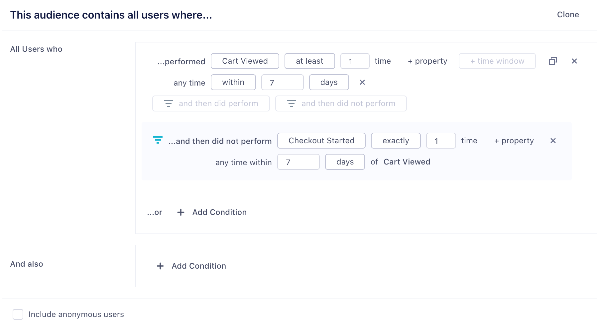
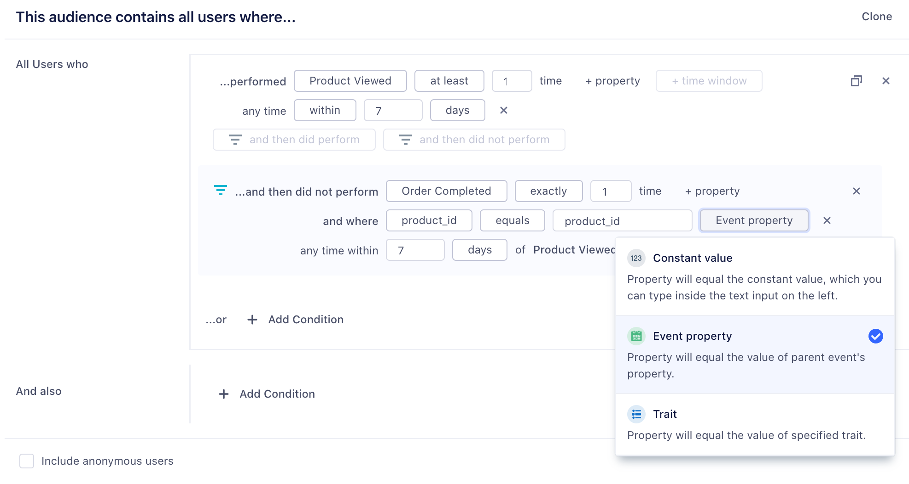
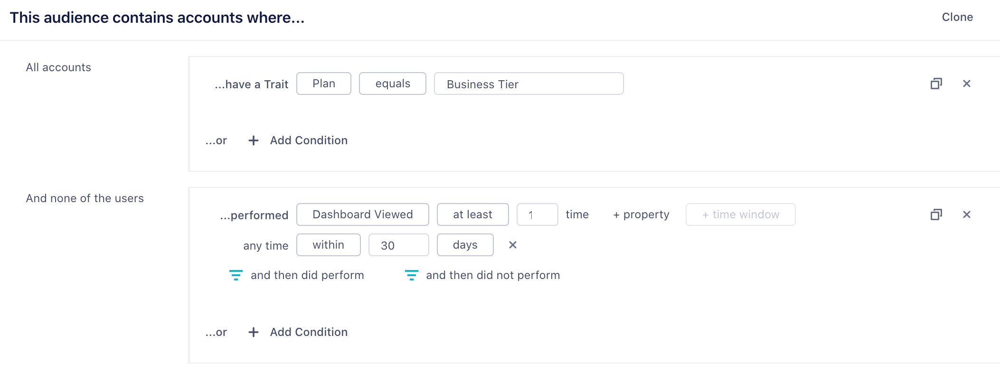

Audiences allow you to define cohorts of users or accounts based on their event behavior and traits that Segment then keeps up-to-date over time. Audiences can be built from your core **tracking events**, **traits**, or **computed traits**. These audiences can then be sycned to hundreds of destinations or available via the [Profile API](/docs/personas/profile-api).

## Building an Audience

When building an audience you can leverage existing events, traits, computed traits or audiences.

### Events

You can build an audience from any of the events that are connected to Personas. This includes any [track](/docs/connections/spec/track), [page](/docs/connections/spec/page), or [screen](/docs/connections/spec/screen) calls. You can use the `property` button to refine the audience on specific event properties as well. Select `and not who` to indicate users that have not performed an event. For example, you might want to look at all users that have viewed a product above a certain price point, but not completed the order.

You can also specify two different types of time-windows, `within` and `in between`. Within lets you specify an event that occurred in the last `x` number of days. In-between lets you specify events that occurred over a rolling time-window in the past. A common use case is to look at all customers that were active 30 to 90 days ago, but have not completed an action in the last 30 days.

### Custom Traits

You can also build audiences based on custom traits. These can traits collected from your apps when a user completes a form, or signs up, via an (identify)[/docs/connections/spec/identify] call. You can also check out the Personas user explorer to see examples of these traits.

### Computed Traits

You can also use computed traits in an audience definition. For example, if you have created a `total_revenue` computed trait, you can use this to generate an audience of `big_spender` customers that exceed a certain threshold.

### Funnel Audiences

Funnel audiences allow you to specify strict ordering between two events. This might be the case if you want an event to happen or not happen, within a specific time window, as in the example below

### Dynamic Property References

Dynamic Property references give you more flexibility over funnel audiences. Instead of specifying a constant value in both events, like product_id = '123' for both Product Viewed and Order Completed events, you can specify that a child event references an event property of a parent event. You can also compare an event property to a trait variable.

### Account-Level audiences

If you are a B2B business, you might want to build an audience of accounts. You can leverage both account-level traits that you've sent through the [group](/docs/connections/spec/group) call, or user-level traits and events. For example, you might want to re-engage a list of at-risk accounts defined as companies which are on a business tier plan and where none of the users in that account have logged in recently. When incorporating user-level events or traits, you can specify `None of the users`, `Any users`, or `All users`.

## Connecting your Audience to a Destination

Once you have previewed your audience, you can choose to connect a destination, or simply keep the audience in Segment and download a csv. If you already have destinations setup in Segment, you can import the configuration from one of your existing sources to Personas. Note that you can only connect one destination configuration per destination type.

Once you have created your audience, we will start syncing your audience to the destinations you have selected. Audiences are either sent to destinations as a boolean user-property or a user-list, depending on what is supported by the destination. Learn more about supported destinations [here](/docs/personas/activation/#destinations).

For account-level audiences, you have the option to send either a [group](/docs/connections/spec/group) call and/or [identify](/docs/connections/spec/identify) call. Group calls will send one event per account, whereas identify calls will send an identify call for each user in the account. This means that even if a user hasn't performed an event, we will still set the account-level computed trait on that user. Because most marketing tools are still based at the user level, it is often important to map this account-level trait onto each user within an account.

## Accessing your audiences via the Profiles API

You can access your audiences via the Profile API by querying the `/traits` endpoint. For example, if you can query for the `high_value_user` with the following GET request:

https://profiles.segment.com/v1/spaces/<workspace_id>/collections/users/profiles/email:alex@segment.com/traits?limit=100&include=high_value_user

returns:

    {
        "traits": {
            "high_value_user": true
        },
        "cursor": {
            "url": "",
            "has_more": false,
            "next": "",
            "limit": 100
        }
    }

View the full Profile API docs [here](/docs/personas/profile-api/)
