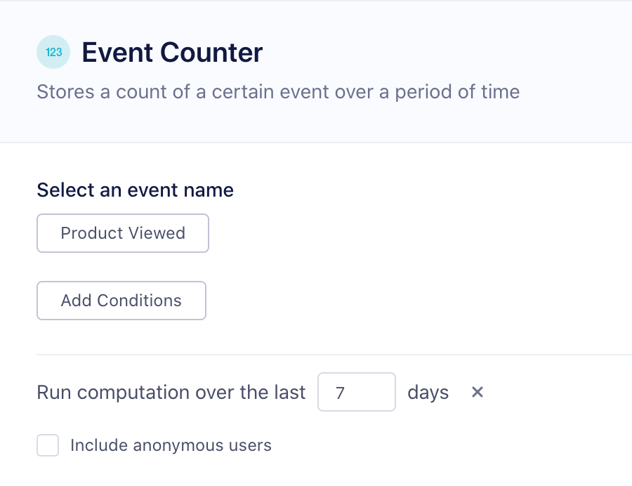
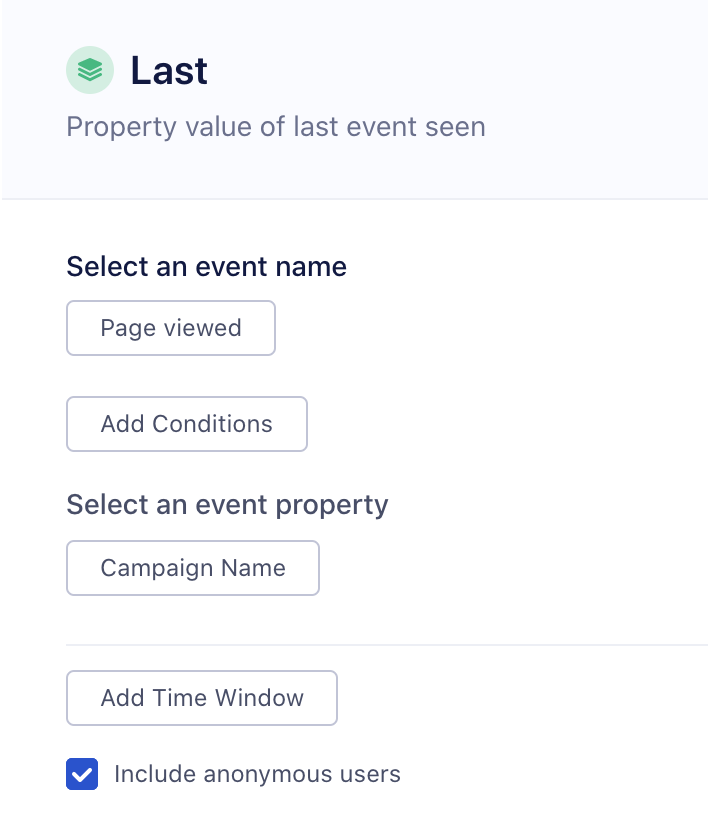
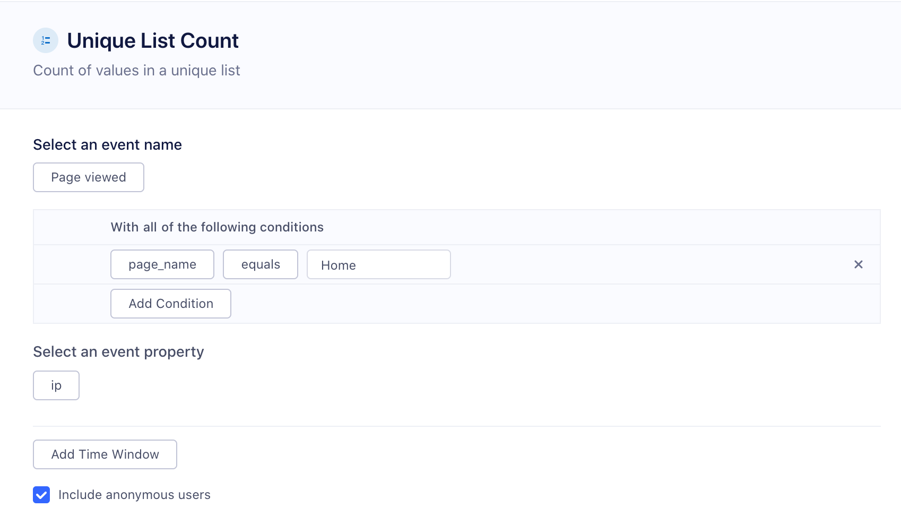
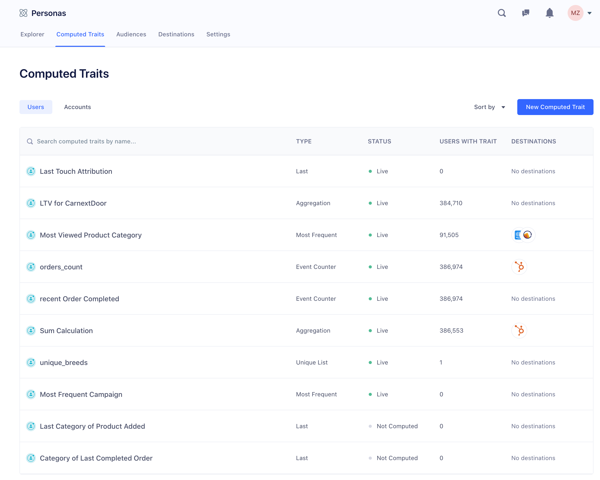
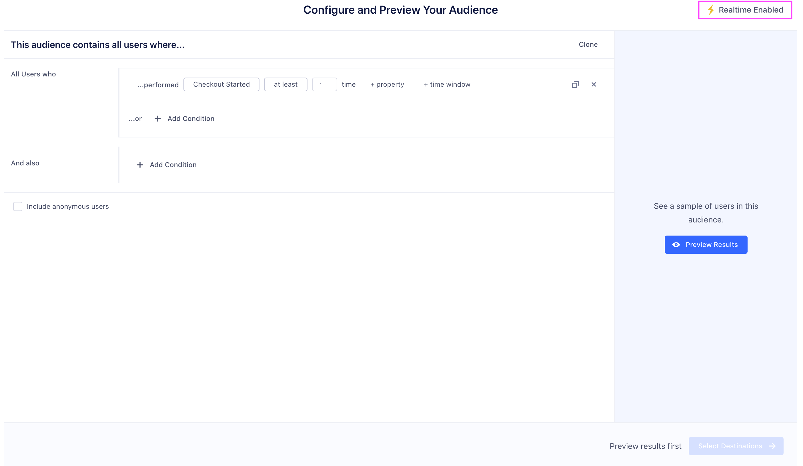

Computed Traits allow you to quickly create user or account-level calculations that Segment keeps up-to-date over time. These can be computations like the `total_num_orders` a customer has completed, the `lifetime_revenue` of a customer, the `most_frequent_user` to determine which user is most active in an account, or the `unique_visitors_count` to assess how many visitors from a single domain. These computations are based on your events and event properties that you are sending through Segment on the [page](/docs/spec/page/) and [track](/docs/spec/track) calls.

## Types of Computed Traits

Personas currently supports the following types of computed traits:
- [Event Counter](#event-counter)
- [Aggregation](#aggregation)
- [Most Frequent](#most-frequent)
- [First](#first)
- [Last](#last)
- [Unique List](#unique-list)
- [Unique List Count](#unique-list-count)

### Event Counter

An Event Counter trait stores a count of an **event** over a period of time. For example, you can create a trait called `number_logins_90_days` based on a `User Logged In` event. You can also use event properties to only specific types of events.

User-level examples:
- Orders Completed Last 30 Days
- Pricing Page Views Last 30 Days

Account-level examples:
- Total Logins by Account 30 Days
- Emails Opened by Account 90 Days



### Aggregation

An aggregation computes a **sum, average, minimum, or maximum** of a numeric **event property**. A good example is a `sum_cosmetics_revenue_90_days` if you're sending an `Order Completed` event with a `revenue` property. In the example we're refining the revenue even further based on another event property: `category = 'cosmetics'`. Note that you can only compute an aggregation trait for event properties that have a numeric value.

User-level examples:
- Order Revenue Last 14 Days
- Max Ride Distance Last 60 Days

Account-level use cases
- Total Minutes Watched 30 Days
- Avg Order Size Last 180 Days


### Most Frequent

A most frequent user-level computed trait will return the **most common value** for an **event property**.  This is  helpful to create traits like `preferred_product_viewed`  or `most_commonly_viewed_category` that tell you what a user's preferred product, or content category might be. Note that the most frequent computed trait requires the event property to have been tracked at least twice. In the case of a tie, we return the first alphabetical value. For account-level computed traits, you can also return the most frequent **user trait**. This is helpful when you want to determine which user has performed an event the most frequently. For example, you might to return the email of the user in an account most actively viewing your app.

User-level examples:
- Favorite Blog Post
- Top Purchase Category


Account-level examples:
- Most frequent product viewed
- Most active user


### First

The first user-level trait returns the first event property value we have seen. This is common for creating traits like `first_page_visited` based on the page name. For accounts, the first computed trait could also return a trait like `first_user_signup`, to calculate the first user to use your product.

User-level examples:
- First seen timestamp
- First utm parameter

Account-level examples:
- First email opened
- First user signup


### Last

The last trait returns the last event property value we have seen. This is common for creating traits like `last_utm_campaign` to help you calculate last-touch attribution for paid advertising.

User-level examples:
- Last seen at
- Last utm parameter



Account-level examples:
- Last unsubscribe timestamp
- Last user active


### Unique List

Unique list computed traits will output a **list of unique values** for an **event property**. This is helpful to understand the different types of products or content that a customer or users in an account have interacted with or purchased. Customers are creating traits like `unique_product_categories_viewed` and sending them to email marketing tools and accessing them through the Profiles API for in-app personalization.

Example use cases:
- Unique products purchased
- Unique categories
- Unique games played


### Unique List Count

Unique list count computed traits will output a **count of the unique list of values** for an **event property**. Customers are creating traits like `unique_product_categories_viewed_count` to understand the variety of products that a customer is viewing. At the account-level, customers are creating traits like `unique_visitors_count` to calculate the number of unique visitors by ip address.

User-level examples:
- Unique products viewed count
- Unique categories count


Account-level examples:
- Unique products viewed
- Unique visitors count



## Conditions
All computed trait types support a common "Add Conditions" section. Conditions defined here restrict the messages considered when calculating the final value of the computed trait by looking at a property of the events. For example, you could limits events to only those where "price" is greater than 30.00 or where "page.url" contains "pricing".

There are twelve different operators currently available.
- equals
- not equals
- less than
- greater than
- less than or equal
- greater than or equal
- contains
- does not contain
- starts with
- ends with
- exists
- not exists
- before date
- after date
- within last (x days)
- with next (x days)
- before last (x days)
- after next (x days)

## Connecting your Computed Trait to a Destination

User-level computed Traits are sent to destinations on our platform through the [identify](/docs/spec/identify) call as a user trait. The trait name will correspond to the snake-cased name that you can find in the trait settings, for e.g. `most_viewed_page_category`. You can find the list of destinations [here](/docs/personas/activation)


For account-level computed traits, you have the option to send either a [group](/docs/spec/group) call and/or [identify](/docs/spec/identify) call. Group calls will send one event per account, whereas identify calls will send an identify call for each user in the account. This means that even if a user hasn't performed an event, we will still set the account-level computed trait on that user. Because most marketing tools are still based at the user level, it is often important to map this account-level trait onto each user within an account.

## Accessing your Computed Traits via the Profiles API

You can access your computed traits via the Profile API by querying the `/traits` endpoint. For example, if you can query for the `emails_opened_last_30_days` with the following GET request:

    https://profiles.segment.com/v1/spaces/<workspace_id>/collections/users/profiles/email:john.doe@segment.com/traits?include=emails_opened_last_30_days

returns:

    {
        "traits": {
            "emails_opened_last_30_days": 255
        },
        "cursor": {
            "url": "",
            "has_more": false,
            "next": "",
            "limit": 100
        }
    }

View the full Profile API docs [here](/docs/personas/profile-api/)


## Audiences

Audiences allow you to define cohorts of users or accounts based on their event behavior and traits that Segment then keeps up-to-date over time. Audiences can be built from your core **tracking events**, **traits**, or **computed traits**. These audiences can then be sycned to hundreds of destinations or available via the [Profile API](/docs/personas/profile-api).

### Building an Audience

**Events**

You build an audience from any of the events that are connected to Personas. This includes any [track](/docs/spec/track), [page](/docs/spec/page), or [screen](/docs/spec/screen) calls. You can use the `property` button to refine the audience on specific event properties as well. Select `and not who` to indicate users that have not performed an event. For example, you might want to look at all users that have viewed a product above a certain price point, but not completed the order.


You can also specify two different types of time-windows, `within` and `in between`. Within lets you specify an event that occurred in the last `x` number of days. In-between lets you specify events that occurred over a rolling time-window in the past. A common use case is to look at all customers that were active 30 to 90 days ago, but have not completed an action in the last 30 days.

**Traits**

You can also build audiences based on traits. These can traits collected from your apps via an (identify)[/docs/spec/identify] call, or any of the computed traits you have generated through the Personas UI. For example, if you have created a `total_revenue` computed trait, you can use this to generate an audience of `big_spender` customers that exceed a certain threshold.


**Account-Level audiences**

If you are a B2B business, you might want to build an audience of accounts. You can leverage both account-level traits that you've sent through the [group](/docs/spec/group) call, or user-level traits and events. For example, you might want to re-engage a list of at-risk accounts defined as companies which are on a business tier plan and where none of the users in that account have logged in recently. When incorporating user-level events or traits, you can specify `None of the users`, `Any users`, or `All users`.


### Connecting your Audience to a Destination

Once you have previewed your audience, you can choose to connect a destination, or simply keep the audience in Segment and download a csv. If you already have destinations setup in Segment, you can import the configuration from one of your existing sources to Personas. Note that you can only connect one destination configuration per destination type.


Once you have created your audience, we will start syncing your audience to the destinations you have selected. Audiences are either sent to destinations as a boolean user-property or a user-list, depending on what is supported by the destination. Learn more about supported destinations [here](/docs/personas/activation/#destinations).

For account-level audiences, you have the option to send either a [group](/docs/spec/group) call and/or [identify](/docs/spec/identify) call. Group calls will send one event per account, whereas identify calls will send an identify call for each user in the account. This means that even if a user hasn't performed an event, we will still set the account-level computed trait on that user. Because most marketing tools are still based at the user level, it is often important to map this account-level trait onto each user within an account.

## Realtime Compute vs. Batch

Realtime Compute allows you to update traits and audiences as Segment receives new events. Realtime Compute unlocks exciting use cases:

  - **Intra-Session App Personalization:** change your app experience with personalized onboarding, product recommendations, and faster funnels based on a user entering and exiting an audience.
  - **Instant Messaging:** Trigger messages in email, livechat, and push notifications instantly, to deliver immediate experiences across channels.
  - **Operational Workflows:** Supercharge your sales and support teams by responding to customer needs faster, based on the latest understanding of a user

1. **Go to your Computed Traits or Audiences tab in Personas > New**



2. **Create your computed trait or audience.**

*You will see a Lightning bolt indicating that the computation will be updated in realtime.*



3. **Preview your audience > Select Destinations > Review & Create**

*By default, Segment queries all historical data to set the current value of the computed trait and audience. If you want to compute values only using data from the time you activate the feature on, uncheck Historical Backfill.*


Note that Facebook Custom Audiences, Marketo Lists, and Adwords have rate limits on how quickly we can update an audience. We will sync at the fastest frequency allowed by the tool. This is between 1 hour and 6 hours.


### Accessing your audiences via the Profiles API

You can access your audiences via the Profile API by querying the `/traits` endpoint. For example, if you can query for the `high_value_user` with the following GET request:

```
    https://profiles.segment.com/v1/spaces/<workspace_id>/collections/users/profiles/email:alex@segment.com/traits?limit=100&include=high_value_user
```

returns:

```json
    {
        "traits": {
            "high_value_user": true
        },
        "cursor": {
            "url": "",
            "has_more": false,
            "next": "",
            "limit": 100
        }
    }
```

View the full Profile API docs [here](/docs/personas/profile-api/)
