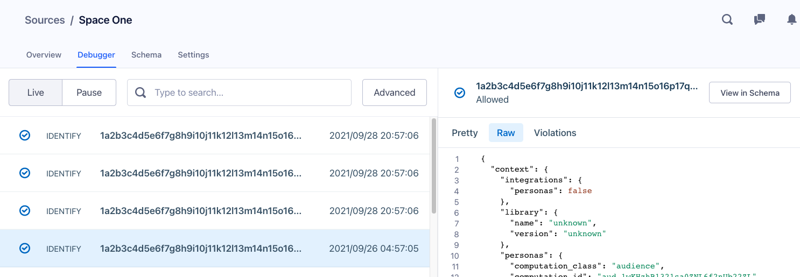

Using the Personas Source Debugger, you can inspect and monitor the events that Personas sends downstream.

Because Personas generates a unique Source for every Destination connected to a Space, the Debugger gives you insight into how Personas sends events before they reach their Destination.

The Debugger provides you with the payload information you need to troubleshoot potential formatting issues and ensure Personas sends events as your Destinations expect.

## Working with the Debugger

To access the Debugger within your Space, click on the **Settings** tab, and then the **Debugger** tab.

Next, click on the Source you want to inspect in the Debugger.

The Debugger displays the payload in two tabs:

* **Pretty view** shows the actual API call Segment sends to your Destination.
* **Raw view** shows the full JSON object Segment sends to your Destination from the calls you sent, including timestamps, properties, traits, and ids.

Similar to the Connections Debugger, the Personas Debugger allows you to search through events using information contained within the event's payload.
