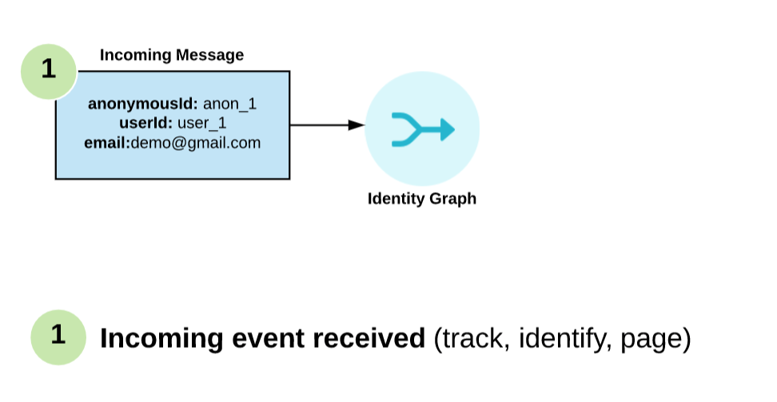
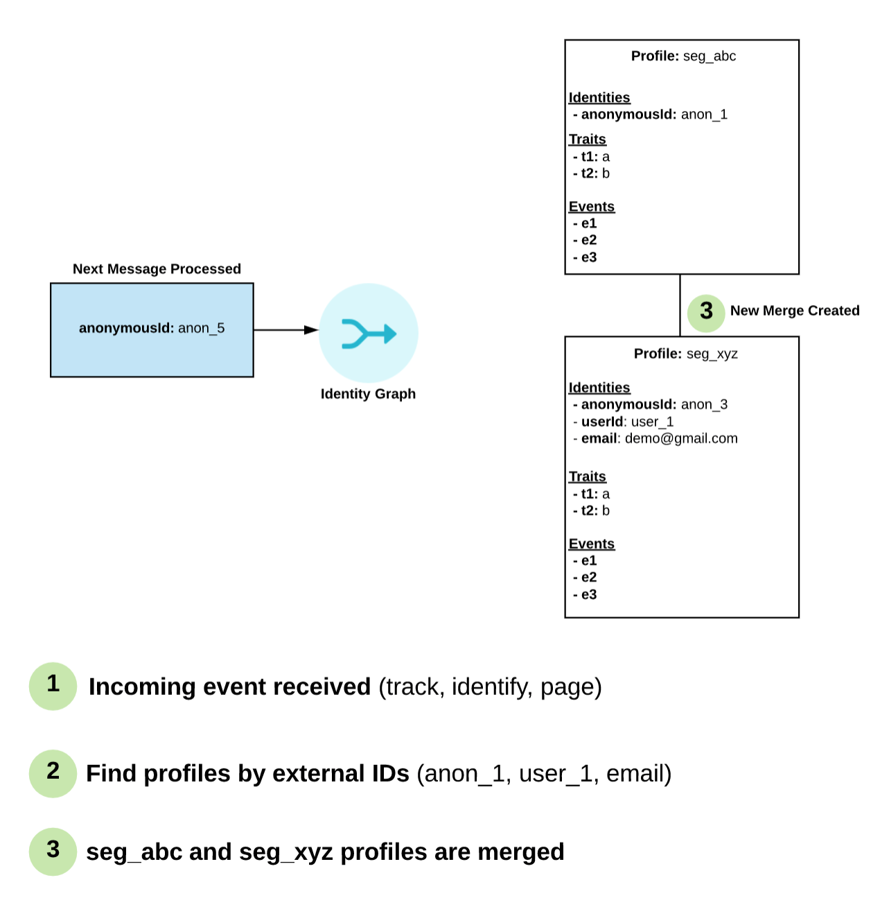

## Can I use the Profile API on the client-side?
For security reasons, Segment requires that the Profile API only be used server-side. The Profile API allows you to look up data about any user given an identifier (for example, email, `anonymousId`, or `userId`) and an authorized access secret. While this enables powerful personalization workflows, it could also let your customers' data fall into the wrong hands if the access secret were exposed on the client.

Instead, by creating an authenticated personalization endpoint server-side backed by the Personas Profile API, you can serve up personalized data to your users without the risk of their information falling into the wrong hands.


## Do you have an Audiences API?

You can add, remove, and modify audiences only by using the Personas in-app audience builder.

However, you can programmatically query the Profile API to determine if a user belongs to a particular audience because Personas creates a trait with the same name as your audience. For example, to determine if the user with an email address of `bob@example.com` is a member of your `high_value_users` audience, you could query the following profile API URL:

`https://profiles.segment.com/v1/namespaces/<namespace_id>/collections/users/profiles/email:bob@segment.com/traits?include=high_value_users`

The following response indicates that Bob is indeed a high-value user:

```json
{
  "traits": {
    "high_value_users": true,
  },
  "cursor": {
    "has_more": false,
  }
}
```

For more information on profile queries, visit the [Profile API documentation](/docs/personas/profile-api).

## Can I reuse audience keys?

Avoid using the same audience key twice, even if you've deleted the key's original audience. Downstream tools and Destinations might have trouble distinguishing between different audiences that at any point shared the same key.

## Does your identity model support multiple external ID types?

Yes, Identity Graph supports multiple external IDs.

Identity Graph automatically collects a rich set of external IDs without any additional code:

1. Device level IDs (ex: `anonymous_id`, `ios.idfa` and `android.id`)
2. Device token IDs (ex: `ios.push_token` and `android_push_token`)
3. User level IDs (ex: `user_id`)
4. Common external IDs (`email`)
5. Cross domain analytics IDs (`cross_domain_id`)

If you want Identity Graph to operate on a different custom ID, you can pass it in using `context.externalIds` on an `identify()` or `track()`. If you're interested in this feature, contact your CSM to discuss the best way to implement this feature.

## How do historical lookback windows work?

Personas allows you to compute new traits and audiences of your users based on their entire customer journey, and all historical data you've tracked with Segment.

When you create a new computed trait or audience, you include a lookback window that determines how far back into the past the trait or audiences will be computed.


Some important things to keep in mind when setting a lookback window:

Historical lookback windows are based on the event `timestamp` field.

Lookback windows are precise down to the hour, so a 90-day lookback window will include any events with a `timestamp` timestamp within the last 2,160 hours (24 hr/day * 90 days).

The trait and audience will automatically update going forward as historical events exceed the lookback window.

## How does Personas handle identity merging?
Each incoming event is analyzed and external IDs are extracted (`user_id`, `anonymous_id`, `email`). The simplified algorithm works as follows:

- Segment first searches the Identity Graph for incoming external IDs.
- If Segment find no users, it creates one.
- If one user is returned, then that user is chosen.
- If multiple users are returned, merge protection kicks in and checks the validity of all of the provided external IDs.
  - If the merge protection checks pass, Segment creates a new merge connection between those two users. The first user profile ever created becomes the parent profile, and all merged users become child profiles.
  - If the merge protection checks fail, Segment discards the lowest precedence external ID and re-run the algorithm.






## Is all matching deterministic, or is there any support for probabilistic matching?
All Profile matching is deterministic and based on first-party data that you've collected.

Segment doesn't support probabilistic matching. Most marketing automation use cases require 100% confidence that a user is who you think they are (sending an email, delivering a recommendation, and so on). The best way to support this is through a deterministic identity algorithm.

## Should I use Personas if I already have a marketing automation tool?
Personas pairs well with marketing automation tools on the Segment platform.

You can think of Personas as the brain on top of your raw data streams, synthesizing those event streams into profiles, relationships, clusters, and new insights about your users.

From there, your marketing, product, sales, and success teams have channels on which they can act on a user's needs.

They can contact you using livechat, email, push notification, or text. Success can better prioritize their support ticket in Zendesk, or hone in on the customer's problem faster. On the sales side, they can focus on the products a prospect is most engaged with, or focus on getting the customer on the right plan. Your product team can serve specific recommendations, based on that user's specific needs next time they visit your site.

Today, most businesses are forced to think about each channel as individual silos. With Personas, all channels — including your marketing automation tool — can be powered by the same, singular understanding of your users.

## What are Funnel Audiences?
Funnel Audiences allow you to use **strict, relative ordering** for your audience conditions. Common use cases for these audiences are Cart Abandonment (users that triggered the Product Added event but did not trigger the Order Completed event after the Product Added event occurred) and onboarding steps (users that Added Credit Card but did not Subscribe afterward).

To get started with Funnel Audiences, go to:

**Audiences > New > Select Funnel Condition** ("and then did not"/"and then did")

The funnel condition will now be relative to the parent condition.

The audience in the image below includes all users that have Product Added in the last week, but not Order Completed within a day of doing so.


**Important:** Funnel Audiences compute based on all instances of the parent event within the lookback period. This means that if you have a user that Product Added ⟶ Order Completed ⟶ Product Added, this user would be entered into the Abandoned Cart state despite having previously completed an order.

## What happens to conflicting and non-conflicting profile attributes?
If two merged user profiles contain conflicting profile attributes, Segment selects the newest, or last updated, attributes when querying the profile.

## What is Personas Merge Protection?
Personas merge protection algorithm protects your identity graph from unnecessary merges by finding and removing untrusted external IDs. Here's an example:


In this example, `anonymous_id: a1` is not reset during a `User Logout`. Without merge protection, Segment would merge `user_id u1` and `user_id u2`. Instead, the Merge Protection algorithm detects that such a merge would break user_id uniqueness and prevents the merge.

This is especially helpful for preventing "blob users" that are merged together by non-unique anonymous IDs or by common group emails like `team@company.com`.

## Which destinations support syncing the identity graph?
Most destinations on the Segment Platform are built up around a user model. They assume that a user will have a single userId. Further, most Destinations are not built to handle anonymous traffic.

By default, Segment doesn't sync the output of the Identity Graph to Destinations. However, Segment computed traits and audiences are based on the entire user profile, including anonymous and merged data. We sync the value of these computations (e.g. `blog_posts_ready_30_days: 10`) using all `userIds` on the profile.

For Destinations that support an `alias` call (for example, Mixpanel), you can emit an `alias` call on merge.

## What Sources can I sync to Personas?

The following list shows just some data sources you can sync to Personas:

- Website ([analytics.js](/docs/connections/sources/catalog/libraries/website/javascript/))
- Mobile SDKs ([ios](/docs/connections/sources/catalog/libraries/mobile/ios), [android](/docs/connections/sources/catalog/libraries/mobile/android), [amp](/docs/connections/sources/catalog/libraries/mobile/amp))
- Serverside libraries ([go](/docs/connections/sources/catalog/libraries/server/go), [node](/docs/connections/sources/catalog/libraries/server/node/), [java](/docs/connections/sources/catalog/libraries/server/java), [PHP](/docs/connections/sources/catalog/libraries/server/php/), [python](/docs/connections/sources/catalog/libraries/server/python), [ruby](/docs/connections/sources/catalog/libraries/server/ruby), [.NET](/docs/connections/sources/catalog/libraries/server/net))
- [Facebook Lead Ads](https://segment.com/docs/connections/sources/catalog/cloud-apps/facebook-lead-ads/)
- [Activecampaign](https://segment.com/docs/connections/sources/catalog/cloud-apps/activecampaign/)
- [Customer.io](https://segment.com/docs/connections/sources/catalog/cloud-apps/customer.io/)
- [Drip](https://segment.com/docs/connections/sources/catalog/cloud-apps/drip/)
- [Iterable](https://segment.com/docs/connections/sources/catalog/cloud-apps/iterable/)
- [Klaviyo](https://segment.com/docs/connections/sources/catalog/cloud-apps/klaviyo/)
- [Mailjet](https://segment.com/docs/connections/sources/catalog/cloud-apps/mailjet/)
- [Nudgespot](https://segment.com/docs/connections/sources/catalog/cloud-apps/nudgespot/)
- [Vero](https://segment.com/docs/connections/sources/catalog/cloud-apps/vero/)
- [Blueshift](https://segment.com/docs/connections/sources/catalog/cloud-apps/blueshift/)
- [Delighted](https://segment.com/docs/connections/sources/catalog/cloud-apps/delighted/)
- [Braze](https://segment.com/docs/connections/sources/catalog/cloud-apps/braze/)
- [Looker](https://segment.com/docs/connections/sources/catalog/cloud-apps/looker/)
- [Radar](https://segment.com/docs/connections/sources/catalog/cloud-apps/radar/)
- [Autopilot](https://segment.com/docs/connections/sources/catalog/cloud-apps/autopilothq/)
- [Friendbuy](https://segment.com/docs/connections/sources/catalog/cloud-apps/friendbuy/)


## Can I send audiences to multiple destination accounts?

Yes, Personas supports the ability to send an audience or computed trait to two or more accounts of the same partner. The most common use case is multiple Facebook, or Adwords ad accounts.


### What identifiers can the merged profile be queried/updated with?

Any of the external IDs can be used to query a profile. When a profile is requested, Segment traverses the merge graph and resolves all merged profiles. The result is a single profile, with the latest state of all traits, events, and identifiers.
