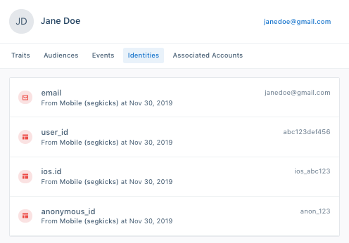
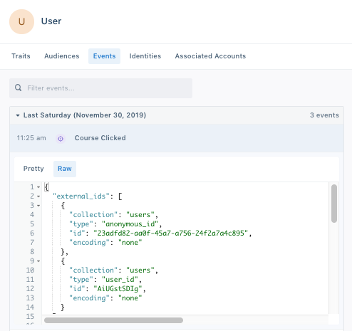

## Default ExternalIDs

The Identity Graph creates or merges profiles based on externalIDs. ExternalIDs will become the Identities attached to a User Profile in the User Explorer:



We automatically promote the following traits and IDs in track and identify calls to externalIDs:

| External ID Type      | Message Location in Track or Identify Call                            |
|-----------------------|-----------------------------------------------------------------------|
| anonymous_id          | anonymousId              |
| user_id               | userId                   |
| group_id              | groupId                  |
| cross_domain_id       | cross_domain_id                     |   
| email       | traits.email or context.traits.email                     |   
| android.id       | context.device.id when context.device.type = 'android'               |   
| ios.id       | context.device.id when context.device.type = 'ios'               |   
| android.push_token       | context.device.token when context.device.type = 'android'                 |   
| ios.push_token       | context.device.token when context.device.type = 'ios'                 |   
| android.idfa       | context.device.advertisingId when context.device.type = 'android' AND context.device.adTrackingEnabled = true                    |   
| ios.idfa       | context.device.advertisingId when context.device.type = 'ios' AND context.device.adTrackingEnabled = true
| ga_client_id       | context.integrations['Google Analytics'].clientId                     |   

## Custom ExternalIDs

Personas will automatically resolve identity for any other externalIDs that you bind to users - such as a phone number or any custom identifier that you support. As seen in the below example, you can send custom `externalIds` in the `context` object of any call to our API.

``` js
analytics.track('Subscription Upgraded', {
   plan: 'Pro',
   mrr: 99.99
}, {
  externalIds: [
    {
      id: '123-456-7890',
      type: 'phone',
      collection: 'users',
      encoding: 'none'
    }
  ]
})
```

Personas will automatically create a user (user_id: `use_123`)  with the custom externalId (phone: `123-456-7890`). Then, you query the users phone record by using the external id (phone: `123-456-7890`), or update this profile using that externalId going forward. (Note: externalIDs must be lower-case.)

## Viewing Promoted ExternalIDs

Users can view which externalIDs are promoted on each event by viewing the raw payload on Events in the User Profile in the "external_ids" object.

For example, the following user had anonymous_id and user_id promoted as identifiers from the Course Clicked track call:



## Example

Let's say a new anonymous user visits your Pricing page:

``` js
analytics.page('Pricing', {
  anonymousId: 'anon_123'
  title: 'Acme Pricing',
  url: 'https://acme.com/pricing',
  referrer: 'https://google.com/'
});
```

At this point, the Identity Graph will create a new user with external id (anonymous_id: `anon_123`) and a persistent and globally unique segment_id, in this case: `use_4paotyretuj4Ta2bEYQ0vKOq1e7`.


Any new events received with the same external id (anonymous_id: `anon_123`) will be appended to same user `use_4paotyretuj4Ta2bEYQ0vKOq1e7`.

Next, the user goes to a signup form and signs up:

``` js
analytics.track('User Signup', {
  userId: 'use_123',
  anonymousId: 'anon_123'
});
```

At this point, the Identity Graph associates external ID (user_id: `use_123`) with the same user `use_4paotyretuj4Ta2bEYQ0vKOq1e7`.

