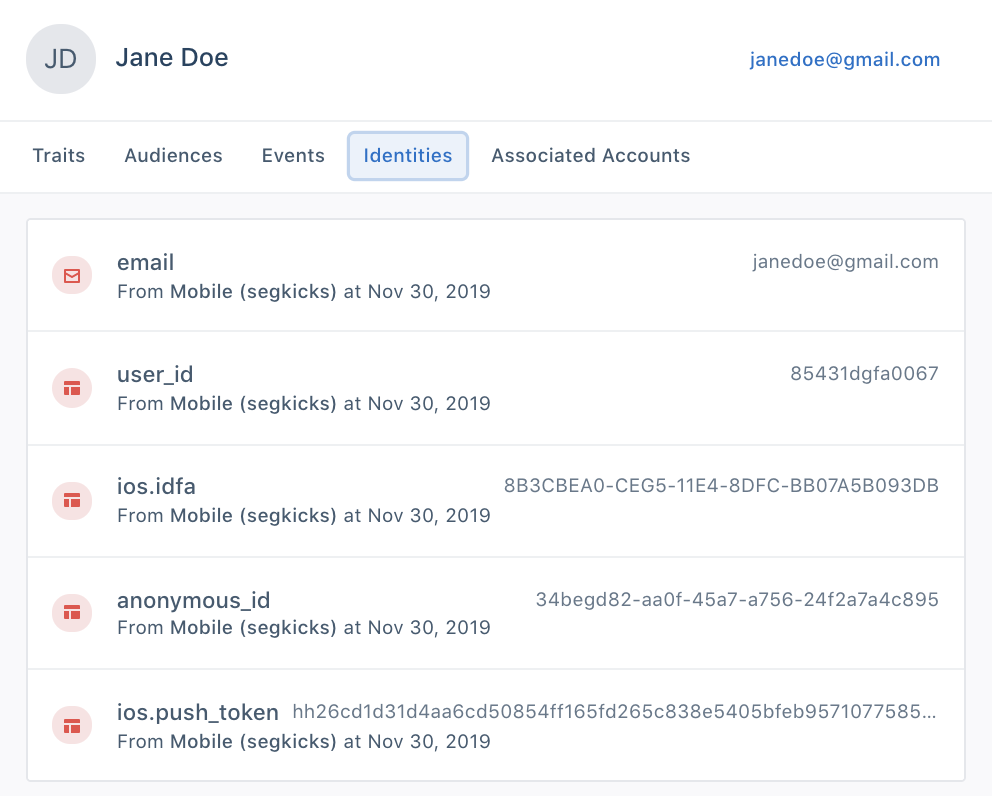
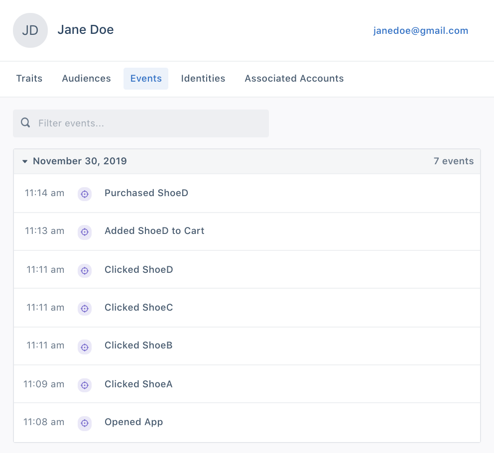
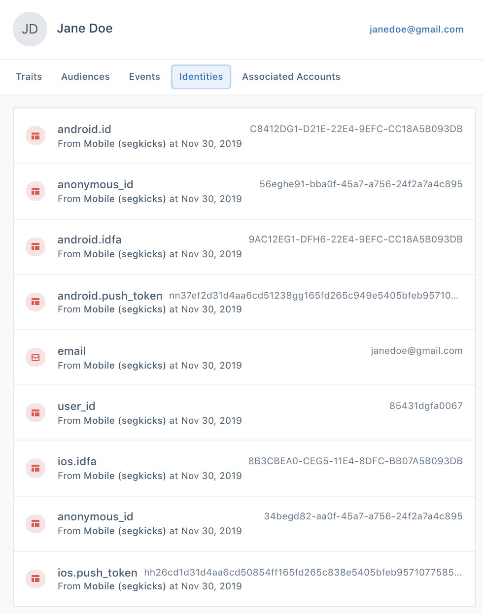
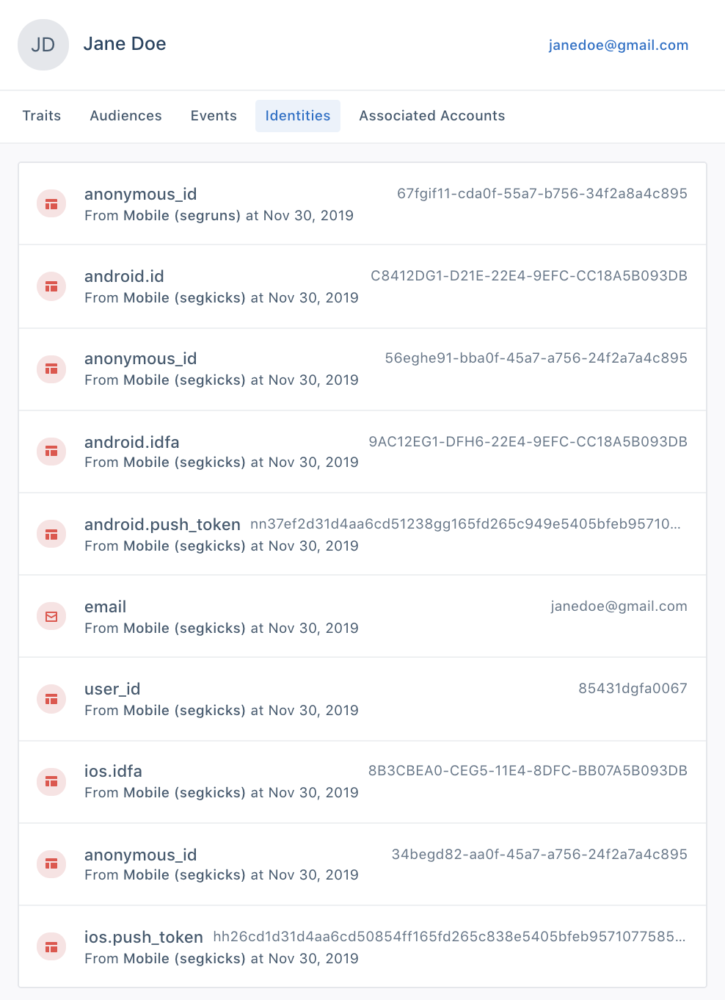
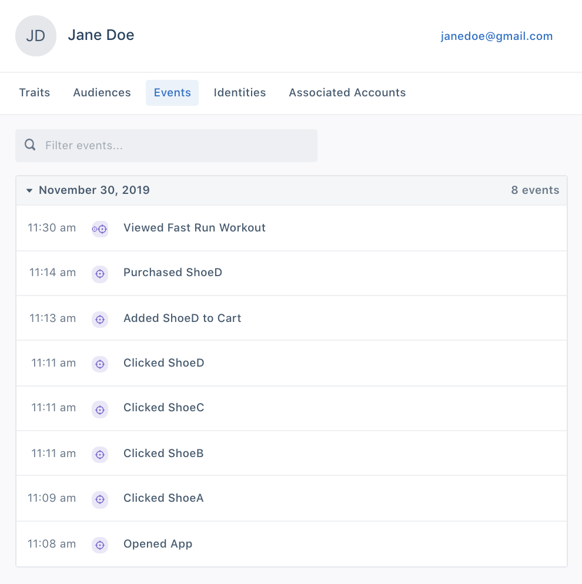

The Personas Identity Resolution feature helps to create a unified view of the user across devices, apps, and unique identifiers. Identity resolution is critical to understanding the customer journey at multiple touch points, which is central to a brand’s success in delivering personalized experiences to its customers at scale.

Let's take the example of a sneaker company called SegmentKicks which has an eCommerce app called SegKicks as well as a running app called SegRuns. We'll follow Jane Doe throughout her entire customer journey from an anonymous user to a registered buyer on one app, SegKicks, to her use of the same app on a different device, and finally to her use of a different app belonging to the same company, SegRuns.  

## Anonymous to Known Identification
Identity Resolution allows a company to link a customer's journey from pre-account creation to post-account activity. This is important to help a brand understand the behaviors that lead a user to convert from a window shopper in the discovery stage to a buyer with intent in the consideration and decision stage to the loyal return customer in the conversion and retention stage.

Let's take the following example using the eCommerce app, SegKicks:
1. Jane Doe downloads the app on her iPhone but does not yet register for an account.
``` js
{
  "anonymousId": "34begd82-aa0f-45a7-a756-24f2a7a4c895",
  "context": {
    "active": true,
    "app": {
      "build": "3.0.1.545",
      "name": "SegKicks",
      "version": "101"
    },
    "device": {
      "adTrackingEnabled": true,
      "advertisingId": "8B3CBEA0-CEG5-11E4-8DFC-BB07A5B093DB",
      "id": "B7311CF0-C21E-11E4-8DFC-BB07A5B093DB",
      "manufacturer": "Apple",
      "model": "iPhone7,2",
      "name": "maguro",
      "token": "hh26cd1d31d4aa6cd50854ff165fd265c838e5405bfeb9571077585b9d9eb559",
      "type": "ios"
    },
    "ip": "8.8.8.8",
    "library": {
      "name": "analytics.js",
      "version": "2.11.1"
    },
    "os": {
      "name": "iPhone OS",
      "version": "8.1.3"
    }
  },
  "event": "Opened App",
  "integrations": {},
  "originalTimestamp": "2019-11-30T19:11:08.249Z",
  "timestamp": "2019-11-30T19:11:08.249Z",
  "type": "track"
}
```

2. She then clicks on a few different types of shoes, ShoeA, ShoeB and ShoeC but does not add to them cart. Because she has not yet registered for an account, all of these events will be sent through with an anonymousID and an ios deviceID.  
``` js
{
  "anonymousId": "34begd82-aa0f-45a7-a756-24f2a7a4c895",
  "context": {
    "active": true,
    "app": {
      "build": "3.0.1.545",
      "name": "SegKicks",
      "version": "101"
    },
    "device": {
      "adTrackingEnabled": true,
      "advertisingId": "8B3CBEA0-CEG5-11E4-8DFC-BB07A5B093DB",
      "id": "B7311CF0-C21E-11E4-8DFC-BB07A5B093DB",
      "manufacturer": "Apple",
      "model": "iPhone7,2",
      "name": "maguro",
      "token": "hh26cd1d31d4aa6cd50854ff165fd265c838e5405bfeb9571077585b9d9eb559",
      "type": "ios"
    },
    "ip": "8.8.8.8",
    "library": {
      "name": "analytics.js",
      "version": "2.11.1"
    },
    "os": {
      "name": "iPhone OS",
      "version": "8.1.3"
    }
  },
  "event": "Clicked ShoeA",
  "integrations": {},
  "originalTimestamp": "2019-11-30T11:09:03.349Z",
  "timestamp": "2019-11-39T11:09:03.349Z",
  "type": "track"
}
```

3. She then decides to add ShoeD to her cart. Upon checkout, she creates a new user profile with her email and purchases the shoe. At the point of account creation she is assigned a userID and the events of her purchase are sent through with an email.

``` js
{
  "anonymousId": "34begd82-aa0f-45a7-a756-24f2a7a4c895",
  "channel": "mobile",
    "context": {
    "active": true,
    "app": {
      "build": "3.0.1.545",
      "name": "SegKicks",
      "version": "101"
    },
    "device": {
      "adTrackingEnabled": true,
      "advertisingId": "8B3CBEA0-CEG5-11E4-8DFC-BB07A5B093DB",
      "id": "B7311CF0-C21E-11E4-8DFC-BB07A5B093DB",
      "manufacturer": "Apple",
      "model": "iPhone7,2",
      "name": "maguro",
      "token": "hh26cd1d31d4aa6cd50854ff165fd265c838e5405bfeb9571077585b9d9eb559",
      "type": "ios"
    },
    "ip": "8.8.8.8",
    "library": {
      "name": "analytics.js",
      "version": "2.11.1"
    },
    "os": {
      "name": "iPhone OS",
      "version": "8.1.3"
    }
  },
  "originalTimestamp": "2019-11-30T11:14:03.349Z",
  "timestamp": "2019-11-30T11:14:03.349Z",
  "traits": {
    "name": "Jane Doe",
    "email": "janedoe@gmail.com",
    "plan": "premium",
    "logins": 1
  },
  "type": "identify",
  "userId": "85431dgfa0067",
  "version": "1.1"
}
```
By linking the original anonymous events to the her logged-in activity, the app's marketing team can now begin to map out her customer journey on a single app, understand her preferences and retarget her with highly personalized emails about the shoes she didn't complete purchasing.

Her identifiers will now contain the original anonymous_id, her email and her user_id:


Her final events will look like:


## Cross-Device Identification
Users often have many different touch points with a brand across different devices, such as viewing the e-commere.
Users can have multiple touch points with an app ecosystem through more than one device. For example, users might interact with an eCommerce app through both a native app and a web browser.

Let’s continue with the example of Jane Doe. She now views the same mobile app SegKicks on her Android phone as well.

Jane Doe logs into the Android phone with the same email janedoe@gmail.com.

```js
{
  "anonymousId": "56eghe91-bba0f-45a7-a756-24f2a7a4c895",
  "channel": "mobile",
    "context": {
    "active": true,
    "app": {
      "build": "3.0.1.545",
      "name": "SegKicks",
      "version": "101"
    },
    "device": {
      "adTrackingEnabled": true,
      "advertisingId": "9AC12EG1-DFH6-22E4-9EFC-CC18A5B093DB",
      "id": "C8412DG1-D21E-22E4-9EFC-CC18A5B093DB",
      "manufacturer": "Samsung",
      "model": "Galaxy, 8",
      "token": "nn37ef2d31d4aa6cd51238gg165fd265c949e5405bfeb9571077585b9d9eb559",
      "type": "android"
    },
    "ip": "8.8.8.8",
    "library": {
      "name": "analytics.js",
      "version": "2.11.1"
    },
    "os": {
      "name": "Android",
      "version": "4.2.3"
    }
  },
  "originalTimestamp": "2019-11-30T11:20:03.349Z",
  "timestamp": "2019-11-30T11:20:03.349Z",
  "traits": {
    "name": "Jane Doe",
    "email": "janedoe@gmail.com",
    "plan": "premium",
    "logins": 1
  },
  "type": "identify",
  "userId": "85431dgfa0067",
  "version": "1.1"
}
```

Her new User Profile identities will now also contain android.id, android.push_token, android.idfa and a new anonymous_id:


## Cross-App Identification
A company’s product ecosystem may also spread out across multiple apps. For example, SegmentKicks also has a running app SegRuns.

Now let’s view what happens when Jane Doe downloads the Android app SegRuns and views a workout:
```js
{
  "anonymousId": "56eghe91-bba0f-45a7-a756-24f2a7a4c895",
  "channel": "mobile",
    "context": {
    "active": true,
    "app": {
      "build": "3.0.1.545",
      "name": "SegKicks",
      "version": "101"
    },
    "device": {
      "adTrackingEnabled": true,
      "advertisingId": "9AC12EG1-DFH6-22E4-9EFC-CC18A5B093DB",
      "id": "C8412DG1-D21E-22E4-9EFC-CC18A5B093DB",
      "manufacturer": "Samsung",
      "model": "Galaxy, 8",
      "token": "nn37ef2d31d4aa6cd51238gg165fd265c949e5405bfeb9571077585b9d9eb559",
      "type": "android"
    },
    "ip": "8.8.8.8",
    "library": {
      "name": "analytics.js",
      "version": "2.11.1"
    },
    "os": {
      "name": "Android",
      "version": "4.2.3"
    }
  },
  "originalTimestamp": "2019-11-30T11:30:03.349Z",
  "timestamp": "2019-11-30T11:30:03.349Z",
  "traits": {
    "name": "Jane Doe",
    "email": "janedoe@gmail.com",
    "plan": "premium",
    "logins": 3
  },
  "type": "identify",
  "userId": "85431dgfa0067",
  "version": "1.1"
}
```

Her final identifiers now have a new anonymous_id from the SegRuns app:


Her final events now will look like:

