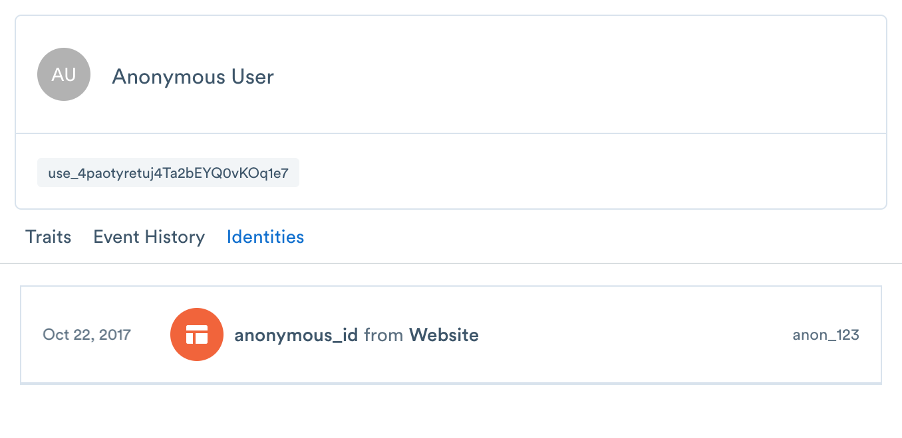

## Identity Graph

Identity Resolution is a major new upgrade to the Segment platform. The Segment Identity Graph merges the complete history of each customer into a single profile, no matter where they interact with your business. Identity Resolution allows you to understand a user's interaction across web, mobile, server, and third party partner touch-points in realtime, using an online and offline ID graph with support for cookie IDs, device IDs, emails, and custom external IDs. If you are sending the [group](/docs/spec/group) call, you can also understand user behavior at the account-level.


## Highlights
1. **Supports existing data** — no additional code or setup required
2. **Supports all channels** — stitches web + mobile + server + third party interactions into the same user
3. **Supports anonymous identity stitching** — by using merging child sessions into parent sessions
4. **Supports user:account relationships** - for b2b companies, generates a graph of relationships between users and accounts
5. **Realtime —** merges realtime data streams, tested at 50,000 resolutions/second with a P95 resolve duration of 7ms


## Technical Highlights
1. **Supports custom external IDs —** bring your own external IDs
2. **Customizable ID Rules** — allows you to enforce uniqueness on select external IDs and customize which external IDs and sources cause associations
3. **Merge Protection —** automatically detects and solves identity issues such as non unique anonymous IDs and the library problem using our priority trust algorithm
4. **Maintains persistent ID —** multiple external IDs get matched to one persistent ID.


## Identity Example

Let's say a new anonymous user visits your Pricing page:

```
analytics.page('Pricing', {
  anonymousId: 'anon_123'
  title: 'Acme Pricing',
  url: 'https://acme.com/pricing',
  referrer: 'https://google.com/'
});
```

At this point, the Identity Graph will create a new user with external id (anonymous_id: `anon_123`) and a persistent and globally unique segment_id, in this case: `use_4paotyretuj4Ta2bEYQ0vKOq1e7`.




Any new events received with the same external id (anonymous_id: `anon_123`) will be appended to same user `use_4paotyretuj4Ta2bEYQ0vKOq1e7`.


Next, the user goes to a signup form and signs up:

```
analytics.track('User Signup', {
  userId: 'use_123',
  anonymousId: 'anon_123'
});
```

At this point, the Identity Graph associates external ID (user_id: `use_123`) with the same user `use_4paotyretuj4Ta2bEYQ0vKOq1e7`.


And if you're going beyond customer data (the users collection), Personas will automatically resolve identity for any other external ID's that you bind to users - such as a phone number or any custom identifier that you support. As seen in the below example, you can send custom `externalIds` in the `context` object of any call to our API.

```
analytics.track('Subscription Upgraded', {
   plan: 'Pro',
   mrr: 99.99
}, {
  externalIds: [
    {
      id: '123-456-7890',
      type: 'phone',
      collection: 'users',
      encoding: 'none'
    }
  ]
})
```

Personas will automatically create a user (user_id: `use_123`)  with the custom externalId (phone: `123-456-7890`). Then, you query the users phone record by using the external id (phone: `123-456-7890`), or update this profile using that externalId going forward. (Note: externalIDs must be lower-case.) 
