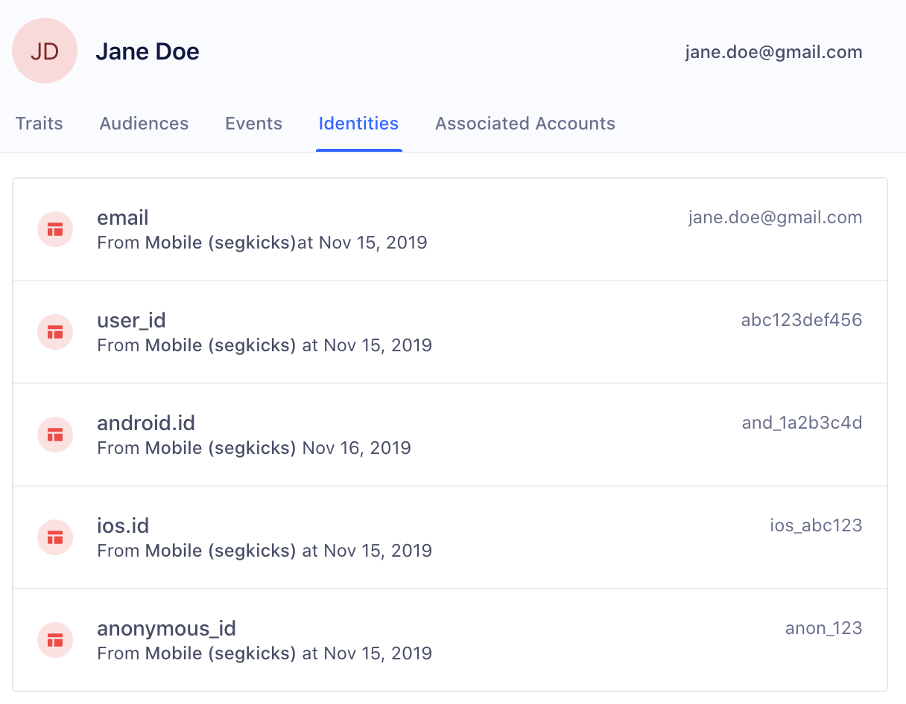
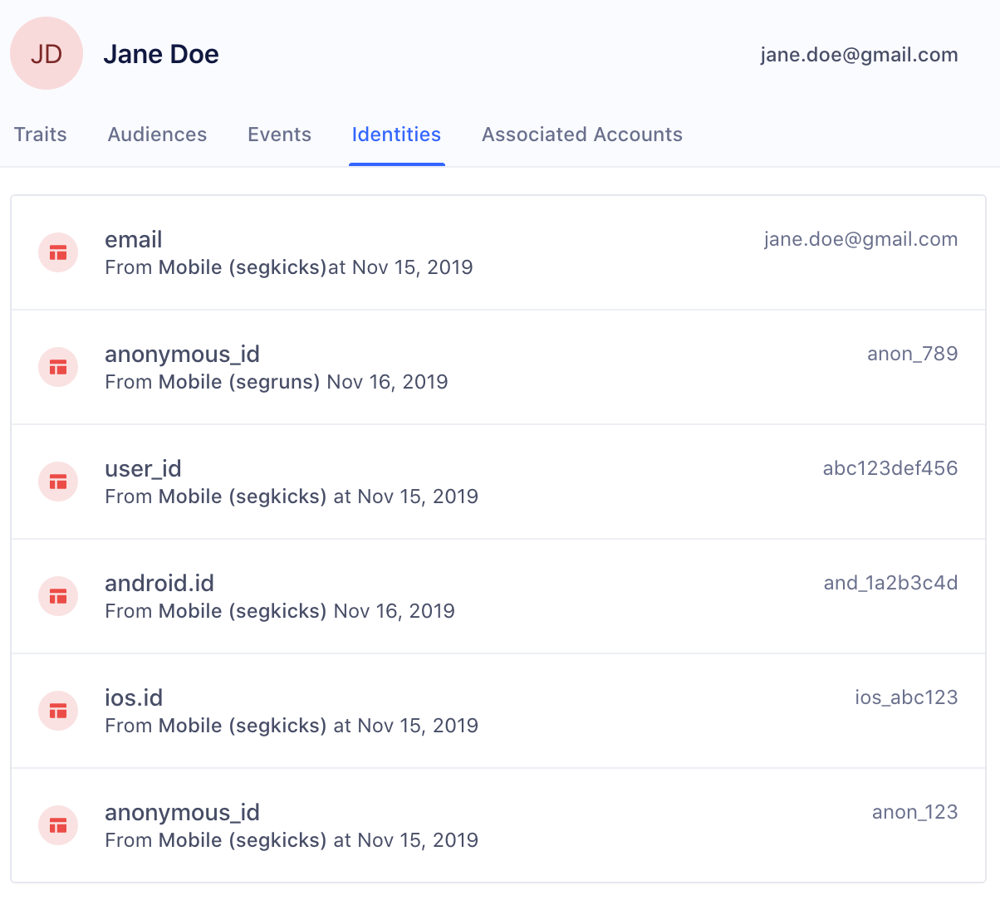

The Personas Identity Resolution feature helps to create a unified view of the user across devices, apps, and unique identifiers.

Let's take the example of a sneaker company called SegmentKicks which has an eCommerce app called SegKicks as well as a running app called SegRuns. We'll follow Jane Doe throughout her entire customer journey from an anonymous user to a registered buyer on one app, SegKicks, to her use of the same app on a different device, and finally to her use of a different app belonging to the same company, SegRuns.

## Anonymous to known identification
Identity Resolution can connect a user's anonymous behaviors to a user's post-account registration activity.

Let's take the following example using the eCommerce app, SegKicks:
1. Jane Doe downloads the app on her iPhone but doesn't yet register for an account.
``` js
{
  "anonymousId": "anon_123",
  "context": {
    "app": "SegKicks",
    "device": {
      "id": "ios_abc123",
      "type": "ios"
    },
  },
  "event": "App Opened",
  "type": "track"
}
```

2. She then clicks on a few different types of shoes, ShoeA, ShoeB, and ShoeC but doesn't add them to a cart. Because she hasn't yet registered for an account, all of these events will be sent through with an anonymousID and an ios deviceID.
``` js
{
  "anonymousId": "anon_123",
  "context": {
    "app": "SegKicks",
    "device": {
      "id": "ios_abc123",
      "type": "ios"
    },
  },
  "event": "ShoeA Clicked",
  "type": "track"
}
```

3. She then decides to add ShoeD to her cart. Upon checkout, she creates a new user profile with her email and purchases the shoe. At the point of account creation she is assigned a userID and the events of her purchase are sent through with an email.

``` js
{
  "anonymousId": "anon_123",
  "context": {
    "app": "SegKicks",
    "device": {
      "id": "ios_abc123",
      "type": "ios"
    },
  },
  "userId": "abc123def",
  "type": "identify"
}
```
By linking the original anonymous events to Jane's logged-in activity, the app's marketing team can now begin to map out her customer journey on a single app, understand her preferences, and retarget her with highly personalized emails about the shoes she didn't complete purchasing.

Her identifiers will now contain the original anonymous_id, her email, and her user_id:


## Cross-device identification
Users can have multiple touch points with an app ecosystem through more than one device. For example, users might interact with an eCommerce app through both a native app, a mobile browser, and a web browser.

Let's continue with the example of Jane Doe. She now views the same mobile app SegKicks on her Android phone as well.

Jane Doe logs into the Android phone with the same email janedoe@example.com.

```js
{
  "anonymousId": "anon_456",
  "context": {
    "app": "SegKicks",
    "device": {
      "id": "and_1a2b3c4d",
      "type": "android"
    },
  },
  "type": "identify",
  "userId": "abc123def"
}
```

Her new User Profile identities will now also contain android.id:


## Cross-app identification
A company's product ecosystem may also spread out across multiple apps. For example, SegmentKicks also has a running app SegRuns.

Now let's view what happens when Jane Doe downloads the Android app SegRuns and views a workout:

```js
{
  "anonymousId": "anon_789",
  "context": {
    "app": "SegRuns",
    "device": {
      "id": "and_1a2b3c4d",
      "type": "android"
    },
  },
  "type": "identify",
  "userId": "abc123def"
}
```

Her final identifiers now have a new anonymous_id from the SegRuns app:


## Conclusion
By combining the events throughout Jane's entire customer journey from anonymous to known user, cross-device, and cross-app identification, SegKicks and SegRuns can now work together to understand how to give Jane the best customer experience possible while increasing her LTV across the entire SegmentKicks ecosystem.

For example, if Jane looked at ShoeC on her iPhone and completed checkout for ShoeC on her Android, SegKicks will now know to exclude her from a cart abandonment email for ShoeC. This wouldn't be possible if SegKicks had only looked at her activity on the iPhone.

Additionally, most shoes need to be replaced every 300 to 400 miles. By understanding her activity on SegRuns, SegKicks will now be able to more effectively remind Jane to repurchase ShoeC or ShoeD once she's reached that mileage.
