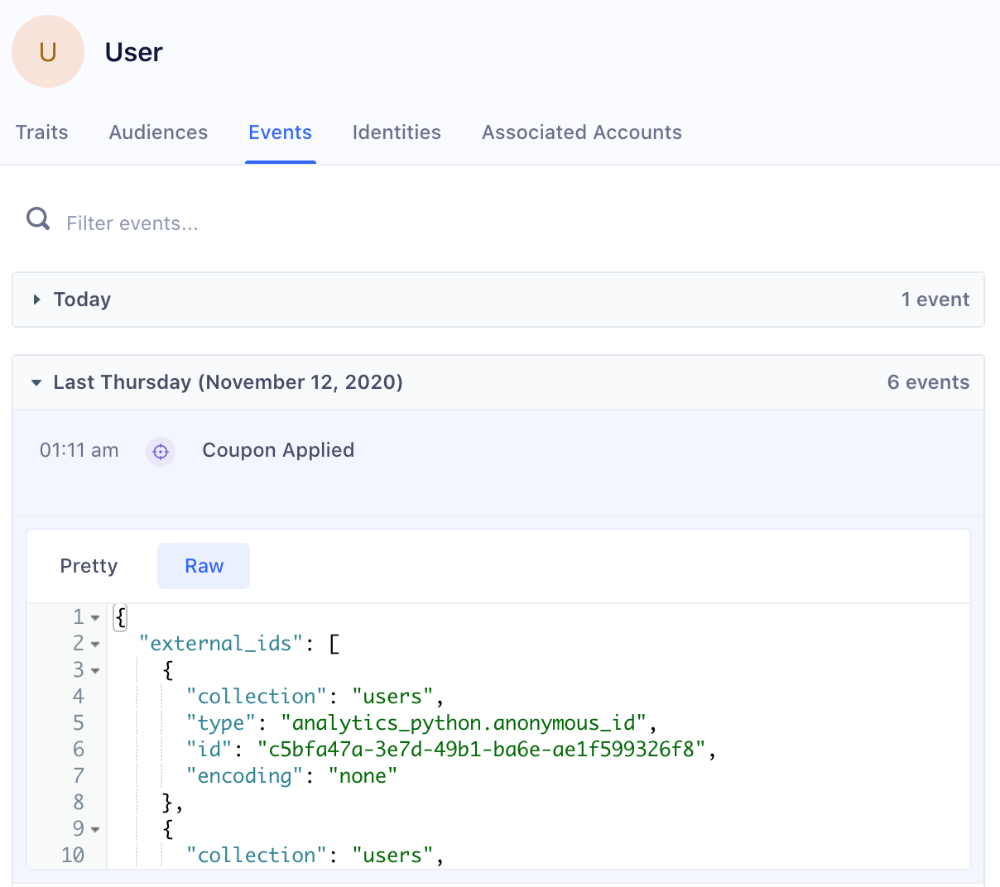
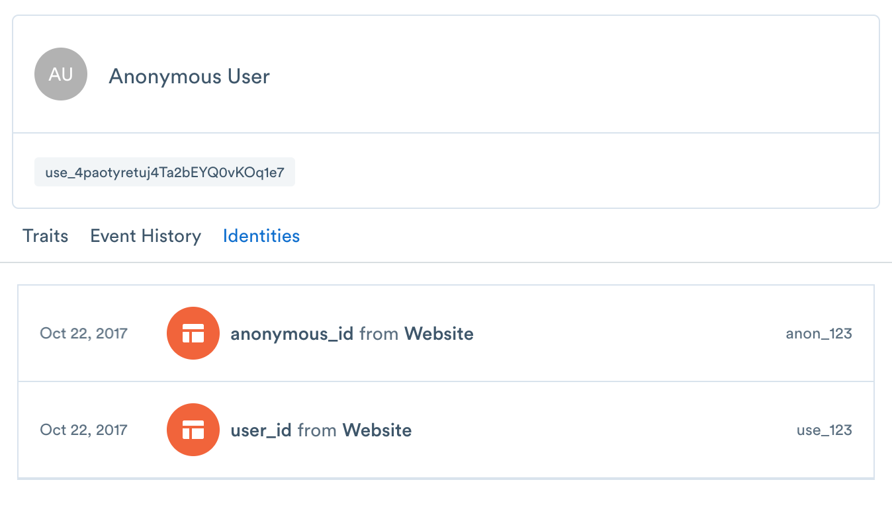

> note ""
> **NOTE:** The steps in this guide pertain to spaces created before September 27th, 2020. For spaces created after September 27th, 2020, please refer to the onboarding guide [here](/docs/personas/identity-resolution/identity-resolution-onboarding/).

## Default externalIDs

The Identity Graph creates or merges profiles based on externalIDs. ExternalIDs will become the Identities attached to a User Profile in the User Explorer:


Segment automatically promotes the following traits and IDs in track and identify calls to externalIDs:

| External ID Type   | Message Location in Track or Identify Call                                                                    |
| ------------------ | ------------------------------------------------------------------------------------------------------------- |
| user_id            | userId                                                                                                        |
| email              | traits.email or context.traits.email                                                                          |
| android.id         | context.device.id when context.device.type = 'android'                                                        |
| android.idfa       | context.device.advertisingId when context.device.type = 'android' AND context.device.adTrackingEnabled = true |
| android.push_token | context.device.token when context.device.type = 'android'                                                     |
| anonymous_id       | anonymousId                                                                                                   |
| cross_domain_id    | cross_domain_id when XID has been enabled for the workspace                                                   |
| ga_client_id       | context.integrations['Google Analytics'].clientId when explicitly captured by users                           |
| group_id           | groupId                                                                                                       |
| ios.id             | context.device.id when context.device.type = 'ios'                                                            |
| ios.idfa           | context.device.advertisingId when context.device.type = 'ios'     |
| ios.push_token     | context.device.token when context.device.type = 'ios'                                                         |


## Custom externalIDs

Personas will automatically resolve identity for any other externalIDs that you bind to users - such as a phone number or any custom identifier that you support. As seen in the below example, you can send custom `externalIds` in the `context` object of any call to Segment's API.

The four fields below (id, type, collection, encoding) are all required:

| Key        | Value                                                                        |
| ---------- | ---------------------------------------------------------------------------- |
| id         | value of the externalID                                                      |
| type       | name of externalID type (`app_id`, `ecommerce_id`, `shopify_id`, and more)   |
| collection | `users` if a user-level identifier or `accounts` if a group-level identifier |
| encoding   | `none`                                                                       |

As an example:

``` js
analytics.track('Subscription Upgraded', {
   plan: 'Pro',
   mrr: 99.99
}, {
  externalIds: [
    {
      id: '123-456-7890',
      type: 'phone',
      collection: 'users',
      encoding: 'none'
    }
  ]
})
```

Personas will automatically create a user (user_id: `use_123`)  with the custom externalId (phone: `123-456-7890`). Then, you query the users phone record by using the external id (phone: `123-456-7890`), or update this profile using that externalId going forward. (Note: externalIDs must be lower-case.)

## Viewing promoted externalIDs

Users can view which externalIDs are promoted on each event by viewing the raw payload on Events in the User Profile in the "external_ids" object.

For example, the following user had anonymous_id and user_id promoted as identifiers from the Course Clicked track call:



## Example

For example, a new anonymous user visits your Pricing page:

``` js
analytics.page('Pricing', {
  anonymousId: 'anon_123'
  title: 'Acme Pricing',
  url: 'https://acme.com/pricing',
  referrer: 'https://google.com/'
});
```

At this point, the Identity Graph will create a new user with external id (anonymous_id: `anon_123`) and a persistent and globally unique segment_id, in this case: `use_4paotyretuj4Ta2bEYQ0vKOq1e7`.


Any new events received with the same external id (anonymous_id: `anon_123`) are appended to same user `use_4paotyretuj4Ta2bEYQ0vKOq1e7`.

Next, the user goes to a sign up form and signs up:

``` js
analytics.track('User Signup', {
  userId: 'use_123',
  anonymousId: 'anon_123'
});
```

At this point, the Identity Graph associates external ID (user_id: `use_123`) with the same user `use_4paotyretuj4Ta2bEYQ0vKOq1e7`.

