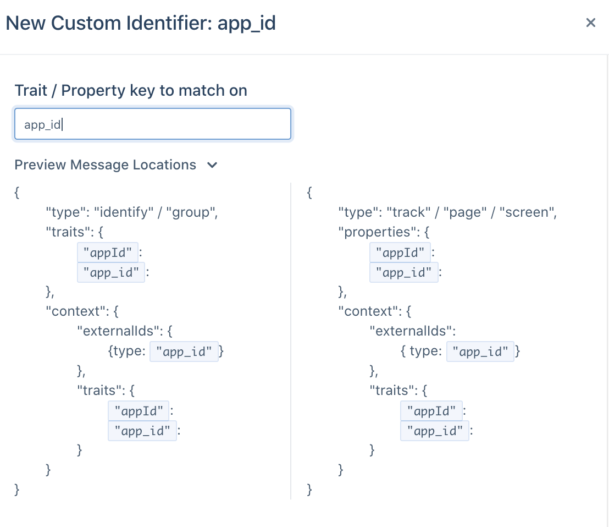
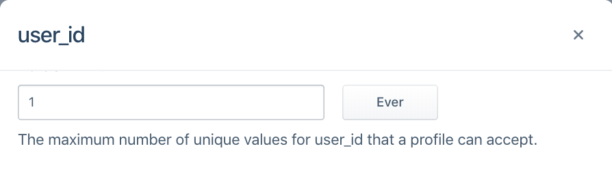
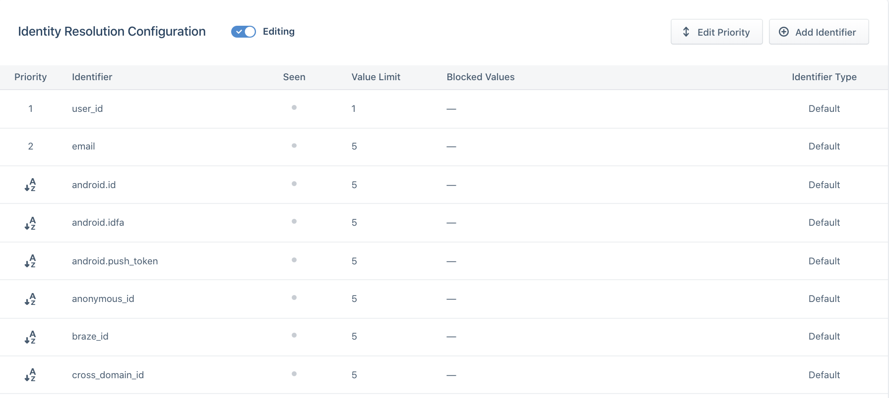

> note ""
> **NOTE:** This setup guide is intended for spaces created after October 5th, 2020. For spaces created before October 5th, 2020, please refer to the onboarding guide [here](/docs/personas/identity-resolution/identity-resolution-settings).

# Choosing Identity Resolution Settings
> note ""
> **NOTE:** Identity Resolution Settings can only be edited by workspace owners, Personas admins and users with the Identity Admin role.

Segment creates and merges user profiles based the Identity Resolution configuration of a space. We look for identifiers such as userId, anonymousId and email on incoming events and match them to existing profiles or create new ones. These identifiers will be displayed in the Identities tab of a User Profile in the User Explorer:

## Flat Matching Logic
When a new event flows into Personas, we look for any profiles that match any of the identifiers on the event.

There are three cases that can occur:

**Case One: Create New Profile**
When there are no pre-existing profiles that have matching identifiers to the event, we create a new user profile.

**Case Two: Add Event to Existing Profile**
When there is only one profile that matches all identifiers in an event, we attempt to map the traits, identifiers and events on the call to that existing profile. If there is an excess of any identifier on the final profile, we defer to our merge protection rules outlined below.

**Case Three: Merge Existing Profiles**
When there are multiple profiles that match the identifiers in an event, we attempt to merge profiles and first check our merge protection rules as outlined below.

# Identity Resolution Settings
Identity Admins are directed to first configure Identity Resolution Settings page to protect the identity graph from inaccurate merges and user profiles.

When creating a space, the first step is to choose an Identity Resolution configuration. If this is your first space, you will be given the option of choosing an Segment-suggested Out-of-the-Box configuration or choosing a custom identity resolution setup. All subsequent spaces will given the third option of importing settings from a different space.

## Out-of-the-Box
For most first-time Personas users, we recommend using the out-of-the-box configuration and answering a simple series of questions for a best-fit setup for your use-case.

Customers who have custom unique identifiers or do not have a canonical user_id will be automatically redirected to our Identity Resolution Settings page to complete their setup.

## Custom Rules
For customers who are familiar with identity or have custom identifiers, we recommend this option.

Customers will be redirected to our Identity Resolutions Settings page where they can add default or custom identifiers.

Segment's default 11 identifiers are listed below.

| External ID Type   | Message Location in Track or Identify Call                                                                    |
| ------------------ | ------------------------------------------------------------------------------------------------------------- |
| user_id            | userId                                                                                                        |
| email              | traits.email or context.traits.email                                                                          |
| android.id         | context.device.id when context.device.type = 'android'                                                        |
| android.idfa       | context.device.advertisingId when context.device.type = 'android' AND context.device.adTrackingEnabled = true |
| android.push_token | context.device.token when context.device.type = 'android'                                                     |
| anonymous_id       | anonymousId                                                                                                   |
| ga_client_id       | context.integrations['Google Analytics'].clientId when explicitly captured by users                           |
| group_id           | groupId                                                                                                       |
| ios.id             | context.device.id when context.device.type = 'ios'                                                            |
| ios.idfa           | context.device.advertisingId when context.device.type = 'ios' AND context.device.adTrackingEnabled = true     |
| ios.push_token     | context.device.token when context.device.type = 'ios'                                                         |

Customers can also add custom identifiers by providing the trait or property key to match on. Customers can preview the locations where Segment will look for the identifier. Segment will accept both camelCase and snake_case for context.traits, traits and properties, but will only accept lowercase types for identifiers in the context.externalIds object.

### Blocked Values
We recommend proactively blocking certain values from ever been used as identifiers. While these values will remain in the payload on the event itself, it will not be promoted to as an identifier Segment uses to determine user profiles.

This is extremely important when developers have a hard-coded value for fields like user_id during QA or development that then erroneously makes it production. This can cause hundreds of profiles to merge incorrectly and can have costly consequences when these spaces are already feeding data into a production email marketing tool or push notification tool downstream.

In the past, we've seen certain default values across many different customers cause mass amounts of profiles to merge incorrectly. Segment suggests that for every identifier, customers opt into automatically blocking the following suggested values:

| Value                         | Type            |
| ----------------------------- | --------------- |
| Zeroes and Dashes (`^[0\-]*$) | Pattern (REGEX) |
| -1                            | Exact Match     |
| null                          | Exact Match     |
| anonymous                     | Exact Match     |

Before sending data through, we also recommend adding any default hard-coded values that your team uses during the development process, such as `void` or `abc123`.

### Limit

Identity Admins can specify the total number of values allowed per identifier type on a profile during a certain period. This will vary depending on how companies define a user today. In most cases, companies rely on `user_id` to distinguish user profiles and Segment defaults to the following configurations:

| Identifier            | Limit |
| --------------------- | ----- |
| user_id               | 1     |
| all other identifiers | 5     |

There are specific cases that will deviate from this default. For example, a case where a user can have more than one user_id but only one email, like when a user is defined by both their shopify_id and an internal UUID. In this case, an example set up may be:

| Identifier            | Limit |
| --------------------- | ----- |
| email                 | 1     |
| user_id               | 2     |
| all other identifiers | 5     |

When choosing the limit on your identifier, ask the following questions about each of the identifiers you will send through to Segment:

1. Is it an immutable ID? An immutable ID, such as user_id, should only have `1 ever` per user profile.
2. Is it a constantly changing ID? A constantly changing ID, such as anonymous_id or ga_client_id, should be given a short sliding window, such as `5 weekly` or `5 monthly`, depending on how often your application automatically logs out the user.
3. Is it an ID that can be updated on a yearly basis? Most customers will have around 5 emails or devices at any one time, but can update these over time. For identifiers like email, android.id or ios.id, we might recommend using something like `5 annually`.

### Priority

The priority of an identifier is taken into consideration once we exceed the limit of any identifier on the final profile.

Let's take as an example a Personas space with the following Identity Resolution configurations:

| Identifier   | Limit | Priority |
| ------------ | ----- | -------- |
| user_id      | 1     | 1        |
| email        | 5     | 2        |
| anonymous_id | 5     | 3        |

A profile already exists with user_id `abc123` and email `jane@example1.com`. A new event comes in with new user_id `abc456` but the same email `jane@example1.com`. If we mapped this event to this profile, the resulting profile would then contain two user_ids and one email. Given that user_id has a limit of 1, we've now exceeded the limit of an identifier so check the priority of these identifiers. Because email and user_id are the only two identifiers on the event and email is ranked lower than user_id, we demote email as an identifier on the incoming event and try again.

At this point, the event searches for any profiles that match just the identifier user_id `abc456`. Now there are no existing profiles with this identifier, so a new profile is created with user_id `abc456`.

By default, we explicitly order user_id and email as rank `1` and `2`, respectively. All other identifiers are in alphabetical order beginning from rank `3`. This means that if the only identifiers ever sent in on events flowing into personas are user_id, email, anonymous_id and ga_client_id, the rank would be as follows:

| Identifier   | Priority |
| ------------ | -------- |
| user_id      | 1        |
| email        | 2        |
| anonymous_id | 3        |
| ga_client_id | 4        |

If a new android.id identifier appeared without first giving it explicit order, the order would automatically reshuffle to:

| Identifier   | Priority |
| ------------ | -------- |
| user_id      | 1        |
| email        | 2        |
| android.id   | 3        |
| anonymous_id | 4        |
| ga_client_id | 5        |

Thus, if you require an explicit order for all identifiers, configure this in the Identity Resolution settings page before sending in events.

When choosing the priority of your identifier, ask the following questions about each of the identifiers you will send through to Segment:

1. Is it an immutable ID? An immutable ID, such as user_id, should be prioritized highest.
2. Are they unique IDs? Unique IDs such as email should be prioritized higher over possibly shared identifiers like android.id or ios.id.
3. Does it temporarily identify a user? Identifiers such as anonymous_id, ios.idfa, ga_client_id are constantly updated or expired for a user. Generally speaking, these should rank lower than identifiers that permanently identify a user.

## Importing from an Existing Space
This option is only available to new spaces once the initial Dev space has been created. We recommend this option when identity settings have been validated as correct in the initial Dev space and should be copied into the Prod space.

# Connecting a Source
Once Identity Resolution Settings are configured, the next step is to connect a source to the Personas space.

# Creating an Audience
Once the source is connected, Personas will begin creating user profiles based off of replayed and newly incoming data.

The next step, which is important especially in the Dev space, is to create an audience to ensure that user profiles have populated correctly and that the identity resolution settings follow expected business logic.

For example, if there should be 100,000 distinct users who have a user_id, this would be a great way to validate that the identity resolution settings have calculated profiles correctly.

Users can learn more about creating audiences and traits [here](/docs/personas/audiences.md).
