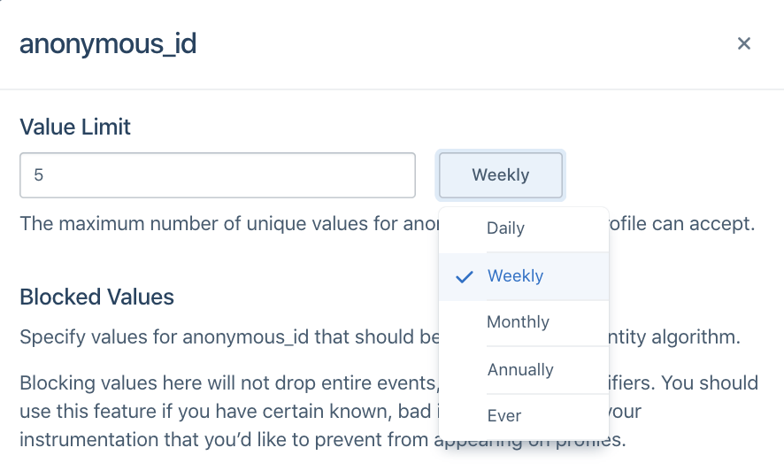

> note ""
> **NOTE:** The steps in this guide pertain to spaces created after **October 5th, 2020**. For spaces created before **October 5th, 2020**, please refer to [Identity Resolution Settings](/docs/personas/identity-resolution/identity-resolution-settings).

> note ""
> **NOTE:** Workspace owners, Personas administrators, and users with the Identity Admin role can edit Identity Resolution Settings.

Segment creates and merges user profiles based on a space's Identity Resolution configuration. Segment searches for identifiers such as `userId`, `anonymousId`, and `email` on incoming events and matches them to existing profiles or creates new profiles. These identifiers display in the Identities tab of a User Profile in the User Explorer:

### Flat matching logic

When Personas receives a new event, Segment looks for profiles that match any of the identifiers on the event.

Based on the existence of a match, one of three actions can occur:

**1: Create a new profile**
When there are no pre-existing profiles that have matching identifiers to the event, Segment creates a new user profile.

**2: Add to existing profile**
When there is one profile that matches all identifiers in an event, Segment attempts to map the traits, identifiers, and events on the call to that existing profile. If there is an excess of any identifier on the final profile, Segment defers to the Identity Resolution rules outlined below.

**3: Merge existing profiles**
When there are multiple profiles that match the identifiers in an event, Segment checks the Identity Resolution rules outlined below, and attempts to merge profiles.

## Identity Resolution settings

Identity Admins should first configure Identity Resolution Settings to protect the identity graph from inaccurate merges and user profiles.

During the space creation process, the first step is to choose an Identity Resolution configuration. If this is your first space, you have the option to choose a Segment-suggested Out-of-the-Box configuration or a custom Identity Resolution setup. All other spaces have a third option of importing settings from a different space.

### Out-of-the-Box

For most first-time Personas users, Segment recommends that you use the out-of-the-box configuration and answer a short series of questions for a best-fit setup for your use-case.

If you have custom unique identifiers or don't have a canonical `user_id`, you're automatically redirected to the Identity Resolution Settings page to complete your setup.

### Custom rules

If you're familiar with identity or have custom identifiers, Segment recommends that you select Custom Rules.

Segment redirects you to the Identity Resolution Settings page where you can add Default Identifiers or Custom Identifiers.

Segment's 11 default are:

| External ID Type     | Message Location in Track or Identify Call                                                                    |
| -------------------- | ------------------------------------------------------------------------------------------------------------- |
| `user_id`            | userId                                                                                                        |
| `email`              | traits.email or context.traits.email                                                                          |
| `android.id `        | context.device.id when context.device.type = 'android'                                                        |
| `android.idfa`       | context.device.advertisingId when context.device.type = 'android' AND context.device.adTrackingEnabled = true |
| `android.push_token` | context.device.token when context.device.type = 'android'                                                     |
| `anonymous_id`       | anonymousId                                                                                                   |
| `ga_client_id`       | context.integrations['Google Analytics'].clientId when explicitly captured by users                           |
| `group_id `          | groupId                                                                                                       |
| `ios.id `            | context.device.id when context.device.type = 'ios'                                                            |
| `ios.idfa`           | context.device.advertisingId when context.device.type = 'ios' AND context.device.adTrackingEnabled = true     |
| `ios.push_token`     | context.device.token when context.device.type = 'ios'                                                         |

You can also provide a trait or property key to match on to add custom identifiers. You can preview the locations where Segment looks for the identifier. Segment accepts both camelCase and snake_case for context.traits, traits, and properties, but accepts lowercase types for identifiers only in the context.externalIds object.

#### Blocked values

Segment recommends that you proactively prevent using certain values as identifiers. While these values remain in the payload on the event itself, it is not promoted to an identifier Segment uses to determine user profiles.

This is important when developers have a hard-coded value for fields like `user_id` during QA or development that then erroneously make it to production. This may cause hundreds of profiles to merge incorrectly and can have costly consequences if these spaces already feed data into a production email marketing tool or push notification tool downstream.

In the past, Segment has seen certain default values that cause large amounts of profiles to merge incorrectly. Segment suggests that for every identifier, customers opt into automatically blocking the following suggested values:

| Value                         | Type            |
| ----------------------------- | --------------- |
| Zeroes and Dashes (^[0-]*$)   | Pattern (REGEX) |
| -1                            | Exact Match     |
| null                          | Exact Match     |
| anonymous                     | Exact Match     |

Before sending data through, Segment also recommends that you add any default hard-coded values that your team uses during the development process, such as `void` or `abc123`.

#### Limit

Identity Admins can specify the total number of values allowed per identifier type on a profile during a certain period. For example, in the image below, the `anonymous_id` field has a limit of **5 Weekly**.

This will vary depending on how companies define a user today. In most cases, companies rely on `user_id` to distinguish user profiles and Segment defaults to the following configurations:

| Identifier            | Limit |
| --------------------- | ----- |
| user_id               | 1     |
| all other identifiers | 5     |

Specific cases may deviate from this default. For example, a case where a user can have more than one `user_id` but one email, like when `shopify_id` and an internal UUID define a user. In this case, an example configuration may be:

| Identifier            | Limit |
| --------------------- | ----- |
| email                 | 1     |
| user_id               | 2     |
| all other identifiers | 5     |

When you choose the limit on an identifier, ask the following questions about each of the identifiers you send to Segment:

1. Is it an immutable ID? An immutable ID, such as `user_id`, should have `1 ever` per user profile.
2. Is it a constantly changing ID? A constantly changing ID, such as `anonymous_id` or `ga_client_id`, should have a short sliding window, such as **5 weekly** or **5 monthly**, depending on how often your application automatically logs out the user.
3. Is it an ID that updates on a yearly basis? Most customers will have around five emails or devices at any one time, but can update these over time. For identifiers like `email`, `android.id`, or `ios.id`, Segment recommends a longer limit like **5 annually**.

#### Priority

Segment considers the priority of an identifier once that identifier exceeds the limit on the final profile.

For example, consider a Personas space with the following Identity Resolution configurations:

| Identifier   | Limit | Priority |
| ------------ | ----- | -------- |
| user_id      | 1     | 1        |
| email        | 5     | 2        |
| anonymous_id | 5     | 3        |

A profile already exists with `user_id` **abc123** and `email` **jane@example1.com**. A new event comes in with new `user_id` **abc456** but the same `email` **jane@example1.com**.

If this event maps to this profile, the resulting profile would then contain two `user_id` values and one `email`. Given that `user_id` has a limit of 1, this exceeds the limit of that identifier. As a result, Segment checks the priority of the `user_id` identifier. Because `email` and `user_id` are the two identifiers on the event and `email` ranks lower than `user_id`, Segment demotes `email` as an identifier on the incoming event and tries again.

At this point, the event searches for any profiles that match just the identifier user_id `abc456`. Now there are no existing profiles with this identifier, so Segment creates a new profile with user_id `abc456`.

By default, Segment explicitly orders user_id and email as rank `1` and `2`, respectively. All other identifiers are in alphabetical order beginning from rank `3`. This means that if the identifiers sent with events flowing into Personas are user_id, email, anonymous_id, and ga_client_id, the rank would be as follows:

| Identifier   | Priority |
| ------------ | -------- |
| user_id      | 1        |
| email        | 2        |
| anonymous_id | 3        |
| ga_client_id | 4        |

If a new android.id identifier appeared without first giving it explicit order, the order would automatically reshuffle to:

| Identifier   | Priority |
| ------------ | -------- |
| user_id      | 1        |
| email        | 2        |
| android.id   | 3        |
| anonymous_id | 4        |
| ga_client_id | 5        |

If you require an explicit order for all identifiers, configure this in the Identity Resolution Settings page before sending in events.

When choosing the priority of your identifier, ask the following questions about each of the identifiers you send to Segment:

1. Is it an immutable ID? Give immutable IDs, such as user_id, highest priority.
2. Are they unique IDs? Give Unique IDs such as email higher priority than possibly shared identifiers like android.id or ios.id.
3. Does it temporarily identify a user? Identifiers such as anonymous_id, ios.idfa, and ga_client_id are constantly updated or expired for a user. Generally speaking, rank these lower than identifiers that permanently identify a user.

### Importing from an existing space

This option is available to new spaces after you create an initial Dev space. Segment recommends this option when identity settings are validated as correct in the initial Dev space and should be copied into the Production space.

You can review the identifiers, priorities, limits, and blocked values before you complete the import.

## Connect a source

After you configure Identity Resolution settings, the next step is to connect a [source](/docs/connections/sources/) to the Personas space.

## Create an Audience

After you connect a source, Personas creates user profiles based off of replayed and newly incoming data.

The next step, which is important in the Dev space, is to create an audience to ensure that user profiles have populated correctly and that the Identity Resolution settings follow expected business logic.

For example, if there should be 100,000 distinct users who have a `user_id`, this would be a great way to validate that the Identity Resolution settings have calculated profiles correctly.

For more information about how to create audiences and traits, see Segment's [Audiences docs](/docs/personas/audiences/).
