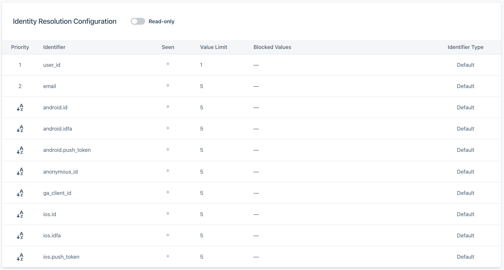
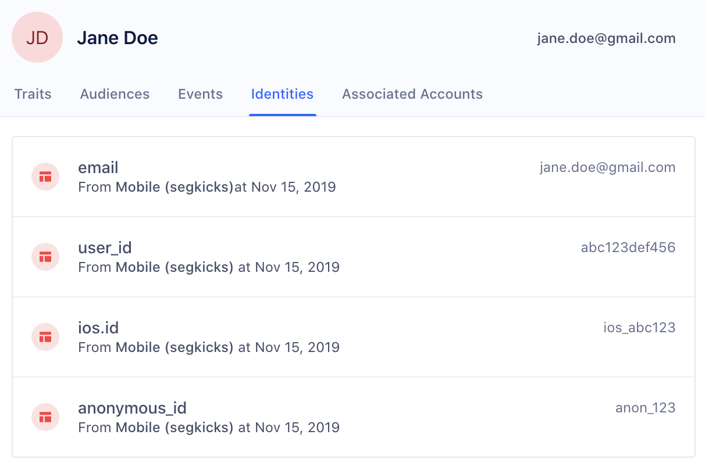
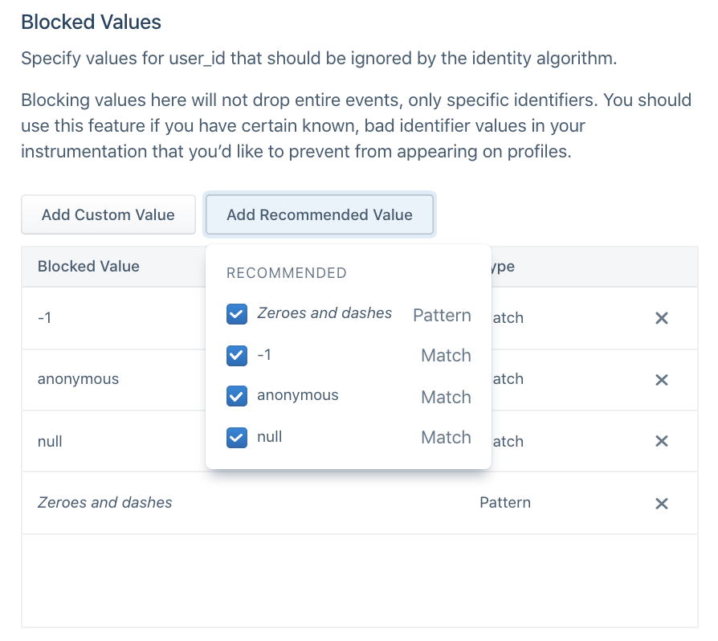
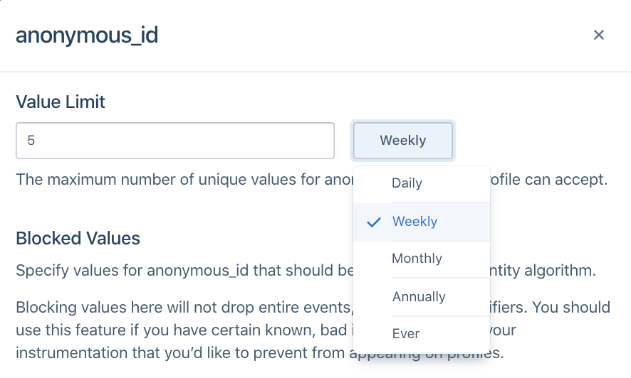
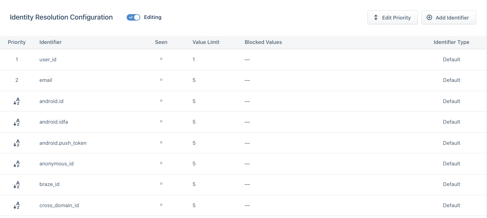

> note ""
> **NOTE:** The steps in this guide pertain to spaces created before September 27th, 2020. For spaces created after September 27th, 2020, please refer to the onboarding guide [here](/docs/personas/identity-resolution/identity-resolution-onboarding/).

## Configure Identity Graph rules

Before you connect a source to your Personas space, Segment recommends that you first review the default Identity settings and configure custom rules as needed. Segment applies configuration updates to all *new* data flowing through the space after you save your changes. As a result, if this is your first time setting up your Identity Graph, Segment recommends that you get started with a *Dev* space [here](/docs/personas/identity-resolution/personas-space-set-up/).

> note ""
> **NOTE:** Workspace owners and users with the Identity Admin role can edit the Identity Resolution table.



## ExternalIDs

Segment creates and merges user profiles based on externalIDs used as identifiers. You can view these externalIDs in the Identities tab of a User Profile in the User Explorer:



By default, Segment promotes the following traits and IDs in track and identify calls to externalIDs:

| External ID Type   | Message Location in Track or Identify Call                                                                    |
| ------------------ | ------------------------------------------------------------------------------------------------------------- |
| user_id            | userId                                                                                                        |
| email              | traits.email or context.traits.email                                                                          |
| android.id         | context.device.id when context.device.type = 'android'                                                        |
| android.idfa       | context.device.advertisingId when context.device.type = 'android' AND context.device.adTrackingEnabled = true |
| android.push_token | context.device.token when context.device.type = 'android'                                                     |
| anonymous_id       | anonymousId                                                                                                   |
| braze_id           | context.Braze.braze_id or context.Braze.braze_id when Braze is connected as a destination                     |
| cross_domain_id    | cross_domain_id when XID is enabled for the workspace                                                         |
| ga_client_id       | context.integrations['Google Analytics'].clientId when explicitly captured by users                           |
| group_id           | groupId                                                                                                       |
| ios.id             | context.device.id when context.device.type = 'ios'                                                            |
| ios.idfa           | context.device.advertisingId when context.device.type = 'ios' AND context.device.adTrackingEnabled = true     |
| ios.push_token     | context.device.token when context.device.type = 'ios'                                                         |

You'll notice that these identifiers have the *Default* label next to it under *Identifier Type*.

To create your own custom externalID, click *Add Identifier*, and add the following:
- Identifier Name
- Value Limit
- Blocked Values

These custom identifiers must be sent in the custom `externalIds` field in the `context` object of any call to the Segment API. The four fields below are all required:

| Key        | Value                                                                        |
| ---------- | ---------------------------------------------------------------------------- |
| id         | value of the externalID                                                      |
| type       | name of externalID type (`app_id`, `ecommerce_id`, `shopify_id`, and more)   |
| collection | `users` if a user-level identifier or `accounts` if a group-level identifier |
| encoding   | `none`                                                                       |

The following example payload adds a custom `phone` externalID type:

``` js
analytics.track('Subscription Upgraded', {
   plan: 'Pro',
   mrr: 99.99
}, {
  externalIds: [
    {
      id: '123-456-7890',
      type: 'phone',
      collection: 'users',
      encoding: 'none'
    }
  ]
})
```

Segment recommends that you add custom externalIDs to the Identity Resolution table *before* events containing this identifier flow through the space. Once an event with a new type of externalID flows into the space, the externalID is automatically added to the table if it wasn't manually added. When the externalID is automatically added, it defaults to the preset priority and limit, as explained below.

## Flat matching logic
When a new event flows into Personas, Segment looks for profiles that match any of the identifiers on the event.

Based on the existence of a match, one of three actions can occur:

**1: Create a new profile**
When there are no pre-existing profiles that have matching identifiers to the event, Segment creates a new user profile.

**2: Add to existing profile**
When there is one profile that matches all identifiers in an event, Segment attempts to map the traits, identifiers, and events on the call to that existing profile. If there's an excess of any identifier on the final profile, Segment defers to the Identity Resolution rules outlined below.

**3: Merge existing profiles**
When there are multiple profiles that match the identifiers in an event, Segment checks the Identity Resolution rules outlined below, and attempts to merge profiles.

One common example of a use-case that can cause inaccurate merges is the Shared iPad setup. For example, many companies now have iPads available in-store for customers to register for an account or submit order information. If different users submit information on the same device, there will now be multiple events sent with the same deviceID. Without Identity Resolution rules in place, Segment might see all these different users merged into the same user profile based on this common identifier.

Segment's three Identity Resolution rules allow Identity Admins to block incorrect values from causing incorrect merges, to set the maximum number of values allowed per externalID, and to customize the priority of these externalIDs.

## Identity Resolution rules
The following rules exist to increase the likelihood that identities are resolved correctly.

### Blocked values
Segment recommends that you proactively block certain values from being used as identifiers. While these values will remain in the payload on the event itself, they are not promoted to the externalID object Segment uses to determine user profiles.

This is important when developers have a hard-coded value for fields like user_id during QA or development that then erroneously makes it production. This can cause hundreds of profiles to merge incorrectly and can have costly consequences when these spaces are already feeding data into a production email marketing tool or push notification tool downstream.

In the past, certain default values cause large amounts of profiles to merge incorrectly. Segment suggests that for every externalID, customers opt into automatically blocking the following suggested values:

| Value                         | Type            |
| ----------------------------- | --------------- |
| Zeroes and Dashes (^[0-]*$)   | Pattern (REGEX) |
| -1                            | Exact Match     |
| null                          | Exact Match     |
| anonymous                     | Exact Match     |



Before sending data through, Segment also recommends adding any default hard-coded values that your team uses during the development process, such as `void` or `abc123`.

### Limit

Identity Admins can specify the total number of values allowed per identifier type on a profile during a certain period. For example, in the image below, the `anonymous_id` field has a limit of **5 Weekly**.


This will vary depending on how companies define a user today. In most cases, companies rely on `user_id` to distinguish user profiles and Segment defaults to the following configurations:

| Identifier            | Limit |
| --------------------- | ----- |
| user_id               | 1     |
| all other identifiers | 5     |

Specific cases may deviate from this default. For example, a case where a user can have more than one `user_id` but one email, like when `shopify_id` and an internal UUID define a user. In this case, an example configuration may be:

| Identifier            | Limit |
| --------------------- | ----- |
| email                 | 1     |
| user_id               | 2     |
| all other identifiers | 5     |

When you choose the limit on an identifier, ask the following questions about each of the identifiers you send to Segment:

1. Is it an immutable ID? An immutable ID, such as `user_id`, should have `1 ever` per user profile.
2. Is it a constantly changing ID? A constantly changing ID, such as `anonymous_id` or `ga_client_id`, should have a short sliding window, such as **5 weekly** or **5 monthly**, depending on how often your application automatically logs out the user.
3. Is it an ID that updates on a yearly basis? Most customers will have around five emails or devices at any one time, but can update these over time. For identifiers like `email`, `android.id`, or `ios.id`, Segment recommends a longer limit like **5 annually**.

### Priority

Segment considers the priority of an identifier once that identifier exceeds the limit on the final profile.

For example, consider a Personas space with the following Identity Resolution configurations:

| Identifier   | Limit | Priority |
| ------------ | ----- | -------- |
| user_id      | 1     | 1        |
| email        | 5     | 2        |
| anonymous_id | 5     | 3        |

A profile already exists with `user_id` **abc123** and `email` **jane@example1.com**. A new event comes in with new `user_id` **abc456** but the same `email` **jane@example1.com**.

If this event maps to this profile, the resulting profile would then contain two `user_id` values and one `email`. Given that `user_id` has a limit of 1, this exceeds the limit of that identifier. As a result, Segment checks the priority of the `user_id` identifier. Because `email` and `user_id` are the two identifiers on the event and `email` ranks lower than `user_id`, Segment demotes `email` as an identifier on the incoming event and tries again.

At this point, the event searches for any profiles that match just the identifier user_id `abc456`. Now there are no existing profiles with this identifier, so Segment creates a new profile with user_id `abc456`.

By default, Segment explicitly orders user_id and email as rank `1` and `2`, respectively. All other identifiers are in alphabetical order beginning from rank `3`. This means that if the identifiers sent with events flowing into personas are user_id, email, anonymous_id, and ga_client_id, the rank would be as follows:

| Identifier   | Priority |
| ------------ | -------- |
| user_id      | 1        |
| email        | 2        |
| anonymous_id | 3        |
| ga_client_id | 4        |

If a new android.id identifier appeared without first giving it explicit order, the order would automatically reshuffle to:

| Identifier   | Priority |
| ------------ | -------- |
| user_id      | 1        |
| email        | 2        |
| android.id   | 3        |
| anonymous_id | 4        |
| ga_client_id | 5        |

If you require an explicit order for all identifiers, configure this in the Identity Resolution settings page before sending in events.



When choosing the priority of your identifier, ask the following questions about each of the identifiers you send to Segment:

1. Is it an immutable ID? Give immutable IDs, such as user_id, highest priority.
2. Are they unique IDs? Give Unique IDs such as email higher priority than possibly shared identifiers like android.id or ios.id.
3. Does it temporarily identify a user? Identifiers such as anonymous_id, ios.idfa, and ga_client_id are constantly updated or expired for a user. Generally speaking, rank these lower than identifiers that permanently identify a user.
