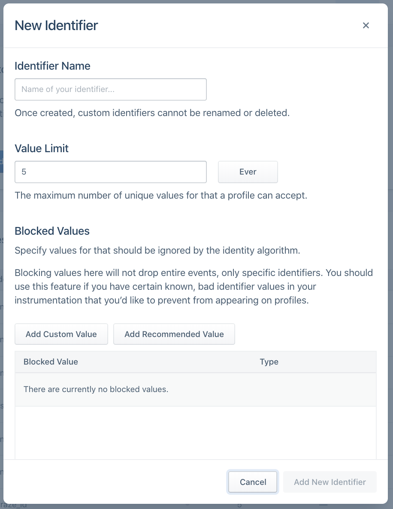
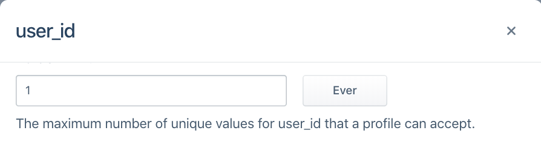

## Setting Up Identity Graph Rules
Before connecting a source to a Personas space, we recommend first reviewing our default Identity settings and configuring custom rules as needed. Updates to configurations will only be applied to all new data flowing through the space after the changes have been saved. Thus, if this is your first time setting up your Identity Graph, we recommend getting started with a *Dev* space [here](/docs/personas/identity-resolution/personas-space-set-up/).

> note ""
> **NOTE:** The Identity Resolution table can only be edited by workspace owners and users with the Identity Admin role.


## ExternalIDs
Segment creates and merges user profiles based on externalIDs we use as identifiers. You can view these externalIDs in the Identities tab of a User Profile in the User Explorer:


By default, Segment promotes the following traits and IDs in track and identify calls to be used as externalIDs:

| External ID Type   | Message Location in Track or Identify Call                                                                    |
| ------------------ | ------------------------------------------------------------------------------------------------------------- |
| user_id            | userId                                                                                                        |
| email              | traits.email or context.traits.email                                                                          |
| android.id         | context.device.id when context.device.type = 'android'                                                        |
| android.idfa       | context.device.advertisingId when context.device.type = 'android' AND context.device.adTrackingEnabled = true |
| android.push_token | context.device.token when context.device.type = 'android'                                                     |
| anonymous_id       | anonymousId                                                                                                   |
| braze_id           | context.Braze.braze_id or context.Braze.braze_id when Braze is connected as a destination                     |
| cross_domain_id    | cross_domain_id when XID has been enabled for the workspace                                                   |
| ga_client_id       | context.integrations['Google Analytics'].clientId when explicitly captured by users                           |
| group_id           | groupId                                                                                                       |
| ios.id             | context.device.id when context.device.type = 'ios'                                                            |
| ios.idfa           | context.device.advertisingId when context.device.type = 'ios' AND context.device.adTrackingEnabled = true     |
| ios.push_token     | context.device.token when context.device.type = 'ios'                                                         |

You'll notice that these identifiers have the *Default* label next to it under *Identifier Type*.

To create your own custom externalID, click on *Add Identifier*.



These custom identifiers must be sent in the custom `externalIds` in the `context` object of any call to our API. The four fields below (id, type, collection, encoding) are all required:

| Key        | Value                                                                        |
| ---------- | ---------------------------------------------------------------------------- |
| id         | value of the externalID                                                      |
| type       | name of externalID type (`app_id`, `ecommerce_id`, `shopify_id`, etc)        |
| collection | `users` if a user-level identifier or `accounts` if a group-level identifier |
| encoding   | `none`                                                                       |

The following example payload adds a custom `phone` externalID type:

``` js
analytics.track('Subscription Upgraded', {
   plan: 'Pro',
   mrr: 99.99
}, {
  externalIds: [
    {
      id: '123-456-7890',
      type: 'phone',
      collection: 'users',
      encoding: 'none'
    }
  ]
})
```

We recommend adding custom externalIDs to the Identity Resolution table *before* events containing this identifier flow through the space. Once an event with a new type of externalID flows into the space, the externalID will automatically be added to the table if it wasn't manually added. However, when the externalID is automatically added, it will default to our preset priority and limit, as explained below.

## Flat Matching Logic
When a new event flows into Personas, we look for any profiles that match any of the identifiers on the event.

There are three cases that can occur:

**Case One: Create New Profile**
When there are no pre-existing profiles that have matching identifiers to the event, we create a new user profile.

**Case Two: Add Event to Existing Profile**
When there is only one profile that matches all identifiers in an event, we attempt to map the traits, identifiers and events on the call to that existing profile. If there is an excess of any identifier on the final profile, we defer to our merge protection rules outlined below.

**Case Three: Merge Existing Profiles**
When there are multiple profiles that match the identifiers in an event, we attempt to merge profiles and first check our merge protection rules as outlined below.

## Merge Protection Rules
Identity Admins should review and configure the merge protection rules in the Identity Resolution Settings page to protect the identity graph from inaccurate merges.

One common example of a use-case that can cause inaccurate merges is the Shared iPad setup. For example, many companies now have iPads available in-store for customers to register for an account or submit order information. If different users submit information on the same device, there will now be multiple events sent with the same deviceID. Without merge protection rules in place, we might see all these different users merged into the same user profile based on this common identifier.

Our three merge protection rules allow Identity Admins to block incorrect values from causing incorrect merges, to set the maximum number of values allowed per externalID, and to customize the priority of these externalIDs.

### Blocked Values
We recommend proactively blocking certain values from ever been used as identifiers. While these values will remain in the payload on the event itself, it will not be promoted to the externalID object Segment uses to determine user profiles.

This is extremely important when developers have a hard-coded value for fields like user_id during QA or development that then erroneously makes it production. This can cause hundreds of profiles to merge incorrectly and can have costly consequences when these spaces are already feeding data into a production email marketing tool or push notification tool downstream.

In the past, we've seen certain default values across many different customers cause mass amounts of profiles to merge incorrectly. Segment suggests that for every externalID, customers opt into automatically blocking the following suggested values:

| Value                         | Type            |
| ----------------------------- | --------------- |
| Zeroes and Dashes (`^[0\-]*$) | Pattern (REGEX) |
| -1                            | Exact Match     |
| null                          | Exact Match     |
| anonymous                     | Exact Match     |


Before sending data through, we also recommend adding any default hard-coded values that your team uses during the development process, such as `void` or `abc123`.

### Limit

Identity Admins can specify the total number of values allowed per externalID type on a profile during a certain period. This will vary depending on how companies define a user today. In most cases, companies rely on `user_id` to distinguish user profiles and Segment defaults to the following configurations:

| ExternalID            | Limit |
| --------------------- | ----- |
| user_id               | 1     |
| all other identifiers | 5     |



There are specific cases that will deviate from this default. For example, a case where a user can have more than one user_id but only one email, like when a user is defined by both their shopify_id and an internal UUID. In this case, an example setup may be:

| ExternalID            | Limit |
| --------------------- | ----- |
| email                 | 1     |
| user_id               | 2     |
| all other identifiers | 5     |

When choosing the limit on your identifier, ask the following questions about each of the identifiers you will send through to Segment:

1. Is it an immutable ID? An immutable ID, such as user_id, should only have `1 ever` per user profile.
2. Is it a constantly changing ID? A constantly changing ID, such as anonymous_id or ga_client_id, should be given a short sliding window, such as `5 weekly` or `5 monthly`, depending on how often your application automatically logs out the user.
3. Is it an ID that can be updated on a yearly basis? Most customers will have around 5 emails or devices at any one time, but can update these over time. For identifiers like email, android.id or ios.id, we might recommend using something like `5 annually`.


### Priority

The priority of an identifier is taken into consideration once we exceed the limit of any identifier on the final profile.

Let's take as an example a Personas space with the following Identity Resolution configurations:

| ExternalID   | Limit | Priority |
| ------------ | ----- | -------- |
| user_id      | 1     | 1        |
| email        | 5     | 2        |
| anonymous_id | 5     | 3        |

A profile already exists with user_id `abc123` and email `jane@example1.com`. A new event comes in with new user_id `abc456` but the same email `jane@example1.com`. If we mapped this event to this profile, the resulting profile would then contain two user_ids and one email. Given that user_id has a limit of 1, we've now exceeded the limit of an identifier so check the priority of these identifiers. Because email and user_id are the only two identifiers on the event and email is ranked lower than user_id, we demote email as an identifier on the incoming event and try again.

At this point, the event searches for any profiles that match just the identifier user_id `abc456`. Now there are no existing profiles with this identifier, so a new profile is created with user_id `abc456`.

By default, we explicitly order user_id and email as rank `1` and `2`, respectively. All other identifiers are in alphabetical order beginning from rank `3`. This means that if the only identifiers ever sent in on events flowing into personas are user_id, email, anonymous_id and ga_client_id, the rank would be as follows:

| ExternalID   | Priority |
| ------------ | -------- |
| user_id      | 1        |
| email        | 2        |
| anonymous_id | 3        |
| ga_client_id | 4        |

If a new android.id identifier appeared without first giving it explicit order, the order would automatically reshuffle to:

| ExternalID   | Priority |
| ------------ | -------- |
| user_id      | 1        |
| email        | 2        |
| android.id   | 3        |
| anonymous_id | 4        |
| ga_client_id | 5        |

Thus, if you require an explicit order for all identifiers, configure this in the Identity Resolution settings page before sending in events.


When choosing the priority of your identifier, ask the following questions about each of the identifiers you will send through to Segment:

1. Is it an immutable ID? An immutable ID, such as user_id, should be prioritized highest.
2. Are they unique IDs? Unique IDs such as email should be prioritized higher over possibly shared identifiers like android.id or ios.id.
3. Does it temporarily identify a user? Identifiers such as anonymous_id, ios.idfa, ga_client_id are constantly updated or expired for a user. Generally speaking, these should rank lower than identifiers that permanently identify a user.
