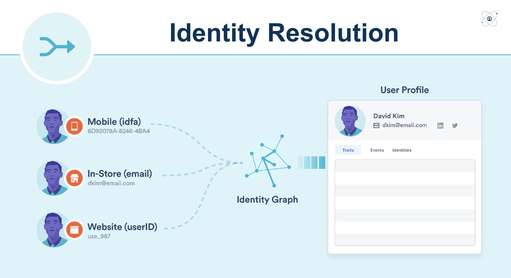

## Identity Graph

Identity Resolution sits at the core of Personas. The Segment Identity Graph merges the complete history of each customer into a single profile, no matter where they interact with your business. Identity Resolution allows you to understand a user's interaction across web, mobile, server, and third party partner touch-points in realtime, using an online and offline ID graph with support for cookie IDs, device IDs, emails, and custom external IDs. If you are sending the [group](/docs/connections/spec/group) call, you can also understand user behavior at the account-level.

## Highlights
1. **Supports existing data** — no additional code or set up required
2. **Supports all channels** — stitches web + mobile + server + third party interactions into the same user
3. **Supports anonymous identity stitching** — by merging child sessions into parent sessions
4. **Supports user:account relationships** - for b2b companies, generates a graph of relationships between users and accounts
5. **Realtime** - merges realtime data streams, tested at 50,000 resolutions/second with a P95 resolve duration of 7ms

## Technical Highlights
1. **Supports custom external IDs** - bring your own external IDs
2. **Customizable ID Rules** — allows you to enforce uniqueness on select external IDs and customize which external IDs and sources cause associations
3. **Merge Protection** - automatically detects and solves identity issues such as non unique anonymous IDs and the library problem using our priority trust algorithm
4. **Maintains persistent ID** - multiple external IDs get matched to one persistent ID.
