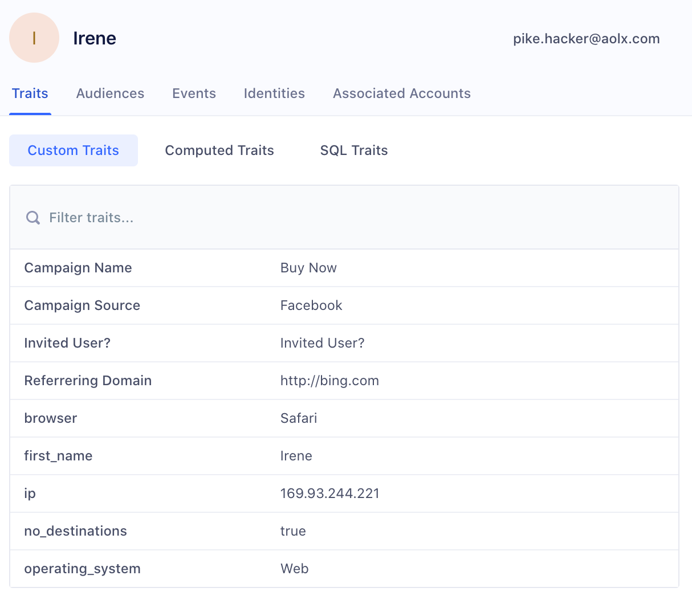

Personas is a powerful personalization platform that helps you create unified customer profiles. With Personas, you can build, enrich, and activate audiences across marketing tools.

<!-- With Personas, you compile lists of _traits_ for each user, then create _audiences_ which are lists of users that meet criteria you define. You can send user traits to your Segment destinations, and audience lists to specific Personas destinations. -->

> info "Get Access to Personas"
> Personas is available only to workspaces on our [Business Tier plan](https://segment.com/pricing/). If you're already a Segment customer on a Business Tier plan, contact your Customer Success Manager to get access to Personas. If you're a new customer or don't have a CSM, [request a demo](https://segment.com/demo/).

## What can you do with Personas?

#### Create unified customer profiles
Personas uses [Segment Identity Resolution](/docs/personas/identity-resolution/) to take event data from across devices and channels and intelligently merge it into complete user- or account-level profiles. This gives your organization a single view of your customer base. To learn more, read the [Identity Resolution documentation](/docs/personas/identity-resolution/).

{% include components/reference-button.html href="https://segment.com/customers/frameio/" icon="personas.svg" title="Personalizing customer interactions" description="Support teams rely on Segment's unified profiles to make real-time and informed decisions about customers when answering tickets or taking support calls. Read about how the support team at Frame.io reduced ticket response time by 80%." %}

#### Enrich profiles with new traits
Add detail to user profiles with new traits, and use them to power personalized marketing campaigns. You can add new traits to your user or account profiles in Segment using:

- [**Computed Traits:**](/docs/personas/computed-traits/) Use the Personas drag-and-drop interface to build per-user (B2C) or per-account (B2B) metrics on user profiles (for example, “lifetime value” or “lead score”).
- [**SQL Traits:**](/docs/personas/sql-traits/) Run custom queries on your data warehouse using the Personas SQL editor, and import the results into Segment. With SQL Traits, you can pull rich, uncaptured user data back into Segment.

#### Build Audiences
Create lists of users or accounts that match specific criteria. For example, after creating an "inactive accounts" audience that lists paid accounts with no logins in 60 days, you can push the audience to your marketing and analytics tools. Learn more about [Personas audiences](/docs/personas/audiences/).

#### Sync audiences to marketing tools
Once you create your Computed Traits and Audiences, Personas sends them to your Segment Destinations in just a few clicks. You can use these Traits and Audiences to personalize messages across channels, optimize ad spend, and improve targeting. You can also use the [Profile API](/docs/personas/profile-api) to build in-app and onsite personalization. Learn more about [using Personas data](/docs/personas/using-personas-data/) and the [Profile API](/docs/personas/profile-api).

{% include components/reference-button.html href="https://segment.com/customers/drift/" icon="personas.svg" title="Personalizing marketing campaigns" content="Marketing teams use Personas to run real-time multi-channel marketing campaigns, based off specific user attributes they've computed in Personas. Read about how Drift used Personas to increase prospect engagement by 150% in 2 month." %}

## Personas core components

Before you set up up Personas, review the features and terms used in this documentation. The main parts of Personas are your Personas space(s), Audiences, the Profile Explorer, and Traits (Computed, SQL, and Custom).

## Personas Spaces

A space is a separate Personas environment. There are two main reasons you might use spaces:

- To separate your development and production environments (highly recommended)
- To separate environments for distinct teams or geographical regions

## Audiences

An [Audience](/docs/personas/audiences/) is a list of either users (B2C) or accounts (B2B) that match a specific criteria. For example, Segment's Marketing team might build an active signups audience for an email marketing campaign. This Audience could contain all users who signed up in the last seven days and added a source within seven days of signing up. The example below shows how you could define this audience in the Audience Builder.

## Profile Explorer and Traits

The Profile Explorer is the single view of your customer in Personas. *Traits* are user or account attributes that you can see in the Profile Explorer.

- The **Profile Explorer** contains all data that you have on a user, from their event history to their traits and identifiers.
- **Computed Traits** are per-user or per-account traits that you create or “compute” in Personas using a drag-and-drop interface. When you build a Computed Trait, Personas adds it to relevant user profiles. Personas recomputes these traits once an hour to make they are always accurate. See the [Computed traits documentation](/docs/personas/computed-traits/) for more detailed information.
- **SQL Traits** are per-user or per-account traits that you create by running queries against your data warehouse, which can include data not captured using your Segment implementation. Segment imports the results into Personas, and appends these traits to the user profile. Personas recomputes these traits every 12 hours to ensure accuracy. See the [SQL trait documentation](/docs/personas/sql-traits/) for more detailed information.
- **Custom Traits** are user or account properties collected from all events you send to Personas.  For example, you can add any properties that you send as a part of your track calls or identify calls (`email`, `first_name`, `last_name`) as custom traits. You can then view them in the Profile Explorer and use them in your Audiences, Computed Traits and SQL traits.

