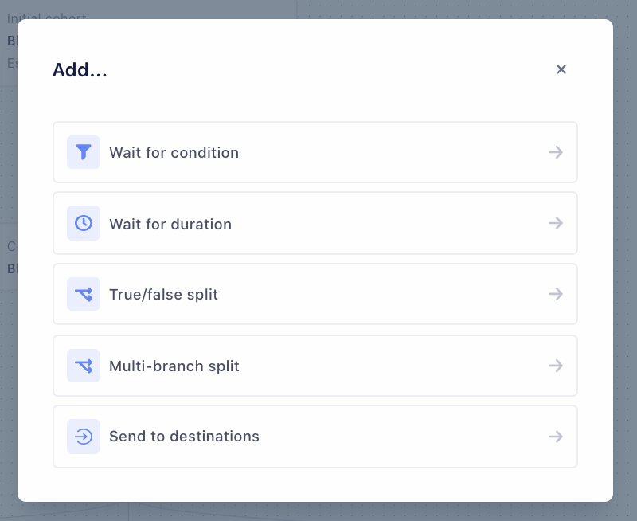
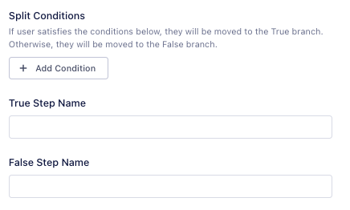
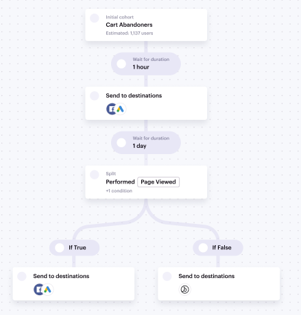
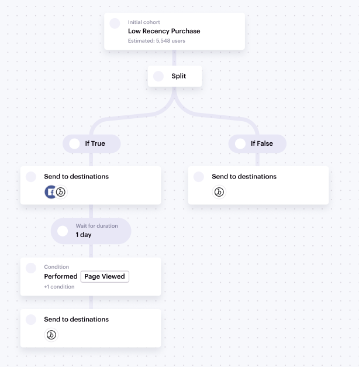
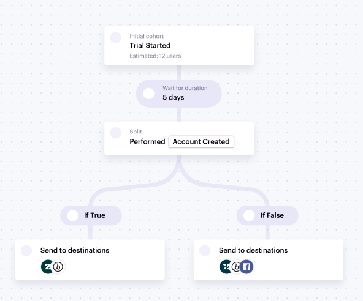

## What is a journey?

Journeys, a feature of Segment Personas, provide a way for marketers to personalize experiences through planning how and when to engage customers with the right campaigns and messages.

Journeys enable you to define steps in a user's journey based on their event behavior and traits. You can build Journeys from your tracking events, traits, computed traits, or audiences. At each step of a journey, you can send your list of users to any personas-compatible destination.

## Key terms

Keep the following terms in mind as you begin to explore Journeys.

### General

| Term              | Definition                                                                                                                           |
| ----------------- | ------------------------------------------------------------------------------------------------------------------------------------ |
| Journey           | A multi-step workflow that progresses users through steps based on time logic, real-time customer interactions, and customer traits. |
| Journey list view | The Journeys tab shows all Journeys in the selected Personas space.                                                                  |
| Journey builder   | A visual canvas where you can view and edit step definitions and types.                                                              |
| Journey overview  | A visual canvas where you can view all steps and definitions after the Journey has been created.                                     |

### Steps

| Term                 | Definition                                                                                                                                                                                                                                                                                                             |
| -------------------- | ---------------------------------------------------------------------------------------------------------------------------------------------------------------------------------------------------------------------------------------------------------------------------------------------------------------------- |
| Step                 | An individual point in the Journey that can be any of the following: **Wait for condition**, **Wait for duration**, **True/false split**, **Multi-branch split**, **Send to destinations**.                                                                                                                            |
| Branch               | Paths that lead users away from a step. For example, A True/false split creates one True branch and one False branch.                                                                                                                                                                                                  |
| Entry condition      | The first step in the Journey where you define the entry criteria. This is the only step where you can backfill historical data and preview users before you publish the Journey.                                                                                                                                      |
| Wait for condition   | A step in which you define one or more conditions which a user must fulfill to move to this step.                                                                                                                                                                                                                      |
| Wait for duration    | A step in which you define the amount of time before the user moves to the next step.                                                                                                                                                                                                                                  |
| True/false split     | A step in which you define a condition to direct a user to A step in which you define a condition to direct user to one of two steps. <br /> <br />Users who fulfill the condition move to the `true` branch. Users who do not move to the `false` branch.                                                             |
| Multi-branch split   | A step in which you define any number of conditions. Each condition represents a separate branch leading away from the step. Users travel down the branch of the condition they meet. <br /> <br /> Journeys does not enforce mutual exclusivity in branch conditions . For more information, see [Best Practices](#). |
| Send to destinations | A step in which you can send track or identify calls to Event destinations, or a list of users to a List destination.                                                                                                                                                                                                  |
| Step name            | The name of the step that is surfaced in the Journey builder and overview.                                                                                                                                                                                                                                             |
| Key                  | name of the Send to Destination step used to identify the step users are on when information is sent to the destination. For Track events, the property name uses this key. For Identify events, the trait name uses this key. <br /><br />For more information, see [Send data to Destinations](#).                   |

### Statuses

| Term                     | Definition                                                                                                                        |
| ------------------------ | --------------------------------------------------------------------------------------------------------------------------------- |
| Draft journey            | A Journey which is not yet computing nor sending data to destinations. <br /><br />For more information, see [Draft Journeys](#). |
| Published (live) journey | A Journey that is computing and sending data to destinations. For more information, see [Published Journeys](#).                  |

## Build a journey

Follow along for the steps required to create a new Journey.

### Before you begin

Ensure you have one or more sources connected to your Personas space, with events streaming in.

For more information, see [Setting up your Sources](/docs/personas/quickstart/#step-3-connect-production-sources).

### Add the entry condition

1. From your Personas space, click the **Journeys** tab.
2. Click **+ New Journey** to access the Journey builder.
3. Click **+ Add Entry Condition**. The entry condition is the first step in the journey and is where you define the entry criteria. It also provides the only opportunity to both enable historical data and preview users before you publish.
   1. Add a name that describes the step, for example `New users`.
   2. Add conditions for inclusion, or import conditions from an existing audience to define the group of users who will enter the journey.
   3. Check **Use historical data** to allow users who have previously matched the entry criteria to enter the journey. Otherwise, only users who meet the entry conditions moving forward will enter the journey.
   4. Click **Preview** to see the list of users and ensure you've defined the right conditions.
   5. Click **Save**.
4. You should see the entry condition on the Journey Builder canvas. It may take up to 2 minutes to see the estimated number of users in the journey.
5. Click **+** to add the next step, and view the available step types.

### Available step types

Journeys provide 5 step types which you can add after the entry condition.



**Wait for condition** defines the conditions which a user must fulfill to be moved from the previous step, to the next step. You can define conditions from scratch, or import conditions from an existing audience.


**Wait for duration** defines the length of time in minutes, hours, days, or weeks that a user must wait before moving to the next step.

**True/false split** splits the group of users from the previous step into two branches, based on boolean logic against a defined condition. If a user satisfies the condition(s), they move to the true branch. Otherwise, they move to the false branch.

You can add Step Names to describe the users in the true and false branch.



**Multi-branch split** splits the group of users from the previous step into 2 or more branches based on conditions you define for each branch. 

Define the number of branches you want to create. Then, add a “Wait for condition” step to define the conditions for each branch.

> info ""
> Segment Journeys does not enforce branch conditions to be mutually exclusive. For more information about ensuring branch exclusivity, see [Best Practices](#).

**Send to destinations** delivers information about the journey to the selected destination. For more information, see [Send data to destinations](#)

## Send data to destinations

When you send data to destinations, you send a series of events or user lists, depending on the destination type.

### Before you begin

Ensure you have connected and enabled destinations in your Personas space.

For more information, see [Setting up Destinations](/docs/personas/quickstart/).

### Send data to destinations

1. Add a **Send to destinations** step to the journey.
2. Enter a **Step name**. This name should be descriptive of the users you send to the destination. For example, `New subscribed users`. Journeys generates a key based on the step name you enter. Destinations use this key to references the users that are sent to it. For track events, the property name uses this key. For Identify events, the trait name uses the key.
3. Click **Connect destinations** to select the destination you'll send the data to.
4. Click **Save**.

### What do I send to destinations?

The type of data you send to a destination depends on whether the destination is an Event destination, or a List destination.

#### Event destination

The format in which the destination receives updates depends on the type of call.

##### Track calls

When the user enters the step:

```json
{
  "type": "track",
  "event": "Step Entered",
  "properties": {
    "j_o_first_purchase__opened_email_dje83h": "true"
  }
}
```

When the user leaves the step:

```json
{
  "type": "track",
  "event": "Step Exited",
  "properties": {
    "j_o_first_purchase__opened_email_dje83h": "false"
  }
}
```

##### Identify calls

When the user enters the step:

```json
{
  "type": "identify",
  "traits": {
    "j_o_first_purchase__opened_email_dje83h": "true"
  }
}
```

When the user leaves the step:

```json
{
  "type": "identify",
  "traits": {
    "j_o_first_purchase__opened_email_dje83h": "false"
  }
}
```

#### List destination

The destination receives a list of users who qualify for that step of the Journey. This list is constantly updated by Segment. 

For more information, see [Using Personas Data](/docs/personas/using-personas-data/).

## Publish a journey

Published journeys are active journeys. Once published, journeys have a limited ability to be edited.

### Draft journeys

When you're finished creating your journey, click **Save as Draft** in the bottom-right corner.

#### When Journeys are in a draft state

- Journeys provide an *estimate* of user counts at the entry step, and do not compute user counts for the other steps of the journey.
- Data is **not** sent to connected destinations.

### Published journeys

When you publish a journey, it becomes active. To publish a journey, click **Publish Journey** from the Journey Overview. You can also click **Publish Journey** in the bottom-right corner of the Journey Builder.

#### When a journey is published

- You can edit only the Journey name, description, and destination steps.
- You cannot add, edit, or delete other steps in the journey.
- User counts are computed. It may take a few hours for user counts to be available.
- Once user counts are computed and available, you'll see the list of users at each step of the journey.
- You can click a user profile to see the list of journeys they belong to.
- Data is sent to destinations, and updates in real-time.

### Edit name, description, and destinations.

#### Edit name and description
To edit your Journey name and description, navigate to the **Settings** tab of the Journey Overview. 


#### Edit destinations
To edit destinations, click **Edit Destinations** from the Journey Overview. You can add, edit, or delete connected destinations within existing **Send to destinations** steps. 

## Clone a journey

Click the **…** icon at the end of a row in the Journey List View to, and select Clone Journey to clone a journey. This creates a copy of the journey in draft status. Similarly, you can also clone a Journey from a Journey’s overview by clicking on the **…** icon on the top right corner. 

## Best practices

### Enforce exclusivity in multi-branch splits

When you create a multi-branch split, do not create overlapping conditions that might lead a user to qualify for more than one step at a time.

For example:
  - If a multi-branch split has the following conditions, a user who has performed both `webinar attended` and `registration form submitted` will end up in both branches.
  - To set a priority, branch 2 should then be `who performed registration form submitted and did not perform webinar attended` to ensure mutual exclusivity

### Add time windows whenever possible
Where possible, add a time window when defining conditions to ensure that users eventually exit the step or Journey, rather than remain at the step forever. This prevents Journeys from collecting stale users which can muddle your data for analytics, or cause you to over-target.

### Review your Journey in drafts first
Save your Journey in a draft state so that you can review before you publish it. Once a Journey is published, limited edits can be made and data is being sent to destinations.

### Make a copy to edit published Journeys
Once a Journey is published, you cannot add, delete, or edit the steps within the Journey. You can only edit the Journey name, description, and destinations.

To edit the steps within a published Journey, make a copy of the Journey you wish to edit, make adjustments, delete the original Journey, and then publish the revised Journey.

When you do this, the key used for syncing to destinations will be different from the copied Journey. Make sure you change the reference key used in the downstream destinations accordingly.

## Frequently asked questions

### How often do Journeys run?
Journeys is built on Personas’ real-time compute engine. Because of this, Journeys run in real-time, and users will progress through Journeys as Segment receives new events.

### What destinations are supported by Journeys?
Journeys supports all Personas destinations, including Destination Functions. Read more in Send data to destinations.

### What are the reporting capabilities of Journeys?
When building a Journey, you will be able to see the estimated number of users in the initial cohort, if “Use historical data” is checked.

Once published, you will see how many users are in each step of the Journey at any given time.

### How are users sent to downstream destinations?
The type of data you send to a destination depends on whether the destination is configured as an Event Destination or a List Destination. 

## Example use cases

To help you get underway, you can reference these sample journeys.

### E-commerce use cases

#### Cart abandonment

In this journey, you'll see a cart abandonment campaign designed to win users back while still optimizing ad spend and discounting based on customer engagement.



1. Create the entry condition with the step name `Cart abandoners`.
   1. All users who performed **Product Added** at least once within **1 day**, and performed **Order Completed** zero times within **1 day**.
2. Add a wait duration of **1 hour**.
3. Send this audience to relevant destinations, for example Facebook Custom Audiences or Google Adwords.
4. Add a wait duration of **1 day**.
5. Add a True/false split.
   1. Split the audience based on those who performed **Page Viewed** at least once, and where the **utm_source** equals the ad destination in step 3, within the last day.
   2. For the True branch, send the list of users to Email and Advertising destinations.
   3. For the False branch, send the list of users to an Email destination.


#### Low recency purchase winback

This journey represents a campaign designed to drive returning purchases based on intent and lifetime value goals.



1. Create the entry condition with the step name `Low recency purchasers`.
   1. All users who have performed the **Order Completed** event zero times within the last **180 days**.
2. Add a True/false split.
   1. Split the audience around a computed trait of **Customer Lifetime Value > 100**.
   2. For the True branch, send the list of users to Email and Advertising destinations.
   3. For the False branch, send the list of users to an Email destination.
3. Add a wait duration of **1 day** to the True branch from step 2.
4. Add a Wait for condition step to wait for a **Page Viewed** event at least 1 time and where **utm_source** is equal to the ad or email campaign, within 1 day.
5. Send this list of users to an email destination, as they are more likely to accept a discount and complete the purchase.

### B2B use cases

#### Trial to paid conversion
This journey creates an acquisition campaign designed to convert trial accounts to paid accounts with a unified owned and paid media strategy.



1. Create the entry condition with the step name `Trial started`.
   1. All users who performed **Trial Started** at least once and who performed **Subscription Started** exactly 0 times.
2. Add a wait duration of **5 days**.
3. Add a True/false split.
   1. Split the audience around users who have performed **Subscription Started**
   2. For the True branch, send the list of users to Email and Support destinations.
   3. For the False branch, send the list of users to an Email destination, Support, and Advertising destinations.

## Product limits

Journeys is available to Personas Advanced customers. To learn more about Personas, contact [sales for a demo](https://segment.com/contact/demo).

In addition to the [Personas Default Limits](/docs/personas/product-limits), Journeys enforces a set of default limits to ensure the reliability and performance of the feature.

| Item          | Limit description                | Details                                                                                                                                                                                                                                                                               |
| ------------- | -------------------------------- | ------------------------------------------------------------------------------------------------------------------------------------------------------------------------------------------------------------------------------------------------------------------------------------- |
| Journeys      | 5 Journeys per workspace         | This applies to active, concurrent Journeys. <br><br>Once the limit is reached, you cannot publish any additional Journeys. You will still be able to create draft Journeys.                                                                                               |
| Journey steps | 20 steps per Journey             | This applies to certain steps:<br><br>- Initial cohort: 1<br>- Wait for condition: 1<br>- True / False Split: 1<br>- Multi-Branch Split: Number of branches<br>- Send to Destinations: 1<br><br>Once the limit is reached, you will be unable to add additional steps to the Journey. |
| Journey Name  | Maximum length of 73 characters  | Once the limit is reached, you cannot add additional characters to the name.                                                                                                                                                                                               |
| Step Name     | Maximum length of 170 characters | Once the limit is reached, you cannot add additional characters to the name.                                                                                                                                                                                               |
| Key           | Maximum length of 255 characters | Once the limit is reached, you cannot add additional characters to the key.                                                                                                                                                                                                |
