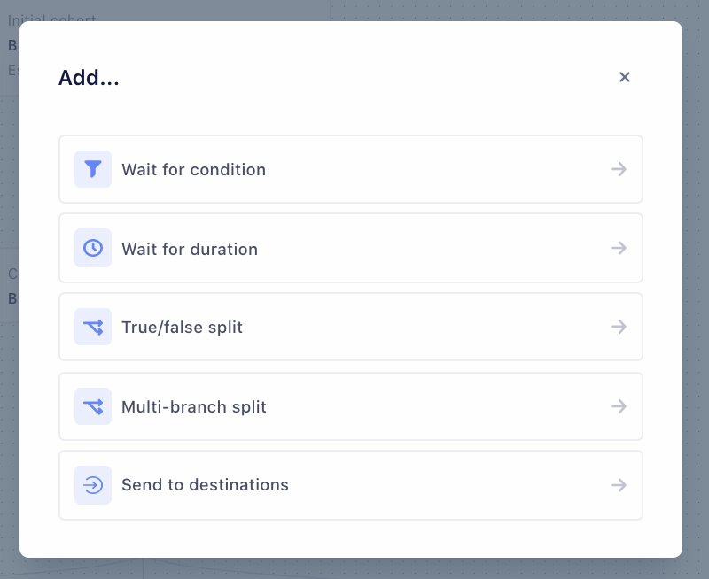
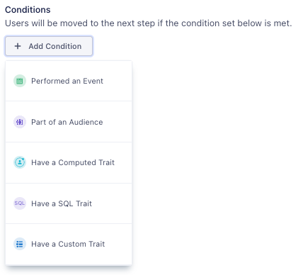
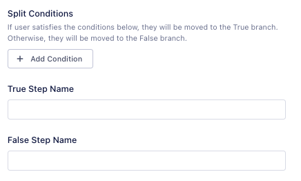



## Before you begin

Verify that you've connected at least one source to your Personas space, with events streaming in.

For more information, see [Setting up your Sources](/docs/personas/quickstart/#step-3-connect-production-sources).

## Adding the entry condition

1. From your Personas space, click the **Journeys** tab.
2. Click **+ New Journey** to access the Journey builder.
3. Click **+ Add Entry Condition**. Define entry criteria with an entry condition, the first step in the Journey. Before publishing, you can also enable historical data and preview users who meet the entry criteria.
   1. Add a name to describe the step, for example `New users`.
   2. Add inclusion conditions, or import conditions from an existing audience to define users who will enter the Journey.
   3. Check **Use historical data** to allow users who have already matched the entry criteria to enter the Journey. Otherwise, only users who meet the entry conditions after publication will enter the Journey.
   4. Click **Preview** to see the list of users who meet your criteria. Verify that you've defined the right conditions.
   5. Click **Save**.
4. Segment displays the entry condition on the Journey Builder canvas. It may take up to two minutes for Segment to estimate the number of users in the journey.
5. Click **+** to add the next step and view available step types.

### Using historical data for the entry step

If you select the **Use historical data** option, Segment queries all historical data to generate a list of users who enter the Journey upon publication. If you don't select **Use historical data**, only users who satisfy the entry condition *after* you publish enter the Journey.

> info ""
> Your **Use historical data** selection won't impact subsequent Journey steps.  Only future events and existing trait memberships trigger post-entry Journey steps.

## Available step types

Journeys provides five step types, which you can add after the entry condition.

**Wait for condition** defines the conditions that a user must satisfy to move from one step to the next. You can define new conditions or import conditions from an existing audience.

**Wait for duration** defines the length of time in minutes, hours, days, or weeks that a user must wait before moving to the next step.

**True/false split** divides the previous step's user group into two branches, based on Boolean logic against a defined condition. Users who satisfy the condition(s) move to the **True** branch. Otherwise, they move to the **False** branch. To enforce mutual exclusivity, Journeys evaluates true/false conditions when a user reaches the relevant step.

You can add Step Names to describe the users in the True and False branch.

**Multi-branch split** divides the group of users from the previous step into two or more branches based on each branch's defined conditions.

Define the number of branches you want to create, then add a **Wait for condition** step to define each branch's condition.

> info ""
> Journeys doesn't enforce mutual exclusivity in branch conditions. For more information about ensuring branch exclusivity, see [Best Practices](#).

**Connect to existing step** joins two separate branches. Use this step to target multiple groups with one step.

**Send to Destinations** delivers information about the Journey to the selected Destination. For more information, see [Send data to Destinations](/docs/personas/journeys/send-data)

## Publishing a Journey

To publish and activate a Journey, click **Publish Journey** from the Journey Overview. You can also click **Publish Journey** in the bottom-right corner of the Journey Builder.

> info ""
> Some Journey features can only be edited before publication. For more information, see the difference between Draft and Published Journeys below.

## Journey re-entry

The Journeys re-entry setting allows users to repeat Journeys they've already exited. Common use cases for Journeys re-entry include the following:

- Retargeting users who abandon multiple carts
- Recurring rewards and promotion offers
- Notifying users when to renew a subscription

## Cloning a Journey

To clone a Journey:
1. In Journey List view, click the **…** icon at the end of a row.
2. Select **Clone Journey**.

Segment then creates a draft of your Journey.

You can also clone a Journey from a Journey's Overview by clicking the **…** icon.

## Randomized splits

A randomized split lets you experiment with and test the performance of a Journey's branches. When you create a randomized split, you add up to five Journey branches, each with a different step. Journeys then sends eligible users down one of the branches at random. Each branch receives a portion of the eligible users based on percentages that you assign to the branches.

To test your messaging channels, for example, you might create a randomized split with three different branches, assigning 40% of users to an email campaign, 40% to an SMS campaign, and 20% to a control group. Once users flow through the split, you can determine the success of the email and SMS campaigns compared to each other and the control group.

### Add a randomized split

Follow these steps to add a randomized split to a Journey:

1. Create a new Journey, and [add an entry condition](#adding-the-entry-condition).
2. Select the **+** icon to add a step, then select **Create a randomized split**.
3. Name the randomized split step, then add up to five branches.
4. Set the distribution percentage for each branch, then select **Save**.
5. For each branch in the split, select the child **+** icon and add a step.
3. Save and publish your Journey.

Users who meet the Journey's entry condition will then enter the Journey and flow through the randomized split.

### Act on the split's results

Once users complete your Journey's randomized split step, you'll have insight into how each split performed. You can take action on the results by cloning the Journey and sending a new set of users through the highest performing branch.

### Exit and re-entry times

To enable re-entry, you'll need to specify two Journeys settings:

- Journeys exit time
- Journeys re-entry time

Users must first exit a Journey before re-entering. To enable re-entry, then, you'll need to specify a Journey's exit settings. You can configure exit by hour, day, or week. Journeys exits users once this time passes, allowing users to re-enter once they meet the Journey's entry conditions again.

You'll also configure re-entry time by hour, day, or week. An exited user won't re-enter the same Journey until the re-entry time has passed. Re-entry time begins once a user exits the Journey.

Suppose, for example, you enable re-entry for an abandoned cart campaign. You set exit to one week and re-entry to 30 days. A user who abandons their cart will progress through the Journey and exit no later than one week after entering. Once 30 days after exit have passed, the user can re-enter the Journey.

### Setting up re-entry

To enable Journey re-entry for a new Journey, follow these steps:

1. Select the **Journeys** tab within your Personas space, then click **New Journey**.
2. Under **Entry settings**, select **Re-Entry** and enter a re-entry time.
3. Under **Exit settings**, enter an exit time.
4. Click **Build Journey** to complete Journey setup.

## Pausing and resuming a Journey

Pausing a published Journey prevents new users from joining your Journey. Users already in the Journey, however, will continue their progress.

Follow these steps to pause a Journey:

1. Select the **Journeys** tab within your Personas space.
2. Select the **More Options** icon next to the Journey you want to pause.
3. From the dropdown menu, select **Pause Entry**.
4. A modal window appears. Select **Pause Entry** again to confirm.

> info "Compute Limits"
> Because pausing only affects new Journey members, paused Journeys still count towards compute credit limits.

### Resuming a Journey

You can resume new user entries to a paused Journey at any time. 

After you resume a Journey, users who meet the Journey's entry conditions will join the Journey. New users will not enter the Journey, however, if they met its entry conditions while it was paused. 

Follow these steps to resume entry to a paused Journey:

1. Select the **Journeys** tab within your Personas space.
2. Select the **More Options** icon next to the Journey you want to resume.
3. From the dropdown menu, select **Resume Entry**.
4. A modal window appears. Select **Resume Entry** again to confirm.

## Connecting to Existing Steps

You can merge split Journey branches by using the **Connect to existing steps** option. Connecting to existing steps lets you apply a single step to more than one group. For example, you may want to target some Journey group members with email campaigns while targeting others with ad campaigns. Instead of duplicating steps, you can connect these steps to steps that already exist.

Keep the following in mind when connecting to existing steps:

- You can only connect the end of a branch to another branch.
- You cannot link back or loop back to previous steps.
- If you connect multiple non-exclusive branches, the user will only be sent to a Destination the first time they reach it.

Follow the instructions below to connect branches to an existing step:

1. Within an existing Journey, click the **Edit** button.
2. Click the **+** icon below an existing step to add a new step.
3. From the **Select a Step** window, select **Connect to existing step**.
4. Choose the existing step you want to connect.
5. Click **Save** to confirm.

### Drafting a Journey

When you've finished creating your Journey, click **Save as Draft** in the bottom-right corner.

#### When Journeys are in a draft state
- Journeys estimates user counts only for the entry step.
- Journeys doesn't send data to connected Destinations.

### About published Journeys

Keep the following considerations in mind when working with a published Journey:

- It may take up to three hours for Journeys to compute user counts after publication.
- You can edit a Journey's name, description, and Destination steps.
- You can't add, edit, or delete other steps in the Journey.
- Once Journeys computes and displays user counts, you'll see the list of users at each step of the Journey.
- Click a user profile to see the Journey list to which they belong.
- Journeys sends and updates data to Destinations in real-time.
