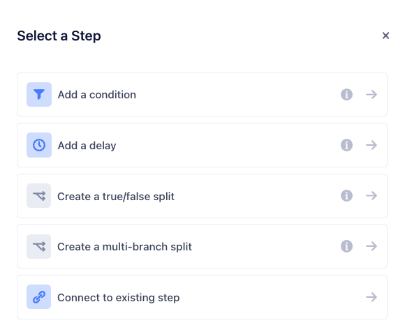



Follow along for the steps required to create a new Journey.

## Before you begin

Ensure you have one or more sources connected to your Personas space, with events streaming in.

For more information, see [Setting up your Sources](/docs/personas/quickstart/#step-3-connect-production-sources).

## Add the entry condition

1. From your Personas space, click the **Journeys** tab.
2. Click **+ New Journey** to access the Journey builder.
3. Click **+ Add Entry Condition**. The entry condition is the first step in the journey and is where you define the entry criteria. On this step, you can both enable historical data and preview users before you publish.
   1. Add a name that describes the step, for example `New users`.
   2. Add conditions for inclusion, or import conditions from an existing audience to define the group of users who will enter the journey.
   3. Check **Use historical data** to allow users who have matched the entry criteria to enter the journey. Otherwise, users who meet the entry conditions moving forward will enter the journey.
   4. Click **Preview** to see the list of users and ensure you've defined the right conditions.
   5. Click **Save**.
4. You should see the entry condition on the Journey Builder canvas. It may take up to 2 minutes to see the estimated number of users in the journey.
5. Click **+** to add the next step, and view the available step types.

## Available step types

Journeys provide 5 step types which you can add after the entry condition.

**Wait for condition** defines the conditions which a user must fulfill to move from the previous step, to the next step. You can define conditions from scratch, or import conditions from an existing audience.

**Wait for duration** defines the length of time in minutes, hours, days, or weeks that a user must wait before moving to the next step.

**True/false split** splits the group of users from the previous step into two branches, based on boolean logic against a defined condition. If a user satisfies the condition(s), they move to the true branch. Otherwise, they move to the false branch.

You can add Step Names to describe the users in the true and false branch.

**Multi-branch split** splits the group of users from the previous step into 2 or more branches based on conditions you define for each branch. 

Define the number of branches you want to create. Then, add a “Wait for condition” step to define the conditions for each branch.

> info ""
> Segment Journeys does not enforce branch conditions to be mutually exclusive. For more information about ensuring branch exclusivity, see [Best Practices](#).

**Send to destinations** delivers information about the journey to the selected destination. For more information, see [Send data to destinations](/docs/personas/journeys/send-data)

## Clone a Journey

Click the **…** icon at the end of a row in the Journey List View to, and select Clone Journey to clone an existing journey. This creates a copy of the journey in draft status. Similarly, you can also clone a Journey from a Journey’s overview by clicking on the **…** icon on the top right corner. 

## Publish a Journey

When you publish a journey, it becomes active. To publish a journey, click **Publish Journey** from the Journey Overview. You can also click **Publish Journey** in the bottom-right corner of the Journey Builder.

> info ""
> Once published, you cannot edit select portions of a Journey. For more information, see the difference between Draft and Published journeys below.

### Draft Journeys

When you’re finished creating your journey, click Save as Draft in the bottom-right corner.

#### When Journeys are in a draft state
- Journeys provide an estimate of user counts at the entry step, and do not compute user counts for the other steps of the journey.
- Data is not sent to connected destinations.

### Published Journeys

When you publish a journey, it becomes active. To publish a journey, click Publish Journey from the Journey Overview. You can also click Publish Journey in the bottom-right corner of the Journey Builder.

> info ""
> After you publish a Journey, it may take up to three hours for user preview to display.

#### When you publish a Journey

- You can edit the Journey name, description, and destination steps.
- You cannot add, edit, or delete other steps in the journey.
- Journeys computes user counts. It may take a up to 3 hours for user counts to be available.
- Once Journeys computes user counts and makes them available, you’ll see the list of users at each step of the journey.
- You can click a user profile to see the list of Journey they belong to.
- Journeys sends data to destinations, and updates in real-time.

## Edit name, description, and destinations

### Edit name and description
To edit your Journey name and description, navigate to the Settings tab of the Journey Overview.

### Edit destinations
To edit destinations, click Edit Destinations from the Journey Overview. You can add, edit, or delete connected destinations within existing Send to destinations steps.

