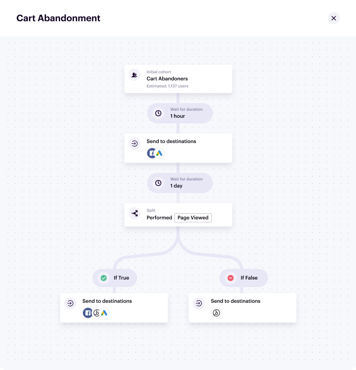
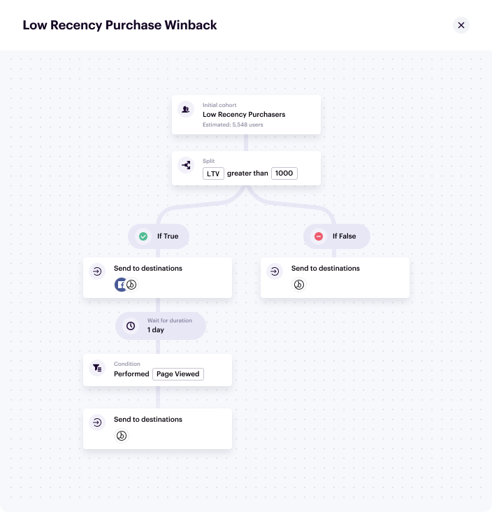
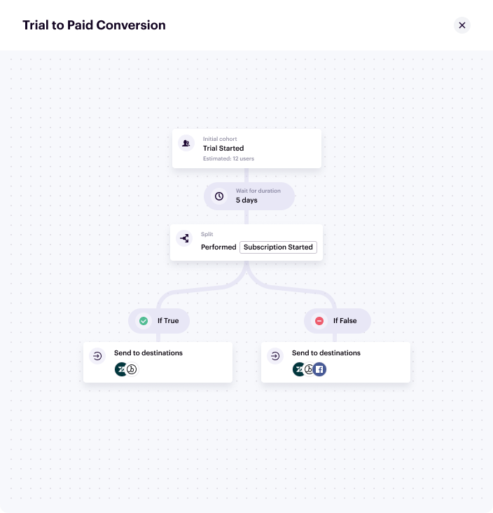
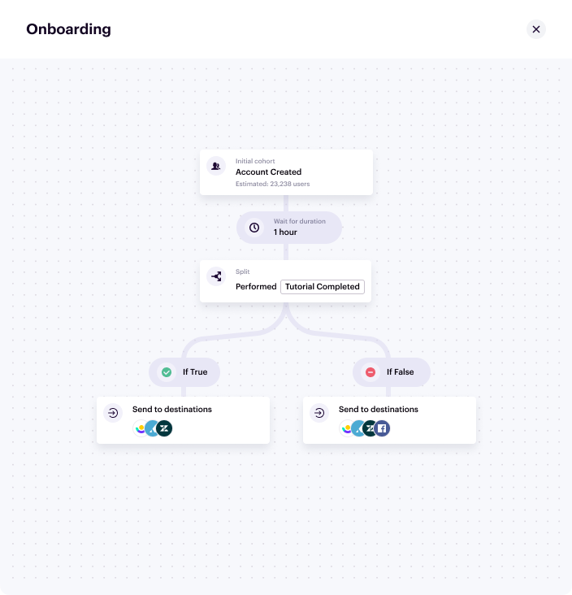
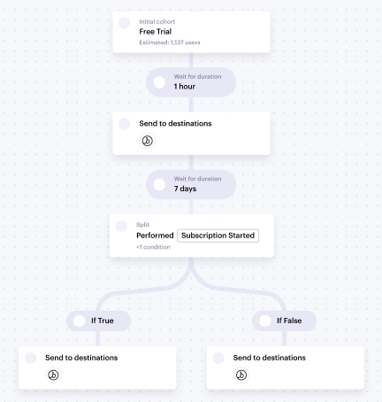

To help you get underway, you can reference these sample Journeys.

## E-commerce use cases

### Cart abandonment

In this journey, you'll see a cart abandonment campaign designed to win users back while still optimizing ad spend and discounting based on customer engagement.

1. Create the entry condition with the step name `Cart abandoners`.
   1. All users who performed **Product Added** at least once within **1 day**, and performed **Order Completed** zero times within **1 day**.
2. Add a wait duration of **1 hour**.
3. Send this audience to relevant destinations, for example Facebook Custom Audiences or Google Adwords.
4. Add a wait duration of **1 day**.
5. Add a True/false split.
   1. Split the audience based on those who performed **Page Viewed** at least once, and where the **utm_source** equals the ad destination in step 3, within the last day.
   2. For the True branch, send the list of users to Email and Advertising destinations.
   3. For the False branch, send the list of users to an Email destination.

### Low recency purchase winback

This journey represents a campaign designed to drive returning purchases based on intent and lifetime value goals.

1. Create the entry condition with the step name `Low recency purchasers`.
   1. All users who have performed the **Order Completed** event zero times within the last **180 days**.
2. Add a True/false split.
   1. Split the audience around a computed trait of **Customer Lifetime Value > 100**.
   2. For the True branch, send the list of users to Email and Advertising destinations.
   3. For the False branch, send the list of users to an Email destination.
3. Add a wait duration of **1 day** to the True branch from step 2.
4. Add a Wait for condition step to wait for a **Page Viewed** event at least 1 time and where **utm_source** is equal to the ad or email campaign, within 1 day.
5. Send this list of users to an email destination, as they are more likely to accept a discount and complete the purchase.

## B2B use cases

### Trial to paid conversion
This journey creates an acquisition campaign designed to convert trial accounts to paid accounts with a unified owned and paid media strategy.

1. Create the entry condition with the step name `Trial started`.
   1. All users who performed **Trial Started** at least once and who performed **Subscription Started** exactly 0 times.
2. Add a wait duration of **5 days**.
3. Add a True/false split.
   1. Split the audience around users who have performed **Subscription Started**
   2. For the True branch, send the list of users to Email and Support destinations.
   3. For the False branch, send the list of users to an Email destination, Support, and Advertising destinations.

### Onboarding flow

This journey creates an onboarding flow designed to maintain new user engagement through the onboarding experience.

1. Create the entry condition with the step name `Account created`. Set the condition to all users who performed **Account Created** at least 1 time.
2. Add a wait duration of **1 hour**.
3. Add a True/false split.
   1. Split the audience based on those who have performed **Tutorial Completed**.
   2. For the True branch, send the list of users to Email, Support, and In-App destinations.
   3. For the False branch, send the list of users to Email, Support, In-App, and Advertising destinations.

## Media use cases

### Paid subscription acquisition

This journey creates an acquisition campaign designed to convert trial subscriptions to paid subscriptions with a unified owned and paid media strategy.

1. Create the entry condition with the step name `Free trial`. Set the condition to all users who performed **Subscription Started** at least 1 time, and where **Subscription Plan Type** is **Free**.
2. Add a wait duration of **1 hour**.
3. Send the list of users to an Email destination.
4. Add a wait duration of **7 days**.
5. Add a True/false split.
   1. Split the audience based on those who have performed **Subscription Started** where **Subscription Plan Type** is **paid**.
   2. For the True branch, send to an email destination.
   3. For the False branch, send to both email and advertising destinations.