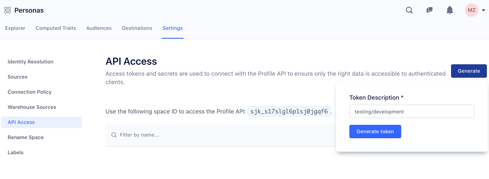
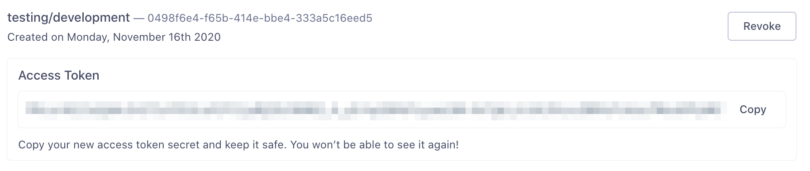
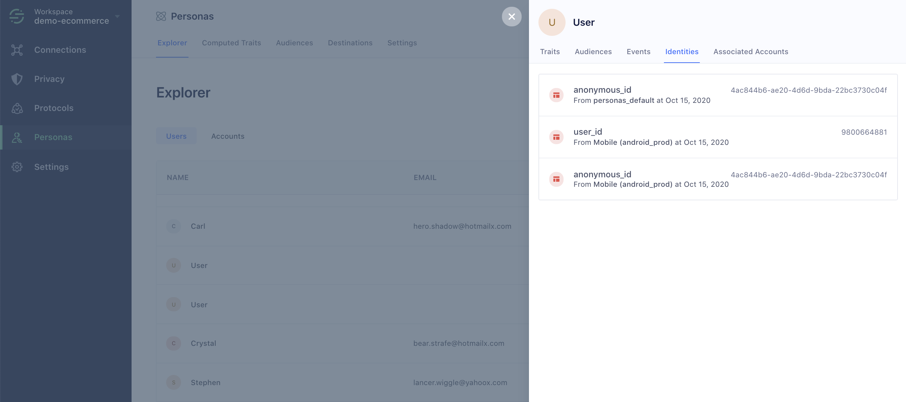
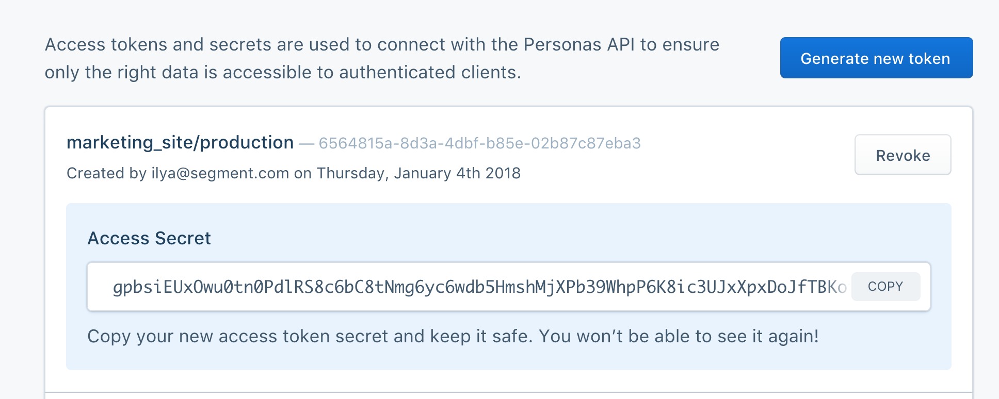

> info "Plan Requirements"
> To use the Profile API, you'll need Personas Advanced on your plan.

The Segment Profile API provides a single API to read user-level and account-level customer data. Segment now allows you to query the entire user or account object programmatically, including the `external_ids` , `traits` , and `events` that make up a user's journey through your product.

<!-- We need links to glossary pages here ^ -->

You can use this API to:

- **Build an in-app recommendation** engine to show users or accounts the last five products they viewed but didn't purchase
- **Empower your sales and support associates** with the complete customer context by embedding the user profile in third-party tools like Zendesk or Desk.com
- **Power personalized marketing campaigns** by enriching dynamic / custom properties with profile traits in marketing tools like Braze
- **Qualify leads faster** by embedding the user event timeline in Salesforce

This document has four parts:

1. [**Product Highlights**](#product-highlights)
2. [**Quickstart**](#quickstart): Walks you through how to get started querying your user profile in <1 min
3. [**API Reference**](#api-reference): Retrieve a list of users sorted by recent activity or find a particular user
4. [**Best Practices**](#recommended-implementation): Recommended implementation and example Profile API workflow

## Product highlights
1. **Fast response times** — fetch traits from a user profile under 200ms
2. **Real-time data** — query streaming data on the user profile
3. **One identity** — query an end user's interactions across web, mobile, server, and third party touch-points
4. **Rich data** — query user traits, audiences, and events
5. **Any external ID** — the API supports query from user_id, advertising IDs, anonymous_id, and custom external IDs.

## Quickstart

> warning ""
> **Important**: The Profile API is intended to be used server-side. You should not implement directly in client applications. See the [Best Practices](#recommended-implementation) section for more details.

### Configure access

Your access token enables you to call the Profile API and access customer data.

> info "European Union requirements"
> To implement the Profile API in the European Union, you must complete the following steps within an EU workspace. View the [regional Segment documentation](/docs/guides/regional-segment/#create-a-new-workspace-with-a-different-region) for more information.

1.  Navigate to the API Access settings page **Personas > Settings > API Access**.

2.  Create your **Access Token** with a name that describes your use case, for example `testing/development`. Take note of the **space ID** value, you'll pass this into the Profile API request URL in a later step.

    

3.  Click **Generate token**. Copy the resulting **Access Token** and store it in a file on your computer. You'll pass in the **Access Token** into the Profile API for authorization as an HTTP Basic Auth username in a later step.
    


### Find a user's external id

1. Navigate to **Personas > Profiles > Explorer** and select the user you want to query through the API.
2. Take note of the user's available identifiers. For example, this user has a `user_id` with the value `9800664881`. The Profile API requires both the type of ID and the value separated by a colon. For example, `user_id:9800664881`.


> warning ""
> To query phone numbers that contain a plus sign (`+`), insert the escape characters `%2B` in place of the plus sign. 
> For example, if a `phone_number` identifier has the value `+5555550123`, enter `phone_number:%2B5555550123` in your query.

### Query the user's event traits

1. From the HTTP API testing application of your choice, configure the authentication as described above.
2. Prepare the request URL by replacing `<space_id>` and `<external_id>` in the request URL:
    `https://profiles.segment.com/v1/spaces/<space_id>/collections/users/profiles/<external_id>/traits`


    If you're using the Profile API in the EU, use the following URL for all requests:

    `https://profiles.euw1.segment.com/v1/spaces/<space_id>/collections/users/profiles/<external_id>/traits`
3. Send a `GET` request to the URL.

### Explore the user's traits in the response

The response is returned as a JSON object which contains the queried user's assigned traits.

```json
{
    "traits": {
        "3_product_views_in_last_60_days": false,
        "Campaign Name": "Organic",
        "Campaign Source": "Organic",
        "Experiment Group": "Group A",
        "Invited User?": "Invited User?",
        "Referrering Domain": "http://duckduckgo.com",
        "all_users_order_completed": true,
        "big_spender": false
    },
    "cursor": {
        "url": "https://profiles.segment.com/v1/spaces/kNU0gh7EVl/collections/users/profiles/user_id:1413639574/traits?%3Acollection=users&%3Aid=user_id%3A1413639574&%3Anamespace=kNU0gh7EVl&next=browser",
        "has_more": true,
        "next": "browser",
        "limit": 10
    }
}
```

### Explore more of the API

- **Search by an External ID**: You can query directly by a user's user_id or other external_id.

  `https://profiles.segment.com/v1/spaces/<space_id>/collections/users/profiles/<user_identifier>/events`

- **External IDs**: You can query all of a user's external IDs such as `anonymous_id` or `user_id`.

  `https://profiles.segment.com/v1/spaces/<space_id>/collections/users/profiles/<user_identifier>/external_ids`


**Traits**
You can query a user's traits (such as `first_name`, `last_name`, and more):


`https://profiles.segment.com/v1/spaces/<space_id>/collections/users/profiles/<external_id>/traits`

By default, the response includes 20 traits. You can return up to 200 traits by appending `?limit=200` to the querystring. If you wish to return a specific trait, append `?include={trait}` to the querystring (for example `?include=age`). You can also use the ``?class=audience​`` or ``?class=computed_trait​`` URL parameters to retrieve audiences or computed traits specifically.

**Metadata**
You can query all of a user's metadata (such as `created_at`, `updated_at`, and more):

`https://profiles.segment.com/v1/spaces/<space_id>/collections/users/profiles/<external_id>/metadata`

**Search an account profile**

If you're sending group calls to Segment, you can now access your account profiles as well. Retrieve your account traits, computed traits, and audience traits by querying the `group_id` you are interested in:

`https://profiles.segment.com/v1/spaces/<space_id>/collections/accounts/profiles/group_id:12345/traits`

**Search for linked users or accounts**

If you're looking to find all the users linked to an account, you can search for an account's linked users, or a user's linked accounts.

`https://profiles.segment.com/v1/spaces/<space_id>/collections/accounts/profiles/group_id:12345/links`

The return limit for the `/links` endpoint is 20 records. You can request up to 20 records by appending `?limit=20` to the query string.

### cURL

You can also request using cURL:

```bash
export SEGMENT_ACCESS_SECRET="YOUR_API_ACCESS_TOKEN_SECRET_HERE"

curl https://profiles.segment.com/v1/spaces/<space_id>/collections/users/profiles/<external_id>/traits -u $SEGMENT_ACCESS_SECRET:
```

## API reference

The Segment API is organized around [REST](http://en.wikipedia.org/wiki/Representational_State_Transfer){:target="_blank"}. The API has predictable, resource-oriented URLs, and uses HTTP response codes to indicate API errors. Segment uses standard HTTP features, like HTTP authentication and HTTP verbs, which are understood by off-the-shelf HTTP clients.  [JSON](http://www.json.org/){:target="_blank"} is returned by all API responses, including errors.

**Endpoint**

    https://profiles.segment.com

**European Union endpoint**

    https://profiles.euw1.segment.com


### Authentication

The Profile API uses basic authentication for authorization — with the **Access Token** as the authorization key. Your **Access Token** carries access to all of your customer data, so be sure to keep them secret. Don't share your Access Token in publicly accessible areas such as GitHub or client-side code.

You can create your Access Secret in your Personas Settings page. Segment recommends that you name your tokens with the name of your app and its environment, such as `marketing_site/production`. Access tokens are shown once — you won't be able to see it again. In the event of a security incident, you can revoke and cycle the access token.




When you make requests to the Profile API, use the Access Token as the basic authentication username and keep the password blank.

```bash
curl https://profiles.segment.com/v1/spaces/<space_id>/collections/users/profiles
  -u $SEGMENT_ACCESS_TOKEN:
```


### Errors

Segment uses conventional HTTP response codes to indicate the success or failure of an API request. In general, codes in the `2xx` range indicate success, codes in the `4xx` range indicate an error that failed given the information provided (for example, a required parameter was omitted), and codes in the `5xx` range indicate an error with Segment's servers.

**HTTP Status**

| **HTTP Status**                        | **Description**                                                                                                                                                                                                                                                                         |
| -------------------------------------- | --------------------------------------------------------------------------------------------------------------------------------------------------------------------------------------------------------------------------------------------------------------------------------------- |
| **200 - OK**                           | Everything worked as expected.                                                                                                                                                                                                                                                          |
| **400 - Bad Request**                  | The request was unacceptable, often due to missing a required parameter.                                                                                                                                                                                                                |
| **401 - Unauthorized**                 | No valid Access Token provided.                                                                                                                                                                                                                                                         |
| **404 - Not Found**                    | The requested resource doesn't exist.                                                                                                                                                                                                                                                   |
| **429 - Too Many Requests**            | Too many requests hit the API too quickly. Segment recommends an exponential backoff of your requests. By default, each space has a limit of 100 requests/sec. Please contact [friends@segment.com](mailto:friends@segment.com) if you need a higher limit with details around your use case. |
| **500, 502, 503, 504 - Server Errors** | Something went wrong on Segment's side.                                                                                                                                                                                                                                                 |

**Error Body**

```js
{
  "error": {
    "code": "validation_error",
    "message": "The parameter `collection` has invalid character(s) `!`"
  }
}
```

| **Code**                  | **Message**                                                                                             |
| ------------------------- | ------------------------------------------------------------------------------------------------------- |
| **authentication_error**  | Failure to properly authenticate yourself in the request.                                               |
| **invalid_request_error** | Invalid request errors arise when your request has invalid parameters.                                  |
| **rate_limit_error**      | Too many requests hit the API too quickly.                                                              |
| **validation_error**      | Errors triggered when failing to validate fields (for example, when a collection name has invalid characters). |

### Rate limit

To ensure low response times, every Space has a default rate limit of 100 requests/sec. Please contact [friends@segment.com](mailto:friends@segment.com) if you need a higher limit with details around your use case. For more information about rate limits, see the [Product Limits](/docs/personas/product-limits) documentation.


### Pagination

All top-level API resources have support for bulk fetches using "list" API methods. For instance you can list profiles, a profile's events, a profile's traits, and a profile's external_ids. These list API methods share a common structure, taking at least two parameters: `next` and `limit`.

### Request arguments

| **Argument** | **Description**                                                     |
| ------------ | ------------------------------------------------------------------- |
| `limit`      | A limit on the number of objects to be returned, between 1 and 100. |
| `next`       | The string cursor that indexes the next page of requests.           |

### Response arguments

| **Argument** | **Description**                                                                                                      |
| ------------ | -------------------------------------------------------------------------------------------------------------------- |
| `has_more`   | Whether or not there are more elements available after this set. If `false`, this set comprises the end of the list. |
| `next`       | The string cursor that indexes the next page of requests.                                                            |
| `url`        | The URL for accessing this list.                                                                                     |

### Request IDs

Each API request has an associated request identifier. You can find this value in the response headers, under `Request-Id`.

```bash
curl -i https://profiles.segment.com/v1/spaces/<space_id>/collections/users/profiles
HTTP/1.1 200 OK
Date: Mon, 01 Jul 2013 17:27:06 GMT
Status: 200 OK
Request-Id: 1111-2222-3333-4444
```
> note ""
> If you need to contact Segment regarding a specific API request, please capture and provide the `Request-Id`.


### Routes

The Profile API supports the following routes. These routes are appended the Profile API request URL:

```
https://profiles.segment.com/v1/spaces/<space_id>/
```

| Name                         | Route                                                  |
| ---------------------------- | ------------------------------------------------------ |
| Get a Profile's Traits       | `collections/users/profiles/<identifier>/traits`       |
| Get a Profile's External IDs | `collections/users/profiles/<identifier>/external_ids` |
| Get a Profile's Events       | `collections/users/profiles/<identifier>/events`       |
| Get a Profile's Metadata     | `collections/users/profiles/<identifier>/metadata`     |
| Get a Profile's Links        | `collections/users/profiles/<identifier>/links`        |


#### Get a profile's traits

Retrieve a single profile's traits within a collection using an `external_id`. For example, two different sources can set a different `first_name` for a user. The traits endpoint will resolve properties from multiple sources into a canonical source using the last updated precedence order.

```
GET /v1/spaces/<space_id>/collections/<users>/profiles/<external_id>/traits
```

##### Query parameters

| **Argument** | **Description**                                          | **Example**                                |
| ------------ | -------------------------------------------------------- | ------------------------------------------ |
| `class`      | Supports returning all audiences, or all computed traits | `class=audience` or `class=computed_trait` |
| `include`    | A comma-separated list of property keys to include       | `first_name,city`                          |
| `limit`      | Defines how many traits are returned in one call         | `100`                                      |
| `verbose`    | True for verbose field selection                         | `true`,`false`                             |

##### Examples
This example retrieves a profile's traits by an external id, like an `anonymous_id`:

```
GET /v1/spaces/lg8283283/collections/users/profiles/anonymous_id:a1234/traits
```

Or a `user_id`:

```
GET /v1/spaces/lg8283283/collections/users/profiles/user_id:u1234/traits
```

**Request**

```bash
    curl https://profiles.segment.com/v1/spaces/<space_id>/collections/users/profiles/<id_type:ext_id>/traits
      -X GET
      -u $SEGMENT_ACCESS_SECRET:
```

**404 Not Found**

```js
{
  "error": {
    "code": "not_found",
    "message": "Profile was not found."
  }
}
```

**200 OK**

```js
{
  "traits": {
    "first_name": "Bob",
    "emails_opened_last_30_days": 33,
  },
  "cursor": {
    "url": "/v1/spaces/lgJ4AAjFN4/collections/users/profiles/use_RkjG0kW53igMijEISMH0vKBF4sL/traits",
    "has_more": false,
    "next": ""
  }
}

```

With `?verbose=true` enabled:

```js
{
  "traits": {
    "first_name": {
      "value": "Bob",
      "source_id": "..",
      "updated_at": ".."
    }
    "emails_opened_last_30_days": {
      "value": 33,
      "source_id": "..",
      "updated_at": ".."
    }
  },
  "cursor": {
    "url": "/v1/spaces/lgJ4AAjFN4/collections/users/profiles/use_RkjG0kW53igMijEISMH0vKBF4sL/traits",
    "has_more": false,
    "next": ""
  }
}
```

#### Get a Profile's External IDs

Get a single profile's external ids within a collection using an `external_id`.

```
GET /v1/spaces/<space_id>/collections/<users>/profiles/<id_type:ext_id>/external_ids
```

**Request**

```bash
curl https://profiles.segment.com/v1/spaces/<space_id>/collections/users/profiles/<id_type:ext_id>/external_ids
  -X GET
  -u $SEGMENT_ACCESS_TOKEN:
```

**404 Not Found**

```js
{
  "error": {
    "code": "not_found",
    "message": "Profile was not found."
  }
}
```

**200 OK**

```js
{
  "data": [
      {
        "source_id": "GFu4AJc2bE"
        "collection": "users",
        "id": "1d1cd931-bc7d-4e39-a1a7-61563296fb15",
        "type": "cross_domain_id",
        "created_at": "2017-11-30T06:05:01.40468Z",
        "encoding": "none",
        "first_message_id": "ajs-0af8675aa114c759210a76b2baea0a03-clean",
      }
    ],
    "cursor": {
      "url": "/v1/spaces/lgJ4AAjFN4/collections/users/profiles/use_RkjG0kW53igMijEISMH0vKBF4sL/external_ids",
      "has_more": true,
      "next": "map_0vKouKs2XyirgwMO4SmnDGaps7j"
    }
}
```

##### Query parameters

| **Argument** | **Description**                                        | **Example**               |
| ------------ | ------------------------------------------------------ | ------------------------- |
| `include`    | A comma-separated list of external ids to include      | `user_id`, `anonymous_id` |
| `limit`      | Defines how many external ids are returned in one call | `25`                     |
| `verbose`    | True for verbose field selection                       | `true`,`false`            |


#### Get a profile's events

Get up to 14 days of a profile's historical events within a collection using an `external_id`.

```
    GET /v1/spaces/<space_id>/collections/<users>/profiles/<external_id>/events
```

**Request**

```js
    curl https://profiles.segment.com/v1/spaces/<space_id>/collections/users/profiles/<external_id>/events
      -X GET
      -u $SEGMENT_ACCESS_SECRET:
```

**404 Not Found**

```js
{
  "error": {
    "code": "not_found",
    "message": "Profile was not found."
  }
}
```

**200 OK**

```js
{
  "data": [
    {
      "external_ids": [
        {
          "collection": "users",
          "type": "user_id",
          "id": "c0HN02fNe1",
          "encoding": "none"
        },
        {
          "collection": "users",
          "type": "cross_domain_id",
          "id": "1d1cd931-bc7d-4e39-a1a7-61563296fb15",
          "encoding": "none"
        }
      ],
      "context": {
        "ip": "73.92.233.78",
        "library": {
            "name": "analytics.js",
            "version": "3.2.5"
        },
        "page": {
            "path": "/docs/connections/spec/ecommerce/v2/",
            "referrer": "https://www.google.com/",
            "search": "",
            "title": "Spec: V2 Ecommerce Events Documentation - Segment",
            "url": "https://segment.com/docs/connections/spec/ecommerce/v2/"
        },
        "traits": {
            "crossDomainId": "1d1cd931-bc7d-4e39-a1a7-61563296fb15"
        },
        "userAgent": "Mozilla/5.0 (Macintosh; Intel Mac OS X 10_13_2) AppleWebKit/537.36 (KHTML, like Gecko) Chrome/63.0.3239.84 Safari/537.36"
      },
      "type": "track",
      "message_id": "ajs-1a6064a677b3c16a01b8055c18f16e0b-clean",
      "source_id": "CRx5M9uk2p",
      "timestamp": "2018-01-05T00:16:35.663Z",
      "properties": {
        "name": "Docs",
        "page_name": "Docs",
        "path": "/docs/connections/spec/ecommerce/v2/",
        "referrer": "https://www.google.com/",
        "search": "",
        "section": "Spec",
        "title": "Spec: V2 Ecommerce Events Documentation - Segment",
        "topic": "Spec: V2 Ecommerce Events",
        "url": "https://segment.com/docs/connections/spec/ecommerce/v2/"
      },
      "event": "Page Viewed",
      "related": {
        "users": "use_RkjG0kW53igMijEISMH0vKBF4sL"
      }
    }
  ],
  "cursor": {
    "url": "/v1/spaces/lgJ4AAjFN4/collections/users/profiles/use_RkjG0kW53igMijEISMH0vKBF4sL/events",
    "has_more": true,
    "next": "MTUxMzc1NTQzNjg2NzAwMDAwMDo6YWpzLTcyMWFhNzFjNDM2ZWJhOTUyYmI1ZmNiMzJlZWI3MWMzLWNsZWFu"
  }
}
```

##### Query parameters

| **Argument** | **Description**                                                                   | **Example**                       |
| ------------ | --------------------------------------------------------------------------------- | --------------------------------- |
| `end`        | Returns all the events that end before `end` (in ISO 8601).                       | `2018-01-02`                      |
| `exclude`    | A comma-separated list of event keys to exclude.                                  | `Page Viewed`,`Experiment Viewed` |
| `include`    | A comma-separated list of event keys to include.                                  | `Page Viewed`,`Experiment Viewed` |
| `limit`      | Defines how many events are returned in one call.                                  | `100`                             |
| `sort`       | Determines whether the result is ascending or descending. Defaults to descending. | `asc`,`desc`                      |
| `start`      | Returns all the events that start after `start` (in ISO 8601).                    | `2006-01-02`                      |

#### Get a profile's metadata

Get a single profile's metadata within a collection using an `external_id`.

```
    GET /v1/spaces/<space_id>/collections/<users>/profiles/<external_id>/metadata
```

**Request**

```bash
    curl https://profiles.segment.com/v1/spaces/<space_id>/collections/users/profiles/<external_id>/metadata
      -X GET
      -u $SEGMENT_ACCESS_SECRET:
```

**404 Not Found**

```js
{
  "error": {
    "code": "not_found",
    "message": "Profile was not found."
  }
}
```

**200 OK**

```js
{
  "metadata": {
    "created_at": "2017-10-23T00:22:42.78Z",
    "updated_at": "2018-01-05T00:16:36.919Z",
    "expires_at": null,
    "first_message_id": "ajs-32ed8dea3980c0c92ed2b8c9c8c5dfb5-clean",
    "first_source_id": "GFu4AJc2bE",
    "last_message_id": "ajs-1a6064a677b3c16a01b8055c18f16e0b-clean",
    "last_source_id": "CRx5M9uk2p",
  },
}
```

##### Query parameters

| **Argument** | **Description**                  | **Example**    |
| ------------ | -------------------------------- | -------------- |
| `verbose`    | True for verbose field selection | `true`,`false` |


#### Get a profile's linked users or accounts

Get the users linked to an account, or accounts linked to a user, using an `external_id`.

```
GET /v1/spaces/<space_id>/collections/<users>/profiles/<external_id>/links
```

**Request**

```bash
    curl https://profiles.segment.com/v1/spaces/<space_id>/collections/users/profiles/<external_id>/links
      -X GET
      -u $SEGMENT_ACCESS_SECRET:
```

**404 Not Found**

```js
{
  "error": {
    "code": "not_found",
    "message": "Profile was not found."
  }
}
```
**200 OK**
```js
{
    "data": [
        {
            "to_collection": "accounts",
            "external_ids": [
                {
                    "id": "ADGCJE3Y8H",
                    "type": "group_id",
                    "source_id": "DFAAJc2bE",
                    "collection": "accounts",
                    "created_at": "2018-10-06T03:43:26.63387Z",
                    "encoding": "none"
                }
            ]
        },
        {
            "to_collection": "accounts",
            "external_ids": [
                {
                    "id": "ghdctIwnA",
                    "type": "group_id",
                    "source_id": "DFAAJc2bE",
                    "collection": "accounts",
                    "created_at": "2018-10-07T06:22:47.406773Z",
                    "encoding": "none"
                }
            ]
        }
    ]
}
```

## Best practices
###  Recommended implementation

The Profile API doesn't support CORS because it has access to the sum of a customer's data. Segment also requests that you prevent the Access Token to the public, for example in a client-side application. Engineers implementing this API are advised to create a personalization service in their infrastructure, which other apps, websites, and services communicate with to fetch personalizations about their users.


### Example workflow

If you want to display the most relevant blog posts given a reader's favorite blog category:

1.  **Create a computed trait** `favorite_blog_category` **in the Personas UI** [Marketer or Engineer]
2.  **Create** `/api/recommended-posts` **in customer-built personalization service** [Engineer]
    - Accept `user_id`, `anonymous_id` to fetch `favorite_blog_category` using API
    - Return array of most recent posts of that category to render in recommended section
3.  **Add recommended section to the blog** [Engineer]
    - Client-side by making a request to `/recommended-posts` if it accepts CORS (recommended for static blogs, WordPress plugin, or other CMS solutions)
    - Server-side by collecting all the personalizations you want to make on the blog in a single request to increase the total time to load (recommended for custom blog setup)

Users who take a few minutes to read through an article on the blog will find posts recommended using their historical reading pattern including the post they just read.

### External IDs

Segment does not recommend using `external_ids` as a lookup field that might contain personally identifiable information (PII), because this can make its way into your server logs that can be hard to find and remove. For this reason, Segment recommends against using `email` as an `external_id` for Profile API use cases.

### Performance

Segment typically sees p95 response times under 200ms for the `/traits` endpoint, based on an in-region test in `us-west` to retrieve 50 traits. However, if you know which traits you're looking for, Segment suggests you use the `/traits?include=` parameter to provide a list of traits you want to retrieve.

Another best practice to optimize performance in high-throughput applications is to use connection pooling. Your personalization service should share existing connections when making a request to the Profile API, instead of opening and closing a connection for each request. This additional TLS handshake is a common source of overhead for each request.

Segment recommends against blocking the page render to wait for a third party API's response, as even small slow down can impact the page's conversion performance. Instead, Segment recommends you to asynchronously request the data from after the page loads and use a server-to-server request for the necessary computed traits. Resulting computed traits can be cached for the second page load.
