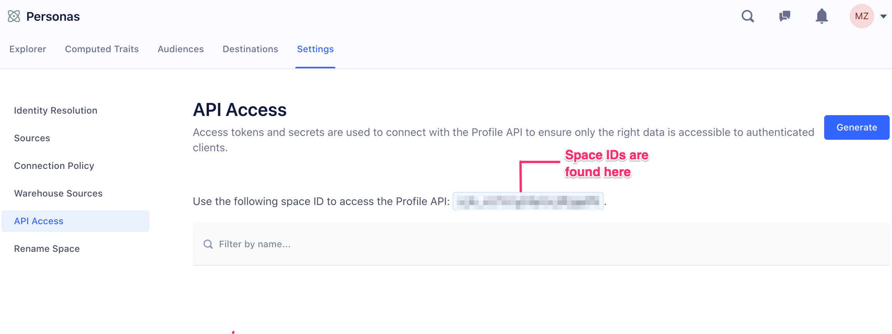

The Segment Profile API provides a single API to read user-level and account-level customer data. Segment now allows you to query the entire user or account object programmatically, including the `external_ids` , `traits` , and `events` that make up a user's journey through your product.

<!-- We need links to glossary pages here ^ -->

You can use this API to…

- **Build an in-app recommendation engine** to show users or accounts the last 5 products they viewed but didn't purchase
- **Train user-level machine learning prediction models** to determine a users next purchase or likelihood to churn
- **Empower your** **sales and** **support associates with the complete customer context** by embedding the user profile in third-party tools like Zendesk or Desk.com
- **Qualify leads faster** by embedding the user event timeline in Salesforce

This document has four parts…

1. [**Product Highlights**](/docs/personas/profile-api/#product-highlights)
2. [**Quickstart**](/docs/personas/profile-api/#quickstart): Walks you through how to get started querying your user profile in <1 min
3. [**API Reference**](/docs/personas/profile-api/#api-reference): Retrieve a list of users sorted by recent activity or find a particular user
4. [**Personalization**](/docs/personas/profile-api/#recommended-implementation): Example personalization solution built on Personas using server-side personalization

## Product Highlights
1. **Realtime Access** - fetch your entire user profile
2. **Realtime Data** — query streaming data on the user profile that happened seconds ago
3. **One Identity** — query an end user's interactions across web, mobile, server, and third party touch-points
4. **Rich Data** — query any amount of custom events or user traits
5. **Any External ID** — the API supports query from any external ID: email, user_id, advertising IDs, anonymous_id, and any custom external ID.

## Quickstart

### Set up Access
Your access secret allows you to call the Segment API and access customer data.  We do not recommend exposing this key in client applications (see the end of this section for more details).


1.  Go to _Personas > Settings > API Access_: `https://app.segment.com/<your-workspace>/personas/settings` (replace <your-workspace> with your own workspace).
2.  Create your **Access Secret** with name, for e.g. `testing/development`

    

3.  Press Generate. Copy the resulting **Access Secret** and store it in a file on your computer as it's only shown once. You'll pass in the **Access Secret** into the Profile API for authorization (using the HTTP basic auth username).
    

4.  Profile API request URLs require your space ID. For example:
    `https://profiles.segment.com/v1/spaces/<your-namespace-id>/collections/users/profiles/<external_id>/events`

    Your namespace ID can be found here: [https://app.segment.com/goto-my-workspace/personas/spaces/default/settings/api-access](https://app.segment.com/goto-my-workspace/personas/spaces/default/settings/api-access)

      


**B. Find a user's external id**

1. Head over to Personas > Explorer: `https://app.segment.com/<your-workspace>/personas/explorer` (replace **your-workspace** with your own workspace slug)
2. And press on any interesting user in the list.
3. Copy their `external_id` (ex: `email:bob@example.com`)


**C. Query the user's event history**

1.  Download and open [Postman](https://www.getpostman.com/), a nice app for exploring HTTP APIs
2.  Create your Postman GET request to query the user's event's history:
    i. The URL is:
       `https://profiles.segment.com/v1/spaces/<your-namespace-id>/collections/users/profiles/<external_id>/events`

    ii. Replace `<your-namespace-id>` with your own namespace id found here:
         [https://app.segment.com/goto-my-workspace/personas/spaces/default/settings/api-access](https://app.segment.com/goto-my-workspace/personas/spaces/default/settings/api-access)


    iii. Replace `<id_type:ext_id>` with your external id type and id pair from step B

    iv. Copy your **Access Secret** from step (A) into the _Basic Auth > Username field_. Leave Password empty.


    

3.  Press the Send button in Postman.

**D. Explore the user's event history in the response**


**E. Explore more of the API**

**Search by an External ID**
You can query directly by a user's email or user_id:

`https://profiles.segment.com/v1/spaces/<your-namespace-id>/collections/users/profiles/email:user@example.com/events`


`https://profiles.segment.com/v1/spaces/<your-namespace-id>/collections/users/profiles/user_id:u1234567/events`

**External IDs**
You can query all of a user's external ids (email, anonymous_id, user_id):

`https://profiles.segment.com/v1/spaces/<your-namespace-id>/collections/users/profiles/email:user@example.com/external_ids`

**Traits**
You can query a user's traits (first_name, last_name, ...):


`https://profiles.segment.com/v1/spaces/<your-namespace-id>/collections/users/profiles/<your-segment-id>/traits`

By default, we will include 20 traits. You can return up to 200 traits by appending `?limit=200` to the querystring. If you wish to return a specific trait, append `?include={trait}` to the querystring (eg `?include=age`).

**Metadata**
You can query all of a user's metadata (created_at, updated_at, ...):

`https://profiles.segment.com/v1/spaces/<your-namespace-id>/collections/users/profiles/<your-segment-id>/metadata`

**Search an account profile**

If you are sending group calls to Segment, you can now access your account profiles as well. You can retrieve your account traits, computed traits, and audience traits by querying the `group_id` you are interested in:

`https://profiles.segment.com/v1/spaces/<your-namespace-id>/collections/accounts/profiles/group_id:12345/traits`

**Search for linked users or accounts**

If you are looking to find all the users linked to an account, you can search for an account's linked users, or a user's linked accounts.

`https://profiles.segment.com/v1/spaces/<your-namespace-id>/collections/accounts/profiles/group_id:12345/links`

### cURL

You can also request using cURL:

```bash
export SEGMENT_ACCESS_SECRET="YOUR_API_ACCESS_TOKEN_SECRET_HERE"

curl https://profiles.segment.com/v1/spaces/<your-namespace-id>/collections/users/profiles/<your-segment-id>/events -u $SEGMENT_ACCESS_SECRET:
```


## API Reference

The Segment API is organized around [REST](http://en.wikipedia.org/wiki/Representational_State_Transfer). Our API has predictable, resource-oriented URLs, and uses HTTP response codes to indicate API errors. We use built-in HTTP features, like HTTP authentication and HTTP verbs, which are understood by off-the-shelf HTTP clients.  [JSON](http://www.json.org/) is returned by all API responses, including errors.

**Endpoint**

    https://profiles.segment.com


### Authentication

The Profile API uses basic authentication for authorization — with the **Access Secret** as the authorization key. Your **Access Secret** carries access to all of your customer data, so be sure to keep them secret! Do not share your Access Secret in publicly accessible areas such as GitHub, client-side code, and so forth.

You can create your Access Secret in your Personas Settings page. We strongly recommend naming your keys with the name of your app and its environment, such as `marketing_site/production`. We will only show your Access Secret once — you won't be able to see it again. In the case of a security event, you can revoke and cycle the access secret.


When making requests to the Profile API, use the Access Secret as the basic authentication username and keep the password blank.

```bash
curl https://profiles.segment.com/v1/spaces/<namespace_id>/collections/users/profiles
  -u $SEGMENT_ACCESS_SECRET:
```


### Errors

Segment  uses conventional HTTP response codes to indicate the success or failure of an API request. In general, codes in the `2xx` range indicate success, codes in the `4xx` range indicate an error that failed given the information provided (e.g., a required parameter was omitted, etc.), and codes in the `5xx` range indicate an error with Segment's servers.

**HTTP Status**

| **HTTP Status**                        | **Description**                                                                                  |
| -------------------------------------- | ------------------------------------------------------------------------------------------------ |
| **200 - OK**                           | Everything worked as expected.                                                                   |
| **400 - Bad Request**                  | The request was unacceptable, often due to missing a required parameter.                         |
| **401 - Unauthorized**                 | No valid Access Secret provided.                                                                 |
| **404 - Not Found**                    | The requested resource doesn't exist.                                                            |
| **429 - Too Many Requests**            | Too many requests hit the API too quickly. We recommend an exponential backoff of your requests.    |
| **500, 502, 503, 504 - Server Errors** | Something went wrong on Segment's side.                                    |

**Error Body**

```js
{
  "error": {
    "code": "validation_error",
    "message": "The parameter `collection` has invalid character(s) `!`"
  }
}
```

| **Code**                  | **Message**  |
| ------------------------- | -------------|
| **authentication_error**  | Failure to properly authenticate yourself in the request.                    |
| **invalid_request_error** | Invalid request errors arise when your request has invalid parameters.                 |
| **rate_limit_error**      | Too many requests hit the API too quickly.                    |
| **validation_error**      | Errors triggered when failing to validate fields (e.g., when a collection name has invalid characters). |

### Rate Limit

Every Access Secret has a default rate limit of 60,000 requests/min. That limit can be adjusted over time.


### Pagination

All top-level API resources have support for bulk fetches using "list" API methods. For instance you can list profiles, a profile's events, a profile's traits, and a profile's external_ids. These list API methods share a common structure, taking at least two parameters: `next` and `limit`.

#### Request Arguments

| **Argument** | **Description**                                                     |
| ------------ | ------------------------------------------------------------------- |
| `next`       | The string cursor that indexes the next page of requests.           |
| `limit`      | A limit on the number of objects to be returned, between 1 and 100. |

#### Response Arguments

| **Argument** | **Description**                                                                                                      |
| ------------ | -------------------------------------------------------------------------------------------------------------------- |
| `has_more`   | Whether or not there are more elements available after this set. If `false`, this set comprises the end of the list. |
| `next`       | The string cursor that indexes the next page of requests.                                                            |
| `url`        | The URL for accessing this list.                                                                                     |

#### Request IDs

Each API request has an associated request identifier. You can find this value in the response headers, under `Request-Id`. **If you need to contact us about a specific request, providing the request identifier will ensure the fastest possible resolution.**

```bash
curl -i https://profiles.segment.com/v1/spaces/<namespace_id>/collections/users/profiles
HTTP/1.1 200 OK
Date: Mon, 01 Jul 2013 17:27:06 GMT
Status: 200 OK
Request-Id: 1111-2222-3333-4444
```

### Routes

| **Name**                     | **Route** https://profiles.segment.com/v1/spaces/:space_id:/ ... |
| ---------------------------- | -------------------------------------------------------------------- |
| Get a Profile's Traits       | collections/users/profiles/email:amir@segment.com/traits             |
| Get a Profile's External IDs | collections/users/profiles/email:amir@segment.com/external_ids       |
| Get a Profile's Metadata     | collections/users/profiles/email:amir@segment.com/metadata           |
| Get a Profile's Events       | collections/users/profiles/email:amir@segment.com/events             |
| Get a Profile's Links        | collections/users/profiles/email:amir@segment.com/links              |

#### Get a Profile's Traits

Get a single profile's traits within a collection using an `external_id`. For example, two different sources can set a different `first_name` for a user. The traits endpoint will resolve properties from multiple sources into a canonical source using the last updated precedence order.

```
GET /v1/spaces/<namespace_id>/collections/<users>/profiles/<external_id>/traits
```

**Examples**
Here's what it looks to search for a profile's traits by an external id, like by an `email`:

```
GET /v1/spaces/lg8283283/collections/users/profiles/email:amir@segment.com/traits
```

Or a `user_id`:

```
GET /v1/spaces/lg8283283/collections/users/profiles/user_id:u1234/traits
```

**Request**

```bash
    curl https://profiles.segment.com/v1/spaces/:namespace_id:/collections/users/profiles/<id_type:ext_id>/traits
      -X GET
      -u $SEGMENT_ACCESS_SECRET:
```

**404 Not Found**

```js
{
  "error": {
    "code": "not_found",
    "message": "Profile was not found."
  }
}
```

**200 OK**

```js
{
  "traits": {
    "first_name": "Bob",
    "emails_opened_last_30_days": 33,
  },
  "cursor": {
    "url": "/v1/spaces/lgJ4AAjFN4/collections/users/profiles/use_RkjG0kW53igMijEISMH0vKBF4sL/traits",
    "has_more": false,
    "next": ""
  }
}

```

And when ?**verbose=true** mode on:

```js
{
  "traits": {
    "first_name": {
      "value": "Bob",
      "source_id": "..",
      "updated_at": ".."
    }
    "emails_opened_last_30_days": {
      "value": 33,
      "source_id": "..",
      "updated_at": ".."
    }
  },
  "cursor": {
    "url": "/v1/spaces/lgJ4AAjFN4/collections/users/profiles/use_RkjG0kW53igMijEISMH0vKBF4sL/traits",
    "has_more": false,
    "next": ""
  }
}
```

**Query Parameters**

| **Argument** | **Description**                                     | **Example**     |
| ------------ | --------------------------------------------------- | --------------- |
| `include`    | A comma-separated list of property keys to include. | first_name,city |
| `verbose`    | True for verbose field selection                    | true,false      |
| `limit`      | Defines how many traits are returned in one call    | 100             |


#### Get a Profile's External IDs

Get a single profile's external ids within a collection using an `external_id`.

```
GET /v1/spaces/<namespace_id>/collections/<users>/profiles/<id_type:ext_id>/external_ids
```

**Request**

```bash
curl https://profiles.segment.com/v1/spaces/:namespace_id:/collections/users/profiles/<id_type:ext_id>/external_ids
  -X GET
  -u $SEGMENT_ACCESS_SECRET:
```

**404 Not Found**

```js
{
  "error": {
    "code": "not_found",
    "message": "Profile was not found."
  }
}
```

**200 OK**

```js
{
  "data": [
      {
        "source_id": "GFu4AJc2bE"
        "collection": "users",
        "id": "1d1cd931-bc7d-4e39-a1a7-61563296fb15",
        "type": "cross_domain_id",
        "created_at": "2017-11-30T06:05:01.40468Z",
        "encoding": "none",
        "first_message_id": "ajs-0af8675aa114c759210a76b2baea0a03-clean",
      }
    ],
    "cursor": {
      "url": "/v1/spaces/lgJ4AAjFN4/collections/users/profiles/use_RkjG0kW53igMijEISMH0vKBF4sL/external_ids",
      "has_more": true,
      "next": "map_0vKouKs2XyirgwMO4SmnDGaps7j"
    }
}
```

**Query Parameters**

| **Argument** | **Description**                                        | **Example**   |
| ------------ | ------------------------------------------------------ | ------------- |
| `include`    | A comma-separated list of external id type to include. | user_id,email |
| `verbose`    | True for verbose field selection                       | true,false    |
| `limit`      | Defines how many external ids are returned in one call | 100           |


#### Get a Profile's Events

Get a single profile's events within a collection using an `external_id`.

```
    GET /v1/spaces/<namespace_id>/collections/<users>/profiles/<external_id>/events
```

**Request**

```js
    curl https://profiles.segment.com/v1/spaces/:namespace_id:/collections/users/profiles/<external_id>/events
      -X GET
      -u $SEGMENT_ACCESS_SECRET:
```

**404 Not Found**

```js
{
  "error": {
    "code": "not_found",
    "message": "Profile was not found."
  }
}
```

**200 OK**

```js
{
  "data": [
    {
      "external_ids": [
        {
          "collection": "users",
          "type": "user_id",
          "id": "c0HN02fNe1",
          "encoding": "none"
        },
        {
          "collection": "users",
          "type": "cross_domain_id",
          "id": "1d1cd931-bc7d-4e39-a1a7-61563296fb15",
          "encoding": "none"
        }
      ],
      "context": {
        "ip": "73.92.233.78",
        "library": {
            "name": "analytics.js",
            "version": "3.2.5"
        },
        "page": {
            "path": "/docs/connections/spec/ecommerce/v2/",
            "referrer": "https://www.google.com/",
            "search": "",
            "title": "Spec: V2 Ecommerce Events Documentation - Segment",
            "url": "https://segment.com/docs/connections/spec/ecommerce/v2/"
        },
        "traits": {
            "crossDomainId": "1d1cd931-bc7d-4e39-a1a7-61563296fb15"
        },
        "userAgent": "Mozilla/5.0 (Macintosh; Intel Mac OS X 10_13_2) AppleWebKit/537.36 (KHTML, like Gecko) Chrome/63.0.3239.84 Safari/537.36"
      },
      "type": "track",
      "message_id": "ajs-1a6064a677b3c16a01b8055c18f16e0b-clean",
      "source_id": "CRx5M9uk2p",
      "timestamp": "2018-01-05T00:16:35.663Z",
      "properties": {
        "name": "Docs",
        "page_name": "Docs",
        "path": "/docs/connections/spec/ecommerce/v2/",
        "referrer": "https://www.google.com/",
        "search": "",
        "section": "Spec",
        "title": "Spec: V2 Ecommerce Events Documentation - Segment",
        "topic": "Spec: V2 Ecommerce Events",
        "url": "https://segment.com/docs/connections/spec/ecommerce/v2/"
      },
      "event": "Page Viewed",
      "related": {
        "users": "use_RkjG0kW53igMijEISMH0vKBF4sL"
      }
    }
  ],
  "cursor": {
    "url": "/v1/spaces/lgJ4AAjFN4/collections/users/profiles/use_RkjG0kW53igMijEISMH0vKBF4sL/events",
    "has_more": true,
    "next": "MTUxMzc1NTQzNjg2NzAwMDAwMDo6YWpzLTcyMWFhNzFjNDM2ZWJhOTUyYmI1ZmNiMzJlZWI3MWMzLWNsZWFu"
  }
}
```

**Query Parameters**

| **Argument** | **Description**                                                                   | **Example**                   |
| ------------ | --------------------------------------------------------------------------------- | ----------------------------- |
| `include`    | A comma-separated list of event keys to include.                                  | Page Viewed,Experiment Viewed |
| `exclude`    | A comma-separated list of event keys to excluse.                                  | Page Viewed,Experiment Viewed |
| `start`      | Returns all the events that start after `start` (in ISO 8601).                    | 2006-01-02                    |
| `end`        | Returns all the events that end before `end` (in ISO 8601).                       | 2018-01-02                    |
| `sort`       | Determines whether the result is ascending or descending. Defaults to descending. | asc,desc                      |
| `limit`      | Defines how many events are returned in one call                                  | 100                           |

#### Get a Profile's Metadata

Get a single profile's metadata within a collection using an `external_id`.

```
    GET /v1/spaces/<namespace_id>/collections/<users>/profiles/<external_id>/metadata
```

**Request**

```bash
    curl https://profiles.segment.com/v1/spaces/:namespace_id:/collections/users/profiles/<external_id>/metadata
      -X GET
      -u $SEGMENT_ACCESS_SECRET:
```

**404 Not Found**

```js
{
  "error": {
    "code": "not_found",
    "message": "Profile was not found."
  }
}
```

**200 OK**

```js
{
  "metadata": {
    "created_at": "2017-10-23T00:22:42.78Z",
    "updated_at": "2018-01-05T00:16:36.919Z",
    "expires_at": null,
    "first_message_id": "ajs-32ed8dea3980c0c92ed2b8c9c8c5dfb5-clean",
    "first_source_id": "GFu4AJc2bE",
    "last_message_id": "ajs-1a6064a677b3c16a01b8055c18f16e0b-clean",
    "last_source_id": "CRx5M9uk2p",
  },
}
```

**Query Parameters**

| **Argument** | **Description**                  | **Example** |
| ------------ | -------------------------------- | ----------- |
| `verbose`    | True for verbose field selection | true,false  |


#### Get a Profile's Linked Users or Accounts

Get the users linked to an account, or accounts linked to a user, using an `external_id`.

```
GET /v1/spaces/<namespace_id>/collections/<users>/profiles/<external_id>/links
```

**Request**

```bash
    curl https://profiles.segment.com/v1/spaces/:namespace_id:/collections/users/profiles/<external_id>/links
      -X GET
      -u $SEGMENT_ACCESS_SECRET:
```

**404 Not Found**

```js
{
  "error": {
    "code": "not_found",
    "message": "Profile was not found."
  }
}
```
**200 OK**
```js
{
    "data": [
        {
            "to_collection": "accounts",
            "external_ids": [
                {
                    "id": "ADGCJE3Y8H",
                    "type": "group_id",
                    "source_id": "DFAAJc2bE",
                    "collection": "accounts",
                    "created_at": "2018-10-06T03:43:26.63387Z",
                    "encoding": "none"
                }
            ]
        },
        {
            "to_collection": "accounts",
            "external_ids": [
                {
                    "id": "ghdctIwnA",
                    "type": "group_id",
                    "source_id": "DFAAJc2bE",
                    "collection": "accounts",
                    "created_at": "2018-10-07T06:22:47.406773Z",
                    "encoding": "none"
                }
            ]
        }
    ]
}
```

## Personalization
###  Recommended Implementation

Segment provides an API where customers can fetch data about their users given an identifier (e.g email or user id) and an authorized access secret. We recommend you integrate using a server-side personalization pattern.


Since this API has access to all of a customer's data, we do not support CORS and ask that you do not expose the access secret (e.g. in a client-side app). We advise customers to create personalization service in their infrastructure that other apps, websites or services communicate with to fetch personalizations about their users.


### Example Workflow

If you want to display the most relevant blog posts given a reader's favorite blog category:


1.  **Create a computed trait** `favorite_blog_category` **in Segment UI** [Marketer or Engineer]
2.  **Create** `/api/recommended-posts` **in customer-built personalization service** [Engineer]
    - Accept `user_id`, `email` or `anonymous_id` to fetch `favorite_blog_category` using API
    - Return array of most recent posts of that category to render in recommended section
3.  **Add recommended section to the blog** [Engineer]
    - Client-side by making a request to `/recommended-posts` if it accepts CORS (recommended for static blogs, WordPress plugin, or other CMS solutions)
    - Server-side by collecting all the personalizations you want to make on the blog in a single request to increase the total time to load (recommended for custom blog setup)

Now, users who take a few minutes to read through an article on the blog will find posts recommended using their historical reading pattern including the post they just read.

## Custom External IDs

One of the Profile API's strengths is that you can query using custom external IDs. For example, let's say that each user can have a distinct subscription id. You can add it as a custom external ID:

```javascript
analytics.track('Subscription Upgraded', {
   plan: 'Pro',
   mrr: 99.99
}, {
  externalIds: [
    {
      id: 'sub_1923923',
      type: 'subscription_id',
      collection: 'users',
      encoding: 'none'
    }
  ]
})
```

> note ""
> **Note:** The `type` value should use snake_case notation; camelCase and special characters are not currently supported.

Now you can query the Profile API by subscription_id:

```
https://profiles.segment.com/v1/spaces/<your-namespace-id>/collections/users/profiles/subscription_id:sub_1923923/traits
```
