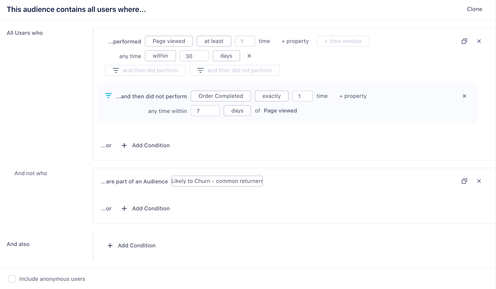
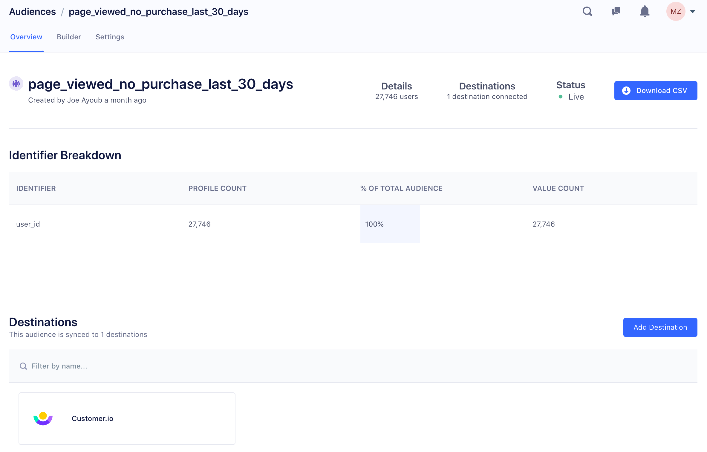

This guide walks you through the set up process for a simple Personas Space, which you can use if your Segment implementation is simple. If your implementation is complex, you can use this to demonstrate and test Personas before working on a more complex configuration.

## Personas Configuration Requirements

Personas is an add-on product that works alongside the core Segment [Connections product](/docs/connections/). Before you set up Personas, you must first set up and configure Segment Connections.

To configure and use Personas, you need the following:

1. **A Segment account and Workspace.**
2. **Events flowing into Connections** from your digital properties where most of your valuable user behavior occurs.
3. **Personas Administrator access.** You must be either be a workspace admin, or a workspace user with Personas admin access to set up audiences and computed trait. You can check your permissions by navigating to [Access Management](https://app.segment.com/goto-my-workspace/settings/access-management) in your workspace settings. See the [Segment Access Management documentation](/docs/segment-app/iam/) for more details.

## Step 1: Create a New Developer Space

When you first start working with Personas, you should start by creating a "Developer" Personas space. This is your experimental and test environment while you learn more about how Personas works. You can validate that identity resolution is working correctly, test audiences and traits in the Developer space, and then apply those changes to your *Production* space once you're sure everything is working as expected.

This two-space method prevents you from making untested configuration changes that immediately affect production data.

<!-- TODO: I can't see this in any of the spaces I'm an admin in
To create a Personas space:
1. In your Segment workspace, click **Personas** from the left-navigation.
2.  -->

## Step 2: Invite teammates to your Personas Space

You probably have teammates who help set up your Segment Workspace with the data you need. Invite them to your personas dev space and grant them access to the space. Navigate to [Access Management](https://app.segment.com/goto-my-workspace/settings/access-management) in your workspace settings to add them.

<!-- TODO: actually add steps here -->

## Step 3: Connect Production Sources

1. From your Personas space, go to your Space Settings and click **Sources**.
2. On the screen that appears, choose one or two production sources from your Connections workspace.
   We recommend connecting your production website or App source as a great starting point.

> success ""
> **Tip:** It sounds a little counter- intuitive to connect a production source to a developer Personas space, but your production sources have rich user data in them, which is what you need to build and validate user profiles.

Once you select sources, Segment starts a replay of one month of historical data from these sources into your Personas space. We're doing this step first so you have some user data in Personas to build your first audiences and computed traits.

The replay usually takes several hours, but the duration will vary depending on how much data you have sent through these sources in the past one month. When the replay finishes, you are notified in the Sources tab under Settings, shown below.

> warning ""
> **Note**: Data replays start with the earliest (oldest) chronological events in the one month window, and finish with the most recent. Don't continue to the next step until all replays are marked complete. If you do, the data in your Personas data will be stale.

Once the Source(s) finish replaying, data from your connected Sources flows into Personas in near real time, just like it does for sources in your Segment workspace.

## Step 4: Check your Profile data

Once the replay finishes, you can see the data replayed into Personas using the Profile Explorer. You should have a lot! The data should include information from multiple sources and multiple sessions, all resolved into a single profile per user.

Before you continue, check a few user profiles to make sure they show an accurate and recent snapshot of your users.

A good test this is to look at _your own_ user profile, and maybe some colleagues' profiles. Look in the Profile Explorer for your Profile, and look at your event history, custom traits and identifiers. If these identifiers look correct across a few different profiles (and you can verify that they are all correct), then you're ready to create an audience.

If your user profiles look wrong, or you aren't confident users are being accurately defined and merged, stop here and troubleshoot. It's important to have accurate identity resolution before you continue. See the [detailed Identity Resolution documentation](/docs/personas/identity-resolution/) to better understand how it works, and why you may be running into problems. (Still need help? [Contact us](https://segment.com/help/contact/) for assistance.)

## Step 5: Create An Audience

You can build an audience using any of the source data that flows into your Personas space. To further verify your data, in this step create an Audience that you are familiar with, and that you already have a rough idea of the size of. For example, you might know the number of new website user sign-ups in the last seven days, if you've connected your production website source to Personas.

The Audience Builder UI prompts you to filter your users using on specific behaviors that they performed. The audience in the example below is all the users who have performed the event `User Signed Up` at least one time within the last 7 days:

To build your own audience:
1. Navigate to your Personas space.
2. Click the Audiences tab, then click **New Audience**.
3. Click **Add Condition**, and choose among the options that appear:
   - Performed an Event
   - Part of an Audience
   - Have a Computed Trait
   - Have a SQL Trait
   - Have a Custom Trait
4. Configure the settings for your condition. These vary by type, so explore the different options.
5. Optionally, add more conditions until you're satisfied that the audience will only contain the users you want to target.

Once you build your audience, click **Preview Results** to see the total number of users who meet the audience criteria, for example all users who signed up within the last seven days.

## Step 6:  Connect the Audience to a Destination

Once you create your test audience, click **Select Destinations**. Personas guides you through configuration steps to set up a destination for your audience. If you don't already have destinations configured for the Personas space, the you are prompted to select one or more. Finally, enter a name for the audience.

The larger the audience you're creating, the longer it takes Personas to successfully compute the Audience. The Audience page shows a status that indicates if the audience is still being calculated. When the total number of users appears in the Audience overview, as in the example screenshot below, the audience has successfully finished computing, and Personas then sends the audience to the destination you selected.

## Step 7: Validate that your audience is appearing in your destination

Audiences are either sent to destinations as a boolean user-property (for example `New_Users_7days=true` or a user-list, depending on what the destination supports. Read more about [which destinations support which types of data](/docs/personas/using-personas-data/#personas-compatible-destinations-event-type).

The UIs for the destination tools you send the audience data to are different, so the process of validating the audience varies per tool. However, the guiding principle is the same. You should be able to identify the full group of users who are members of your audience in your destination.

## Step 8: Create your Production Space

Once you validate that your full audience is arriving in your destination, you're ready to create a Production space. We recommend you repeat the same steps outlined above, focusing on your production use cases and data sources.
