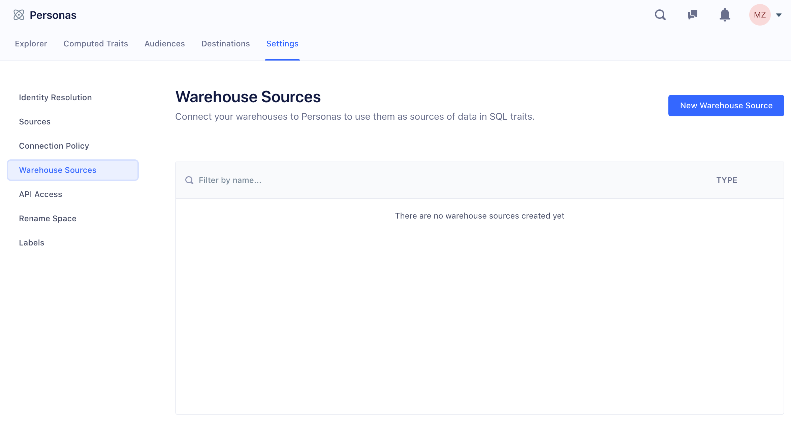
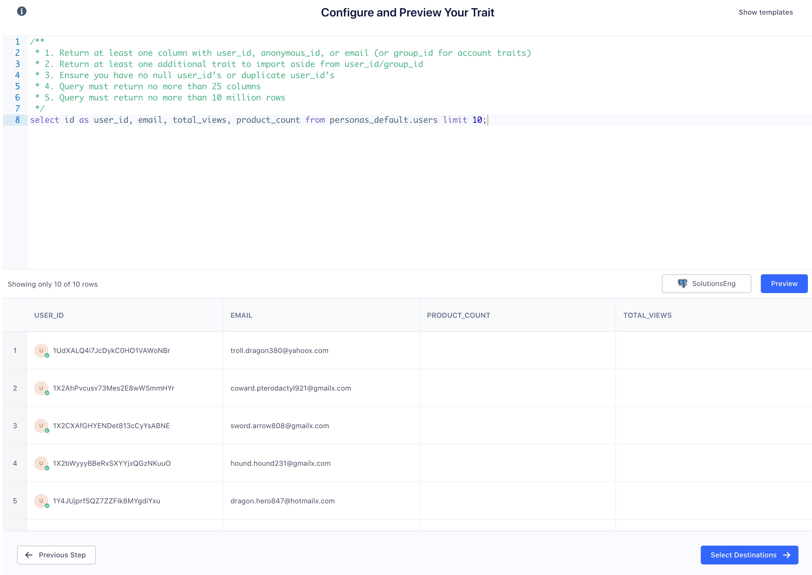
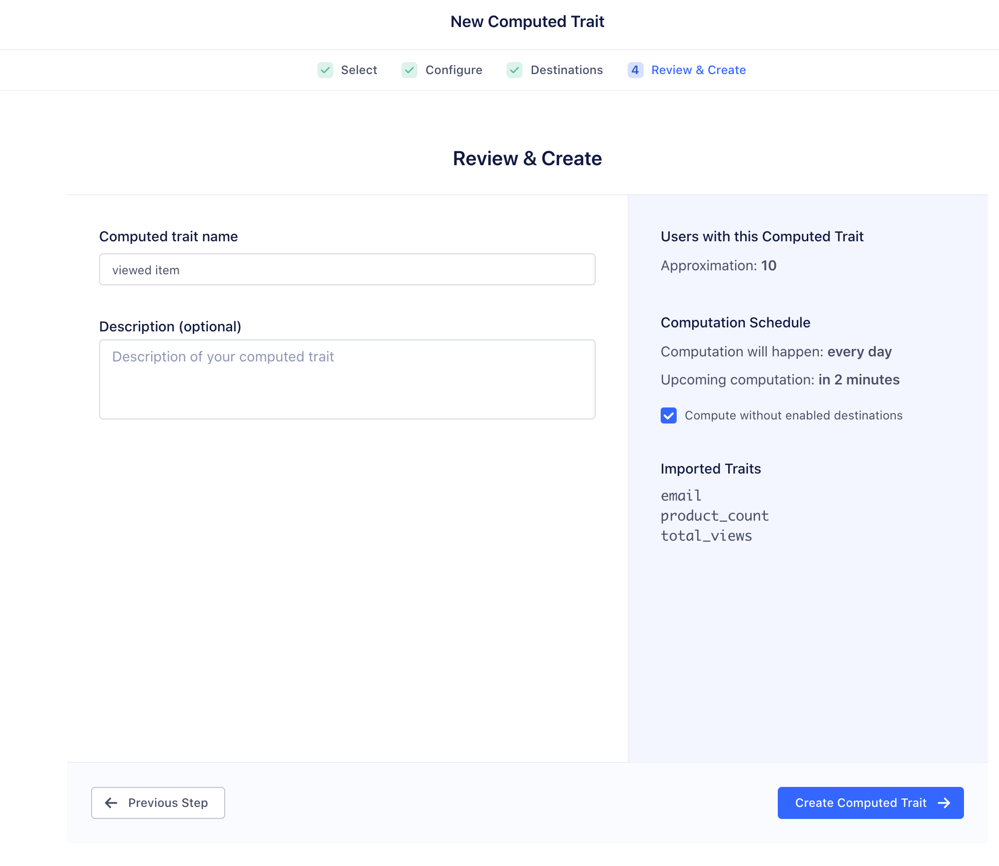

Use SQL Traits to import user or account traits from your data warehouse back into Personas to build audiences or to enhance Segment data that you send to other Destinations.

SQL Traits are only limited by the data in your warehouse. Because anything you can write a query for can become a SQL Trait, you can add detail to your user and account profiles, resulting in more nuanced personalization.

This unlocks some interesting possibilities to help you meet your business goals.

- To improve your support team's customer satisfaction score (CSAT), create a SQL Trait of the most common ticket requests for a customer's industry by joining data from cloud sources like Zendesk and Salesforce.  The resulting SQL Trait helps you anticipate the user's problems and accelerate potential solutions.
- To determine if a user resides in a specific area, query address data in your warehouse and send it as a `true` or `false` Trait to a Personas audience.
- To fill gaps in your customer profiles to include information before you implemented Segment, import historical Traits from your warehouse.
- To predict a customer's lifetime value (LTV), generate a complex query based on demographic and customer data in your warehouse. You can then use that information in a Personas audience to send personalized offers or recommend specific products.
- To inform your outreach efforts, use complex queries to build churn or product adoption models.

Check out Segment's [SQL Traits blog post](https://segment.com/blog/sql-traits){:target="_blank"} for more customer case studies.


### Example: Cloud Sources Sync

SQL Traits allow you to import data from [object cloud sources](/docs/connections/sources/#object-cloud-sources) like Salesforce, Stripe, Zendesk, Hubspot, Marketo, Intercom, and more. For example, bring in Salesforce Leads or Accounts, Zendesk ticket behavior, or Stripe LTV calculations.

The two examples below show SQL queries you can use to retrieve cloud-source information from your warehouse.

**Salesforce lead import**

If you want to import data from the Salesforce leads and contacts table, you can use SQL similar to the following query:

```sql
    select external_id_c as user_id,
    lead_score_c,
    lead_age_c,
    lead_status
    -- …more properties
    from salesforce.leads
```

**Has Open Ticket in Zendesk**

This query computes whether a user has an open ticket:

```sql
    select distinct u.external_id as user_id, true as has_open_ticket
    from zendesk.tickets t
    join zendesk.users u
    on u.id = t.requester_id
    where t.status in ('pending','open','hold','new')
```


## Setting up SQL Traits

To use SQL Traits, you need the following:

- a warehouse connected to Segment
- a Personas-enabled Segment workspace
- a user account with access to Personas in that workspace

### Step 1. Set up a warehouse source

Segment supports Redshift, Postgres, Snowflake, Azure SQL, and BigQuery as data warehouse sources for SQL Traits. Note that the BigQuery setup process _requires_ a service user.

> info "Safeguard your data"
> For any warehouse, Segment recommends that you create a separate read-only user for building SQL Traits.

#### Redshift, Postgres, Snowflake, Azure SQL setup

If you don't already have a data warehouse, use one of the following guides to get started:
- [Redshift Getting Started](/docs/connections/storage/catalog/redshift/#getting-started)
- [Postgres Getting Started](/docs/connections/storage/catalog/postgres/#getting-started)
- [Snowflake Getting Started](/docs/connections/storage/catalog/snowflake/#getting-started)
- [Azure SQL Getting Started](/docs/connections/storage/catalog/azuresqldw/#getting-started)


#### BigQuery setup

To connect BigQuery to Segment SQL Traits, follow these instructions to create a service account for Segment to use:

1. Navigate to the Google Developers Console.

2. Click the drop down to the left of the search bar and select the project that you want to connect.

   

   > **Note**: If you don't see the project you want in the menu, click the account switcher in the upper right corner, and verify that you're logged in to the right Google account for the project.

3. Click the menu in the upper left and select **IAM & Admin**, then **Service accounts**.

5. Click **Create Service Account**.

   

6. Give the service account a name like `segment-sqltraits`.

7. Under **Project Role**, add _only_ the `BigQuery Data Viewer` and `BigQuery Job User` roles.

   

   

   > IMPORTANT: Do not add any other roles to the service account. Adding other roles can prevent Segment from connecting to the account.

6. Click **Create Key**.

   

7. Select `JSON` and click **Create**.

   

   A file with the key is saved to your computer. Save this; you'll need it to set up the warehouse source in the next step.

   

   You're now ready to create a new BigQuery warehouse source, upload the JSON key you just downloaded, and complete the BigQuery setup.

### Step 2. Add the warehouse as a Personas Source

Once your warehouse is up and running, follow these steps:

1. Navigate to the Personas settings (Personas > Settings tab > Warehouse Sources), and click **New Warehouse Source**.

   

2. Select the type of warehouse you're connecting.

   

3. In the next screen, provide the connection credentials, and click **Save**.

  

  If you're connecting a BigQuery warehouse, use the JSON key file that you downloaded as the last step.

## Creating a SQL Trait

Before you create a SQL Trait, you must first preview it to validate your query. If you're new to SQL, try out one of the templates Segment offers.

### Preview the SQL Trait

From the Personas screen, go to the Computed Traits tab, and click **New Computed Trait**. Next, choose SQL, and click **Configure**. Select the data warehouse that contains the data you want to query.

If you're sending data from [object cloud sources](/docs/connections/sources/#cloud-apps) to your warehouse, the SQL Traits UI has some pre-made templates you can try out.


<!-- need to actually give a sample here -->

When you're building your query, keep the following requirements in mind for the data your query returns.

- The query must return a column with a `user_id`, `email`, or `anonymous_id` (or `group_id` for account traits, if you have Personas for B2B enabled). The query _cannot_ include values for both `user_id` and `anonymous_id`.
- The query must return at least one trait in addition to `user_id`/`anonymous_id`/`email`/`group_id`, and no more than 25 total columns.
- The query must not return any `user_id`s, `anonymous_id`s, or `group_id`s with a `null` value.
- The query must not return any records with duplicate `user_id`s.
- The query must not return more than 25 million rows.
- Each record must be less than 16kb in size to adhere to [Segment's maximum request size](/docs/connections/sources/catalog/libraries/server/http-api/#max-request-size).

A successful preview returns a sample of users and their traits.
If Segment recognizes a user already in Personas, it displays a green checkmark on their profile. Clicking the checkmark displays the user's profile. If a user has a question mark, Segment hasn't detected this `user_id` in Personas before.




### Configure SQL Trait options

Once you're ready to import the SQL Trait, select the Destinations to which you want to send the data.  If you prefer to build Personas audiences directly from the data instead of sending it to a Destination, click **Skip**.


Give your SQL Trait a descriptive name. If you're importing multiple Traits, use a name like "Zendesk Traits". The Trait names you use in audience-building or in your downstream tools correspond to the column names from the query.

If you're building Personas audiences from this data, select "Compute without enabled destinations".

Click **Create Computed Trait** to save the Trait.


Check **Compute without destinations** if you only want to send to Personas.

When you create a SQL Trait, Segment runs the query on the warehouse twice a day by default. You can customize the time at which Segment queries the data warehouse and  the frequency, up to once per hour, from the SQL Trait's settings.
(If you're interested in a more frequent schedule, [contact Segment Support](https://segment.com/help/contact/){:target="_blank"}.)

For each row (user or account) in the query result, Personas sends an identify or group call with all the columns that were returned as Traits. For example, if you write a query that returns `user_id, has_open_ticket, num_tickets_90_days, avg_zendesk_rating_90days` Segment sends an identify call with the following payload:

```sql
    {
      type: 'identify',
      userId: 'u123',
      traits: {
        has_open_ticket: true,
        num_tickets_90_days: 3,
        avg_zendesk_rating_90_days: 8
      }
    }
```

## FAQs

### Is there a limit to the result set that can be queried and imported?

Yes. The result set is capped at 25 million rows.

### How often does Segment query the customer's data warehouse?

For each SQL Trait you create, you can set a compute schedule to query the data warehouse up to once per hour. Your query may run at any given time during the hour you select.

### What identifiers can I use to query a list?

You can query based on `email`, `user_id` or `anonymous_id`. If Segment doesn't locate a match based on the chosen identifier, it creates a new profile. See more below.

### Can I use SQL Traits to create users in Segment? Or do SQL Traits only append Traits to existing users?

Yes. The Personas engine sends an identify call if there is no match between the identifier you chose and an existing record. When this happens, Segment creates a new user profile. This identify call takes place in the back-end and doesn't show up in your Debugger.

### Does Personas send identify/group calls on every run?

No. Personas only sends an identify/group call if the values in a row have changed from previous runs.

### I have a large (1M+) query of users to import, should I be worried?

If you're importing a large list of users and traits, you'll need to consider your API call usage as well as volume among the partners receiving your data. These vary depending on our partners, so [reach out to Segment](https://segment.com/help/contact/){:target="_blank"} for more information.

### Is there a limit on the size of a SQL Trait's payload?

Yes, Segment limits request sizes to a maximum of 16kb. Records larger than this are discarded.

## Troubleshooting

### I'm getting a permissions error.

You might encounter a `permission denied for schema` error, like the following:


Segment usually displays this error because you're querying a schema and table that the current user cannot access. To check the table privileges for a specific grantee (user), go to [your warehouse source credentials in Personas](https://app.segment.com/goto-my-workspace/personas/settings/warehouse-sources/){:target="_blank"} to retrieve the user name.

To grant access to a table, an admin usually needs to grant access to both a schema and table through the following similar commands:

```sql
    GRANT USAGE ON SCHEMA ecommerce TO segment_user;
    GRANT SELECT ON TABLE ecommerce.users TO segment_user;
```

Learn more about granting permissions using the following links:
- [PostgreSQL Grants](https://www.postgresql.org/docs/current/sql-grant.html){:target="_blank"}
- [What does 'Grant usage on schema' do?](https://stackoverflow.com/questions/17338621/what-grant-usage-on-schema-exactly-do){:target="_blank"}

### I'm seeing a maximum columns error.


Segment supports returning only 25 columns. [Contact Segment](https://segment.com/help/contact/){:target="_blank"} with a description of your use case if you need access to more than 25 columns.

### I'm seeing a duplicate `user_id` error.


Each query row must correspond to a unique user. Segment displays this error if it detects multiple rows with the same `user_id`. Use a `distinct` or `group by` statement to ensure that each row has a unique user_id.

### I'm seeing some users/accounts in my preview with question marks. What does that mean?

Question marks in previews indicate one of two things:

**1. Segment doesn't recognize this `user_id`/`group_id` in Personas.**

In this case, for [sources connected to Personas](https://app.segment.com/goto-my-workspace/personas/settings/sources){:target="_blank"}, Segment hasn't received any event (for example, identify, track, or page) with this `user_id`. This could still be a legitimate `user_id` for a number of reasons, but before syncing, make sure you rule out option two (below), as sending a different identifier as the `user_id` can corrupt your identity graph.

**2. You have the wrong `user_id` column.**

You might be returning a value for `user_id` that's inconsistent with how you track `user_id` elsewhere. Some customers want to return `email` as the `user_id`, or a partner's tool ID as the `user_id`. These conflict with Segment best practices and corrupt the identity graph if you then track `user_id` differently elsewhere in your apps.

If you see only question marks in the preview, and have already tracked data historically with Segment, then you likely have the wrong column. If your cloud source doesn't have the database `user_id`, Segment recommends using a `JOIN` clause with an internal users table before sending the results back to Segment.
