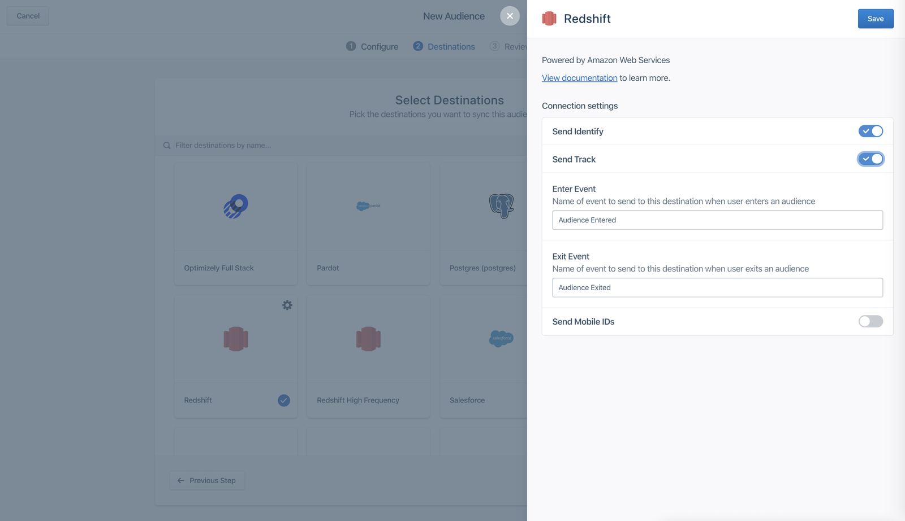
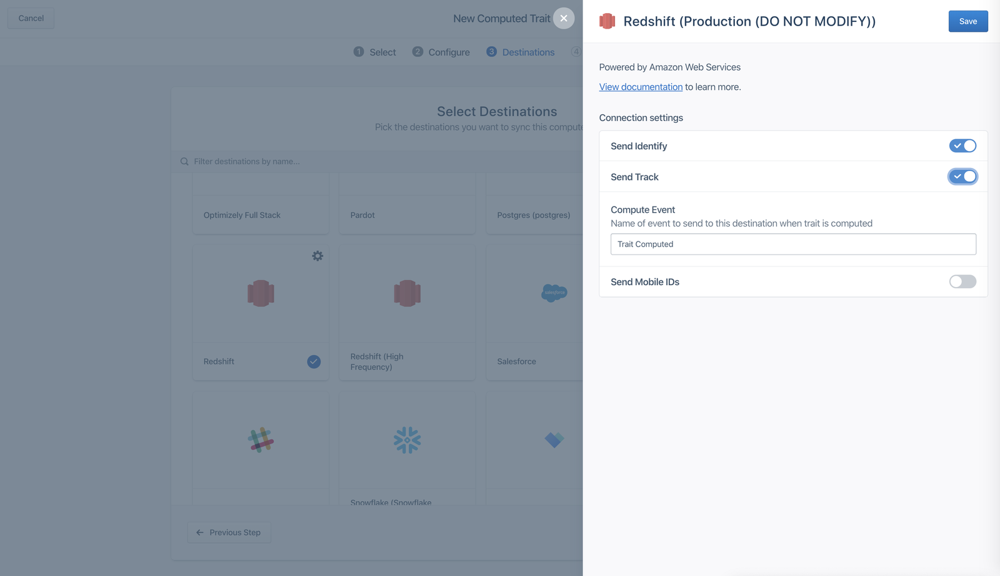
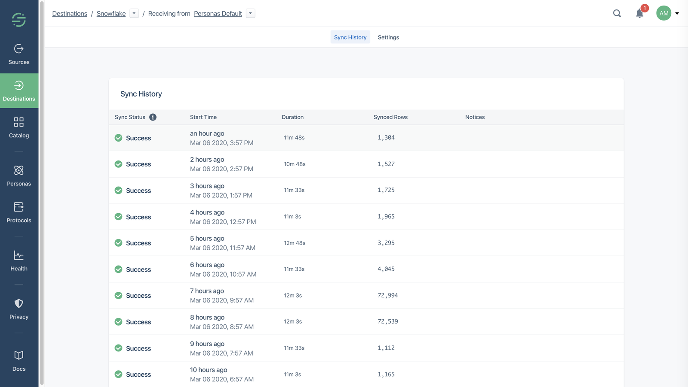

Personas provides a complete, up-to-date view of your users customer journey as it unfolds, and one of the best ways to understand the data produced by this journey is by analyzing the data in your data warehouse using SQL.

With Personas, you can send Computed Traits and Audiences to a data warehouse like Redshift, BigQuery, or Snowflake. This allows you to perform analysis and reporting around key customer audiences and campaigns, as well set up your user data as input into predictive models.

Segment makes it easy to load your customer profile data into a clean schema, so your analysts can help answer some of your toughest business questions.

## Set up

When you build an audience or computed trait, you can configure it to send an identify call or a track call to your data warehouse, and additionally include mobile ids.



## Identify calls for audiences

If you chose to send your personas data as an identify call, Personas usually sends one call per user.

When you send _audiences_ as an identify call, Personas includes a boolean trait that matches the audience name. When a user enters an audience the boolean is set to `true`, and when they exit, the boolean is set to `false`.

In the example below, you can see that the `identify` payload includes a trait of the audience `first_time_shopper` with the value of `true.`

```js
{
  "type": "identify",
  "userId": u123,
  "traits": {
     "first_time_shopper": true // false when a user exits the audience
  }
}
```

## Identify calls for computed traits

When you send _computed traits_ as an identify call, Personas sends a similar call with the computed value for that trait. In the example below, the trait `total_revenue_180_days` includes the calculated value of `450.00`.

```js
{
  "type": "identify",
  "userId": u123,
  "traits": {
     "total_revenue_180_days": 450.00
  }
}
```

## Warehouse schema for Personas identify calls

Personas identify calls appear in your warehouse using a similar format as normal Connections identify calls. Personas identify calls appear in two tables per Personas space. These tables are named with a prefix of `personas_`, then the Personas Space name, followed by `identifies` or `users`. The `identifies` table contains a record of every identify call, and the `users` table contains one record per `user_id` with the most recent value.

The `personas_` schema name is specific to the Personas space and cannot be modified. Additional audiences and computed traits appear as additional columns in these tables.

`personas_default.identifies`

| user_id | first_time_shopper | total_revenue_180_days |
| ------- | ------------------ | ---------------------- |
| u123    | true               |                        |
| u123    |                    | 450.0                  |

`personas_default.users`

| user_id | first_time_shopper | total_revenue_180_days |
| ------- | ------------------ | ---------------------- |
| u123    | true               | 450.00                 |

### Track calls for audiences

When you send _audiences_ using track calls, Personas sends an `Audience Entered` event when a user enters, and an `Audience Exited` event when the user exits, by default. These event names are configurable.

Personas also sends two event properties about the audience: the `audience_key`, which records the name of the audience that the event modifies, and the audience name and its value, as a separate key and value pair. The value of the audience key is populated with a boolean value.

In the example below, you can see that the `audience_key` is set to record a modification to the  `first_time_shopper` audience, and the `first_time_shopper` value is set to `true`.

```js
{
  "type": "track",
  "userId": u123,
  "event": "Audience Entered",
  "traits": {
     "audience_key": "first_time_shopper",
     "first_time_shopper": true
  }
}
```

### Track calls for computed traits

When you send _computed traits_, Personas sends a `Trait Computed` event that records which computed trait it updates, then records the updated key and value. You can also customize this event name.



In the example below, the Trait Computed event contains the `trait_key` which records which computed trait is being modified, and then includes the key `total_revenue_180_days` with the updated value of `450.00`.

```js
{
  "type": "track",
  "userId": u123,
  "event": "Trait Computed",
  "traits": {
     "trait_key": "total_revenue_180_days",
     "total_revenue_180_days": 450.00
  }
}
```

## Warehouse schema for Personas track calls

Similar to track calls in Connections, Personas track calls appear in your warehouse as one table per event name. For example, if you configure your events called `Audience Entered`, `Audience Exited`, and `Trait Computed`, Personas would create tables like the following examples in your warehouse:

`personas_default.audience_entered`

| user_id | audience_key       | first_time_shopper |
| ------- | ------------------ | ------------------ |
| u123    | first_time_shopper | true               |

`personas_default.audience_exited`

| user_id | audience_key       | first_time_shopper |
| ------- | ------------------ | ------------------ |
| u123    | first_time_shopper | false              |

`personas_default.trait_computed`

| user_id | total_revenue_180_days | trait_key              |
| ------- | ---------------------- | ---------------------- |
| u123    | 450.00                 | total_revenue_180_days |

## Sync frequency

Although Personas can compute audiences and traits in real-time, these calculations are subject to the sync schedule allowed by your warehouses plan, which is usually hourly. You can check the warehouse sync history to see details about past and upcoming syncs. When you look at the sync schedule, sources with the `personas_` prefix sync data from Personas.




## Common questions

### Can I prevent a table, a computed trait, or audience from syncing to my warehouse?

Yes. You can use [Warehouses Selective Sync](/docs/connections/storage/warehouses/faq/#can-i-control-what-data-is-sent-to-my-warehouse) to manage which traits, audiences, and tables get synced from Personas.

### Why are some users missing from the `users` table?

The users table is an aggregate view based on the `user_id` field. This means that anonymous profiles with just an `anonymous_id` identifier aren't included in this view. You can still view identify calls for anonymous audiences and computed traits in the `identifies` table.

### Can I sync the identities table to my warehouse?

Not yet. We're working on this feature, and if you're interested, let your CSM know or [contact Segment](https://segment.com/help/contact/){:target="_blank"}.

### Why are there multiple schemas prefixed with `personas_` in my warehouse when I only have one space?

Segment currently can only connect a source to one instance of each destination, for example, one source cannot send to two different Amplitude instances. To get around this restriction, Personas creates multiple sources to send events to the destinations connected to your Personas space.
For example, if you have three webhook destinations in your Personas space, Personas creates three different sources to send events to them. This creates three different warehouse schemas, and is usually the reason you have more schemas than spaces.
