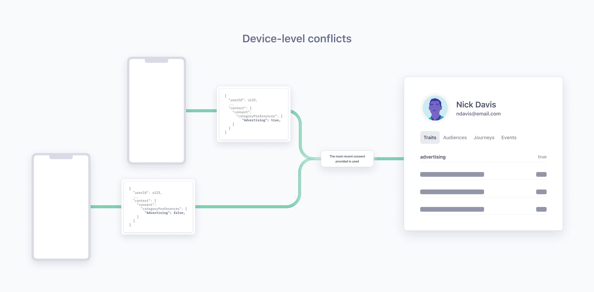
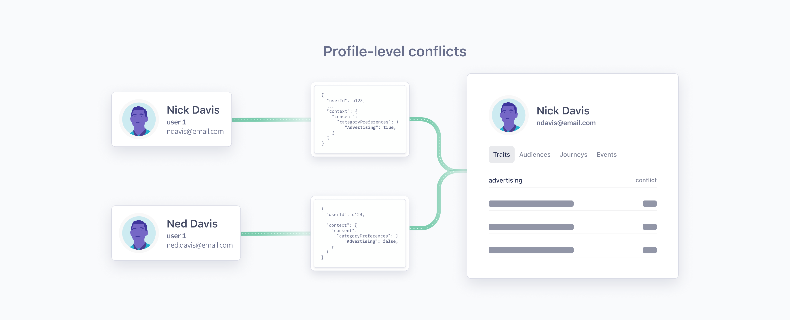

> info "Consent in Unify and Twilio Engage is currently unavailable."
> However, Segment's OneTrust consent wrappers automatically generate the Segment Consent Preference Track event, which will be required for future integrations with Unify and Twilio Engage.

Segment uses Profiles in [Unify](/docs/unify/) as the source of truth of an end user's consent preference when enforcing consent in Twilio Engage. To get consent preference on the Profile, Segment requires the use of the [Segment Consent Preference event](#segment-consent-preference-event) and [Identify](/docs/connections/spec/Identify) events to route events to Unify. The Segment Consent Preference and Identify event should include the [consent object](/docs/privacy/consent-in-segment-connections/#consent-object).

## Segment Consent Preference event
Every time an end user provides or updates their consent preferences, Segment requires you to generate a **Segment Consent Preference** event. If you are using [Segment's OneTrust consent wrappers](/docs/privacy/configure-consent-management/#step-2-integrating-your-cmp-with-segment), Segment automatically generates a Segment Consent Preference event. This event is required to add the end user’s consent preference on their Profile in Unify.

For example, if an end user agreed to share their information for functional and advertising purposes but not for analytics or data sharing, the Segment Consent Preference [Track call](/docs/connections/spec/track/) demonstrating their new consent preferences would have the following format:

``` json
{
  "anonymousId": "23adfd82-aa0f-45a7-a756-24f2a7a4c895",
  "type": "track",
  "event": "Segment Consent Preference",
  "userId": "u123",
  "traits": {
     "email": "peter@example.com",
     "phone": "555-555-5555",
  }
  "timestamp": "2023-01-01T00:00:00.000Z",
  "context": {
    "consent": {
      "categoryPreferences" : {
        "Advertising": true,
        "Analytics": false,
        "Functional": true,
        "DataSharing": false
      }
    }
  }
}
```

If you use Protocols, the Segment app automatically adds the Segment Consent Preference event to all your existing Tracking Plans and for every new Tracking Plan. Segment recommends you don’t edit or delete the default fields in the Segment Consent Preference events, but you can add new fields as needed.

> info "Segment Consent Preference is a reserved event name"
> Segment has standardized a series of reserved event names that have special semantic meaning and maps these events to tools that support them.
>
> See the [Semantic Events](/docs/connections/spec/semantic/) docs for more details.

## Reconcile profile conflicts
You might encounter a profile with a consent value of `conflict` if one of your end users consents to different categories on different devices or if two distinct IDs are linked to one Unify profile.

> success ""
> Profile conflicts only impact profiles used in Engage spaces.

### Device-level conflict
A device conflict occurs when consent for one user ID is collected from two distinct devices. This conflict is automatically resolved to accept consent from the most recent interaction. 

For example, if a user first consented to advertising on their mobile phone, and then later didn't consent to advertising on their desktop computer, their consent for the `advertising` category would be set to `false`.



### Profile-level conflict
A profile-level conflict occurs when two distinct userIDs with different consent preferences are merged into one Unify profile. A profile-level conflict can also occur when a userID and an anonymousID (one without a linked userID) are linked to the same profile by an external ID, like an email address or phone number, and the consent preferences of both profiles do not match. 



To avoid profile-level conflicts, Segment recommends that you take the following steps:
1. **Use `user_id` to identify a profile or person.** Using other identifiers, like a phone number, email, or `anonymous_id`, can result in a profile-level conflict. 
2. **Set `user_id` as the highest priority identifier in the [Identity Resolution](/docs/unify/identity-resolution/identity-resolution-settings/#priority) settings.**
3. **Maintain the default `reset()` behavior.** When a user explicitly logs out of your application, call `analytics.reset()` to prevent any further event activity from being associated with the logged out user and generate a new `anonymousId` for subsequent activity (until the user logs in again). 