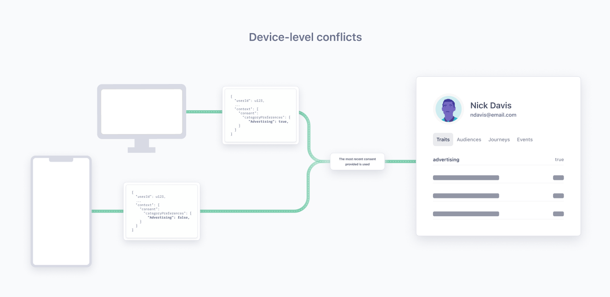

Segment uses the [consent object](/docs/privacy/consent-management/consent-in-segment-connections/#consent-object) on Segment events, including the [Segment Consent Preference Updated](#segment-consent-preference-updated-event) Track event, to evaluate and store consent preferences on the profile. Consent on the profiles serves as the source of truth of an end user’s consent preference when enforcing consent in Twilio Engage or Linked Audiences.

> info "Consent on the profile is in public beta"
> Storing consent preferences on the profile is actively in development and some things may change before it becomes generally available.


## Segment Consent Preference Updated event

> success ""
> The Segment Consent Preference Updated event is generally available (GA). 

Every time an end user provides or updates their consent preferences, Segment requires you to generate a **Segment Consent Preference Updated** event. If you are using [Segment's OneTrust consent wrappers](/docs/privacy/consent-management/configure-consent-management/#step-2-integrating-your-cmp-with-segment), Segment automatically generates a Segment Consent Preference Updated event. This event is required to add the end user’s consent preference on their profile in Unify.

For example, if an end user agreed to share their information for functional and advertising purposes but not for analytics or data sharing, the Segment Consent Preference Updated [Track call](/docs/connections/spec/track/) demonstrating their new consent preferences would have the following format:

``` json
{
  "anonymousId": "23adfd82-aa0f-45a7-a756-24f2a7a4c895",
  "type": "track",
  "event": "Segment Consent Preference Updated",
  "userId": "u123",
  "timestamp": "2023-01-01T00:00:00.000Z",
  "context": {
    "consent": {
      "categoryPreferences" : {
        "Advertising": true,
        "Analytics": false,
        "Functional": true,
        "DataSharing": false
      }
    }
  }
}
```

If you use Protocols, the Segment app automatically adds the Segment Consent Preference Updated event to all your existing Tracking Plans and for every new Tracking Plan. Segment recommends you don’t edit or delete the default fields in the Segment Consent Preference Updated events, but you can add new fields as needed.

> info "Segment Consent Preference Updated is a reserved event name"
> Segment has standardized a series of reserved event names that have special semantic meaning and maps these events to tools that support them.
>
> See the [Semantic Events](/docs/connections/spec/semantic/) docs for more details.

### Sharing consent with Actions destinations

In addition to enforcing consent in Connections, you may want these preferences to flow to each destination so your destinations can be aware when an end-user revokes their consent. You can use the [Destination Actions framework](/docs/connections/destinations/destination-actions) to edit the destination's mapping and copy the consent preferences from the Segment Consent Preference Updated event to a destination-specified consent field. 

If you use Destination Actions to send consent information to your destinations, the Segment Consent Preference Updated event should **only** include information about a user's consent preferences because this event is sent regardless of an end-user's consent preferences. 

> info "Sharing consent with Classic Destinations is not available"
> Segment only supports sharing consent with Actions Destinations. 

## Profile conflicts
You can experience conflicts in an end user's consent preferences when they set different consent preferences across different devices (device-level conflicts) or when you merge two Profiles with different consent preferences into one profile (profile-level conflicts).

### Device-level conflicts
A device-level conflict occurs when conflicting consent preferences linked to one user ID are collected from two distinct devices.

> success ""
> Segment uses `anonymousId` to approximate device identification, as some of Segment's libraries don't track `deviceId`.

For example, if an end-user didn’t consent to Advertising on their mobile phone, but later consented to Advertising on their desktop computer, this user would have a conflicting consent preference for the `advertising` category.

By default, Segment relies on the latest consent preferences collected for a user and would set the `advertising` category to `true` given that the **latest** consent preference collected (from the desktop computer) consented to the `advertising` category. 

If you would like to use a different method of conflict resolution, you must build an approach to address and resolve conflicting consent preferences in your website or mobile app and then send the updated consent back to Segment. 

Examples of other conflict resolution strategies include:
- **Rely on a single source of truth for consent preferences**: Apply the consent preferences found in your single source of truth across all of a user's devices.
- **Ask user to resolve conflict**: Ask a user for consent preference information and apply their preferences across all of a user's devices. If this new request for consent preferences results in a conflict with the information stored in your single source of truth, prompt your user to resolve the conflict and provide their consent preferences. 

> success ""
> An end user's profile with device level conflicts will always result in a consent status of `true` or `false` for the conflicting consent categories.



### Profile-level conflict
A profile-level conflict occurs when two distinct userIDs with different consent preferences are merged into one Unify profile. A profile-level conflict can also occur when a userID and an anonymousID (one without a linked userID) are linked to the same profile by an external ID, like an email address or phone number, and the consent preferences of both profiles do not match. 


To avoid profile-level conflicts, Segment recommends that you take the following steps:
1. **Use `user_id` to uniquely identify a profile or person**: Using other identifiers, like a phone number, email address, or `anonymousId`, can result in a profile-level conflict. With a unique `user_id` for each profile, there can never be a profile level conflict between two users on the same profile.
2. **Set `user_id` as the highest priority identifier**: Setting `user_id` as the highest priority identifier in your [Identity Resolution settings](/docs/unify/identity-resolution/identity-resolution-settings/#priority) correctly models the one-to-many relationship between `user_id` and `anonymousId`.  
3. **Maintain the default `reset()` behavior that represents a logout and flushes the `user_id` and `anonymousId`**: When a user explicitly logs out of your application, call `analytics.reset()` to prevent any further event activity from being associated with the previous user and generate a new anonymousId for subsequent activity until a user logs in again. This helps you avoid ambiguity when multiple people use a shared device.

> success ""
> Profile conflicts only impact profiles used in Engage spaces.

## Enforcing consent in Twilio Engage
Consent enforcement in Twilio Engage and Linked is currently unavailable during the public beta. Segment stores consent preferences as traits on the Profile. These traits can be used like any other when building Audiences/Journeys in Twilio Engage and Linked Audiences. 

> warning ""
> Consent stored on the profile does not automatically enforce consent in Twilio Engage or Linked Audiences.

## Validating consent preferences stored on a profile
You can validate consent is present on the profile by looking for the consent trait provided for a profile on the consent tab.

- **If the value is `true`**: Your user consented to have their data used for this purpose
- **If the value is `false`**: Your user did not consent to have their data used for this purpose
- **If the value is `conflict`**: At the time this profile was merged, there was a conflict in the consent preferences recorded for a consent category. For more information about consent conflicts, see the [profile-level conflict](#profile-level-conflict) documentation.


## Troubleshooting consent preferences stored on the profile

### If I have 2 sources connected to a Unify space and only 1 is set up to collect consent, which consent preferences does Segment record?
Consent preferences collected in the [consent object](/docs/privacy/consent-management/consent-in-segment-connections/#consent-object) from the source are used to store consent on the profile. Sources with no consent object do not impact what is stored on the profile. If the source generates an empty consent object, Segment interprets this as an end-user failing to consent to any category. As a result, the consent preference will be updated to `false` for all consent categories.