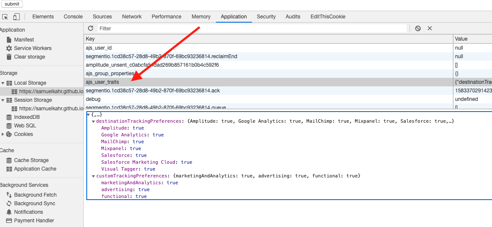
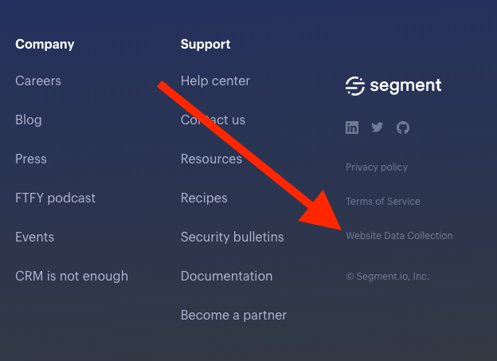
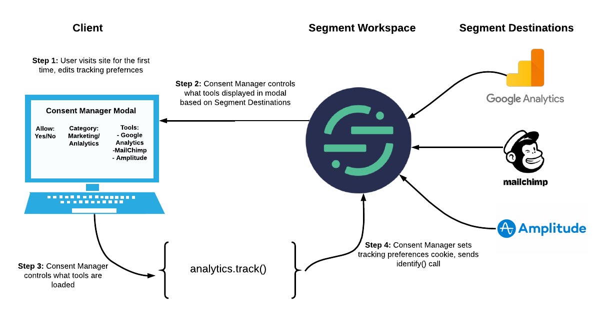

A Consent Manager gives visitors to your site a way to control and customize their tracking preferences for third party tools.A Consent Manager should allow visitors to either opt in to tracking for tools such as Google Analytics or Amplitude, selectively choose which tools track them or opt out of tracking entirely.

Ideally, a Consent Manager should do the following:

- Show pop up to users when the page is first loaded and collect
  only pre-approved data by firing the accepted tags before a user
  has indicated their tracking preference.

- Store these tracking preferences so they persist for future
  visits, for example as a first party cookie in the user’s browser

- Allow the user the option to change these preferences at a later
  date.

Segment created a free, [open source Consent Manager](https://github.com/segmentio/consent-manager) you can easily configure, customize and deploy on your site.

## What does Segment’s Consent Manager Do?

As an example, on [Segment’s website](https://segment.com/), when you
first visit the site you are presented with our Consent Manager link at
the bottom of the page. If you click the link, you are presented with an
option to enable or disable tracking for specific categories of tools.


When you select your preferences they are saved as a first party cookie
called Tracking Preferences in your browser.


Inspecting the cookie (with the ASCII URL encoding removed), it is
simply a boolean list of the tools the user has opted into for tracking

```js
{
"version":C,
"Destinations":{
    "AdWords":false,
    "Airtable-DemandCurve(SegmentProd)":false,
    "Amazon S3":false,
    "Amplitude":false,
    "Clearbit Reveal":false,
    "Drift":true,
    "Facebook Pixel":false,
    "FullStory":false,
    "Google Analytics":false,
    "Google Tag Manager":false,
    "Hotjar":false,
    "LinkedIn Insight Tag":false,
    "Madkudu":false,
    "Marketo V2":false,
    "Mutiny":true,
    "Personas":false,
    "Slack":true,
    "Twitter Ads":false,
    "Visual Tagger":false,
    "Webhooks":false,
    "Zapier":false},
"Custom":{
    "advertising":false,
    "marketingAndAnalytics":false,
    "Functional":true
 }
}
```

You can also see your tracking preferences under `ajs_user_traits` in
your browser local storage:



Once you set your preferences you can change them at any point in the
future using the same tool in the footer of the Segment site. Changing
your preferences using this tool edits this cookie content, which
changes which tools can track you on the site.



For more information on how you can use Segment’s Consent Manager to
reach GDPR compliance, see this [blog post](https://segment.com/blog/how-to-build-consent-management-into-your-site-in-less-than-a-week/).
To see examples of how the Consent Manager can be configured for CCPA
compliance (specifically Do Not Sell, and the Right to Opt Out) [see here](https://segment.com/blog/segment-ccpa/).

## How does Segment’s Open Source Consent Manager Control What Tools Track You?

Under the hood, our open sourced Consent Manager is integrated with our
[analytics.js](/docs/connections/sources/catalog/libraries/website/javascript/)
library, which means you need to be using Segment and have your
downstream tracking tools hooked up to your Segment workspace [as destinations](/docs/connections/destinations/). At
its most basic level, the Consent Manager acts as a wrapper for the
Analytics.js library and controls what tools are allowed to be loaded
for the user. Consent Manager will only load the Segment destinations
the user has consented to and not load analytics.js library at all if
the user has opted out of everything.

As demonstrated above, the Consent Manager will then save the
preferences as a cookie in the user’s browser and send an [identify() call](/docs/connections/spec/identify/) to Segment
indicating what the user’s preferences are. An example `identify()` call
with tracking preferences sent to Segment would like. Since a user’s
preferences are saved on Segment’s backend, the user’s tracking
preferences can be sent to other source setup in your Segment workspace,
such as server side libraries.

```js
analytics.identify({
 "destinationTrackingPreferences": {
      "Google Analytics": true,
      "Salesforce": false
    }
});
```

You should note the only tools Consent Manager will load are those
already set up in your Segment workspace, e.g. if you only have Google
Analytics, Amplitude and AppsFlyer set up as destinations, these will be
the only tools that will be displayed in the Consent Manager pop up.
Consent Manager will automatically update to reflect your downstream
tools as you update them in your Segment account.

### Consent Manager Architecture

[](https://www.lucidchart.com/documents/edit/bd1bddb5-e286-4d5c-8a3a-306b53cf8e18/0?callback=close&name=docs&callback_type=back&v=1828&s=612)

## Implementing Segment’s Consent Manager

There are three primary ways you can implement Segment’s Consent
Manager:

  - **Out of the box** - using our out of the [box version of Consent
    Manager](https://github.com/segmentio/consent-manager#standalone-script),
    you simply drop in the script tag we provide and our Consent
    Manager UX is automatically loaded on your site. This is the
    easiest implementation and Consent Manager will control both 1)
    what tools are loaded based on user tracking preferences and 2)
    Consent Manager UX. You can customize the text shown in the
    Consent Manager banner. In the pop up modal, you can also change
    the types of the types of categories shown, purpose decisions, and
    tool mappings.

  - **Low level React props** - if you do not want to take advantage of the
    prebuilt Consent Manager UX and want to build your own, you can
    use our [ConsentManagerBuilder React
    component](https://github.com/segmentio/consent-manager#consentmanagerbuilder)
    which will take care of the logic for which tools Analytics.js
    loads, checking/saving consent and fetching destinations. You can
    create your own custom UX using React and mount the
    ConsentManagerBuilder component. This is the lowest level, most
    customizable option for configuring Consent Manager.

  - **Integrate Segment Consent Manager with other Consent Tools** - you
    can integrate Segment’s Consent Manager and downstream tool
    loading logic using Analytics.js with any other Consent Manager
    tool. For most other Consent Manager tools, you must
    map the downstream tools hooked up to Segment to the alternative
    Consent Manager’s Consent Groups. See [this Gist](https://gist.github.com/sperand-io/4725e248a35d5005d68d810d8a8f7b29) for an example integrating Segment’s Consent Manager with TrustArc.

## Consent Manager Implementation Overview

To see a full working demo of our out of the box Consent Manager, please
[see here](https://codepen.io/samuelkahr/pen/eYYrobB).

To quickly get started implementing Consent Manager on your website,
follow the steps below:

**Step 1:**

Add the Consent Manager standalone script to your website (show below).
You will need to create an empty div on your webpage to which you would
like to mount the Consent Manager component. You will also need to
update the writeKey value with your Segment source write key, this is
the value in the `analytics.load()` in your analytics.js code snippet. You
can also find your source write key in your Segment workspace by
following [these steps](/docs/connections/find-writekey/). Note, you
can easily customize the text in the Consent Manager using the exposed
props (`bannerContent` ect - see [Available Properties for Out of the Box Consent Manager](#available-properties-for-out-of-the-box-consent-manager) for a full reference of props
you can pass in).

```js
<script>
window.consentManagerConfig = function(exports) {
      return {
       //Need to update with the id of the container where you want Consent Manager to load
        container: '#target-container',
       //Need to update with you source write key
        writeKey: '<STRING>',
        bannerContent:
          'We use cookies (and other similar technologies) to collect data to improve your experience on our site. Also, Segment is Awesome',
        bannerSubContent: 'You can change your preferences at any time.',
        preferencesDialogTitle: 'Website Data Collection Preferences',
        preferencesDialogContent:
          'We use data collected by cookies and JavaScript libraries to improve your browsing experience, analyze site traffic, deliver personalized advertisements, and increase the overall performance of our site.',
        cancelDialogTitle: 'Are you sure you want to cancel?',
        cancelDialogContent:
          "Your preferences have not been saved. By continuing to use our website, you're agreeing to our Website Data Collection Policy",
        closeBehavior: 'accept'
      }
}
</script>
```

**Step 2:**

Add the following script below your Consent Manager code so that Segment
can deliver the prebuilt Consent Manager UX bundled component using
Preact. Note- you need to check the current version of [Consent Manager
here](https://www.npmjs.com/package/@segment/consent-manager), if using
an earlier version of Consent Manager, you may be missing functionality.

```js
<script
//Note current version! Demos are all v4.3.0 src="https://unpkg.com/@segment/consent-manager@4.3.0/standalone/consent-manager.js"
  defer
></script>
```

**Step 3:**

Remove the `analytics.load(“YOUR_SEGEMENT_SOURCE_WRITE_KEY”)` call
from your Segment Analytics.js code.

```js
//Analytics.js code
<script>
  !function(){var analytics=window.analytics=window.analytics||[];if(!analytics.initialize)if(analytics.invoked)window.console&&console.error&&console.error("Segment snippet included twice.");else{analytics.invoked=!0;analytics.methods=["trackSubmit","trackClick","trackLink","trackForm","pageview","identify","reset","group","track","ready","alias","debug","page","once","off","on"];analytics.factory=function(t){return function(){var e=Array.prototype.slice.call(arguments);e.unshift(t);analytics.push(e);return analytics}};for(var t=0;t<analytics.methods.length;t++){var e=analytics.methods[t];analytics[e]=analytics.factory(e)}analytics.load=function(t,e){var n=document.createElement("script");n.type="text/javascript";n.async=!0;n.src="https://cdn.segment.com/analytics.js/v1/"+t+"/analytics.min.js";var a=document.getElementsByTagName("script")[0];a.parentNode.insertBefore(n,a);analytics._loadOptions=e};analytics.SNIPPET_VERSION="4.1.0";

//Remove analytics.load call from your code snippet

analytics.load("SEGMENT_WRITE_KEY");

analytics.page();
  }}();
</script>
```

**Step 4:**

Congratulations - Consent Manager should now be loaded on your site! If
after reloading your page you still do not see the Consent Manager
banner, check:

  - You are not located in the geo location where shouldRequireConsent
    is set to false (see FAQ below about how to change this)

  - You do not already have the
    “[tracking-preferences](https://share.getcloudapp.com/7KuRmNEy)”
    cookie saved in your browser (if present, Consent Manager will not
    load)

## FAQs

### How do I change the categories and tool mapping in the preferences dialog box (for example, how to add the “Do Not Sell” category)?

To change the default category and tool mapping in the preferences
dialog box, you will need to use the customCategories property. This
property is an object that represent custom consent categories and
mappings of these categories to Segment integrations. See the example
below for how to add a custom category:

```js
const customCategories = {
  'New Category': {
    purpose: 'A new consent category to capture more granular consent groupings',
    integrations: ['Google Adwords (Classic)', 'Amplitude', 'Slack']
  }
}
```

You can get the integrations connected to a particular Segment source by
entering your [source’s write key](/docs/connections/find-writekey/) into [this
tool](https://codepen.io/samuelkahr/pen/gOpWyEG).

For example, if you would like to create a new Do Not Sell category with
custom tool mappings, refer to the following example

```js
const customCategories = {
  'Do Not Sell': {
    purpose: 'To prevent sale of data to third party tools',
    integrations: ["Google Adwords (Classic)", "MailChimp"]
  }
}
```

Adding this to our Consent Manager example, you can see the custom
category/tool mapping below:

```js
var customCategories = {
          'Analytics': {
             integrations: ['Google Analytics','Mixpanel','Amplitude'],
             purpose: 'Provide statistical information on site usage, e.g., web analytics so we can improve this website over time.'
          },
          'Functional': {
            integrations: ['Salesforce Marketing Cloud','Visual Tagger'],
            purpose: 'Enables enhanced functionality, such as videos and live chat. If you do not allow these, then some or all of these functions may not work properly.'
          },
          'Do Not Sell': {
             integrations: ['Salesforce', 'MailChimp', 'AdWords'],
             purpose:'To give the right to opt out of the sale of personal data.'
          }
      };

```

Once you have set up the custom categories, you can set whether users
are opted into or not tracking by these tool categories by default using
the initialPreferences property. This takes in an object of each of your
custom categories and a boolean for whether they should be opted in by
default. For example, setting Functional tool tracking to true and
Analytics/Do Not Sell tool categories to false would look like:

```js
var initialPrefs = {
        'Analytics': false,
        'Functional': true,
        'Do Not Sell': false };

```

You can see a working [demo here](https://codepen.io/samuelkahr/pen/JjdNqzr) of custom category/tool mapping.

###  How can I get the Consent Manager to only show to people in Europe or California?

To get a Consent Manager to load only those located in Europe or
California, you can use the inRegions() function, which is based on the
[inRegions package](https://www.npmjs.com/package/@segment/in-regions).
Using the out of the box version of Consent Manager (version 4.3.0 and
higher), this component is made available to us as the callback
inRegions (see [Available Call Back Functions and Global Variables for Out of the Box Consent Manager](#available-call-back-functions-and-global-variables-for-out-of-the-box-consent-manager)). `inRegions` uses the user's timezone and
language preferences to determine user location rather than an ip
lookup. We take this approach to trade absolute accuracy for a method
that respects user privacy. See below for example configurations of how
to load this package.

```js
//set inRegions to show Consent Manager to users in EU or California
const inCustomRegion = inRegions(["EU", "CA"])

// isInCustomRegion would be 'true' if current user is in EU or CA, you would pass this into shouldRequireConsent property of our consentManagerConfig function
const isInCustomRegion = inCustomRegion()

```

You can see this in action here in [this demo](https://codepen.io/samuelkahr/pen/qBdPbvG), which will only show
Consent Manager to users located in California (or PST timezone) and
users in EU countries. If you are not in these areas, use [this demo](https://codepen.io/samuelkahr/pen/XWbaBVM) to select which region
you are located in to see Consent Manager conditionally load in your
region.

If you are using custom category mapping and would like users to
automatically opt into different tool tracking preferences based on
their region, you can use the following logic. Users in the EU and CA
will be opted into different tools based on their region.

```js
//Setting different inRegion call backs for CA and EU to determine different initialPreferences for each region
var inCA = exports.inRegions(['CA'])
var inEU = exports.inRegions(['EU'])
//Setting up callback to specify Consent Manager should only load in CA and EU
var shouldRequireConsent = exports.inRegions(['CA', 'EU'])
//initial preferences for users in CA
var caDefaultPreferences  = {advertising: false,
				     marketingAndAnalytics: true,
                             functional: true }
//initial preferences for users in EU
var euDefaultPreferences = {advertising: false,
				    marketingAndAnalytics: false,
				    functional: false }
//sets up different initialPreferences object for users in CA or EU we can pass as Consent Manager prop
var initialPreferences = inCa() ? caDefaultPreferences : inEU()? euDefaultPreferences : undefined

```


### How can I pass user tool tracking preferences from the client side Consent Manager to the server?

If you would like Consent Manager to update the tools loaded on our
server side libraries based on the tracking selection users make in the
client side version of our Consent Manager, add the write key of your
server side sources to the otherWriteKey property (see [Available Properties for Out of the Box Consent Manager](#available-properties-for-out-of-the-box-consent-manager)). This
will automatically control what tools can receive server side
page()/identify()/tracking() calls for that particular user.

### Can Segment’s Consent Manager be integrated with other tools ?

Yes! Generally, you can do this by mapping the different categories in
Segment’s Consent Manager to the categories of the third party Consent
Manager you want to use. For an example of how to integrate Segment’s
Consent Manager with TrustArc see [this
video](https://www.loom.com/share/5072ae023fa5410f8e087e46476d9837) and
[this
gist](https://gist.github.com/sperand-io/4725e248a35d5005d68d810d8a8f7b29).

### Can I build my own Consent Manager using React?

Yes! Our out of the box Consent Manager is built using React under the
hood. If you would like to take advantage of the analytics.js loading
logic our Consent Manager provides but create your own custom UI, you
can use the ConsentManagerBuilder React component to build everything
entirely in React. Refer to [this readme](https://github.com/segmentio/consent-manager#mapcustompreferences)
for all the props, render props and utility functions available in this
component. [This demo](https://codesandbox.io/s/consentmanagerbuilder-example-76iyn)
creates a React component that has a custom UI but uses Consent
Manager’s analytics.js load logic.

You can also call exports.React from inside the
window.consentManagerConfig function to access the virtual DOM to create
custom React elements in the out of the box Consent Manager. The example
below demonstrates how you can use exports.React to add custom links to
the Consent Manager banner content (note how to use
exports.openConsentManager() in order to open Consent Manager’s
preferences dialog box in the React element)

```js
//using exports from function parameter passed into window.consentManagerConfig
var React = exports.React;
var bannerContent = React.createElement(
       'div',{class: 'consentBannerText', style: 'display: flex; align-items: center; justify-content: flex-end; padding: 10px 10px;'},
                React.createElement{  'span',  {style: 'flex-grow: 1; text-align: left;'},
                  'We use cookies (and other similar technologies) to improve your experience on our site and to serve you better. By using our website, you are agreeing
                  to the collection of data as described in
                  Segment\'\s',
                  '\u00a0',
                  //adding link to Segment’s privacy policy
                  React.createElement('a',  { href: 'https://segment.com/legal/privacy-2019/', target: '_blank' },  'Privacy Policy'),
                  '. You can',
                  '\u00a0',
                  //adding link to open preferences dialog box via exports.openConsentManager()
                  React.createElement( 'a', { onClick: function() { exports.openConsentManager() } }, 'change your preferences'),
                  '\u00a0',
                  'at any time.'}
                ),
            );

```

You can see how this looks loaded on the page in [this demo](https://codepen.io/samuelkahr/pen/OJVxWRo).

## Available Properties for Out of the Box Consent Manager

These are the configurable properties you can change when loading the
out of the box Consent Manager. In [this demo](https://codepen.io/samuelkahr/pen/eYYrobB), these are all the
props you can pass into the returned preferences object. See [this readme](https://github.com/segmentio/consent-manager) for more
information.

<table>
<thead>
<tr class="header">
<th><strong>Prop Name</strong></th>
<th><strong>Type</strong></th>
<th><strong>Default Value</strong></th>
<th><strong>Description</strong></th>
</tr>
</thead>
<tbody>
<tr>
<td>writeKey</td>
<td>string</td>
<td></td>
<td>This is the Segment source specific write key you can find in your analytics.load() call in your Analytics.js snippet</td>
</tr>
<tr>
<td>otherWriteKeys</td>
<td>Array of strings</td>
<td>[ ]</td>
<td>Other write keys you want to load destination information for. For example, if you have specific tracking tools for your server specific data sources, you can include the <a href="https://share.getcloudapp.com/jkunGzrw">write key</afor those sources there. This will allow you to send the user’s tracking preferences across multiple Segment sources.</td>
</tr>
<tr>
<td>shouldRequireConsent</td>
<td>function</td>
<td>() =&gt; true</td>
<td>Callback function that determines if consent is required before tracking begins. Set to true to show consent banner, otherwise return false to not show consent banner.</td>
</tr>
<tr>
<td>initialPreferences</td>
<td>object</td>
<td>{}</td>
<td>Object that opts into users into tracking for the different tracking categories. For example {‘Functional’:true}</td>
</tr>
<tr>
<td>closeBehavior</td>
<td>enum|string or function</td>
<td>dismiss</td>
<td>An option to determine the default behavior for the x button on the Consent Manager banner. Available props: 1) “dismiss” - Dismisses the banner, but don't save or change any preferences. Analytics.js won’t be loaded until consent is given 2) “accept”- assume consent across every category 3)”deny” -denies consent across every category.</td>
</tr>
<tr>
<td>implyConsentOnInteraction</td>
<td>bool</td>
<td>true or false depending on version</td>
<td>Determines whether or not consent should be implied if the user interacts with the website by clicking anywhere outside the the Consent Manager banner.</td>
</tr>
<tr>
<td>cookieDomain</td>
<td>string</td>
<td>Topmost domain and all sub domains</td>
<td>The domain the tracking-preferences cookie should be scoped to</td>
</tr>
<tr>
<td>bannerContent</td>
<td>string</td>
<td></td>
<td>What text should be displayed in the <a href="https://share.getcloudapp.com/Apurj6zv">Consent Manager banner</a>.</td>
</tr>
<tr>
<td>bannerSubContent</td>
<td>string</td>
<td></td>
<td>The <a href="https://share.getcloudapp.com/z8uXxpkZ">call to action</aunder the primary text in the Consent Manager banner.</td>
</tr>
<tr>
<td>bannerTextColor</td>
<td>string</td>
<td>#fff</td>
<td>Color of the consent banner text</td>
</tr>
<tr>
<td>bannerBackgroundColor</td>
<td>string</td>
<td>#1f4160</td>
<td>Color of the consent banner background</td>
</tr>
<tr>
<td>preferencesDialogTitle</td>
<td>string</td>
<td></td>
<td><a href="https://share.getcloudapp.com/jkuKlrAw">Title of the preferences dialog box</a></td>
</tr>
<tr>
<td>preferencesDialogContent</td>
<td>string</td>
<td></td>
<td>The top descriptive <a href="https://share.getcloudapp.com/z8uXxJAQ">content</aof the preferences dialog.</td>
</tr>
<tr>
<td>cancelDialogTitle</td>
<td>string</td>
<td></td>
<td><a href="https://share.getcloudapp.com/v1urD6R6">The title</aof the cancel dialog box</td>
</tr>
<tr>
<td>cancelDialogContent</td>
<td>string</td>
<td></td>
<td>The content of the cancel dialog</td>
</tr>
<tr>
<td>customCategories</td>
<td>string</td>
<td></td>
<td>An object representing custom consent categories and mapping of Segment integrations to these categories. For example, for CCPA compliance, you could create a custom “Do Not Sell” category and mapping relevant integrations to it. See the section on Creating Custom Categories for more information.</td>
</tr>
</tbody>
</table>

## Available Call Back Functions and Global Variables for Out of the Box Consent Manager

These are available for use in the consentManagerConfig function, and
are also accessible globally in the window once Consent Manager loads on
the site. For example, if you invoke
[consentManager.preferences.loadPreferences() from the console](https://share.getcloudapp.com/YEuAXj89) the browser displays
the user’s current tracking preferences.

<table>
<thead>
<tr class="header">
<th><p><strong>Callbacks accessible in</strong></p>
<p><strong>window.consentManagerConfig =</strong></p>
<p><strong>function(exports) {})</strong></p></th>
<th><strong>Global Variable</strong></th>
<th><strong>Description</strong></th>
</tr>
</thead>
<tbody>
<tr>
<td>exports.version</td>
<td>consentManager.version</td>
<td>Version of the Consent Manager. Useful for debugging if certain functionality not showing up, can use this to verify you are using most up to date version of Consent Manager</td>
</tr>
<tr>
<td>exports.React</td>
<td>n/a</td>
<td>Reference to the <a href="https://preactjs.com/">Preact library</a(the API is React compatible). Useful for if you need to use virtual DOM in your content and or customize the content that is being displayed in the consent manager banner beyond what is available as an editable prop</td>
</tr>
<tr>
<td><p>exports</p>
<p>.openConsentManager()</p></td>
<td><p>consentManager</p>
<p>.openConsentManager()</p></td>
<td>Opens the Consent Manager preferences dialog.</td>
</tr>
<tr>
<td>Functionality incorporated into exports.inRegion()</td>
<td>consentManager.inEU()</td>
<td>Returns true if user is in EU</td>
</tr>
<tr>
<td>exports.inRegions()</td>
<td>n/a</td>
<td>Call to <a href="https://www.npmjs.com/package/@segment/in-regions">in-regions package</ato determine user location based on timezone. Function return true|false on whether users are in a specified region, which can be passed into shouldRequireConsent prop. For example to return true for users in CA, pass in exports.inRegions([“CA”]). Pass in “EU” to return true for users in European Union. Used timezone/browser language to determine user location.</td>
</tr>
<tr>
<td>exports.doNotTrack()</td>
<td><p>consentManager</p>
<p>.doNotTrack()</p></td>
<td>Returns user’s <a href="https://developer.mozilla.org/en-US/docs/Web/API/Navigator/doNotTrack">Do Not Track</apreferences</td>
</tr>
<tr>
<td><p>exports.consentManager</p>
<p>.preferences</p></td>
<td>consentManager.preferences</td>
<td>Returns an instance of PreferencesManager with the following helper functions below</td>
</tr>
<tr>
<td><p>exports.consentManager</p>
<p>.preferences</p>
<p>.loadpreferences</p></td>
<td><p>consentManager.preferences</p>
<p>.loadpreferences</p></td>
<td>Returns the cookie value for consent preferences (what's contained in ‘tracking-preferences’ cookie)</td>
</tr>
<tr>
<td><p>exports.consentManager</p>
<p>.preferences</p>
<p>.savePreferences</p></td>
<td>consentManager.preferences.savePreferences</td>
<td>Allows for managing the consent cookie programmatically (useful if you want to re-hydrate consent from your own database or prefill consent options)</td>
</tr>
<tr>
<td><p>exports.consentManager</p>
<p>.preferences</p>
<p>.onPreferencesSaved</p>
<p>(callback)</p></td>
<td><p>consentManager.preferences</p>
<p>.onPreferencesSaved</p>
<p>(callback)</p></td>
<td>Allows for subscribing to changes in preferences through a callback function</td>
</tr>
</tbody>
</table>

## Further Reading and Demos

Below are links and descriptions to all the demos referenced throughout
this guide

  - Basic example of the out of the box Consent
    Manager[link](https://codepen.io/samuelkahr/pen/eYYrobB)

  - Demo that uses custom tool/category
    mappings[link](https://codepen.io/samuelkahr/pen/JjdNqzr)

      - Tool to get array of all integrations connected to a Segment source write key[link](https://codepen.io/samuelkahr/pen/gOpWyEG)

  - Demo that uses basic usage inRegions component (hardcoded for
    “CA” and “EU”)[link](https://codepen.io/samuelkahr/pen/qBdPbvG)

  - Demo that allows you choose your location to show Consent Manager
    in region you are physically located in[link](https://codepen.io/samuelkahr/pen/XWbaBVM)

  - Demo that shows how to create React elements in out of the box
    Consent Manager[link](https://codepen.io/samuelkahr/pen/OJVxWRo)

  - Demo built using low level React props[link](https://codesandbox.io/s/consentmanagerbuilder-example-76iyn)
